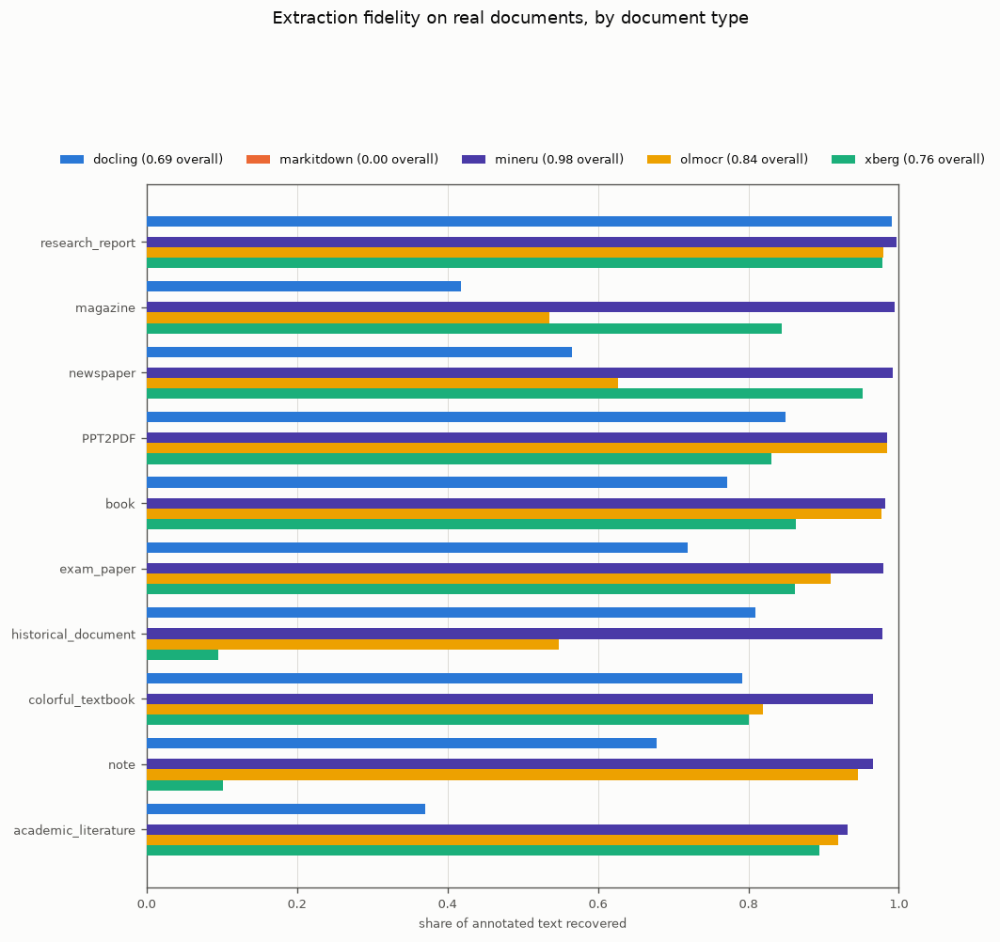

# Extraction

Turning a file into text. This runs before everything else, so an extractor that drops a table or
garbles a scan sets a ceiling no chunker or embedding model can raise.

Two separate decisions live here: which extractor for ordinary documents, and which OCR engine for
scans.

## The extractors

| Backend      | Runs as         | Needs                     | Use it for                                      |
|--------------|-----------------|---------------------------|-------------------------------------------------|
| `text`       | Embedded        | Nothing                   | `.md` and `.txt`. The zero-dependency default.  |
| `markitdown` | Container, MCP  | Docker                    | Office documents and HTML, fast. Cannot do OCR. |
| `xberg`      | Container, REST | Docker                    | The broad workhorse, including CPU OCR.         |
| `docling`    | Container, REST | Docker                    | Layout-aware conversion, considerably slower.   |
| `mineru`     | Container, REST | Docker plus an NVIDIA GPU | Heavy PDF and formula work.                     |

They are containers reached over HTTP on purpose, so semdex never carries torch or an OCR stack as
a dependency. Only `text` is embedded.

## Coverage

<!-- BEGIN GENERATED extractor_coverage (scripts/gen_bench_tables.py) -->
| Extractor  | docx | html | image-ocr | md   | pdf  | pptx | txt  | xlsx |
|------------|------|------|-----------|------|------|------|------|------|
| docling    | 100% | 100% | n/a       | 100% | 100% | 100% | n/a  | 100% |
| markitdown | 100% | 100% | fail      | 100% | 100% | 100% | 100% | 100% |
| mineru     | n/a  | n/a  | n/a       | n/a  | 100% | n/a  | n/a  | n/a  |
| text       | n/a  | n/a  | n/a       | 100% | n/a  | n/a  | 100% | n/a  |
| xberg      | 100% | 100% | 100%      | 100% | 100% | 100% | 100% | 100% |

Share of known phrases recovered from a fixture of that format. `n/a` means the extractor does not claim the format; `skip` means it was not exercised in this run. These are self-authored fixtures, so this measures agreement with our expectations rather than fidelity to documents in the wild - see the gaps page.
<!-- END GENERATED extractor_coverage -->

`xberg` is the only backend that covers every format tested, including image OCR. `markitdown`
covers everything except scans.

**Why markitdown cannot OCR.** Its image path depends on ExifTool, and the pinned image ships a
version affected by CVE-2021-22204 (arbitrary code execution from a crafted image). Sending
untrusted images through it is the exact exposure the CVE describes, so the image cell reports a
failure rather than a number. Use `xberg` for scans.

## Latency

<!-- BEGIN GENERATED extractor_latency (scripts/gen_bench_tables.py) -->
| Extractor  | docx   | html   | image-ocr | md     | pdf     | pptx   | txt   | xlsx   |
|------------|--------|--------|-----------|--------|---------|--------|-------|--------|
| docling    | 2006.6 | 2005.5 | n/a       | 2006.2 | 2006.3  | 2007.5 | n/a   | 2008.9 |
| markitdown | 305.7  | 165.5  | fail      | 272.6  | 269.9   | 108.6  | 115.2 | 166.9  |
| mineru     | n/a    | n/a    | n/a       | n/a    | 32000.0 | n/a    | n/a   | n/a    |
| text       | n/a    | n/a    | n/a       | 0.1    | n/a     | n/a    | 0.0   | n/a    |
| xberg      | 6.4    | 7.7    | 76.2      | 7.3    | 392.3   | 6.8    | 4.2   | 4.9    |

One document per cell on the reference machine, single run. Read the orders of magnitude, not the digits: these are not repeated measurements and the box was shared.
<!-- END GENERATED extractor_latency -->

The spread across backends is three orders of magnitude, which matters far more than any accuracy
difference between them on formats they all handle. For a bulk ingest, that difference is the
whole decision: at these rates, 10,000 PDFs is about an hour with the fast backends and days with
the slowest.

Treat these as single runs on a shared machine. They support "this one is far slower than that
one" and nothing finer.

**Two of these rows are almost certainly not measuring extraction.** `docling` reports between
2005.5 and 2008.9 ms across formats that differ by a factor of a hundred for every other backend,
a 3.4 ms spread that no real workload produces; and `mineru` reports exactly 32000.0 ms. Both are
the signature of a fixed polling interval or a timeout in the REST client rather than per-document
compute. They are upper bounds on those backends, not measurements of them, and they should not be
used to compare the two against each other. Fixing this means instrumenting the extractor client
rather than the wall clock around it.

## Fidelity on real documents

The coverage grid above scores each converter against eight fixtures written in this repo. That
measures agreement with our own expectations: the fixtures say what we thought a converter should
find, and finding it scores 100 percent. It cannot say how any of them behaves on a document
nobody here wrote.

OmniDocBench is 1,651 real document pages with human layout annotations carrying the text of every
block. `scripts/score_extraction_omnidocbench.py` samples across its ten document types, wraps each
page identically as a single-page PDF, and scores what comes back two ways. `Word recall` is the
share of annotated text the extraction contains, counted as a token multiset and so indifferent to
bullets, punctuation and reading order. `Edit similarity` compares whole pages and therefore does
punish dropped, duplicated and reordered content.

<picture>
  <source media="(prefers-color-scheme: dark)" srcset="img/extraction_real-dark.png" />
  
</picture>

<!-- BEGIN GENERATED extraction_real_overall (scripts/gen_bench_tables.py) -->
| Extractor  | Pages | Word recall | Edit similarity | p50 ms | Failed |
|------------|-------|-------------|-----------------|--------|--------|
| docling    | 113   | 0.690       | 0.592           | 4010   | 0      |
| markitdown | 113   | 0.000       | 0.000           | 99     | 5      |
| mineru     | 113   | 0.977       | 0.635           | 5040   | 0      |
| olmocr     | 113   | 0.844       | 0.593           | 12116  | 1      |
| xberg      | 113   | 0.760       | 0.456           | 1471   | 10     |

Real document pages with human annotations, sampled across ten document types and three languages, each wrapped identically as a single-page PDF. `Word recall` is the share of annotated text the extraction contains, counted as a token multiset and so indifferent to bullets, punctuation and reading order; `Edit similarity` compares whole pages and therefore does punish dropped and reordered content. A zero is a converter with no OCR, not a broken harness: the same code path on a text-layer PDF returns docling 108, markitdown 108, mineru 108, olmocr 105, xberg 108 characters respectively.
<!-- END GENERATED extraction_real_overall -->

The ranking is not the one the fixture grid implies, where every converter that supports a format
scores 100 percent on it.

**The GPU backends win, and it is not close.** `mineru` recovers 97.7 percent of the annotated text
and failed on none of the 113 pages; `olmocr` reaches 84.4 percent. The two CPU converters that can
OCR at all manage 76.0 and 69.0 percent. If extraction fidelity is what matters, this is the axis
the coverage grid could not show.

**`markitdown` scores zero on every page, and that is a real result rather than a broken run.** It
has no OCR, so a page with no text layer yields nothing. The same harness, same code path, on a PDF
that does have a text layer returns 108 characters from it - which is why the zero can be read as a
property of the tool instead of a fault in the measurement.

**`xberg` is strong on print and collapses on handwriting.** It scores 0.86 on English printed
pages, 0.95 on newspapers and 0.98 on research reports, then 0.10 on handwritten notes and 0.10 on
historical documents. Tesseract is doing what tesseract does. A fixture grid of clean synthetic
documents cannot expose that cliff, and it is the single most decision-relevant thing on this page
for anyone whose corpus contains scans of handwriting.

<!-- BEGIN GENERATED extraction_real_by_source (scripts/gen_bench_tables.py) -->
| Extractor  | Document type       | Pages | Word recall | Edit similarity | p50 ms | Failed |
|------------|---------------------|-------|-------------|-----------------|--------|--------|
| docling    | PPT2PDF             | 12    | 0.850       | 0.642           | 4007   | 0      |
| docling    | academic_literature | 12    | 0.371       | 0.642           | 6009   | 0      |
| docling    | book                | 12    | 0.772       | 0.733           | 4008   | 0      |
| docling    | colorful_textbook   | 12    | 0.792       | 0.533           | 4008   | 0      |
| docling    | exam_paper          | 12    | 0.719       | 0.720           | 4016   | 0      |
| docling    | historical_document | 5     | 0.810       | 0.161           | 4009   | 0      |
| docling    | magazine            | 12    | 0.418       | 0.744           | 10014  | 0      |
| docling    | newspaper           | 12    | 0.566       | 0.622           | 8024   | 0      |
| docling    | note                | 12    | 0.679       | 0.445           | 4009   | 0      |
| docling    | research_report     | 12    | 0.990       | 0.425           | 6010   | 0      |
| markitdown | PPT2PDF             | 12    | 0.000       | 0.000           | 78     | 0      |
| markitdown | academic_literature | 12    | 0.000       | 0.000           | 68     | 0      |
| markitdown | book                | 12    | 0.000       | 0.000           | 72     | 0      |
| markitdown | colorful_textbook   | 12    | 0.000       | 0.000           | 75     | 1      |
| markitdown | exam_paper          | 12    | 0.000       | 0.000           | 184    | 0      |
| markitdown | historical_document | 5     | 0.000       | 0.000           | 522    | 0      |
| markitdown | magazine            | 12    | 0.000       | 0.000           | 96     | 3      |
| markitdown | newspaper           | 12    | 0.000       | 0.000           | 168    | 1      |
| markitdown | note                | 12    | 0.000       | 0.000           | 251    | 0      |
| markitdown | research_report     | 12    | 0.000       | 0.000           | 216    | 0      |
| mineru     | PPT2PDF             | 12    | 0.984       | 0.579           | 2925   | 0      |
| mineru     | academic_literature | 12    | 0.932       | 0.569           | 5941   | 0      |
| mineru     | book                | 12    | 0.982       | 0.669           | 4758   | 0      |
| mineru     | colorful_textbook   | 12    | 0.966       | 0.509           | 5631   | 0      |
| mineru     | exam_paper          | 12    | 0.979       | 0.743           | 5106   | 0      |
| mineru     | historical_document | 5     | 0.978       | 0.765           | 5138   | 0      |
| mineru     | magazine            | 12    | 0.994       | 0.764           | 5654   | 0      |
| mineru     | newspaper           | 12    | 0.992       | 0.910           | 8425   | 0      |
| mineru     | note                | 12    | 0.966       | 0.567           | 3814   | 0      |
| mineru     | research_report     | 12    | 0.997       | 0.353           | 4620   | 0      |
| olmocr     | PPT2PDF             | 12    | 0.984       | 0.653           | 5322   | 0      |
| olmocr     | academic_literature | 12    | 0.919       | 0.587           | 28125  | 0      |
| olmocr     | book                | 12    | 0.978       | 0.712           | 14836  | 0      |
| olmocr     | colorful_textbook   | 12    | 0.820       | 0.507           | 9270   | 0      |
| olmocr     | exam_paper          | 12    | 0.909       | 0.752           | 12531  | 0      |
| olmocr     | historical_document | 5     | 0.548       | 0.528           | 9385   | 0      |
| olmocr     | magazine            | 12    | 0.535       | 0.510           | 14920  | 1      |
| olmocr     | newspaper           | 12    | 0.627       | 0.649           | 25588  | 0      |
| olmocr     | note                | 12    | 0.946       | 0.616           | 7357   | 0      |
| olmocr     | research_report     | 12    | 0.979       | 0.373           | 17490  | 0      |
| xberg      | PPT2PDF             | 12    | 0.830       | 0.556           | 1227   | 0      |
| xberg      | academic_literature | 12    | 0.894       | 0.650           | 1722   | 0      |
| xberg      | book                | 12    | 0.864       | 0.471           | 1776   | 0      |
| xberg      | colorful_textbook   | 12    | 0.801       | 0.433           | 1291   | 2      |
| xberg      | exam_paper          | 12    | 0.862       | 0.602           | 1383   | 0      |
| xberg      | historical_document | 5     | 0.095       | 0.030           | 848    | 1      |
| xberg      | magazine            | 12    | 0.844       | 0.567           | 1924   | 6      |
| xberg      | newspaper           | 12    | 0.952       | 0.692           | 7882   | 1      |
| xberg      | note                | 12    | 0.102       | 0.080           | 611    | 0      |
| xberg      | research_report     | 12    | 0.978       | 0.263           | 1805   | 0      |

The axis the self-authored fixture grid cannot have: how each converter behaves on a newspaper against a slide deck against a handwritten note.
<!-- END GENERATED extraction_real_by_source -->

### Language

<!-- BEGIN GENERATED extraction_real_by_language (scripts/gen_bench_tables.py) -->
| Extractor  | Language            | Pages | Word recall | Edit similarity | p50 ms | Failed |
|------------|---------------------|-------|-------------|-----------------|--------|--------|
| docling    | en_ch_mixed         | 11    | 0.692       | 0.485           | 4010   | 0      |
| docling    | english             | 48    | 0.488       | 0.705           | 6008   | 0      |
| docling    | simplified_chinese  | 49    | 0.874       | 0.539           | 4009   | 0      |
| docling    | traditional_chinese | 5     | 0.817       | 0.259           | 4011   | 0      |
| markitdown | en_ch_mixed         | 11    | 0.000       | 0.000           | 78     | 0      |
| markitdown | english             | 48    | 0.000       | 0.000           | 78     | 4      |
| markitdown | simplified_chinese  | 49    | 0.000       | 0.000           | 131    | 1      |
| markitdown | traditional_chinese | 5     | 0.000       | 0.000           | 522    | 0      |
| mineru     | en_ch_mixed         | 11    | 0.992       | 0.639           | 5596   | 0      |
| mineru     | english             | 48    | 0.973       | 0.704           | 5419   | 0      |
| mineru     | simplified_chinese  | 49    | 0.978       | 0.557           | 4230   | 0      |
| mineru     | traditional_chinese | 5     | 0.972       | 0.733           | 4153   | 0      |
| olmocr     | en_ch_mixed         | 11    | 0.994       | 0.629           | 10449  | 0      |
| olmocr     | english             | 48    | 0.794       | 0.607           | 17373  | 1      |
| olmocr     | simplified_chinese  | 49    | 0.889       | 0.584           | 10891  | 0      |
| olmocr     | traditional_chinese | 5     | 0.547       | 0.480           | 9433   | 0      |
| xberg      | en_ch_mixed         | 11    | 0.574       | 0.354           | 1435   | 0      |
| xberg      | english             | 48    | 0.860       | 0.711           | 1722   | 7      |
| xberg      | simplified_chinese  | 49    | 0.755       | 0.284           | 1336   | 2      |
| xberg      | traditional_chinese | 5     | 0.311       | 0.131           | 1476   | 1      |

OCR ran with the tesseract pack matching each page's annotated language, so a low score here is the converter rather than a missing language pack.
<!-- END GENERATED extraction_real_by_language -->

Every backend ran with the tesseract pack matching each page's annotated language, so a low score
is the converter and not a missing language pack. `mineru` is the only one that holds up across all
four language groups. `docling` is markedly better on Chinese (0.87) than on English (0.49), and
`xberg` is the reverse (0.76 against 0.86), which is not a difference either tool advertises.

### What this cost, and what it says about the defaults

Fidelity is bought with time and hardware. Per page: `markitdown` 0.1 s, `xberg` 1.5 s, `docling`
4.0 s, `mineru` 5.0 s, `olmocr` 12.1 s. The two leaders both need an NVIDIA GPU; the two CPU
converters run anywhere.

Getting `olmocr` to run at all surfaced a defect worth stating. semdex rasterises a page for a
vision backend at 200 DPI, which was hardcoded and unreachable from `build_extractor`. On these
pages that produced inputs over a 16k context on the dense ones, and its vision encoder - which
allocates per page, outside the memory vLLM reserves at startup - could not find a few hundred
megabytes of spare VRAM on a 16 GB card and killed the server mid-run. The resolution is now a
`render_dpi` parameter; these numbers were taken at 150.

### What this does not establish

* **113 pages sampled across ten document types**, so a per-type figure rests on about a dozen
  pages and the small types (five historical documents) carry no weight at all.
* **Every page is a scan.** OmniDocBench is images by construction, so this measures OCR and
  layout reading. It says nothing about how these tools handle a PDF that already has a text
  layer, where the fixture grid's own numbers apply and `markitdown` is perfectly capable.
* **One resolution for the vision backends** (150 DPI). Both would likely score higher at 200,
  which is what semdex ships and what this hardware could not sustain.
* **Latency is not comparable across hosts.** The CPU converters ran in local containers; the GPU
  ones on a shared RTX 4070 Ti SUPER, `olmocr` through vLLM with a batch size of one.

## OCR on degraded scans

Ordinary extraction and OCR are different problems, and the ranking is different too.

<!-- BEGIN GENERATED ocr_engines (scripts/gen_bench_tables.py) -->
| Engine     | Model                   | Kind       | Content pass | Text present | Reading order |
|------------|-------------------------|------------|--------------|--------------|---------------|
| olmocr     | olmOCR-2-7B-1025-FP8    | vision LLM | 43.7%        | 39.8%        | 30.5%         |
| mineru     | alexsuntop/mineru:3.1.0 | classic    | 38.4%        | 31.5%        | 27.7%         |
| lightonocr | LightOnOCR-1B-1025      | vision LLM | 35.0%        | 31.9%        | 21.5%         |
| tesseract  | tesseract 5.5.0         | classic    | 21.1%        | 14.0%        | 10.7%         |
| docling    | docling-serve:latest    | classic    | 17.9%        | 7.2%         | 3.4%          |

olmOCR-bench old-scans split: 98 degraded scans, 526 unit tests. Content pass is the headline; the other two columns separate 'found the text' from 'put it in the right order'.
<!-- END GENERATED ocr_engines -->

Two things stand out. Even the best engine passes 44 percent of the content tests, so degraded
scans remain genuinely hard and any pipeline over them should expect to lose content. And the gap
between "found the text" and "put it in the right order" is large for every engine: reading order
is where the classic engines fall furthest behind, which matters because chunking a document
whose reading order is scrambled produces chunks that mix unrelated columns.

Vision-LLM engines lead, but they need a GPU. `xberg` with tesseract is the CPU answer and gives up
roughly half the content pass rate.

## Unfeasible combinations

| Combination                                  | Why not                                                               |
|----------------------------------------------|-----------------------------------------------------------------------|
| `mineru` without a GPU                       | It will not start.                                                    |
| `markitdown` for scans                       | No OCR path, for the CVE reason above.                                |
| `mineru` as the default backend              | Slowest by a wide margin; reserve it for documents that need it.      |
| `docling` or `mineru` on a high-churn corpus | Re-extraction cost dominates; a watcher re-runs them on every change. |
| `text` beyond `.md` and `.txt`               | It does not parse container formats and will emit their raw bytes.    |

## What is weak here

The coverage grid uses fixtures written to test these tools, which measures agreement with our own
expectations rather than fidelity to real documents; that is what the
[OmniDocBench section](#fidelity-on-real-documents) exists to answer, and it changes the ranking.
The OCR comparison below uses a second real benchmark but only one split. `mineru`'s PDF number in
the coverage grid was taken on a GPU host and does not reproduce on the machine that last ran the
matrix. See [Gaps](08-gaps.md).
