
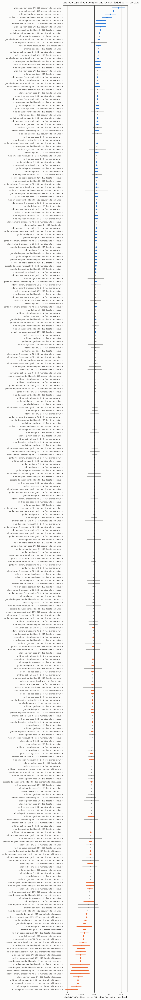
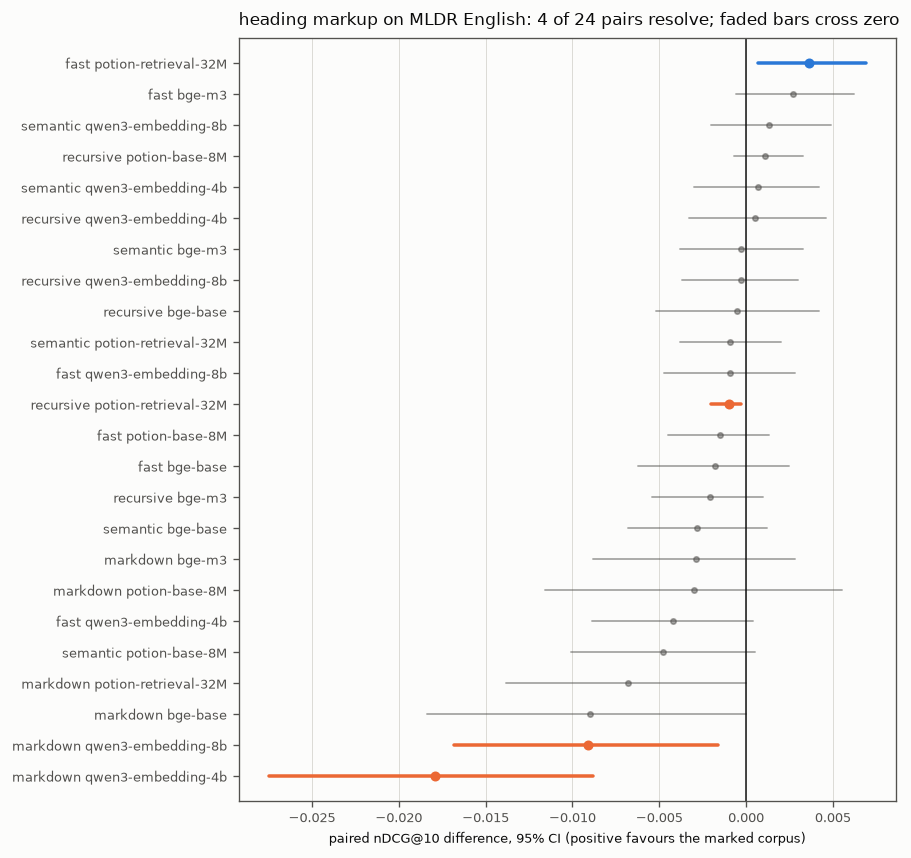
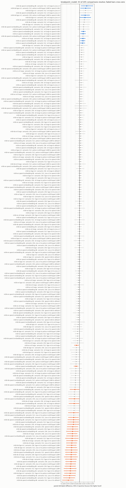
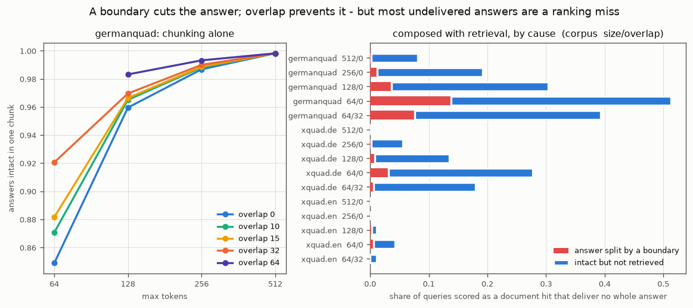
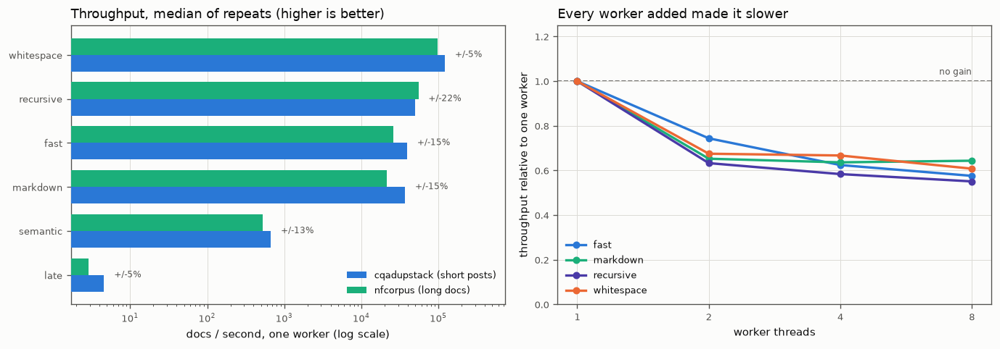

# Chunking

How a document is cut up before embedding: which strategy, how large the pieces are, and how much
they overlap. This page merges what used to be two separate documents, one ranking the strategies
and one sweeping the parameters, because they answer one question and the answers interact.

Measured on the three corpora long enough to carry a chunking claim: MLDR English (18.5 chunks
per document, 800 queries), MLDR German (67.3, 200), and GerDaLIR, a German legal-retrieval set
(36.0, 12,298). See [Method](01-method.md) for why the more familiar benchmark corpora cannot be
used here.

GerDaLIR is worth naming on its own, because it is the corpus that changes the answers below. It
brings fifteen times MLDR English's query count, which narrows every interval by about a factor of
four, and it asks a different kind of question. Its queries are citing PASSAGES from court
decisions, a median of 104 words each and a quarter of them over 169; MLDR's queries are
one-sentence questions with a median of 13 words. That difference, and not the documents, is what
turns out to move the overlap answer, and this page now measures it directly.

## The headline

<!-- BEGIN GENERATED chunk_knob_summary_chunking (scripts/gen_bench_tables.py) -->
| Axis               | Paired comparisons | Resolved at 95% | Up to N by chance | Resolved and material (>= 0.005 ndcg@10) | Which way                                                                                     |
|--------------------|--------------------|-----------------|-------------------|------------------------------------------|-----------------------------------------------------------------------------------------------|
| `breakpoint_model` | 205                | 43 (21%)        | 11                | 43                                       | 17 favour bge-m3, 16 favour jina-v3, 7 favour qwen3-0.6b, 2 favour e5-large, 1 favour default |
| `max_tokens`       | 152                | 109 (72%)       | 8                 | 106                                      | 6 favour more, 54 favour less, 39 unresolved or immaterial (of 99 ladders)                    |
| `overlap_tokens`   | 980                | 530 (54%)       | 49                | 394                                      | 9 favour more, 5 favour less, 54 unresolved or immaterial (of 68 ladders)                     |
| `strategy`         | 313                | 114 (36%)       | 16                | 109                                      | 49 favour recursive, 24 favour markdown, 21 favour fast, 11 favour semantic, 4 favour late    |

Each comparison pairs two cells differing in exactly one axis and bootstraps the per-query difference over the queries they share. Unresolved means the interval spans zero: the query set cannot separate those two configurations. Up to N by chance is comparisons times alpha 0.05, rounded up: the resolutions that many true nulls would produce on average, a ceiling on how much of the resolved count is noise. Material means resolved AND an absolute difference of at least 0.005 ndcg@10; a 12,298-query corpus resolves steps far below that. For a numeric axis the direction is judged once per ladder (corpus, embedder, held-fixed set) by its top against bottom pair, so the counts are ladders; where the optimum sits within a ladder is the ceiling table's question. For a categorical axis the material comparisons are tallied per level. Restricted to corpora long enough to carry a chunking claim.
<!-- END GENERATED chunk_knob_summary_chunking -->

Of the 530 overlap comparisons that resolve, the chance column above already bounds how
much of that could be chance alone; 136 sit under the half-point material floor, all of
them on the 12,298-query corpus. The strategy axis loses 5 comparisons to that floor
and the size axis loses 3.

No axis points the same way everywhere, and the two that looked as if they did are decided by
the same thing. Chunk size resolves in 109 of its 152 comparisons: 91 favour the smaller chunk,
and every one of those is on MLDR; 18 favour the larger, and every one of those is on GerDaLIR,
where `recursive` was cut down to 64 tokens for all six embedders and each of the 18 steps
resolved the same way, counted per comparison and not per ladder. On MLDR's questions 128 tokens beats 256 for every embedder and 64 beats
128 for three of six; on GerDaLIR's passage queries 64 is the worst rung for every embedder, by
up to 0.158 nDCG@10. `whitespace` loses all 21 of the comparisons that resolve against it, but
every one of those is at a setting whose chunk holds 1.5 to 3 times the text of the chunk it is
paired with; at a matched realized size it sits beside `recursive`, so that verdict is the size
verdict wearing a strategy's name. Heading markup does not rescue the splitter named for it
either: with MLDR English's section headings marked as markdown,
`markdown` scored lower for all six embedders, resolved for two, both qwen3 models; `recursive`
was measured there only on chonkie's generic rules, not on the markdown recipe semdex ships.

Overlap does not point one way, and what decides it is the QUERY. Judged once per ladder by
its end-to-end pair, every one of GerDaLIR's `recursive` cap256 ladders favours MORE overlap:
four top out at 128 tokens and two, both `model2vec`, run to 256. Its other twelve ladders,
the two-rung `fast` and `markdown` resplitters that stop at 51 tokens, are undecided, and
none favours less. On MLDR the overlap answer sits mostly under the floor: three of its `recursive` cap256 ladders
and one of its cap512 ladders favour LESS overlap, and so does `bge-small`'s own shorter cap256 ladder
that stops at 15 tokens, on English throughout; three of its two-rung `fast` and `markdown`
hint256 ladders favour MORE instead, the same shape as GerDaLIR's own undecided twelve; the rest
are undecided. A per-level tally on a 20-rung ladder counts partners, not wins. Binning GerDaLIR's own
queries by length turns its answer into MLDR's: on the quarter of its queries under 63 words,
128 tokens of overlap gain nothing for 5 of the 6 embedders and lose, resolved, for the default one,
while on the longest quarter they gain +0.03 to +0.06 for every embedder. Cutting every GerDaLIR query to its
first 20 words and re-scoring the same cells confirms it causally, below: the gain shrinks for
all six embedders and reverses for three of them. So there is no corpus-independent overlap
default, but there is a rule a deployer can apply: it follows the length of the queries, not the
language or the documents.

Read the resolve rates with the query counts beside them. GerDaLIR runs 12,298 queries against
MLDR English's 800, which narrows an interval by about a factor of four on its own, so most of
the 530 resolved overlap comparisons are GerDaLIR's, "now measurable" rather than "now larger".
The chance column in the headline table above states that bound per axis; it caps how many of a
row's resolutions could be chance alone, and is never subtracted from the resolved count beside it.
One thing is absent from every table by an audit's judgement rather than by hand: the whitespace
cells on the German corpora for the embedders whose input window they exceed, listed at the end
of the page with the reason for each. The four cap512 overlap sets on MLDR, which an earlier
size-guard had re-cut into crumbs, were re-cut with the current chunker and re-measured, and
every table carries them again.

## Before the numbers: four things the knob names get wrong

These were measured against the chunk data rather than read off the configuration, and each one
changes how a row in the tables below must be read.

**Overlap is counted in TOKENS, not percent.** The `ov10tok` setting adds ten tokens, which is a
3.9 percent overlap at cap256 and 2.0 percent at cap512, not the 10 to 20 percent that a
percentage reading would imply. Any conclusion on this page about overlap is a conclusion about a
small overlap.

**Three strategies honour overlap, and none of them means the same thing by it.** chonkie
ignores the setting for semantic and late. `recursive` appends the head of the NEXT chunk to each
chunk it has already cut (chonkie's `OverlapRefinery` in its default suffix mode), so the
boundaries do not move and the chunk count does not change. The Rust splitters `markdown` and
`fast` re-split the text into overlapping windows, so their boundaries do move and their chunk
count rises, by up to 6.2 percent at 51 tokens on GerDaLIR. The grid is therefore not a full
factorial, and nothing here averages over the overlap axis.

**A recursive overlap set whose chunk count moved was re-cut, and the export withholds it.**
Because recursive overlap only appends context, its count must equal the overlap-0 set's. Four
cap512 sets on MLDR had grown by 16 to 22 percent instead: an earlier size-guard had split every
chunk the overlap pushed past 512 into a full chunk plus a crumb, so those sets carried 10 to 16
percent chunks of 16 tokens or fewer, and they supplied the seven largest "overlap hurts on MLDR"
comparisons this page once printed. The chunk-dimension audit flags such a set and the export
drops every cell built on it. The four sets were re-cut with the current chunker and re-embedded
for every embedder; their counts now equal the overlap-0 set's (68,090 on English, 95,669 on
German), and of their 36 overlap comparisons four resolve, two each way: `qwen3-embedding-4b`
favours LESS on English (0 against 10 tokens, -0.0059; 0 against 15, -0.0052) and MORE on
German (0 against 10 tokens, +0.0157), and `bge-base` on German at 10 against 15 tokens, +0.0114,
favours more. The rule still withholds the cap512 overlap sets on the three BEIR corpora, which
were not re-measured; they are listed at the end of the page.

**`max_tokens` is a target for the semantic chunker, not a cap, and token counts are not
comparable across strategies.** chonkie's `SemanticChunker` groups at sentence granularity, so one
un-splittable "sentence" overflows the target. semdex adds a lossless size-guard
(`[chunker].enforce_max_tokens`, default **true**) that splits such a chunk into in-cap pieces. It
is a split and never a truncate, so the character total is unaffected, and every profile in the
table below holds its cap.

The tokenizer difference remains. chonkie's `SemanticChunker` takes no tokenizer argument at all
and counts in its embedding model's tokenizer, while `RecursiveChunker` counts in the configured
one.

<!-- BEGIN GENERATED chunk_profile_shape_mldr_en (scripts/gen_bench_tables.py) -->
| Profile                                              | Chunks  | Chunks/doc | Median tokens | Max tokens | True cap | Cap held | Chars/token |
|------------------------------------------------------|---------|------------|---------------|------------|----------|----------|-------------|
| fast hint256 ov0tok (0%)                             | 150,311 | 18.79      | 208           | 256        | 256      | yes      | 4.30        |
| fast hint256 ov26tok (10%)                           | 152,233 | 19.03      | 209           | 256        | 256      | yes      | 4.29        |
| fast hint256 ov38tok (15%)                           | 154,032 | 19.25      | 210           | 256        | 256      | yes      | 4.28        |
| fast hint256 ov51tok (20%)                           | 156,759 | 19.59      | 210           | 256        | 256      | yes      | 4.28        |
| late hint256                                         | 150,688 | 18.84      | 196           | 256        | 256      | yes      | 5.13        |
| markdown hint256 ov0tok (0%)                         | 149,082 | 18.64      | 208           | 256        | 256      | yes      | 4.30        |
| markdown hint256 ov26tok (10%)                       | 151,201 | 18.90      | 209           | 256        | 256      | yes      | 4.29        |
| markdown hint256 ov38tok (15%)                       | 152,909 | 19.11      | 209           | 256        | 256      | yes      | 4.28        |
| markdown hint256 ov51tok (20%)                       | 155,470 | 19.43      | 210           | 256        | 256      | yes      | 4.27        |
| recursive cap128 ov0tok (0%)                         | 316,836 | 39.60      | 101           | 128        | 128      | yes      | 4.25        |
| recursive cap256 ov0tok (0%)                         | 148,008 | 18.50      | 214           | 256        | 256      | yes      | 4.29        |
| recursive cap256 ov10tok (4%)                        | 148,013 | 18.50      | 224           | 266        | 266      | yes      | 4.29        |
| recursive cap256 ov15tok (6%)                        | 148,013 | 18.50      | 229           | 271        | 271      | yes      | 4.29        |
| recursive cap256 ov26tok (10%)                       | 148,013 | 18.50      | 239           | 282        | 282      | yes      | 4.30        |
| recursive cap256 ov38tok (15%)                       | 148,013 | 18.50      | 251           | 294        | 294      | yes      | 4.30        |
| recursive cap256 ov51tok (20%)                       | 148,013 | 18.50      | 263           | 308        | 307      | NO       | 4.30        |
| recursive cap512 ov0tok (0%)                         | 68,090  | 8.51       | 461           | 512        | 512      | yes      | 4.30        |
| recursive cap512 ov10tok (2%)                        | 68,090  | 8.51       | 470           | 522        | 522      | yes      | 4.30        |
| recursive cap512 ov15tok (3%)                        | 68,090  | 8.51       | 475           | 527        | 527      | yes      | 4.30        |
| recursive cap64 ov0tok (0%)                          | 660,625 | 82.58      | 47            | 65         | 64       | NO       | 4.22        |
| semantic hint256 breakpoint-default(potion-base-32M) | 385,414 | 48.18      | 46            | 256        | 256      | yes      | 4.70        |
| semantic hint512 breakpoint-default(potion-base-32M) | 373,893 | 46.74      | 45            | 512        | 512      | yes      | 4.70        |
| whitespace hint128                                   | 158,377 | 19.80      | 128           | 128        | 128      | yes      | 6.23        |
| whitespace hint256                                   | 81,116  | 10.14      | 256           | 256        | 256      | yes      | 6.23        |
| whitespace hint64                                    | 312,780 | 39.10      | 64            | 64         | 64       | yes      | 6.22        |
| whitespace hint96                                    | 209,849 | 26.23      | 96            | 96         | 96       | yes      | 6.22        |

The true cap is `max_tokens + overlap` for recursive, whose overlap is appended context that deliberately overshoots, and `max_tokens` for every other strategy. Chars/token differs across strategies because chonkie's SemanticChunker takes no tokenizer argument and counts in its embedding model's tokenizer, so token counts are NOT comparable between recursive and semantic rows.
<!-- END GENERATED chunk_profile_shape_mldr_en -->

## Chunk size: it follows the queries

<picture>
  <source media="(prefers-color-scheme: dark)" srcset="img/chunk_knob_max_tokens-dark.png" />
  
</picture>

<!-- BEGIN GENERATED chunk_knob_max_tokens (scripts/gen_bench_tables.py) -->
| Corpus                | Embedder                       | Held fixed                                          | Change (low to high) | Delta nDCG@10 | 95% CI             | Win/loss  | Verdict      |
|-----------------------|--------------------------------|-----------------------------------------------------|----------------------|---------------|--------------------|-----------|--------------|
| gerdalir_de_12k_slice | fastembed:bge-base             | recursive ov0tok                                    | 128 to 256           | +0.0263       | [+0.0212, +0.0315] | 2221/1557 | resolved     |
| gerdalir_de_12k_slice | fastembed:bge-base             | recursive ov0tok                                    | 64 to 128            | +0.0675       | [+0.0624, +0.0724] | 2486/1104 | resolved     |
| gerdalir_de_12k_slice | fastembed:bge-base             | recursive ov0tok                                    | 64 to 256            | +0.0937       | [+0.0881, +0.0997] | 3026/1127 | resolved     |
| gerdalir_de_12k_slice | model2vec:potion-base-8M       | recursive ov0tok                                    | 128 to 256           | +0.0590       | [+0.0537, +0.0645] | 2281/1116 | resolved     |
| gerdalir_de_12k_slice | model2vec:potion-base-8M       | recursive ov0tok                                    | 64 to 128            | +0.0990       | [+0.0936, +0.1045] | 2493/630  | resolved     |
| gerdalir_de_12k_slice | model2vec:potion-base-8M       | recursive ov0tok                                    | 64 to 256            | +0.1580       | [+0.1515, +0.1645] | 3393/620  | resolved     |
| gerdalir_de_12k_slice | model2vec:potion-retrieval-32M | recursive ov0tok                                    | 128 to 256           | +0.0532       | [+0.0480, +0.0584] | 2449/1321 | resolved     |
| gerdalir_de_12k_slice | model2vec:potion-retrieval-32M | recursive ov0tok                                    | 64 to 128            | +0.0878       | [+0.0824, +0.0932] | 2685/924  | resolved     |
| gerdalir_de_12k_slice | model2vec:potion-retrieval-32M | recursive ov0tok                                    | 64 to 256            | +0.1410       | [+0.1347, +0.1475] | 3593/903  | resolved     |
| gerdalir_de_12k_slice | ollama:bge-m3                  | recursive ov0tok                                    | 128 to 256           | +0.0299       | [+0.0253, +0.0345] | 2829/1976 | resolved     |
| gerdalir_de_12k_slice | ollama:bge-m3                  | recursive ov0tok                                    | 64 to 128            | +0.0684       | [+0.0634, +0.0734] | 3446/1773 | resolved     |
| gerdalir_de_12k_slice | ollama:bge-m3                  | recursive ov0tok                                    | 64 to 256            | +0.0983       | [+0.0929, +0.1040] | 4006/1645 | resolved     |
| gerdalir_de_12k_slice | ollama:qwen3-embedding-4b      | recursive ov0tok                                    | 128 to 256           | +0.0205       | [+0.0159, +0.0250] | 2810/2086 | resolved     |
| gerdalir_de_12k_slice | ollama:qwen3-embedding-4b      | recursive ov0tok                                    | 64 to 128            | +0.0649       | [+0.0602, +0.0698] | 3497/1803 | resolved     |
| gerdalir_de_12k_slice | ollama:qwen3-embedding-4b      | recursive ov0tok                                    | 64 to 256            | +0.0854       | [+0.0798, +0.0908] | 3990/1757 | resolved     |
| gerdalir_de_12k_slice | ollama:qwen3-embedding-8b      | recursive ov0tok                                    | 128 to 256           | +0.0247       | [+0.0201, +0.0292] | 2962/2087 | resolved     |
| gerdalir_de_12k_slice | ollama:qwen3-embedding-8b      | recursive ov0tok                                    | 64 to 128            | +0.0648       | [+0.0599, +0.0696] | 3497/1831 | resolved     |
| gerdalir_de_12k_slice | ollama:qwen3-embedding-8b      | recursive ov0tok                                    | 64 to 256            | +0.0895       | [+0.0840, +0.0949] | 4068/1770 | resolved     |
| mldr_de_3k_slice      | fastembed:bge-base             | recursive ov0tok                                    | 256 to 512           | -0.0536       | [-0.0935, -0.0143] | 19/38     | resolved     |
| mldr_de_3k_slice      | fastembed:bge-small            | recursive ov0tok                                    | 256 to 512           | -0.0757       | [-0.1140, -0.0385] | 18/45     | resolved     |
| mldr_de_3k_slice      | model2vec:potion-base-8M       | recursive ov0tok                                    | 256 to 512           | -0.0004       | [-0.0350, +0.0340] | 21/22     | not resolved |
| mldr_de_3k_slice      | model2vec:potion-retrieval-32M | recursive ov0tok                                    | 256 to 512           | -0.0474       | [-0.0824, -0.0129] | 16/30     | resolved     |
| mldr_de_3k_slice      | ollama:qwen3-embedding-4b      | recursive ov0tok                                    | 256 to 512           | -0.0571       | [-0.0942, -0.0202] | 15/34     | resolved     |
| mldr_de_3k_slice      | ollama:qwen3-embedding-8b      | recursive ov0tok                                    | 256 to 512           | -0.0425       | [-0.0736, -0.0133] | 13/25     | resolved     |
| mldr_de_3k_slice      | fastembed:bge-base             | recursive ov10tok                                   | 256 to 512           | -0.0652       | [-0.1054, -0.0266] | 21/42     | resolved     |
| mldr_de_3k_slice      | fastembed:bge-small            | recursive ov10tok                                   | 256 to 512           | -0.0729       | [-0.1127, -0.0347] | 16/38     | resolved     |
| mldr_de_3k_slice      | model2vec:potion-base-8M       | recursive ov10tok                                   | 256 to 512           | +0.0048       | [-0.0251, +0.0352] | 27/23     | not resolved |
| mldr_de_3k_slice      | model2vec:potion-retrieval-32M | recursive ov10tok                                   | 256 to 512           | -0.0290       | [-0.0640, +0.0051] | 15/28     | not resolved |
| mldr_de_3k_slice      | ollama:qwen3-embedding-4b      | recursive ov10tok                                   | 256 to 512           | -0.0416       | [-0.0757, -0.0092] | 16/27     | resolved     |
| mldr_de_3k_slice      | ollama:qwen3-embedding-8b      | recursive ov10tok                                   | 256 to 512           | -0.0392       | [-0.0716, -0.0090] | 15/26     | resolved     |
| mldr_de_3k_slice      | fastembed:bge-base             | recursive ov15tok                                   | 256 to 512           | -0.0510       | [-0.0914, -0.0116] | 23/38     | resolved     |
| mldr_de_3k_slice      | fastembed:bge-small            | recursive ov15tok                                   | 256 to 512           | -0.0732       | [-0.1103, -0.0373] | 14/40     | resolved     |
| mldr_de_3k_slice      | model2vec:potion-base-8M       | recursive ov15tok                                   | 256 to 512           | +0.0113       | [-0.0183, +0.0409] | 26/18     | not resolved |
| mldr_de_3k_slice      | model2vec:potion-retrieval-32M | recursive ov15tok                                   | 256 to 512           | -0.0246       | [-0.0589, +0.0093] | 17/28     | not resolved |
| mldr_de_3k_slice      | ollama:qwen3-embedding-4b      | recursive ov15tok                                   | 256 to 512           | -0.0397       | [-0.0739, -0.0068] | 17/29     | resolved     |
| mldr_de_3k_slice      | ollama:qwen3-embedding-8b      | recursive ov15tok                                   | 256 to 512           | -0.0348       | [-0.0647, -0.0068] | 15/25     | resolved     |
| mldr_de_3k_slice      | fastembed:bge-base             | semantic ov0tok                                     | 256 to 512           | -0.0351       | [-0.0650, -0.0074] | 16/21     | resolved     |
| mldr_de_3k_slice      | fastembed:bge-small            | semantic ov0tok                                     | 256 to 512           | -0.0482       | [-0.0747, -0.0254] | 7/21      | resolved     |
| mldr_de_3k_slice      | model2vec:potion-base-8M       | semantic ov0tok                                     | 256 to 512           | -0.0246       | [-0.0504, -0.0015] | 13/18     | resolved     |
| mldr_de_3k_slice      | model2vec:potion-retrieval-32M | semantic ov0tok                                     | 256 to 512           | -0.0215       | [-0.0504, +0.0059] | 14/20     | not resolved |
| mldr_de_3k_slice      | ollama:qwen3-embedding-4b      | semantic ov0tok                                     | 256 to 512           | -0.0236       | [-0.0453, -0.0037] | 7/15      | resolved     |
| mldr_de_3k_slice      | ollama:qwen3-embedding-8b      | semantic ov0tok                                     | 256 to 512           | -0.0140       | [-0.0310, +0.0004] | 5/9       | not resolved |
| mldr_de_3k_slice      | ollama:bge-m3                  | semantic ov0tok breakpoint-bge-m3                   | 256 to 512           | -0.0076       | [-0.0208, +0.0039] | 6/10      | not resolved |
| mldr_de_3k_slice      | ollama:qwen3-embedding-4b      | semantic ov0tok breakpoint-bge-m3                   | 256 to 512           | -0.0086       | [-0.0253, +0.0052] | 9/6       | not resolved |
| mldr_de_3k_slice      | ollama:qwen3-embedding-8b      | semantic ov0tok breakpoint-bge-m3                   | 256 to 512           | -0.0082       | [-0.0222, +0.0018] | 4/4       | not resolved |
| mldr_de_3k_slice      | openai:e5-large                | semantic ov0tok breakpoint-bge-m3                   | 256 to 512           | -0.0064       | [-0.0188, +0.0060] | 5/8       | not resolved |
| mldr_de_3k_slice      | ollama:bge-m3                  | semantic ov0tok breakpoint-e5-large                 | 256 to 512           | -0.0240       | [-0.0524, +0.0010] | 14/17     | not resolved |
| mldr_de_3k_slice      | ollama:qwen3-embedding-4b      | semantic ov0tok breakpoint-e5-large                 | 256 to 512           | -0.0309       | [-0.0585, -0.0060] | 13/18     | resolved     |
| mldr_de_3k_slice      | ollama:qwen3-embedding-8b      | semantic ov0tok breakpoint-e5-large                 | 256 to 512           | -0.0115       | [-0.0344, +0.0094] | 18/13     | not resolved |
| mldr_de_3k_slice      | openai:e5-large                | semantic ov0tok breakpoint-e5-large                 | 256 to 512           | -0.0253       | [-0.0548, +0.0020] | 15/22     | not resolved |
| mldr_de_3k_slice      | ollama:bge-m3                  | semantic ov0tok breakpoint-jina-v3                  | 256 to 512           | -0.0210       | [-0.0393, -0.0048] | 4/11      | resolved     |
| mldr_de_3k_slice      | ollama:qwen3-embedding-4b      | semantic ov0tok breakpoint-jina-v3                  | 256 to 512           | -0.0064       | [-0.0223, +0.0069] | 9/9       | not resolved |
| mldr_de_3k_slice      | ollama:qwen3-embedding-8b      | semantic ov0tok breakpoint-jina-v3                  | 256 to 512           | +0.0018       | [-0.0109, +0.0146] | 6/5       | not resolved |
| mldr_de_3k_slice      | openai:e5-large                | semantic ov0tok breakpoint-jina-v3                  | 256 to 512           | -0.0088       | [-0.0236, +0.0057] | 5/11      | not resolved |
| mldr_de_3k_slice      | ollama:bge-m3                  | semantic ov0tok breakpoint-potion-multilingual-128M | 256 to 512           | -0.0168       | [-0.0355, +0.0012] | 7/13      | not resolved |
| mldr_de_3k_slice      | ollama:qwen3-embedding-4b      | semantic ov0tok breakpoint-potion-multilingual-128M | 256 to 512           | -0.0188       | [-0.0388, +0.0001] | 6/14      | not resolved |
| mldr_de_3k_slice      | ollama:qwen3-embedding-8b      | semantic ov0tok breakpoint-potion-multilingual-128M | 256 to 512           | -0.0095       | [-0.0263, +0.0080] | 5/12      | not resolved |
| mldr_de_3k_slice      | openai:e5-large                | semantic ov0tok breakpoint-potion-multilingual-128M | 256 to 512           | -0.0112       | [-0.0301, +0.0084] | 9/13      | not resolved |
| mldr_de_3k_slice      | ollama:bge-m3                  | semantic ov0tok breakpoint-qwen3-0.6b               | 256 to 512           | -0.0136       | [-0.0296, +0.0000] | 5/9       | not resolved |
| mldr_de_3k_slice      | ollama:qwen3-embedding-4b      | semantic ov0tok breakpoint-qwen3-0.6b               | 256 to 512           | -0.0153       | [-0.0355, +0.0020] | 7/12      | not resolved |
| mldr_de_3k_slice      | ollama:qwen3-embedding-8b      | semantic ov0tok breakpoint-qwen3-0.6b               | 256 to 512           | -0.0126       | [-0.0321, +0.0037] | 6/8       | not resolved |
| mldr_de_3k_slice      | openai:e5-large                | semantic ov0tok breakpoint-qwen3-0.6b               | 256 to 512           | -0.0127       | [-0.0292, +0.0012] | 5/8       | not resolved |
| mldr_de_3k_slice      | model2vec:potion-base-8M       | whitespace ov0tok                                   | 64 to 128            | -0.0229       | [-0.0546, +0.0071] | 19/24     | not resolved |
| mldr_de_3k_slice      | model2vec:potion-base-8M       | whitespace ov0tok                                   | 96 to 128            | -0.0192       | [-0.0454, +0.0063] | 11/21     | not resolved |
| mldr_de_3k_slice      | model2vec:potion-base-8M       | whitespace ov0tok                                   | 64 to 96             | -0.0036       | [-0.0364, +0.0275] | 23/19     | not resolved |
| mldr_de_3k_slice      | model2vec:potion-retrieval-32M | whitespace ov0tok                                   | 64 to 128            | -0.0316       | [-0.0668, +0.0026] | 19/26     | not resolved |
| mldr_de_3k_slice      | model2vec:potion-retrieval-32M | whitespace ov0tok                                   | 96 to 128            | -0.0141       | [-0.0450, +0.0155] | 22/26     | not resolved |
| mldr_de_3k_slice      | model2vec:potion-retrieval-32M | whitespace ov0tok                                   | 64 to 96             | -0.0175       | [-0.0502, +0.0139] | 22/25     | not resolved |
| mldr_en_8k_slice      | fastembed:bge-base             | recursive ov0tok                                    | 128 to 256           | -0.0458       | [-0.0605, -0.0315] | 44/103    | resolved     |
| mldr_en_8k_slice      | fastembed:bge-base             | recursive ov0tok                                    | 128 to 512           | -0.0988       | [-0.1189, -0.0799] | 41/164    | resolved     |
| mldr_en_8k_slice      | fastembed:bge-base             | recursive ov0tok                                    | 256 to 512           | -0.0530       | [-0.0698, -0.0367] | 60/135    | resolved     |
| mldr_en_8k_slice      | fastembed:bge-base             | recursive ov0tok                                    | 64 to 128            | -0.0112       | [-0.0234, +0.0015] | 53/61     | not resolved |
| mldr_en_8k_slice      | fastembed:bge-base             | recursive ov0tok                                    | 64 to 256            | -0.0570       | [-0.0747, -0.0396] | 49/123    | resolved     |
| mldr_en_8k_slice      | fastembed:bge-base             | recursive ov0tok                                    | 64 to 512            | -0.1099       | [-0.1321, -0.0892] | 48/176    | resolved     |
| mldr_en_8k_slice      | fastembed:bge-small            | recursive ov0tok                                    | 256 to 512           | -0.0668       | [-0.0848, -0.0495] | 56/145    | resolved     |
| mldr_en_8k_slice      | model2vec:potion-base-8M       | recursive ov0tok                                    | 128 to 256           | -0.0354       | [-0.0529, -0.0185] | 84/121    | resolved     |
| mldr_en_8k_slice      | model2vec:potion-base-8M       | recursive ov0tok                                    | 128 to 512           | -0.1055       | [-0.1277, -0.0833] | 68/199    | resolved     |
| mldr_en_8k_slice      | model2vec:potion-base-8M       | recursive ov0tok                                    | 256 to 512           | -0.0701       | [-0.0880, -0.0525] | 63/162    | resolved     |
| mldr_en_8k_slice      | model2vec:potion-base-8M       | recursive ov0tok                                    | 64 to 128            | -0.0386       | [-0.0556, -0.0223] | 71/118    | resolved     |
| mldr_en_8k_slice      | model2vec:potion-base-8M       | recursive ov0tok                                    | 64 to 256            | -0.0740       | [-0.0959, -0.0532] | 86/164    | resolved     |
| mldr_en_8k_slice      | model2vec:potion-base-8M       | recursive ov0tok                                    | 64 to 512            | -0.1442       | [-0.1691, -0.1197] | 69/240    | resolved     |
| mldr_en_8k_slice      | model2vec:potion-retrieval-32M | recursive ov0tok                                    | 128 to 256           | -0.0208       | [-0.0346, -0.0073] | 75/102    | resolved     |
| mldr_en_8k_slice      | model2vec:potion-retrieval-32M | recursive ov0tok                                    | 128 to 512           | -0.0723       | [-0.0911, -0.0545] | 66/159    | resolved     |
| mldr_en_8k_slice      | model2vec:potion-retrieval-32M | recursive ov0tok                                    | 256 to 512           | -0.0515       | [-0.0666, -0.0374] | 55/137    | resolved     |
| mldr_en_8k_slice      | model2vec:potion-retrieval-32M | recursive ov0tok                                    | 64 to 128            | -0.0175       | [-0.0309, -0.0042] | 79/93     | resolved     |
| mldr_en_8k_slice      | model2vec:potion-retrieval-32M | recursive ov0tok                                    | 64 to 256            | -0.0383       | [-0.0550, -0.0222] | 81/122    | resolved     |
| mldr_en_8k_slice      | model2vec:potion-retrieval-32M | recursive ov0tok                                    | 64 to 512            | -0.0898       | [-0.1102, -0.0702] | 66/179    | resolved     |
| mldr_en_8k_slice      | ollama:bge-m3                  | recursive ov0tok                                    | 128 to 256           | -0.0320       | [-0.0459, -0.0189] | 44/81     | resolved     |
| mldr_en_8k_slice      | ollama:bge-m3                  | recursive ov0tok                                    | 64 to 128            | -0.0094       | [-0.0224, +0.0036] | 51/62     | not resolved |
| mldr_en_8k_slice      | ollama:bge-m3                  | recursive ov0tok                                    | 64 to 256            | -0.0414       | [-0.0582, -0.0252] | 54/100    | resolved     |
| mldr_en_8k_slice      | ollama:qwen3-embedding-4b      | recursive ov0tok                                    | 128 to 256           | -0.0209       | [-0.0333, -0.0084] | 46/74     | resolved     |
| mldr_en_8k_slice      | ollama:qwen3-embedding-4b      | recursive ov0tok                                    | 128 to 512           | -0.0434       | [-0.0585, -0.0288] | 43/98     | resolved     |
| mldr_en_8k_slice      | ollama:qwen3-embedding-4b      | recursive ov0tok                                    | 256 to 512           | -0.0225       | [-0.0346, -0.0108] | 48/80     | resolved     |
| mldr_en_8k_slice      | ollama:qwen3-embedding-4b      | recursive ov0tok                                    | 64 to 128            | -0.0114       | [-0.0239, +0.0006] | 53/52     | not resolved |
| mldr_en_8k_slice      | ollama:qwen3-embedding-4b      | recursive ov0tok                                    | 64 to 256            | -0.0323       | [-0.0481, -0.0172] | 51/90     | resolved     |
| mldr_en_8k_slice      | ollama:qwen3-embedding-4b      | recursive ov0tok                                    | 64 to 512            | -0.0548       | [-0.0721, -0.0378] | 48/116    | resolved     |
| mldr_en_8k_slice      | ollama:qwen3-embedding-8b      | recursive ov0tok                                    | 128 to 256           | -0.0189       | [-0.0320, -0.0062] | 41/70     | resolved     |
| mldr_en_8k_slice      | ollama:qwen3-embedding-8b      | recursive ov0tok                                    | 128 to 512           | -0.0432       | [-0.0580, -0.0287] | 33/106    | resolved     |
| mldr_en_8k_slice      | ollama:qwen3-embedding-8b      | recursive ov0tok                                    | 256 to 512           | -0.0243       | [-0.0363, -0.0122] | 45/83     | resolved     |
| mldr_en_8k_slice      | ollama:qwen3-embedding-8b      | recursive ov0tok                                    | 64 to 128            | -0.0128       | [-0.0248, -0.0014] | 44/51     | resolved     |
| mldr_en_8k_slice      | ollama:qwen3-embedding-8b      | recursive ov0tok                                    | 64 to 256            | -0.0317       | [-0.0480, -0.0162] | 44/84     | resolved     |
| mldr_en_8k_slice      | ollama:qwen3-embedding-8b      | recursive ov0tok                                    | 64 to 512            | -0.0560       | [-0.0729, -0.0391] | 39/120    | resolved     |
| mldr_en_8k_slice      | fastembed:bge-base             | recursive ov10tok                                   | 256 to 512           | -0.0432       | [-0.0598, -0.0278] | 60/119    | resolved     |
| mldr_en_8k_slice      | fastembed:bge-small            | recursive ov10tok                                   | 256 to 512           | -0.0603       | [-0.0772, -0.0435] | 58/146    | resolved     |
| mldr_en_8k_slice      | model2vec:potion-base-8M       | recursive ov10tok                                   | 256 to 512           | -0.0690       | [-0.0856, -0.0529] | 49/158    | resolved     |
| mldr_en_8k_slice      | model2vec:potion-retrieval-32M | recursive ov10tok                                   | 256 to 512           | -0.0489       | [-0.0631, -0.0352] | 49/131    | resolved     |
| mldr_en_8k_slice      | ollama:qwen3-embedding-4b      | recursive ov10tok                                   | 256 to 512           | -0.0265       | [-0.0385, -0.0151] | 39/85     | resolved     |
| mldr_en_8k_slice      | ollama:qwen3-embedding-8b      | recursive ov10tok                                   | 256 to 512           | -0.0268       | [-0.0384, -0.0154] | 39/83     | resolved     |
| mldr_en_8k_slice      | fastembed:bge-base             | recursive ov15tok                                   | 256 to 512           | -0.0456       | [-0.0620, -0.0299] | 58/125    | resolved     |
| mldr_en_8k_slice      | fastembed:bge-small            | recursive ov15tok                                   | 256 to 512           | -0.0566       | [-0.0735, -0.0399] | 60/142    | resolved     |
| mldr_en_8k_slice      | model2vec:potion-base-8M       | recursive ov15tok                                   | 256 to 512           | -0.0706       | [-0.0873, -0.0546] | 48/157    | resolved     |
| mldr_en_8k_slice      | model2vec:potion-retrieval-32M | recursive ov15tok                                   | 256 to 512           | -0.0509       | [-0.0653, -0.0371] | 50/139    | resolved     |
| mldr_en_8k_slice      | ollama:qwen3-embedding-4b      | recursive ov15tok                                   | 256 to 512           | -0.0308       | [-0.0427, -0.0197] | 35/85     | resolved     |
| mldr_en_8k_slice      | ollama:qwen3-embedding-8b      | recursive ov15tok                                   | 256 to 512           | -0.0210       | [-0.0329, -0.0095] | 49/82     | resolved     |
| mldr_en_8k_slice      | fastembed:bge-base             | semantic ov0tok                                     | 256 to 512           | -0.0050       | [-0.0092, -0.0014] | 5/13      | resolved     |
| mldr_en_8k_slice      | fastembed:bge-small            | semantic ov0tok                                     | 256 to 512           | -0.0064       | [-0.0124, -0.0008] | 13/16     | resolved     |
| mldr_en_8k_slice      | model2vec:potion-base-8M       | semantic ov0tok                                     | 256 to 512           | -0.0035       | [-0.0084, +0.0010] | 20/15     | not resolved |
| mldr_en_8k_slice      | model2vec:potion-retrieval-32M | semantic ov0tok                                     | 256 to 512           | -0.0064       | [-0.0111, -0.0022] | 6/17      | resolved     |
| mldr_en_8k_slice      | ollama:qwen3-embedding-4b      | semantic ov0tok                                     | 256 to 512           | -0.0037       | [-0.0088, +0.0007] | 10/11     | not resolved |
| mldr_en_8k_slice      | ollama:qwen3-embedding-8b      | semantic ov0tok                                     | 256 to 512           | -0.0009       | [-0.0040, +0.0021] | 9/11      | not resolved |
| mldr_en_8k_slice      | ollama:bge-m3                  | semantic ov0tok breakpoint-bge-m3                   | 256 to 512           | -0.0041       | [-0.0077, -0.0006] | 4/12      | resolved     |
| mldr_en_8k_slice      | ollama:qwen3-embedding-4b      | semantic ov0tok breakpoint-bge-m3                   | 256 to 512           | -0.0048       | [-0.0088, -0.0014] | 9/13      | resolved     |
| mldr_en_8k_slice      | ollama:qwen3-embedding-8b      | semantic ov0tok breakpoint-bge-m3                   | 256 to 512           | -0.0059       | [-0.0105, -0.0021] | 7/13      | resolved     |
| mldr_en_8k_slice      | openai:e5-large                | semantic ov0tok breakpoint-bge-m3                   | 256 to 512           | -0.0046       | [-0.0095, -0.0004] | 10/12     | resolved     |
| mldr_en_8k_slice      | ollama:bge-m3                  | semantic ov0tok breakpoint-e5-large                 | 256 to 512           | -0.0064       | [-0.0136, +0.0007] | 20/27     | not resolved |
| mldr_en_8k_slice      | ollama:qwen3-embedding-4b      | semantic ov0tok breakpoint-e5-large                 | 256 to 512           | -0.0118       | [-0.0191, -0.0051] | 19/31     | resolved     |
| mldr_en_8k_slice      | ollama:qwen3-embedding-8b      | semantic ov0tok breakpoint-e5-large                 | 256 to 512           | -0.0139       | [-0.0220, -0.0064] | 25/36     | resolved     |
| mldr_en_8k_slice      | openai:e5-large                | semantic ov0tok breakpoint-e5-large                 | 256 to 512           | -0.0174       | [-0.0263, -0.0090] | 21/46     | resolved     |
| mldr_en_8k_slice      | ollama:bge-m3                  | semantic ov0tok breakpoint-jina-v3                  | 256 to 512           | -0.0027       | [-0.0074, +0.0014] | 10/8      | not resolved |
| mldr_en_8k_slice      | ollama:qwen3-embedding-4b      | semantic ov0tok breakpoint-jina-v3                  | 256 to 512           | -0.0065       | [-0.0123, -0.0015] | 7/15      | resolved     |
| mldr_en_8k_slice      | ollama:qwen3-embedding-8b      | semantic ov0tok breakpoint-jina-v3                  | 256 to 512           | -0.0037       | [-0.0083, +0.0005] | 12/15     | not resolved |
| mldr_en_8k_slice      | openai:e5-large                | semantic ov0tok breakpoint-jina-v3                  | 256 to 512           | -0.0062       | [-0.0112, -0.0018] | 13/15     | resolved     |
| mldr_en_8k_slice      | ollama:bge-m3                  | semantic ov0tok breakpoint-potion-multilingual-128M | 256 to 512           | -0.0071       | [-0.0123, -0.0025] | 11/20     | resolved     |
| mldr_en_8k_slice      | ollama:qwen3-embedding-4b      | semantic ov0tok breakpoint-potion-multilingual-128M | 256 to 512           | -0.0065       | [-0.0123, -0.0016] | 11/17     | resolved     |
| mldr_en_8k_slice      | ollama:qwen3-embedding-8b      | semantic ov0tok breakpoint-potion-multilingual-128M | 256 to 512           | -0.0080       | [-0.0138, -0.0027] | 14/26     | resolved     |
| mldr_en_8k_slice      | openai:e5-large                | semantic ov0tok breakpoint-potion-multilingual-128M | 256 to 512           | -0.0110       | [-0.0170, -0.0055] | 8/28      | resolved     |
| mldr_en_8k_slice      | ollama:bge-m3                  | semantic ov0tok breakpoint-qwen3-0.6b               | 256 to 512           | -0.0012       | [-0.0047, +0.0021] | 8/9       | not resolved |
| mldr_en_8k_slice      | ollama:qwen3-embedding-4b      | semantic ov0tok breakpoint-qwen3-0.6b               | 256 to 512           | -0.0018       | [-0.0056, +0.0019] | 14/12     | not resolved |
| mldr_en_8k_slice      | ollama:qwen3-embedding-8b      | semantic ov0tok breakpoint-qwen3-0.6b               | 256 to 512           | -0.0024       | [-0.0054, +0.0004] | 6/13      | not resolved |
| mldr_en_8k_slice      | openai:e5-large                | semantic ov0tok breakpoint-qwen3-0.6b               | 256 to 512           | -0.0070       | [-0.0124, -0.0025] | 5/15      | resolved     |
| mldr_en_8k_slice      | model2vec:potion-base-8M       | whitespace ov0tok                                   | 128 to 256           | -0.0456       | [-0.0626, -0.0290] | 83/144    | resolved     |
| mldr_en_8k_slice      | model2vec:potion-base-8M       | whitespace ov0tok                                   | 64 to 128            | -0.0479       | [-0.0645, -0.0317] | 73/132    | resolved     |
| mldr_en_8k_slice      | model2vec:potion-base-8M       | whitespace ov0tok                                   | 64 to 256            | -0.0934       | [-0.1146, -0.0725] | 77/185    | resolved     |
| mldr_en_8k_slice      | model2vec:potion-base-8M       | whitespace ov0tok                                   | 96 to 128            | -0.0323       | [-0.0488, -0.0164] | 75/121    | resolved     |
| mldr_en_8k_slice      | model2vec:potion-base-8M       | whitespace ov0tok                                   | 96 to 256            | -0.0779       | [-0.0981, -0.0580] | 76/172    | resolved     |
| mldr_en_8k_slice      | model2vec:potion-base-8M       | whitespace ov0tok                                   | 64 to 96             | -0.0155       | [-0.0309, -0.0004] | 90/100    | resolved     |
| mldr_en_8k_slice      | model2vec:potion-retrieval-32M | whitespace ov0tok                                   | 128 to 256           | -0.0417       | [-0.0558, -0.0280] | 66/125    | resolved     |
| mldr_en_8k_slice      | model2vec:potion-retrieval-32M | whitespace ov0tok                                   | 64 to 128            | -0.0359       | [-0.0491, -0.0233] | 49/119    | resolved     |
| mldr_en_8k_slice      | model2vec:potion-retrieval-32M | whitespace ov0tok                                   | 64 to 256            | -0.0776       | [-0.0950, -0.0609] | 50/161    | resolved     |
| mldr_en_8k_slice      | model2vec:potion-retrieval-32M | whitespace ov0tok                                   | 96 to 128            | -0.0226       | [-0.0349, -0.0103] | 50/105    | resolved     |
| mldr_en_8k_slice      | model2vec:potion-retrieval-32M | whitespace ov0tok                                   | 96 to 256            | -0.0643       | [-0.0805, -0.0486] | 58/156    | resolved     |
| mldr_en_8k_slice      | model2vec:potion-retrieval-32M | whitespace ov0tok                                   | 64 to 96             | -0.0133       | [-0.0246, -0.0016] | 62/93     | resolved     |

Larger chunks mean fewer, longer chunks per document. Only corpora that can carry a chunking claim are shown; the rest yield about one chunk per document, where every profile produces the same chunk. The full set is in `tests/benchmarks/raw/chunk-knob-effects.json`.
<!-- END GENERATED chunk_knob_max_tokens -->

This was the clearest result in the sweep while it was measured on one corpus with short
queries, and it is now the second axis to split by query shape. Of the 152 comparisons, 109
resolve. 91 favour the smaller chunk, and all 91 are on MLDR; 18 favour the larger, and all 18
are on GerDaLIR, whose queries are passages. The effect is large enough to matter in practice in
either direction: up to 0.110 nDCG@10 on English from 64 to 512 tokens for the default embedder,
and up to 0.158 the other way on GerDaLIR, where `potion-base-8M` at 64 tokens loses that much
against 256.

Read the 109 by strategy, because they are not one measurement. 74 are `recursive`, and those are
the axis proper: 64, 128, 256 and 512 tokens on MLDR English, 64 to 256 on GerDaLIR, 256 against
512 on MLDR German, for six embedders (`bge-small` has the 256-against-512 pair only), twenty of
them at the 10- and 15-token overlap rungs of the cap512 sets, on both MLDR corpora. 23 are
`semantic` at hint256 against hint512, and those two profiles are nearly the same chunking - 385,414 chunks against 373,893 on
MLDR English, median 46 tokens against 45 - because the hint only decides where the size-guard
splits the oversize tail; their deltas of a few thousandths measure the guard, not chunk size.
The remaining 12 are the `whitespace` ladder at 64, 96, 128 and 256 words on both MLDR corpora
for the two static embedders, every step of which favours the smaller chunk, resolved. On MLDR
English `potion-retrieval-32M` runs 0.8201 at 64 words, 0.8068 at 96, 0.7842 at 128 and
0.7425 at 256; `potion-base-8M` runs 0.7418, 0.7263, 0.6939 and 0.6484.

The `recursive` ladder on MLDR English answers what the whitespace ladder could only suggest, and
it answers it for the three contextual embedders too. 128 tokens beats 256 for every embedder,
resolved: `bge-base` runs 0.9017, 0.8905, 0.8447 and 0.7917 at 64, 128, 256 and 512 tokens;
`qwen3-embedding-8b` runs 0.9242, 0.9114, 0.8925 and 0.8682; `potion-retrieval-32M` runs 0.8304,
0.8129, 0.7921 and 0.7406. 64 beats 128, resolved, for `potion-base-8M` (+0.0386),
`potion-retrieval-32M` (+0.0175) and `qwen3-embedding-8b` (+0.0128); for `bge-base`, `bge-m3`
and `qwen3-embedding-4b` the step is positive, +0.0094 to +0.0114, and does not resolve on 800
queries. So on a short-question corpus 256 tokens is where the earlier sweep stopped, not an
optimum: the gain from 256 down to 128 resolves for every embedder, and the floor sits at or
below 64 tokens for the two static models and one contextual one, with the other three flat
between 64 and 128. The contextual embedders are not exempt from the size effect; their step
from 128 down to 64 is about a third of the static models' (+0.009 to +0.013 against +0.018 to
+0.039), and their step from 256 down to 128 is the same size as everyone's.

GerDaLIR reverses every step. Its 18 `recursive` comparisons - 64 against 128, 128 against 256 and
64 against 256, for six embedders - all resolve and all favour the LARGER chunk: 64 to 128 costs
0.065 to 0.099 nDCG@10 and 128 to 256 a further 0.021 to 0.059, for the static and the
contextual models alike. `qwen3-embedding-8b` runs 0.4383, 0.5031 and 0.5278 at 64, 128 and 256
tokens; `bge-base` runs 0.1627, 0.2302 and 0.2564. No rung above 256 is measured on GerDaLIR, so
the open end is the opposite one from MLDR's: there, the largest chunk measured is the best one.

This is the rule the overlap section finds below, arriving one section early. GerDaLIR's queries
are citing passages with a median of 104 words; MLDR's are questions with a median of 13. A
passage query matches a passage-sized chunk, and cutting the chunk below the query loses the
match; a question matches a sentence or two, and everything else in the chunk is dilution. So
there is no corpus-independent chunk size, any more than there is a corpus-independent overlap,
and the deployer's rule is the same one: read the length of the queries.

The whitespace ladder still supplies the size-matched control the strategy section needs:
`whitespace` at 128 words is about 186 tokens, and there it sits beside `recursive` at cap256 -
0.7842 against 0.7921 for `potion-retrieval-32M`, 0.6939 against 0.7096 for `potion-base-8M`,
intervals overlapping - while at 256 words it sits beside `recursive` at cap512, and at 64 words
(about 93 tokens) beside `recursive` at cap128, 0.8201 against 0.8129 and 0.7418 against 0.7450.
What looked like a strategy losing was a strategy measured at up to three times the size.

One chunk set overshoots its cap by one token: the `recursive` cap64 set on MLDR English holds a
single chunk of 65 tokens among its 660,625, so the audit records its cap as not enforced, while
the GerDaLIR cap64 set and both cap128 sets sit exactly on their caps. One chunk in 660,625 moves
nothing in the table, and the cell is read as a 64-token cell.

The mechanism is not mysterious, and it has two halves. A larger chunk dilutes a specific passage
into a longer average, so the single vector representing it drifts away from any one question the
passage answers. And every score on this page is a document's BEST chunk (the scorer fetches 200
chunks and keeps the first ten distinct documents), so a document cut into more pieces gets more
draws at the top of the list. Both favour small chunks under a short query. Under a passage query
the first half runs the other way, because the chunk that matches best is the one that still
holds the whole passage, and GerDaLIR's 18 steps show that half winning. Neither half says what a
consumer reading the retrieved chunk gets, which is measured further down and points the other
way.

Smaller chunks cost more vectors: cap256 produces 148,008 chunks on MLDR English against 68,090 at
cap512, so roughly 2.2x the storage and 2.2x the exact-scan work, and 64 words produces 312,780.
`recursive` at 128 tokens produces 316,836 chunks on MLDR English and at 64 tokens 660,625, 4.5
times cap256; on GerDaLIR the cap64 set is 2,137,255 chunks. That is the trade, and on a
short-question corpus this evidence says it is worth paying for retrieval; on a passage-query
corpus it buys a worse result at a higher price. Whether it is worth paying for a reader of the
chunks is the span section's question.

What the size axis still lacks: GerDaLIR has no rung above 256 tokens, MLDR German has
`recursive` at 256 against 512 only, and the whitespace ladder is two static embedders.

## Overlap: it depends on the queries

<picture>
  <source media="(prefers-color-scheme: dark)" srcset="img/chunk_knob_overlap_tokens-dark.png" />
  
</picture>

<!-- BEGIN GENERATED chunk_knob_overlap (scripts/gen_bench_tables.py) -->
| Corpus                | Embedder                       | Held fixed       | Change (low to high)    | Delta nDCG@10 | 95% CI             | Win/loss  | Verdict      |
|-----------------------|--------------------------------|------------------|-------------------------|---------------|--------------------|-----------|--------------|
| gerdalir_de_12k_slice | fastembed:bge-base             | fast hint256     | 0 (0%) to 26 (10%)      | -0.0016       | [-0.0041, +0.0010] | 914/1009  | not resolved |
| gerdalir_de_12k_slice | fastembed:bge-base             | fast hint256     | 0 (0%) to 38 (15%)      | -0.0010       | [-0.0044, +0.0024] | 1189/1344 | not resolved |
| gerdalir_de_12k_slice | fastembed:bge-base             | fast hint256     | 26 (10%) to 38 (15%)    | +0.0006       | [-0.0021, +0.0033] | 965/995   | not resolved |
| gerdalir_de_12k_slice | fastembed:bge-base             | fast hint256     | 0 (0%) to 51 (20%)      | +0.0015       | [-0.0025, +0.0055] | 1506/1509 | not resolved |
| gerdalir_de_12k_slice | fastembed:bge-base             | fast hint256     | 26 (10%) to 51 (20%)    | +0.0031       | [-0.0006, +0.0067] | 1397/1365 | not resolved |
| gerdalir_de_12k_slice | fastembed:bge-base             | fast hint256     | 38 (15%) to 51 (20%)    | +0.0025       | [-0.0007, +0.0055] | 1154/1110 | not resolved |
| gerdalir_de_12k_slice | model2vec:potion-base-8M       | fast hint256     | 0 (0%) to 26 (10%)      | -0.0002       | [-0.0021, +0.0018] | 637/610   | not resolved |
| gerdalir_de_12k_slice | model2vec:potion-base-8M       | fast hint256     | 0 (0%) to 38 (15%)      | +0.0018       | [-0.0010, +0.0045] | 909/883   | not resolved |
| gerdalir_de_12k_slice | model2vec:potion-base-8M       | fast hint256     | 26 (10%) to 38 (15%)    | +0.0020       | [-0.0003, +0.0042] | 737/716   | not resolved |
| gerdalir_de_12k_slice | model2vec:potion-base-8M       | fast hint256     | 0 (0%) to 51 (20%)      | +0.0039       | [+0.0005, +0.0073] | 1156/1061 | resolved     |
| gerdalir_de_12k_slice | model2vec:potion-base-8M       | fast hint256     | 26 (10%) to 51 (20%)    | +0.0041       | [+0.0009, +0.0072] | 1057/998  | resolved     |
| gerdalir_de_12k_slice | model2vec:potion-base-8M       | fast hint256     | 38 (15%) to 51 (20%)    | +0.0021       | [-0.0006, +0.0048] | 841/811   | not resolved |
| gerdalir_de_12k_slice | model2vec:potion-retrieval-32M | fast hint256     | 0 (0%) to 26 (10%)      | -0.0001       | [-0.0021, +0.0018] | 705/726   | not resolved |
| gerdalir_de_12k_slice | model2vec:potion-retrieval-32M | fast hint256     | 0 (0%) to 38 (15%)      | +0.0010       | [-0.0018, +0.0038] | 1024/1036 | not resolved |
| gerdalir_de_12k_slice | model2vec:potion-retrieval-32M | fast hint256     | 26 (10%) to 38 (15%)    | +0.0011       | [-0.0013, +0.0035] | 824/825   | not resolved |
| gerdalir_de_12k_slice | model2vec:potion-retrieval-32M | fast hint256     | 0 (0%) to 51 (20%)      | +0.0038       | [+0.0004, +0.0072] | 1301/1229 | resolved     |
| gerdalir_de_12k_slice | model2vec:potion-retrieval-32M | fast hint256     | 26 (10%) to 51 (20%)    | +0.0039       | [+0.0007, +0.0071] | 1211/1136 | resolved     |
| gerdalir_de_12k_slice | model2vec:potion-retrieval-32M | fast hint256     | 38 (15%) to 51 (20%)    | +0.0028       | [+0.0000, +0.0055] | 996/942   | resolved     |
| gerdalir_de_12k_slice | ollama:bge-m3                  | fast hint256     | 0 (0%) to 26 (10%)      | -0.0015       | [-0.0035, +0.0005] | 947/1069  | not resolved |
| gerdalir_de_12k_slice | ollama:bge-m3                  | fast hint256     | 0 (0%) to 38 (15%)      | -0.0015       | [-0.0042, +0.0011] | 1406/1546 | not resolved |
| gerdalir_de_12k_slice | ollama:bge-m3                  | fast hint256     | 26 (10%) to 38 (15%)    | -0.0001       | [-0.0023, +0.0022] | 1114/1197 | not resolved |
| gerdalir_de_12k_slice | ollama:bge-m3                  | fast hint256     | 0 (0%) to 51 (20%)      | -0.0005       | [-0.0037, +0.0027] | 1700/1766 | not resolved |
| gerdalir_de_12k_slice | ollama:bge-m3                  | fast hint256     | 26 (10%) to 51 (20%)    | +0.0010       | [-0.0019, +0.0039] | 1552/1613 | not resolved |
| gerdalir_de_12k_slice | ollama:bge-m3                  | fast hint256     | 38 (15%) to 51 (20%)    | +0.0010       | [-0.0014, +0.0035] | 1295/1329 | not resolved |
| gerdalir_de_12k_slice | ollama:qwen3-embedding-4b      | fast hint256     | 0 (0%) to 26 (10%)      | +0.0012       | [-0.0007, +0.0031] | 1037/983  | not resolved |
| gerdalir_de_12k_slice | ollama:qwen3-embedding-4b      | fast hint256     | 0 (0%) to 38 (15%)      | +0.0033       | [+0.0007, +0.0059] | 1505/1363 | resolved     |
| gerdalir_de_12k_slice | ollama:qwen3-embedding-4b      | fast hint256     | 26 (10%) to 38 (15%)    | +0.0021       | [-0.0001, +0.0043] | 1154/1114 | not resolved |
| gerdalir_de_12k_slice | ollama:qwen3-embedding-4b      | fast hint256     | 0 (0%) to 51 (20%)      | +0.0044       | [+0.0012, +0.0076] | 1806/1722 | resolved     |
| gerdalir_de_12k_slice | ollama:qwen3-embedding-4b      | fast hint256     | 26 (10%) to 51 (20%)    | +0.0033       | [+0.0002, +0.0062] | 1651/1619 | resolved     |
| gerdalir_de_12k_slice | ollama:qwen3-embedding-4b      | fast hint256     | 38 (15%) to 51 (20%)    | +0.0011       | [-0.0015, +0.0037] | 1328/1391 | not resolved |
| gerdalir_de_12k_slice | ollama:qwen3-embedding-8b      | fast hint256     | 0 (0%) to 26 (10%)      | +0.0014       | [-0.0006, +0.0034] | 1045/993  | not resolved |
| gerdalir_de_12k_slice | ollama:qwen3-embedding-8b      | fast hint256     | 0 (0%) to 38 (15%)      | +0.0015       | [-0.0011, +0.0043] | 1481/1495 | not resolved |
| gerdalir_de_12k_slice | ollama:qwen3-embedding-8b      | fast hint256     | 26 (10%) to 38 (15%)    | +0.0002       | [-0.0020, +0.0024] | 1122/1217 | not resolved |
| gerdalir_de_12k_slice | ollama:qwen3-embedding-8b      | fast hint256     | 0 (0%) to 51 (20%)      | +0.0037       | [+0.0005, +0.0070] | 1802/1792 | resolved     |
| gerdalir_de_12k_slice | ollama:qwen3-embedding-8b      | fast hint256     | 26 (10%) to 51 (20%)    | +0.0023       | [-0.0007, +0.0053] | 1629/1714 | not resolved |
| gerdalir_de_12k_slice | ollama:qwen3-embedding-8b      | fast hint256     | 38 (15%) to 51 (20%)    | +0.0022       | [-0.0003, +0.0047] | 1373/1384 | not resolved |
| gerdalir_de_12k_slice | fastembed:bge-base             | markdown hint256 | 0 (0%) to 26 (10%)      | -0.0020       | [-0.0044, +0.0004] | 1054/894  | not resolved |
| gerdalir_de_12k_slice | fastembed:bge-base             | markdown hint256 | 0 (0%) to 38 (15%)      | -0.0016       | [-0.0044, +0.0012] | 1157/1078 | not resolved |
| gerdalir_de_12k_slice | fastembed:bge-base             | markdown hint256 | 26 (10%) to 38 (15%)    | +0.0004       | [-0.0013, +0.0022] | 548/622   | not resolved |
| gerdalir_de_12k_slice | fastembed:bge-base             | markdown hint256 | 0 (0%) to 51 (20%)      | -0.0017       | [-0.0049, +0.0014] | 1283/1236 | not resolved |
| gerdalir_de_12k_slice | fastembed:bge-base             | markdown hint256 | 26 (10%) to 51 (20%)    | +0.0003       | [-0.0021, +0.0027] | 867/958   | not resolved |
| gerdalir_de_12k_slice | fastembed:bge-base             | markdown hint256 | 38 (15%) to 51 (20%)    | -0.0002       | [-0.0021, +0.0017] | 663/719   | not resolved |
| gerdalir_de_12k_slice | model2vec:potion-base-8M       | markdown hint256 | 0 (0%) to 26 (10%)      | -0.0009       | [-0.0025, +0.0007] | 525/503   | not resolved |
| gerdalir_de_12k_slice | model2vec:potion-base-8M       | markdown hint256 | 0 (0%) to 38 (15%)      | +0.0003       | [-0.0016, +0.0023] | 631/633   | not resolved |
| gerdalir_de_12k_slice | model2vec:potion-base-8M       | markdown hint256 | 26 (10%) to 38 (15%)    | +0.0012       | [-0.0001, +0.0026] | 362/375   | not resolved |
| gerdalir_de_12k_slice | model2vec:potion-base-8M       | markdown hint256 | 0 (0%) to 51 (20%)      | +0.0008       | [-0.0016, +0.0033] | 763/785   | not resolved |
| gerdalir_de_12k_slice | model2vec:potion-base-8M       | markdown hint256 | 26 (10%) to 51 (20%)    | +0.0017       | [-0.0003, +0.0038] | 604/638   | not resolved |
| gerdalir_de_12k_slice | model2vec:potion-base-8M       | markdown hint256 | 38 (15%) to 51 (20%)    | +0.0005       | [-0.0012, +0.0021] | 461/499   | not resolved |
| gerdalir_de_12k_slice | model2vec:potion-retrieval-32M | markdown hint256 | 0 (0%) to 26 (10%)      | -0.0006       | [-0.0021, +0.0008] | 562/458   | not resolved |
| gerdalir_de_12k_slice | model2vec:potion-retrieval-32M | markdown hint256 | 0 (0%) to 38 (15%)      | +0.0003       | [-0.0016, +0.0022] | 717/638   | not resolved |
| gerdalir_de_12k_slice | model2vec:potion-retrieval-32M | markdown hint256 | 26 (10%) to 38 (15%)    | +0.0009       | [-0.0004, +0.0023] | 444/421   | not resolved |
| gerdalir_de_12k_slice | model2vec:potion-retrieval-32M | markdown hint256 | 0 (0%) to 51 (20%)      | +0.0028       | [+0.0005, +0.0052] | 903/786   | resolved     |
| gerdalir_de_12k_slice | model2vec:potion-retrieval-32M | markdown hint256 | 26 (10%) to 51 (20%)    | +0.0035       | [+0.0015, +0.0054] | 733/648   | resolved     |
| gerdalir_de_12k_slice | model2vec:potion-retrieval-32M | markdown hint256 | 38 (15%) to 51 (20%)    | +0.0025       | [+0.0010, +0.0040] | 540/459   | resolved     |
| gerdalir_de_12k_slice | ollama:bge-m3                  | markdown hint256 | 0 (0%) to 26 (10%)      | -0.0001       | [-0.0018, +0.0016] | 953/983   | not resolved |
| gerdalir_de_12k_slice | ollama:bge-m3                  | markdown hint256 | 0 (0%) to 38 (15%)      | +0.0004       | [-0.0017, +0.0025] | 1123/1186 | not resolved |
| gerdalir_de_12k_slice | ollama:bge-m3                  | markdown hint256 | 26 (10%) to 38 (15%)    | +0.0005       | [-0.0009, +0.0020] | 588/662   | not resolved |
| gerdalir_de_12k_slice | ollama:bge-m3                  | markdown hint256 | 0 (0%) to 51 (20%)      | -0.0002       | [-0.0026, +0.0023] | 1302/1440 | not resolved |
| gerdalir_de_12k_slice | ollama:bge-m3                  | markdown hint256 | 26 (10%) to 51 (20%)    | -0.0001       | [-0.0021, +0.0020] | 943/1094  | not resolved |
| gerdalir_de_12k_slice | ollama:bge-m3                  | markdown hint256 | 38 (15%) to 51 (20%)    | -0.0006       | [-0.0022, +0.0011] | 693/832   | not resolved |
| gerdalir_de_12k_slice | ollama:qwen3-embedding-4b      | markdown hint256 | 0 (0%) to 26 (10%)      | +0.0003       | [-0.0015, +0.0020] | 910/1067  | not resolved |
| gerdalir_de_12k_slice | ollama:qwen3-embedding-4b      | markdown hint256 | 0 (0%) to 38 (15%)      | +0.0005       | [-0.0015, +0.0026] | 1133/1258 | not resolved |
| gerdalir_de_12k_slice | ollama:qwen3-embedding-4b      | markdown hint256 | 26 (10%) to 38 (15%)    | +0.0003       | [-0.0012, +0.0017] | 658/698   | not resolved |
| gerdalir_de_12k_slice | ollama:qwen3-embedding-4b      | markdown hint256 | 0 (0%) to 51 (20%)      | +0.0001       | [-0.0023, +0.0025] | 1326/1457 | not resolved |
| gerdalir_de_12k_slice | ollama:qwen3-embedding-4b      | markdown hint256 | 26 (10%) to 51 (20%)    | -0.0002       | [-0.0021, +0.0018] | 1003/1125 | not resolved |
| gerdalir_de_12k_slice | ollama:qwen3-embedding-4b      | markdown hint256 | 38 (15%) to 51 (20%)    | -0.0004       | [-0.0020, +0.0012] | 748/841   | not resolved |
| gerdalir_de_12k_slice | ollama:qwen3-embedding-8b      | markdown hint256 | 0 (0%) to 26 (10%)      | -0.0000       | [-0.0018, +0.0017] | 916/1001  | not resolved |
| gerdalir_de_12k_slice | ollama:qwen3-embedding-8b      | markdown hint256 | 0 (0%) to 38 (15%)      | +0.0009       | [-0.0012, +0.0030] | 1172/1233 | not resolved |
| gerdalir_de_12k_slice | ollama:qwen3-embedding-8b      | markdown hint256 | 26 (10%) to 38 (15%)    | +0.0009       | [-0.0005, +0.0024] | 680/697   | not resolved |
| gerdalir_de_12k_slice | ollama:qwen3-embedding-8b      | markdown hint256 | 0 (0%) to 51 (20%)      | +0.0007       | [-0.0017, +0.0031] | 1406/1449 | not resolved |
| gerdalir_de_12k_slice | ollama:qwen3-embedding-8b      | markdown hint256 | 26 (10%) to 51 (20%)    | +0.0007       | [-0.0013, +0.0028] | 1091/1141 | not resolved |
| gerdalir_de_12k_slice | ollama:qwen3-embedding-8b      | markdown hint256 | 38 (15%) to 51 (20%)    | -0.0002       | [-0.0019, +0.0015] | 813/874   | not resolved |
| gerdalir_de_12k_slice | fastembed:bge-base             | recursive cap256 | 0 (0%) to 102 (40%)     | +0.0052       | [+0.0016, +0.0088] | 1600/1476 | resolved     |
| gerdalir_de_12k_slice | fastembed:bge-base             | recursive cap256 | 0 (0%) to 115 (45%)     | +0.0054       | [+0.0017, +0.0091] | 1624/1462 | resolved     |
| gerdalir_de_12k_slice | fastembed:bge-base             | recursive cap256 | 102 (40%) to 115 (45%)  | +0.0002       | [-0.0014, +0.0019] | 905/850   | not resolved |
| gerdalir_de_12k_slice | fastembed:bge-base             | recursive cap256 | 0 (0%) to 128 (50%)     | +0.0055       | [+0.0018, +0.0092] | 1648/1496 | resolved     |
| gerdalir_de_12k_slice | fastembed:bge-base             | recursive cap256 | 102 (40%) to 128 (50%)  | +0.0003       | [-0.0016, +0.0022] | 1060/1000 | not resolved |
| gerdalir_de_12k_slice | fastembed:bge-base             | recursive cap256 | 115 (45%) to 128 (50%)  | +0.0001       | [-0.0015, +0.0017] | 883/894   | not resolved |
| gerdalir_de_12k_slice | fastembed:bge-base             | recursive cap256 | 0 (0%) to 26 (10%)      | +0.0009       | [-0.0017, +0.0035] | 1217/1182 | not resolved |
| gerdalir_de_12k_slice | fastembed:bge-base             | recursive cap256 | 26 (10%) to 102 (40%)   | +0.0043       | [+0.0013, +0.0073] | 1395/1287 | resolved     |
| gerdalir_de_12k_slice | fastembed:bge-base             | recursive cap256 | 26 (10%) to 115 (45%)   | +0.0045       | [+0.0014, +0.0076] | 1445/1287 | resolved     |
| gerdalir_de_12k_slice | fastembed:bge-base             | recursive cap256 | 26 (10%) to 128 (50%)   | +0.0046       | [+0.0014, +0.0078] | 1499/1336 | resolved     |
| gerdalir_de_12k_slice | fastembed:bge-base             | recursive cap256 | 0 (0%) to 38 (15%)      | +0.0018       | [-0.0011, +0.0045] | 1310/1298 | not resolved |
| gerdalir_de_12k_slice | fastembed:bge-base             | recursive cap256 | 38 (15%) to 102 (40%)   | +0.0034       | [+0.0005, +0.0062] | 1364/1238 | resolved     |
| gerdalir_de_12k_slice | fastembed:bge-base             | recursive cap256 | 38 (15%) to 115 (45%)   | +0.0036       | [+0.0007, +0.0066] | 1402/1262 | resolved     |
| gerdalir_de_12k_slice | fastembed:bge-base             | recursive cap256 | 38 (15%) to 128 (50%)   | +0.0037       | [+0.0007, +0.0068] | 1427/1304 | resolved     |
| gerdalir_de_12k_slice | fastembed:bge-base             | recursive cap256 | 26 (10%) to 38 (15%)    | +0.0009       | [-0.0009, +0.0026] | 925/911   | not resolved |
| gerdalir_de_12k_slice | fastembed:bge-base             | recursive cap256 | 0 (0%) to 51 (20%)      | +0.0019       | [-0.0012, +0.0049] | 1396/1332 | not resolved |
| gerdalir_de_12k_slice | fastembed:bge-base             | recursive cap256 | 51 (20%) to 102 (40%)   | +0.0033       | [+0.0008, +0.0059] | 1266/1165 | resolved     |
| gerdalir_de_12k_slice | fastembed:bge-base             | recursive cap256 | 51 (20%) to 115 (45%)   | +0.0035       | [+0.0008, +0.0063] | 1307/1234 | resolved     |
| gerdalir_de_12k_slice | fastembed:bge-base             | recursive cap256 | 51 (20%) to 128 (50%)   | +0.0036       | [+0.0007, +0.0065] | 1355/1283 | resolved     |
| gerdalir_de_12k_slice | fastembed:bge-base             | recursive cap256 | 26 (10%) to 51 (20%)    | +0.0010       | [-0.0012, +0.0031] | 1090/1029 | not resolved |
| gerdalir_de_12k_slice | fastembed:bge-base             | recursive cap256 | 38 (15%) to 51 (20%)    | +0.0001       | [-0.0017, +0.0018] | 936/887   | not resolved |
| gerdalir_de_12k_slice | fastembed:bge-base             | recursive cap256 | 0 (0%) to 64 (25%)      | +0.0034       | [+0.0003, +0.0065] | 1463/1331 | resolved     |
| gerdalir_de_12k_slice | fastembed:bge-base             | recursive cap256 | 64 (25%) to 102 (40%)   | +0.0018       | [-0.0006, +0.0041] | 1163/1113 | not resolved |
| gerdalir_de_12k_slice | fastembed:bge-base             | recursive cap256 | 64 (25%) to 115 (45%)   | +0.0020       | [-0.0006, +0.0045] | 1214/1164 | not resolved |
| gerdalir_de_12k_slice | fastembed:bge-base             | recursive cap256 | 64 (25%) to 128 (50%)   | +0.0021       | [-0.0007, +0.0047] | 1289/1242 | not resolved |
| gerdalir_de_12k_slice | fastembed:bge-base             | recursive cap256 | 26 (10%) to 64 (25%)    | +0.0025       | [+0.0001, +0.0049] | 1198/1106 | resolved     |
| gerdalir_de_12k_slice | fastembed:bge-base             | recursive cap256 | 38 (15%) to 64 (25%)    | +0.0017       | [-0.0004, +0.0037] | 1080/1005 | not resolved |
| gerdalir_de_12k_slice | fastembed:bge-base             | recursive cap256 | 51 (20%) to 64 (25%)    | +0.0016       | [-0.0001, +0.0032] | 906/863   | not resolved |
| gerdalir_de_12k_slice | fastembed:bge-base             | recursive cap256 | 0 (0%) to 77 (30%)      | +0.0052       | [+0.0019, +0.0085] | 1532/1402 | resolved     |
| gerdalir_de_12k_slice | fastembed:bge-base             | recursive cap256 | 77 (30%) to 102 (40%)   | +0.0000       | [-0.0020, +0.0020] | 1046/1015 | not resolved |
| gerdalir_de_12k_slice | fastembed:bge-base             | recursive cap256 | 77 (30%) to 115 (45%)   | +0.0002       | [-0.0021, +0.0025] | 1140/1126 | not resolved |
| gerdalir_de_12k_slice | fastembed:bge-base             | recursive cap256 | 77 (30%) to 128 (50%)   | +0.0003       | [-0.0021, +0.0028] | 1219/1186 | not resolved |
| gerdalir_de_12k_slice | fastembed:bge-base             | recursive cap256 | 26 (10%) to 77 (30%)    | +0.0043       | [+0.0016, +0.0070] | 1291/1195 | resolved     |
| gerdalir_de_12k_slice | fastembed:bge-base             | recursive cap256 | 38 (15%) to 77 (30%)    | +0.0034       | [+0.0010, +0.0058] | 1212/1098 | resolved     |
| gerdalir_de_12k_slice | fastembed:bge-base             | recursive cap256 | 51 (20%) to 77 (30%)    | +0.0033       | [+0.0012, +0.0054] | 1077/1028 | resolved     |
| gerdalir_de_12k_slice | fastembed:bge-base             | recursive cap256 | 64 (25%) to 77 (30%)    | +0.0017       | [+0.0000, +0.0035] | 909/891   | resolved     |
| gerdalir_de_12k_slice | fastembed:bge-base             | recursive cap256 | 0 (0%) to 90 (35%)      | +0.0068       | [+0.0033, +0.0103] | 1602/1422 | resolved     |
| gerdalir_de_12k_slice | fastembed:bge-base             | recursive cap256 | 90 (35%) to 102 (40%)   | -0.0016       | [-0.0033, +0.0000] | 827/884   | not resolved |
| gerdalir_de_12k_slice | fastembed:bge-base             | recursive cap256 | 90 (35%) to 115 (45%)   | -0.0014       | [-0.0033, +0.0005] | 968/1014  | not resolved |
| gerdalir_de_12k_slice | fastembed:bge-base             | recursive cap256 | 90 (35%) to 128 (50%)   | -0.0013       | [-0.0035, +0.0009] | 1093/1126 | not resolved |
| gerdalir_de_12k_slice | fastembed:bge-base             | recursive cap256 | 26 (10%) to 90 (35%)    | +0.0059       | [+0.0031, +0.0088] | 1385/1203 | resolved     |
| gerdalir_de_12k_slice | fastembed:bge-base             | recursive cap256 | 38 (15%) to 90 (35%)    | +0.0051       | [+0.0024, +0.0077] | 1328/1145 | resolved     |
| gerdalir_de_12k_slice | fastembed:bge-base             | recursive cap256 | 51 (20%) to 90 (35%)    | +0.0050       | [+0.0026, +0.0073] | 1202/1080 | resolved     |
| gerdalir_de_12k_slice | fastembed:bge-base             | recursive cap256 | 64 (25%) to 90 (35%)    | +0.0034       | [+0.0012, +0.0055] | 1092/997  | resolved     |
| gerdalir_de_12k_slice | fastembed:bge-base             | recursive cap256 | 77 (30%) to 90 (35%)    | +0.0017       | [-0.0001, +0.0033] | 915/885   | not resolved |
| gerdalir_de_12k_slice | model2vec:potion-base-8M       | recursive cap256 | 0 (0%) to 102 (40%)     | +0.0266       | [+0.0223, +0.0309] | 1811/1177 | resolved     |
| gerdalir_de_12k_slice | model2vec:potion-base-8M       | recursive cap256 | 0 (0%) to 115 (45%)     | +0.0292       | [+0.0249, +0.0336] | 1855/1175 | resolved     |
| gerdalir_de_12k_slice | model2vec:potion-base-8M       | recursive cap256 | 102 (40%) to 115 (45%)  | +0.0026       | [+0.0008, +0.0045] | 902/808   | resolved     |
| gerdalir_de_12k_slice | model2vec:potion-base-8M       | recursive cap256 | 0 (0%) to 128 (50%)     | +0.0324       | [+0.0280, +0.0368] | 1935/1170 | resolved     |
| gerdalir_de_12k_slice | model2vec:potion-base-8M       | recursive cap256 | 102 (40%) to 128 (50%)  | +0.0058       | [+0.0034, +0.0082] | 1100/923  | resolved     |
| gerdalir_de_12k_slice | model2vec:potion-base-8M       | recursive cap256 | 115 (45%) to 128 (50%)  | +0.0032       | [+0.0013, +0.0051] | 922/824   | resolved     |
| gerdalir_de_12k_slice | model2vec:potion-base-8M       | recursive cap256 | 0 (0%) to 141 (55%)     | +0.0349       | [+0.0304, +0.0394] | 2015/1148 | resolved     |
| gerdalir_de_12k_slice | model2vec:potion-base-8M       | recursive cap256 | 102 (40%) to 141 (55%)  | +0.0083       | [+0.0056, +0.0110] | 1237/996  | resolved     |
| gerdalir_de_12k_slice | model2vec:potion-base-8M       | recursive cap256 | 115 (45%) to 141 (55%)  | +0.0056       | [+0.0032, +0.0081] | 1115/955  | resolved     |
| gerdalir_de_12k_slice | model2vec:potion-base-8M       | recursive cap256 | 128 (50%) to 141 (55%)  | +0.0024       | [+0.0006, +0.0043] | 892/793   | resolved     |
| gerdalir_de_12k_slice | model2vec:potion-base-8M       | recursive cap256 | 0 (0%) to 154 (60%)     | +0.0356       | [+0.0311, +0.0401] | 1994/1146 | resolved     |
| gerdalir_de_12k_slice | model2vec:potion-base-8M       | recursive cap256 | 102 (40%) to 154 (60%)  | +0.0090       | [+0.0061, +0.0119] | 1285/1055 | resolved     |
| gerdalir_de_12k_slice | model2vec:potion-base-8M       | recursive cap256 | 115 (45%) to 154 (60%)  | +0.0064       | [+0.0037, +0.0090] | 1177/1024 | resolved     |
| gerdalir_de_12k_slice | model2vec:potion-base-8M       | recursive cap256 | 128 (50%) to 154 (60%)  | +0.0032       | [+0.0009, +0.0055] | 1000/973  | resolved     |
| gerdalir_de_12k_slice | model2vec:potion-base-8M       | recursive cap256 | 141 (55%) to 154 (60%)  | +0.0007       | [-0.0011, +0.0026] | 822/866   | not resolved |
| gerdalir_de_12k_slice | model2vec:potion-base-8M       | recursive cap256 | 0 (0%) to 166 (65%)     | +0.0381       | [+0.0336, +0.0426] | 2041/1123 | resolved     |
| gerdalir_de_12k_slice | model2vec:potion-base-8M       | recursive cap256 | 102 (40%) to 166 (65%)  | +0.0115       | [+0.0084, +0.0147] | 1381/1099 | resolved     |
| gerdalir_de_12k_slice | model2vec:potion-base-8M       | recursive cap256 | 115 (45%) to 166 (65%)  | +0.0089       | [+0.0060, +0.0118] | 1294/1060 | resolved     |
| gerdalir_de_12k_slice | model2vec:potion-base-8M       | recursive cap256 | 128 (50%) to 166 (65%)  | +0.0057       | [+0.0032, +0.0082] | 1135/1013 | resolved     |
| gerdalir_de_12k_slice | model2vec:potion-base-8M       | recursive cap256 | 141 (55%) to 166 (65%)  | +0.0032       | [+0.0010, +0.0054] | 1009/948  | resolved     |
| gerdalir_de_12k_slice | model2vec:potion-base-8M       | recursive cap256 | 154 (60%) to 166 (65%)  | +0.0025       | [+0.0009, +0.0041] | 816/735   | resolved     |
| gerdalir_de_12k_slice | model2vec:potion-base-8M       | recursive cap256 | 0 (0%) to 179 (70%)     | +0.0387       | [+0.0341, +0.0433] | 2055/1148 | resolved     |
| gerdalir_de_12k_slice | model2vec:potion-base-8M       | recursive cap256 | 102 (40%) to 179 (70%)  | +0.0120       | [+0.0088, +0.0154] | 1445/1129 | resolved     |
| gerdalir_de_12k_slice | model2vec:potion-base-8M       | recursive cap256 | 115 (45%) to 179 (70%)  | +0.0094       | [+0.0064, +0.0125] | 1348/1108 | resolved     |
| gerdalir_de_12k_slice | model2vec:potion-base-8M       | recursive cap256 | 128 (50%) to 179 (70%)  | +0.0062       | [+0.0035, +0.0091] | 1180/1079 | resolved     |
| gerdalir_de_12k_slice | model2vec:potion-base-8M       | recursive cap256 | 141 (55%) to 179 (70%)  | +0.0038       | [+0.0013, +0.0063] | 1093/1031 | resolved     |
| gerdalir_de_12k_slice | model2vec:potion-base-8M       | recursive cap256 | 154 (60%) to 179 (70%)  | +0.0031       | [+0.0010, +0.0051] | 954/890   | resolved     |
| gerdalir_de_12k_slice | model2vec:potion-base-8M       | recursive cap256 | 166 (65%) to 179 (70%)  | +0.0006       | [-0.0011, +0.0023] | 774/800   | not resolved |
| gerdalir_de_12k_slice | model2vec:potion-base-8M       | recursive cap256 | 0 (0%) to 192 (75%)     | +0.0390       | [+0.0346, +0.0435] | 2071/1113 | resolved     |
| gerdalir_de_12k_slice | model2vec:potion-base-8M       | recursive cap256 | 102 (40%) to 192 (75%)  | +0.0124       | [+0.0091, +0.0157] | 1468/1151 | resolved     |
| gerdalir_de_12k_slice | model2vec:potion-base-8M       | recursive cap256 | 115 (45%) to 192 (75%)  | +0.0097       | [+0.0066, +0.0129] | 1391/1135 | resolved     |
| gerdalir_de_12k_slice | model2vec:potion-base-8M       | recursive cap256 | 128 (50%) to 192 (75%)  | +0.0066       | [+0.0037, +0.0095] | 1241/1106 | resolved     |
| gerdalir_de_12k_slice | model2vec:potion-base-8M       | recursive cap256 | 141 (55%) to 192 (75%)  | +0.0041       | [+0.0014, +0.0069] | 1171/1101 | resolved     |
| gerdalir_de_12k_slice | model2vec:potion-base-8M       | recursive cap256 | 154 (60%) to 192 (75%)  | +0.0034       | [+0.0010, +0.0058] | 1025/1003 | resolved     |
| gerdalir_de_12k_slice | model2vec:potion-base-8M       | recursive cap256 | 166 (65%) to 192 (75%)  | +0.0009       | [-0.0012, +0.0031] | 908/947   | not resolved |
| gerdalir_de_12k_slice | model2vec:potion-base-8M       | recursive cap256 | 179 (70%) to 192 (75%)  | +0.0003       | [-0.0013, +0.0019] | 783/760   | not resolved |
| gerdalir_de_12k_slice | model2vec:potion-base-8M       | recursive cap256 | 0 (0%) to 205 (80%)     | +0.0407       | [+0.0363, +0.0452] | 2092/1116 | resolved     |
| gerdalir_de_12k_slice | model2vec:potion-base-8M       | recursive cap256 | 102 (40%) to 205 (80%)  | +0.0141       | [+0.0107, +0.0175] | 1521/1154 | resolved     |
| gerdalir_de_12k_slice | model2vec:potion-base-8M       | recursive cap256 | 115 (45%) to 205 (80%)  | +0.0115       | [+0.0082, +0.0147] | 1451/1149 | resolved     |
| gerdalir_de_12k_slice | model2vec:potion-base-8M       | recursive cap256 | 128 (50%) to 205 (80%)  | +0.0083       | [+0.0053, +0.0114] | 1323/1123 | resolved     |
| gerdalir_de_12k_slice | model2vec:potion-base-8M       | recursive cap256 | 141 (55%) to 205 (80%)  | +0.0058       | [+0.0030, +0.0087] | 1243/1118 | resolved     |
| gerdalir_de_12k_slice | model2vec:potion-base-8M       | recursive cap256 | 154 (60%) to 205 (80%)  | +0.0051       | [+0.0026, +0.0076] | 1144/1046 | resolved     |
| gerdalir_de_12k_slice | model2vec:potion-base-8M       | recursive cap256 | 166 (65%) to 205 (80%)  | +0.0026       | [+0.0003, +0.0050] | 1030/1016 | resolved     |
| gerdalir_de_12k_slice | model2vec:potion-base-8M       | recursive cap256 | 179 (70%) to 205 (80%)  | +0.0020       | [+0.0001, +0.0040] | 926/892   | resolved     |
| gerdalir_de_12k_slice | model2vec:potion-base-8M       | recursive cap256 | 192 (75%) to 205 (80%)  | +0.0017       | [+0.0002, +0.0032] | 727/702   | resolved     |
| gerdalir_de_12k_slice | model2vec:potion-base-8M       | recursive cap256 | 0 (0%) to 218 (85%)     | +0.0418       | [+0.0373, +0.0462] | 2120/1104 | resolved     |
| gerdalir_de_12k_slice | model2vec:potion-base-8M       | recursive cap256 | 102 (40%) to 218 (85%)  | +0.0151       | [+0.0117, +0.0186] | 1549/1161 | resolved     |
| gerdalir_de_12k_slice | model2vec:potion-base-8M       | recursive cap256 | 115 (45%) to 218 (85%)  | +0.0125       | [+0.0093, +0.0158] | 1470/1161 | resolved     |
| gerdalir_de_12k_slice | model2vec:potion-base-8M       | recursive cap256 | 128 (50%) to 218 (85%)  | +0.0093       | [+0.0063, +0.0125] | 1363/1137 | resolved     |
| gerdalir_de_12k_slice | model2vec:potion-base-8M       | recursive cap256 | 141 (55%) to 218 (85%)  | +0.0069       | [+0.0040, +0.0098] | 1267/1126 | resolved     |
| gerdalir_de_12k_slice | model2vec:potion-base-8M       | recursive cap256 | 154 (60%) to 218 (85%)  | +0.0061       | [+0.0035, +0.0088] | 1189/1069 | resolved     |
| gerdalir_de_12k_slice | model2vec:potion-base-8M       | recursive cap256 | 166 (65%) to 218 (85%)  | +0.0037       | [+0.0012, +0.0061] | 1093/1042 | resolved     |
| gerdalir_de_12k_slice | model2vec:potion-base-8M       | recursive cap256 | 179 (70%) to 218 (85%)  | +0.0031       | [+0.0009, +0.0053] | 984/940   | resolved     |
| gerdalir_de_12k_slice | model2vec:potion-base-8M       | recursive cap256 | 192 (75%) to 218 (85%)  | +0.0028       | [+0.0009, +0.0046] | 849/828   | resolved     |
| gerdalir_de_12k_slice | model2vec:potion-base-8M       | recursive cap256 | 205 (80%) to 218 (85%)  | +0.0010       | [-0.0003, +0.0024] | 672/675   | not resolved |
| gerdalir_de_12k_slice | model2vec:potion-base-8M       | recursive cap256 | 0 (0%) to 230 (90%)     | +0.0418       | [+0.0373, +0.0462] | 2090/1096 | resolved     |
| gerdalir_de_12k_slice | model2vec:potion-base-8M       | recursive cap256 | 102 (40%) to 230 (90%)  | +0.0152       | [+0.0117, +0.0187] | 1568/1167 | resolved     |
| gerdalir_de_12k_slice | model2vec:potion-base-8M       | recursive cap256 | 115 (45%) to 230 (90%)  | +0.0126       | [+0.0092, +0.0159] | 1494/1158 | resolved     |
| gerdalir_de_12k_slice | model2vec:potion-base-8M       | recursive cap256 | 128 (50%) to 230 (90%)  | +0.0094       | [+0.0063, +0.0125] | 1366/1148 | resolved     |
| gerdalir_de_12k_slice | model2vec:potion-base-8M       | recursive cap256 | 141 (55%) to 230 (90%)  | +0.0069       | [+0.0040, +0.0099] | 1311/1142 | resolved     |
| gerdalir_de_12k_slice | model2vec:potion-base-8M       | recursive cap256 | 154 (60%) to 230 (90%)  | +0.0062       | [+0.0035, +0.0090] | 1216/1088 | resolved     |
| gerdalir_de_12k_slice | model2vec:potion-base-8M       | recursive cap256 | 166 (65%) to 230 (90%)  | +0.0037       | [+0.0011, +0.0063] | 1120/1080 | resolved     |
| gerdalir_de_12k_slice | model2vec:potion-base-8M       | recursive cap256 | 179 (70%) to 230 (90%)  | +0.0031       | [+0.0008, +0.0055] | 1023/979  | resolved     |
| gerdalir_de_12k_slice | model2vec:potion-base-8M       | recursive cap256 | 192 (75%) to 230 (90%)  | +0.0028       | [+0.0007, +0.0049] | 907/891   | resolved     |
| gerdalir_de_12k_slice | model2vec:potion-base-8M       | recursive cap256 | 205 (80%) to 230 (90%)  | +0.0011       | [-0.0005, +0.0028] | 779/779   | not resolved |
| gerdalir_de_12k_slice | model2vec:potion-base-8M       | recursive cap256 | 218 (85%) to 230 (90%)  | +0.0000       | [-0.0011, +0.0012] | 549/584   | not resolved |
| gerdalir_de_12k_slice | model2vec:potion-base-8M       | recursive cap256 | 0 (0%) to 243 (95%)     | +0.0417       | [+0.0373, +0.0461] | 2108/1092 | resolved     |
| gerdalir_de_12k_slice | model2vec:potion-base-8M       | recursive cap256 | 102 (40%) to 243 (95%)  | +0.0151       | [+0.0116, +0.0186] | 1576/1182 | resolved     |
| gerdalir_de_12k_slice | model2vec:potion-base-8M       | recursive cap256 | 115 (45%) to 243 (95%)  | +0.0125       | [+0.0091, +0.0159] | 1495/1154 | resolved     |
| gerdalir_de_12k_slice | model2vec:potion-base-8M       | recursive cap256 | 128 (50%) to 243 (95%)  | +0.0093       | [+0.0062, +0.0124] | 1358/1157 | resolved     |
| gerdalir_de_12k_slice | model2vec:potion-base-8M       | recursive cap256 | 141 (55%) to 243 (95%)  | +0.0068       | [+0.0038, +0.0098] | 1311/1161 | resolved     |
| gerdalir_de_12k_slice | model2vec:potion-base-8M       | recursive cap256 | 154 (60%) to 243 (95%)  | +0.0061       | [+0.0033, +0.0089] | 1235/1111 | resolved     |
| gerdalir_de_12k_slice | model2vec:potion-base-8M       | recursive cap256 | 166 (65%) to 243 (95%)  | +0.0036       | [+0.0010, +0.0063] | 1125/1097 | resolved     |
| gerdalir_de_12k_slice | model2vec:potion-base-8M       | recursive cap256 | 179 (70%) to 243 (95%)  | +0.0031       | [+0.0006, +0.0055] | 1053/1019 | resolved     |
| gerdalir_de_12k_slice | model2vec:potion-base-8M       | recursive cap256 | 192 (75%) to 243 (95%)  | +0.0027       | [+0.0005, +0.0049] | 957/936   | resolved     |
| gerdalir_de_12k_slice | model2vec:potion-base-8M       | recursive cap256 | 205 (80%) to 243 (95%)  | +0.0010       | [-0.0008, +0.0028] | 810/840   | not resolved |
| gerdalir_de_12k_slice | model2vec:potion-base-8M       | recursive cap256 | 218 (85%) to 243 (95%)  | -0.0000       | [-0.0014, +0.0013] | 606/673   | not resolved |
| gerdalir_de_12k_slice | model2vec:potion-base-8M       | recursive cap256 | 230 (90%) to 243 (95%)  | -0.0001       | [-0.0011, +0.0010] | 423/476   | not resolved |
| gerdalir_de_12k_slice | model2vec:potion-base-8M       | recursive cap256 | 0 (0%) to 256 (100%)    | +0.0420       | [+0.0376, +0.0464] | 2101/1088 | resolved     |
| gerdalir_de_12k_slice | model2vec:potion-base-8M       | recursive cap256 | 102 (40%) to 256 (100%) | +0.0154       | [+0.0119, +0.0189] | 1575/1175 | resolved     |
| gerdalir_de_12k_slice | model2vec:potion-base-8M       | recursive cap256 | 115 (45%) to 256 (100%) | +0.0128       | [+0.0094, +0.0162] | 1496/1148 | resolved     |
| gerdalir_de_12k_slice | model2vec:potion-base-8M       | recursive cap256 | 128 (50%) to 256 (100%) | +0.0096       | [+0.0064, +0.0127] | 1367/1149 | resolved     |
| gerdalir_de_12k_slice | model2vec:potion-base-8M       | recursive cap256 | 141 (55%) to 256 (100%) | +0.0071       | [+0.0041, +0.0101] | 1312/1153 | resolved     |
| gerdalir_de_12k_slice | model2vec:potion-base-8M       | recursive cap256 | 154 (60%) to 256 (100%) | +0.0064       | [+0.0036, +0.0093] | 1237/1099 | resolved     |
| gerdalir_de_12k_slice | model2vec:potion-base-8M       | recursive cap256 | 166 (65%) to 256 (100%) | +0.0039       | [+0.0012, +0.0066] | 1128/1092 | resolved     |
| gerdalir_de_12k_slice | model2vec:potion-base-8M       | recursive cap256 | 179 (70%) to 256 (100%) | +0.0033       | [+0.0009, +0.0057] | 1064/1010 | resolved     |
| gerdalir_de_12k_slice | model2vec:potion-base-8M       | recursive cap256 | 192 (75%) to 256 (100%) | +0.0030       | [+0.0008, +0.0052] | 974/929   | resolved     |
| gerdalir_de_12k_slice | model2vec:potion-base-8M       | recursive cap256 | 205 (80%) to 256 (100%) | +0.0013       | [-0.0005, +0.0031] | 819/832   | not resolved |
| gerdalir_de_12k_slice | model2vec:potion-base-8M       | recursive cap256 | 218 (85%) to 256 (100%) | +0.0002       | [-0.0011, +0.0017] | 623/680   | not resolved |
| gerdalir_de_12k_slice | model2vec:potion-base-8M       | recursive cap256 | 230 (90%) to 256 (100%) | +0.0002       | [-0.0009, +0.0013] | 433/491   | not resolved |
| gerdalir_de_12k_slice | model2vec:potion-base-8M       | recursive cap256 | 243 (95%) to 256 (100%) | +0.0003       | [-0.0003, +0.0008] | 158/177   | not resolved |
| gerdalir_de_12k_slice | model2vec:potion-base-8M       | recursive cap256 | 0 (0%) to 26 (10%)      | +0.0057       | [+0.0028, +0.0085] | 1129/984  | resolved     |
| gerdalir_de_12k_slice | model2vec:potion-base-8M       | recursive cap256 | 26 (10%) to 102 (40%)   | +0.0210       | [+0.0172, +0.0247] | 1629/1106 | resolved     |
| gerdalir_de_12k_slice | model2vec:potion-base-8M       | recursive cap256 | 26 (10%) to 115 (45%)   | +0.0236       | [+0.0196, +0.0275] | 1715/1118 | resolved     |
| gerdalir_de_12k_slice | model2vec:potion-base-8M       | recursive cap256 | 26 (10%) to 128 (50%)   | +0.0268       | [+0.0228, +0.0307] | 1768/1090 | resolved     |
| gerdalir_de_12k_slice | model2vec:potion-base-8M       | recursive cap256 | 26 (10%) to 141 (55%)   | +0.0292       | [+0.0251, +0.0333] | 1840/1128 | resolved     |
| gerdalir_de_12k_slice | model2vec:potion-base-8M       | recursive cap256 | 26 (10%) to 154 (60%)   | +0.0299       | [+0.0259, +0.0340] | 1822/1107 | resolved     |
| gerdalir_de_12k_slice | model2vec:potion-base-8M       | recursive cap256 | 26 (10%) to 166 (65%)   | +0.0324       | [+0.0283, +0.0366] | 1882/1086 | resolved     |
| gerdalir_de_12k_slice | model2vec:potion-base-8M       | recursive cap256 | 26 (10%) to 179 (70%)   | +0.0330       | [+0.0288, +0.0372] | 1891/1102 | resolved     |
| gerdalir_de_12k_slice | model2vec:potion-base-8M       | recursive cap256 | 26 (10%) to 192 (75%)   | +0.0333       | [+0.0292, +0.0376] | 1908/1108 | resolved     |
| gerdalir_de_12k_slice | model2vec:potion-base-8M       | recursive cap256 | 26 (10%) to 205 (80%)   | +0.0350       | [+0.0309, +0.0392] | 1927/1103 | resolved     |
| gerdalir_de_12k_slice | model2vec:potion-base-8M       | recursive cap256 | 26 (10%) to 218 (85%)   | +0.0361       | [+0.0319, +0.0403] | 1942/1078 | resolved     |
| gerdalir_de_12k_slice | model2vec:potion-base-8M       | recursive cap256 | 26 (10%) to 230 (90%)   | +0.0361       | [+0.0319, +0.0403] | 1948/1073 | resolved     |
| gerdalir_de_12k_slice | model2vec:potion-base-8M       | recursive cap256 | 26 (10%) to 243 (95%)   | +0.0361       | [+0.0319, +0.0402] | 1961/1064 | resolved     |
| gerdalir_de_12k_slice | model2vec:potion-base-8M       | recursive cap256 | 26 (10%) to 256 (100%)  | +0.0363       | [+0.0321, +0.0404] | 1959/1058 | resolved     |
| gerdalir_de_12k_slice | model2vec:potion-base-8M       | recursive cap256 | 0 (0%) to 38 (15%)      | +0.0104       | [+0.0072, +0.0137] | 1287/1046 | resolved     |
| gerdalir_de_12k_slice | model2vec:potion-base-8M       | recursive cap256 | 38 (15%) to 102 (40%)   | +0.0162       | [+0.0126, +0.0198] | 1530/1080 | resolved     |
| gerdalir_de_12k_slice | model2vec:potion-base-8M       | recursive cap256 | 38 (15%) to 115 (45%)   | +0.0188       | [+0.0151, +0.0225] | 1614/1099 | resolved     |
| gerdalir_de_12k_slice | model2vec:potion-base-8M       | recursive cap256 | 38 (15%) to 128 (50%)   | +0.0220       | [+0.0182, +0.0258] | 1693/1095 | resolved     |
| gerdalir_de_12k_slice | model2vec:potion-base-8M       | recursive cap256 | 38 (15%) to 141 (55%)   | +0.0244       | [+0.0205, +0.0284] | 1754/1121 | resolved     |
| gerdalir_de_12k_slice | model2vec:potion-base-8M       | recursive cap256 | 38 (15%) to 154 (60%)   | +0.0252       | [+0.0212, +0.0291] | 1755/1123 | resolved     |
| gerdalir_de_12k_slice | model2vec:potion-base-8M       | recursive cap256 | 38 (15%) to 166 (65%)   | +0.0277       | [+0.0237, +0.0317] | 1786/1104 | resolved     |
| gerdalir_de_12k_slice | model2vec:potion-base-8M       | recursive cap256 | 38 (15%) to 179 (70%)   | +0.0282       | [+0.0241, +0.0323] | 1814/1123 | resolved     |
| gerdalir_de_12k_slice | model2vec:potion-base-8M       | recursive cap256 | 38 (15%) to 192 (75%)   | +0.0286       | [+0.0245, +0.0327] | 1836/1125 | resolved     |
| gerdalir_de_12k_slice | model2vec:potion-base-8M       | recursive cap256 | 38 (15%) to 205 (80%)   | +0.0303       | [+0.0263, +0.0343] | 1864/1101 | resolved     |
| gerdalir_de_12k_slice | model2vec:potion-base-8M       | recursive cap256 | 38 (15%) to 218 (85%)   | +0.0313       | [+0.0273, +0.0354] | 1871/1083 | resolved     |
| gerdalir_de_12k_slice | model2vec:potion-base-8M       | recursive cap256 | 38 (15%) to 230 (90%)   | +0.0314       | [+0.0273, +0.0354] | 1874/1091 | resolved     |
| gerdalir_de_12k_slice | model2vec:potion-base-8M       | recursive cap256 | 38 (15%) to 243 (95%)   | +0.0313       | [+0.0272, +0.0353] | 1880/1090 | resolved     |
| gerdalir_de_12k_slice | model2vec:potion-base-8M       | recursive cap256 | 38 (15%) to 256 (100%)  | +0.0316       | [+0.0275, +0.0356] | 1885/1089 | resolved     |
| gerdalir_de_12k_slice | model2vec:potion-base-8M       | recursive cap256 | 26 (10%) to 38 (15%)    | +0.0048       | [+0.0026, +0.0069] | 949/800   | resolved     |
| gerdalir_de_12k_slice | model2vec:potion-base-8M       | recursive cap256 | 0 (0%) to 51 (20%)      | +0.0147       | [+0.0111, +0.0183] | 1421/1111 | resolved     |
| gerdalir_de_12k_slice | model2vec:potion-base-8M       | recursive cap256 | 51 (20%) to 102 (40%)   | +0.0119       | [+0.0086, +0.0151] | 1392/1086 | resolved     |
| gerdalir_de_12k_slice | model2vec:potion-base-8M       | recursive cap256 | 51 (20%) to 115 (45%)   | +0.0145       | [+0.0112, +0.0179] | 1466/1088 | resolved     |
| gerdalir_de_12k_slice | model2vec:potion-base-8M       | recursive cap256 | 51 (20%) to 128 (50%)   | +0.0177       | [+0.0142, +0.0212] | 1567/1101 | resolved     |
| gerdalir_de_12k_slice | model2vec:potion-base-8M       | recursive cap256 | 51 (20%) to 141 (55%)   | +0.0202       | [+0.0164, +0.0239] | 1649/1127 | resolved     |
| gerdalir_de_12k_slice | model2vec:potion-base-8M       | recursive cap256 | 51 (20%) to 154 (60%)   | +0.0209       | [+0.0171, +0.0247] | 1649/1138 | resolved     |
| gerdalir_de_12k_slice | model2vec:potion-base-8M       | recursive cap256 | 51 (20%) to 166 (65%)   | +0.0234       | [+0.0195, +0.0273] | 1698/1126 | resolved     |
| gerdalir_de_12k_slice | model2vec:potion-base-8M       | recursive cap256 | 51 (20%) to 179 (70%)   | +0.0239       | [+0.0200, +0.0280] | 1743/1144 | resolved     |
| gerdalir_de_12k_slice | model2vec:potion-base-8M       | recursive cap256 | 51 (20%) to 192 (75%)   | +0.0243       | [+0.0203, +0.0283] | 1744/1168 | resolved     |
| gerdalir_de_12k_slice | model2vec:potion-base-8M       | recursive cap256 | 51 (20%) to 205 (80%)   | +0.0260       | [+0.0220, +0.0299] | 1767/1146 | resolved     |
| gerdalir_de_12k_slice | model2vec:potion-base-8M       | recursive cap256 | 51 (20%) to 218 (85%)   | +0.0270       | [+0.0230, +0.0310] | 1792/1142 | resolved     |
| gerdalir_de_12k_slice | model2vec:potion-base-8M       | recursive cap256 | 51 (20%) to 230 (90%)   | +0.0271       | [+0.0231, +0.0311] | 1791/1151 | resolved     |
| gerdalir_de_12k_slice | model2vec:potion-base-8M       | recursive cap256 | 51 (20%) to 243 (95%)   | +0.0270       | [+0.0230, +0.0310] | 1792/1144 | resolved     |
| gerdalir_de_12k_slice | model2vec:potion-base-8M       | recursive cap256 | 51 (20%) to 256 (100%)  | +0.0273       | [+0.0233, +0.0313] | 1803/1144 | resolved     |
| gerdalir_de_12k_slice | model2vec:potion-base-8M       | recursive cap256 | 26 (10%) to 51 (20%)    | +0.0090       | [+0.0063, +0.0118] | 1177/920  | resolved     |
| gerdalir_de_12k_slice | model2vec:potion-base-8M       | recursive cap256 | 38 (15%) to 51 (20%)    | +0.0043       | [+0.0021, +0.0064] | 948/821   | resolved     |
| gerdalir_de_12k_slice | model2vec:potion-base-8M       | recursive cap256 | 0 (0%) to 64 (25%)      | +0.0192       | [+0.0154, +0.0231] | 1559/1133 | resolved     |
| gerdalir_de_12k_slice | model2vec:potion-base-8M       | recursive cap256 | 64 (25%) to 102 (40%)   | +0.0074       | [+0.0046, +0.0103] | 1259/1011 | resolved     |
| gerdalir_de_12k_slice | model2vec:potion-base-8M       | recursive cap256 | 64 (25%) to 115 (45%)   | +0.0101       | [+0.0070, +0.0131] | 1370/1056 | resolved     |
| gerdalir_de_12k_slice | model2vec:potion-base-8M       | recursive cap256 | 64 (25%) to 128 (50%)   | +0.0133       | [+0.0099, +0.0165] | 1461/1075 | resolved     |
| gerdalir_de_12k_slice | model2vec:potion-base-8M       | recursive cap256 | 64 (25%) to 141 (55%)   | +0.0157       | [+0.0122, +0.0192] | 1545/1134 | resolved     |
| gerdalir_de_12k_slice | model2vec:potion-base-8M       | recursive cap256 | 64 (25%) to 154 (60%)   | +0.0164       | [+0.0128, +0.0200] | 1541/1143 | resolved     |
| gerdalir_de_12k_slice | model2vec:potion-base-8M       | recursive cap256 | 64 (25%) to 166 (65%)   | +0.0189       | [+0.0153, +0.0226] | 1601/1150 | resolved     |
| gerdalir_de_12k_slice | model2vec:potion-base-8M       | recursive cap256 | 64 (25%) to 179 (70%)   | +0.0195       | [+0.0157, +0.0233] | 1667/1173 | resolved     |
| gerdalir_de_12k_slice | model2vec:potion-base-8M       | recursive cap256 | 64 (25%) to 192 (75%)   | +0.0198       | [+0.0159, +0.0236] | 1673/1224 | resolved     |
| gerdalir_de_12k_slice | model2vec:potion-base-8M       | recursive cap256 | 64 (25%) to 205 (80%)   | +0.0215       | [+0.0177, +0.0253] | 1717/1208 | resolved     |
| gerdalir_de_12k_slice | model2vec:potion-base-8M       | recursive cap256 | 64 (25%) to 218 (85%)   | +0.0226       | [+0.0187, +0.0265] | 1757/1184 | resolved     |
| gerdalir_de_12k_slice | model2vec:potion-base-8M       | recursive cap256 | 64 (25%) to 230 (90%)   | +0.0226       | [+0.0187, +0.0265] | 1737/1180 | resolved     |
| gerdalir_de_12k_slice | model2vec:potion-base-8M       | recursive cap256 | 64 (25%) to 243 (95%)   | +0.0225       | [+0.0187, +0.0264] | 1740/1177 | resolved     |
| gerdalir_de_12k_slice | model2vec:potion-base-8M       | recursive cap256 | 64 (25%) to 256 (100%)  | +0.0228       | [+0.0190, +0.0267] | 1737/1177 | resolved     |
| gerdalir_de_12k_slice | model2vec:potion-base-8M       | recursive cap256 | 26 (10%) to 64 (25%)    | +0.0135       | [+0.0105, +0.0166] | 1344/995  | resolved     |
| gerdalir_de_12k_slice | model2vec:potion-base-8M       | recursive cap256 | 38 (15%) to 64 (25%)    | +0.0087       | [+0.0061, +0.0114] | 1196/929  | resolved     |
| gerdalir_de_12k_slice | model2vec:potion-base-8M       | recursive cap256 | 51 (20%) to 64 (25%)    | +0.0045       | [+0.0025, +0.0065] | 946/823   | resolved     |
| gerdalir_de_12k_slice | model2vec:potion-base-8M       | recursive cap256 | 0 (0%) to 77 (30%)      | +0.0226       | [+0.0186, +0.0267] | 1683/1137 | resolved     |
| gerdalir_de_12k_slice | model2vec:potion-base-8M       | recursive cap256 | 77 (30%) to 102 (40%)   | +0.0040       | [+0.0015, +0.0064] | 1084/966  | resolved     |
| gerdalir_de_12k_slice | model2vec:potion-base-8M       | recursive cap256 | 77 (30%) to 115 (45%)   | +0.0066       | [+0.0038, +0.0094] | 1212/1041 | resolved     |
| gerdalir_de_12k_slice | model2vec:potion-base-8M       | recursive cap256 | 77 (30%) to 128 (50%)   | +0.0098       | [+0.0067, +0.0129] | 1335/1097 | resolved     |
| gerdalir_de_12k_slice | model2vec:potion-base-8M       | recursive cap256 | 77 (30%) to 141 (55%)   | +0.0122       | [+0.0089, +0.0155] | 1438/1141 | resolved     |
| gerdalir_de_12k_slice | model2vec:potion-base-8M       | recursive cap256 | 77 (30%) to 154 (60%)   | +0.0130       | [+0.0096, +0.0164] | 1457/1171 | resolved     |
| gerdalir_de_12k_slice | model2vec:potion-base-8M       | recursive cap256 | 77 (30%) to 166 (65%)   | +0.0154       | [+0.0119, +0.0190] | 1526/1179 | resolved     |
| gerdalir_de_12k_slice | model2vec:potion-base-8M       | recursive cap256 | 77 (30%) to 179 (70%)   | +0.0160       | [+0.0124, +0.0197] | 1578/1214 | resolved     |
| gerdalir_de_12k_slice | model2vec:potion-base-8M       | recursive cap256 | 77 (30%) to 192 (75%)   | +0.0163       | [+0.0127, +0.0200] | 1599/1232 | resolved     |
| gerdalir_de_12k_slice | model2vec:potion-base-8M       | recursive cap256 | 77 (30%) to 205 (80%)   | +0.0181       | [+0.0144, +0.0217] | 1648/1237 | resolved     |
| gerdalir_de_12k_slice | model2vec:potion-base-8M       | recursive cap256 | 77 (30%) to 218 (85%)   | +0.0191       | [+0.0154, +0.0228] | 1672/1225 | resolved     |
| gerdalir_de_12k_slice | model2vec:potion-base-8M       | recursive cap256 | 77 (30%) to 230 (90%)   | +0.0192       | [+0.0154, +0.0229] | 1672/1208 | resolved     |
| gerdalir_de_12k_slice | model2vec:potion-base-8M       | recursive cap256 | 77 (30%) to 243 (95%)   | +0.0191       | [+0.0153, +0.0228] | 1673/1221 | resolved     |
| gerdalir_de_12k_slice | model2vec:potion-base-8M       | recursive cap256 | 77 (30%) to 256 (100%)  | +0.0194       | [+0.0156, +0.0231] | 1678/1223 | resolved     |
| gerdalir_de_12k_slice | model2vec:potion-base-8M       | recursive cap256 | 26 (10%) to 77 (30%)    | +0.0170       | [+0.0136, +0.0204] | 1483/1043 | resolved     |
| gerdalir_de_12k_slice | model2vec:potion-base-8M       | recursive cap256 | 38 (15%) to 77 (30%)    | +0.0122       | [+0.0092, +0.0152] | 1352/984  | resolved     |
| gerdalir_de_12k_slice | model2vec:potion-base-8M       | recursive cap256 | 51 (20%) to 77 (30%)    | +0.0079       | [+0.0054, +0.0106] | 1187/964  | resolved     |
| gerdalir_de_12k_slice | model2vec:potion-base-8M       | recursive cap256 | 64 (25%) to 77 (30%)    | +0.0035       | [+0.0015, +0.0055] | 970/824   | resolved     |
| gerdalir_de_12k_slice | model2vec:potion-base-8M       | recursive cap256 | 0 (0%) to 90 (35%)      | +0.0247       | [+0.0205, +0.0289] | 1748/1152 | resolved     |
| gerdalir_de_12k_slice | model2vec:potion-base-8M       | recursive cap256 | 90 (35%) to 102 (40%)   | +0.0019       | [+0.0001, +0.0039] | 873/826   | resolved     |
| gerdalir_de_12k_slice | model2vec:potion-base-8M       | recursive cap256 | 90 (35%) to 115 (45%)   | +0.0046       | [+0.0022, +0.0069] | 1066/944  | resolved     |
| gerdalir_de_12k_slice | model2vec:potion-base-8M       | recursive cap256 | 90 (35%) to 128 (50%)   | +0.0077       | [+0.0050, +0.0105] | 1219/990  | resolved     |
| gerdalir_de_12k_slice | model2vec:potion-base-8M       | recursive cap256 | 90 (35%) to 141 (55%)   | +0.0102       | [+0.0072, +0.0132] | 1329/1052 | resolved     |
| gerdalir_de_12k_slice | model2vec:potion-base-8M       | recursive cap256 | 90 (35%) to 154 (60%)   | +0.0109       | [+0.0078, +0.0141] | 1350/1102 | resolved     |
| gerdalir_de_12k_slice | model2vec:potion-base-8M       | recursive cap256 | 90 (35%) to 166 (65%)   | +0.0134       | [+0.0101, +0.0168] | 1430/1126 | resolved     |
| gerdalir_de_12k_slice | model2vec:potion-base-8M       | recursive cap256 | 90 (35%) to 179 (70%)   | +0.0140       | [+0.0106, +0.0174] | 1480/1171 | resolved     |
| gerdalir_de_12k_slice | model2vec:potion-base-8M       | recursive cap256 | 90 (35%) to 192 (75%)   | +0.0143       | [+0.0108, +0.0178] | 1494/1201 | resolved     |
| gerdalir_de_12k_slice | model2vec:potion-base-8M       | recursive cap256 | 90 (35%) to 205 (80%)   | +0.0160       | [+0.0125, +0.0195] | 1558/1170 | resolved     |
| gerdalir_de_12k_slice | model2vec:potion-base-8M       | recursive cap256 | 90 (35%) to 218 (85%)   | +0.0171       | [+0.0135, +0.0207] | 1598/1179 | resolved     |
| gerdalir_de_12k_slice | model2vec:potion-base-8M       | recursive cap256 | 90 (35%) to 230 (90%)   | +0.0171       | [+0.0135, +0.0207] | 1609/1172 | resolved     |
| gerdalir_de_12k_slice | model2vec:potion-base-8M       | recursive cap256 | 90 (35%) to 243 (95%)   | +0.0170       | [+0.0134, +0.0207] | 1619/1190 | resolved     |
| gerdalir_de_12k_slice | model2vec:potion-base-8M       | recursive cap256 | 90 (35%) to 256 (100%)  | +0.0173       | [+0.0137, +0.0209] | 1617/1186 | resolved     |
| gerdalir_de_12k_slice | model2vec:potion-base-8M       | recursive cap256 | 26 (10%) to 90 (35%)    | +0.0190       | [+0.0154, +0.0226] | 1543/1063 | resolved     |
| gerdalir_de_12k_slice | model2vec:potion-base-8M       | recursive cap256 | 38 (15%) to 90 (35%)    | +0.0142       | [+0.0108, +0.0176] | 1434/1042 | resolved     |
| gerdalir_de_12k_slice | model2vec:potion-base-8M       | recursive cap256 | 51 (20%) to 90 (35%)    | +0.0100       | [+0.0070, +0.0129] | 1289/1044 | resolved     |
| gerdalir_de_12k_slice | model2vec:potion-base-8M       | recursive cap256 | 64 (25%) to 90 (35%)    | +0.0055       | [+0.0030, +0.0080] | 1130/945  | resolved     |
| gerdalir_de_12k_slice | model2vec:potion-base-8M       | recursive cap256 | 77 (30%) to 90 (35%)    | +0.0020       | [+0.0001, +0.0039] | 928/829   | resolved     |
| gerdalir_de_12k_slice | model2vec:potion-retrieval-32M | recursive cap256 | 0 (0%) to 102 (40%)     | +0.0269       | [+0.0229, +0.0309] | 1954/1297 | resolved     |
| gerdalir_de_12k_slice | model2vec:potion-retrieval-32M | recursive cap256 | 0 (0%) to 115 (45%)     | +0.0285       | [+0.0243, +0.0326] | 2030/1315 | resolved     |
| gerdalir_de_12k_slice | model2vec:potion-retrieval-32M | recursive cap256 | 102 (40%) to 115 (45%)  | +0.0016       | [-0.0003, +0.0034] | 976/900   | not resolved |
| gerdalir_de_12k_slice | model2vec:potion-retrieval-32M | recursive cap256 | 0 (0%) to 128 (50%)     | +0.0312       | [+0.0269, +0.0354] | 2092/1314 | resolved     |
| gerdalir_de_12k_slice | model2vec:potion-retrieval-32M | recursive cap256 | 102 (40%) to 128 (50%)  | +0.0043       | [+0.0019, +0.0066] | 1182/1075 | resolved     |
| gerdalir_de_12k_slice | model2vec:potion-retrieval-32M | recursive cap256 | 115 (45%) to 128 (50%)  | +0.0027       | [+0.0009, +0.0044] | 967/896   | resolved     |
| gerdalir_de_12k_slice | model2vec:potion-retrieval-32M | recursive cap256 | 0 (0%) to 141 (55%)     | +0.0333       | [+0.0290, +0.0376] | 2127/1351 | resolved     |
| gerdalir_de_12k_slice | model2vec:potion-retrieval-32M | recursive cap256 | 102 (40%) to 141 (55%)  | +0.0064       | [+0.0038, +0.0090] | 1307/1131 | resolved     |
| gerdalir_de_12k_slice | model2vec:potion-retrieval-32M | recursive cap256 | 115 (45%) to 141 (55%)  | +0.0048       | [+0.0025, +0.0071] | 1133/1036 | resolved     |
| gerdalir_de_12k_slice | model2vec:potion-retrieval-32M | recursive cap256 | 128 (50%) to 141 (55%)  | +0.0022       | [+0.0004, +0.0039] | 959/922   | resolved     |
| gerdalir_de_12k_slice | model2vec:potion-retrieval-32M | recursive cap256 | 0 (0%) to 154 (60%)     | +0.0363       | [+0.0320, +0.0406] | 2188/1293 | resolved     |
| gerdalir_de_12k_slice | model2vec:potion-retrieval-32M | recursive cap256 | 102 (40%) to 154 (60%)  | +0.0094       | [+0.0065, +0.0123] | 1396/1173 | resolved     |
| gerdalir_de_12k_slice | model2vec:potion-retrieval-32M | recursive cap256 | 115 (45%) to 154 (60%)  | +0.0078       | [+0.0053, +0.0104] | 1267/1117 | resolved     |
| gerdalir_de_12k_slice | model2vec:potion-retrieval-32M | recursive cap256 | 128 (50%) to 154 (60%)  | +0.0052       | [+0.0029, +0.0073] | 1156/1052 | resolved     |
| gerdalir_de_12k_slice | model2vec:potion-retrieval-32M | recursive cap256 | 141 (55%) to 154 (60%)  | +0.0030       | [+0.0013, +0.0048] | 973/831   | resolved     |
| gerdalir_de_12k_slice | model2vec:potion-retrieval-32M | recursive cap256 | 0 (0%) to 166 (65%)     | +0.0368       | [+0.0324, +0.0412] | 2178/1299 | resolved     |
| gerdalir_de_12k_slice | model2vec:potion-retrieval-32M | recursive cap256 | 102 (40%) to 166 (65%)  | +0.0099       | [+0.0068, +0.0129] | 1448/1238 | resolved     |
| gerdalir_de_12k_slice | model2vec:potion-retrieval-32M | recursive cap256 | 115 (45%) to 166 (65%)  | +0.0083       | [+0.0055, +0.0111] | 1371/1199 | resolved     |
| gerdalir_de_12k_slice | model2vec:potion-retrieval-32M | recursive cap256 | 128 (50%) to 166 (65%)  | +0.0056       | [+0.0032, +0.0081] | 1271/1137 | resolved     |
| gerdalir_de_12k_slice | model2vec:potion-retrieval-32M | recursive cap256 | 141 (55%) to 166 (65%)  | +0.0035       | [+0.0013, +0.0057] | 1111/1020 | resolved     |
| gerdalir_de_12k_slice | model2vec:potion-retrieval-32M | recursive cap256 | 154 (60%) to 166 (65%)  | +0.0005       | [-0.0012, +0.0021] | 872/899   | not resolved |
| gerdalir_de_12k_slice | model2vec:potion-retrieval-32M | recursive cap256 | 0 (0%) to 179 (70%)     | +0.0380       | [+0.0335, +0.0423] | 2181/1288 | resolved     |
| gerdalir_de_12k_slice | model2vec:potion-retrieval-32M | recursive cap256 | 102 (40%) to 179 (70%)  | +0.0110       | [+0.0078, +0.0142] | 1558/1273 | resolved     |
| gerdalir_de_12k_slice | model2vec:potion-retrieval-32M | recursive cap256 | 115 (45%) to 179 (70%)  | +0.0094       | [+0.0064, +0.0124] | 1449/1220 | resolved     |
| gerdalir_de_12k_slice | model2vec:potion-retrieval-32M | recursive cap256 | 128 (50%) to 179 (70%)  | +0.0068       | [+0.0041, +0.0094] | 1355/1193 | resolved     |
| gerdalir_de_12k_slice | model2vec:potion-retrieval-32M | recursive cap256 | 141 (55%) to 179 (70%)  | +0.0046       | [+0.0022, +0.0070] | 1238/1126 | resolved     |
| gerdalir_de_12k_slice | model2vec:potion-retrieval-32M | recursive cap256 | 154 (60%) to 179 (70%)  | +0.0016       | [-0.0005, +0.0037] | 1047/1072 | not resolved |
| gerdalir_de_12k_slice | model2vec:potion-retrieval-32M | recursive cap256 | 166 (65%) to 179 (70%)  | +0.0012       | [-0.0006, +0.0028] | 863/886   | not resolved |
| gerdalir_de_12k_slice | model2vec:potion-retrieval-32M | recursive cap256 | 0 (0%) to 192 (75%)     | +0.0400       | [+0.0355, +0.0443] | 2217/1273 | resolved     |
| gerdalir_de_12k_slice | model2vec:potion-retrieval-32M | recursive cap256 | 102 (40%) to 192 (75%)  | +0.0131       | [+0.0097, +0.0164] | 1593/1285 | resolved     |
| gerdalir_de_12k_slice | model2vec:potion-retrieval-32M | recursive cap256 | 115 (45%) to 192 (75%)  | +0.0115       | [+0.0083, +0.0146] | 1509/1249 | resolved     |
| gerdalir_de_12k_slice | model2vec:potion-retrieval-32M | recursive cap256 | 128 (50%) to 192 (75%)  | +0.0088       | [+0.0059, +0.0117] | 1444/1225 | resolved     |
| gerdalir_de_12k_slice | model2vec:potion-retrieval-32M | recursive cap256 | 141 (55%) to 192 (75%)  | +0.0066       | [+0.0040, +0.0094] | 1316/1171 | resolved     |
| gerdalir_de_12k_slice | model2vec:potion-retrieval-32M | recursive cap256 | 154 (60%) to 192 (75%)  | +0.0036       | [+0.0012, +0.0061] | 1165/1173 | resolved     |
| gerdalir_de_12k_slice | model2vec:potion-retrieval-32M | recursive cap256 | 166 (65%) to 192 (75%)  | +0.0032       | [+0.0011, +0.0053] | 1069/1035 | resolved     |
| gerdalir_de_12k_slice | model2vec:potion-retrieval-32M | recursive cap256 | 179 (70%) to 192 (75%)  | +0.0020       | [+0.0004, +0.0037] | 849/811   | resolved     |
| gerdalir_de_12k_slice | model2vec:potion-retrieval-32M | recursive cap256 | 0 (0%) to 205 (80%)     | +0.0390       | [+0.0345, +0.0433] | 2214/1267 | resolved     |
| gerdalir_de_12k_slice | model2vec:potion-retrieval-32M | recursive cap256 | 102 (40%) to 205 (80%)  | +0.0120       | [+0.0086, +0.0154] | 1627/1316 | resolved     |
| gerdalir_de_12k_slice | model2vec:potion-retrieval-32M | recursive cap256 | 115 (45%) to 205 (80%)  | +0.0104       | [+0.0073, +0.0136] | 1552/1297 | resolved     |
| gerdalir_de_12k_slice | model2vec:potion-retrieval-32M | recursive cap256 | 128 (50%) to 205 (80%)  | +0.0078       | [+0.0048, +0.0107] | 1444/1269 | resolved     |
| gerdalir_de_12k_slice | model2vec:potion-retrieval-32M | recursive cap256 | 141 (55%) to 205 (80%)  | +0.0056       | [+0.0028, +0.0084] | 1352/1238 | resolved     |
| gerdalir_de_12k_slice | model2vec:potion-retrieval-32M | recursive cap256 | 154 (60%) to 205 (80%)  | +0.0026       | [+0.0000, +0.0051] | 1228/1249 | resolved     |
| gerdalir_de_12k_slice | model2vec:potion-retrieval-32M | recursive cap256 | 166 (65%) to 205 (80%)  | +0.0022       | [-0.0002, +0.0045] | 1146/1144 | not resolved |
| gerdalir_de_12k_slice | model2vec:potion-retrieval-32M | recursive cap256 | 179 (70%) to 205 (80%)  | +0.0010       | [-0.0009, +0.0029] | 977/1007  | not resolved |
| gerdalir_de_12k_slice | model2vec:potion-retrieval-32M | recursive cap256 | 192 (75%) to 205 (80%)  | -0.0010       | [-0.0026, +0.0005] | 760/852   | not resolved |
| gerdalir_de_12k_slice | model2vec:potion-retrieval-32M | recursive cap256 | 0 (0%) to 218 (85%)     | +0.0404       | [+0.0360, +0.0447] | 2234/1230 | resolved     |
| gerdalir_de_12k_slice | model2vec:potion-retrieval-32M | recursive cap256 | 102 (40%) to 218 (85%)  | +0.0135       | [+0.0100, +0.0169] | 1646/1310 | resolved     |
| gerdalir_de_12k_slice | model2vec:potion-retrieval-32M | recursive cap256 | 115 (45%) to 218 (85%)  | +0.0119       | [+0.0087, +0.0151] | 1561/1281 | resolved     |
| gerdalir_de_12k_slice | model2vec:potion-retrieval-32M | recursive cap256 | 128 (50%) to 218 (85%)  | +0.0092       | [+0.0062, +0.0123] | 1478/1250 | resolved     |
| gerdalir_de_12k_slice | model2vec:potion-retrieval-32M | recursive cap256 | 141 (55%) to 218 (85%)  | +0.0071       | [+0.0042, +0.0100] | 1391/1257 | resolved     |
| gerdalir_de_12k_slice | model2vec:potion-retrieval-32M | recursive cap256 | 154 (60%) to 218 (85%)  | +0.0041       | [+0.0013, +0.0068] | 1271/1270 | resolved     |
| gerdalir_de_12k_slice | model2vec:potion-retrieval-32M | recursive cap256 | 166 (65%) to 218 (85%)  | +0.0036       | [+0.0011, +0.0061] | 1185/1190 | resolved     |
| gerdalir_de_12k_slice | model2vec:potion-retrieval-32M | recursive cap256 | 179 (70%) to 218 (85%)  | +0.0025       | [+0.0002, +0.0046] | 1027/1089 | resolved     |
| gerdalir_de_12k_slice | model2vec:potion-retrieval-32M | recursive cap256 | 192 (75%) to 218 (85%)  | +0.0004       | [-0.0014, +0.0023] | 866/981   | not resolved |
| gerdalir_de_12k_slice | model2vec:potion-retrieval-32M | recursive cap256 | 205 (80%) to 218 (85%)  | +0.0015       | [+0.0001, +0.0029] | 711/737   | resolved     |
| gerdalir_de_12k_slice | model2vec:potion-retrieval-32M | recursive cap256 | 0 (0%) to 230 (90%)     | +0.0415       | [+0.0371, +0.0459] | 2259/1216 | resolved     |
| gerdalir_de_12k_slice | model2vec:potion-retrieval-32M | recursive cap256 | 102 (40%) to 230 (90%)  | +0.0146       | [+0.0111, +0.0180] | 1686/1308 | resolved     |
| gerdalir_de_12k_slice | model2vec:potion-retrieval-32M | recursive cap256 | 115 (45%) to 230 (90%)  | +0.0130       | [+0.0097, +0.0163] | 1615/1287 | resolved     |
| gerdalir_de_12k_slice | model2vec:potion-retrieval-32M | recursive cap256 | 128 (50%) to 230 (90%)  | +0.0104       | [+0.0073, +0.0135] | 1530/1288 | resolved     |
| gerdalir_de_12k_slice | model2vec:potion-retrieval-32M | recursive cap256 | 141 (55%) to 230 (90%)  | +0.0082       | [+0.0052, +0.0112] | 1440/1291 | resolved     |
| gerdalir_de_12k_slice | model2vec:potion-retrieval-32M | recursive cap256 | 154 (60%) to 230 (90%)  | +0.0052       | [+0.0023, +0.0080] | 1331/1288 | resolved     |
| gerdalir_de_12k_slice | model2vec:potion-retrieval-32M | recursive cap256 | 166 (65%) to 230 (90%)  | +0.0048       | [+0.0021, +0.0074] | 1238/1222 | resolved     |
| gerdalir_de_12k_slice | model2vec:potion-retrieval-32M | recursive cap256 | 179 (70%) to 230 (90%)  | +0.0036       | [+0.0013, +0.0059] | 1119/1119 | resolved     |
| gerdalir_de_12k_slice | model2vec:potion-retrieval-32M | recursive cap256 | 192 (75%) to 230 (90%)  | +0.0016       | [-0.0005, +0.0037] | 956/1040  | not resolved |
| gerdalir_de_12k_slice | model2vec:potion-retrieval-32M | recursive cap256 | 205 (80%) to 230 (90%)  | +0.0026       | [+0.0009, +0.0043] | 839/869   | resolved     |
| gerdalir_de_12k_slice | model2vec:potion-retrieval-32M | recursive cap256 | 218 (85%) to 230 (90%)  | +0.0011       | [-0.0001, +0.0023] | 615/616   | not resolved |
| gerdalir_de_12k_slice | model2vec:potion-retrieval-32M | recursive cap256 | 0 (0%) to 243 (95%)     | +0.0424       | [+0.0379, +0.0467] | 2278/1208 | resolved     |
| gerdalir_de_12k_slice | model2vec:potion-retrieval-32M | recursive cap256 | 102 (40%) to 243 (95%)  | +0.0155       | [+0.0119, +0.0189] | 1701/1311 | resolved     |
| gerdalir_de_12k_slice | model2vec:potion-retrieval-32M | recursive cap256 | 115 (45%) to 243 (95%)  | +0.0139       | [+0.0105, +0.0172] | 1629/1308 | resolved     |
| gerdalir_de_12k_slice | model2vec:potion-retrieval-32M | recursive cap256 | 128 (50%) to 243 (95%)  | +0.0112       | [+0.0080, +0.0144] | 1552/1292 | resolved     |
| gerdalir_de_12k_slice | model2vec:potion-retrieval-32M | recursive cap256 | 141 (55%) to 243 (95%)  | +0.0091       | [+0.0060, +0.0121] | 1467/1296 | resolved     |
| gerdalir_de_12k_slice | model2vec:potion-retrieval-32M | recursive cap256 | 154 (60%) to 243 (95%)  | +0.0061       | [+0.0031, +0.0089] | 1355/1287 | resolved     |
| gerdalir_de_12k_slice | model2vec:potion-retrieval-32M | recursive cap256 | 166 (65%) to 243 (95%)  | +0.0056       | [+0.0029, +0.0082] | 1271/1227 | resolved     |
| gerdalir_de_12k_slice | model2vec:potion-retrieval-32M | recursive cap256 | 179 (70%) to 243 (95%)  | +0.0044       | [+0.0020, +0.0068] | 1141/1155 | resolved     |
| gerdalir_de_12k_slice | model2vec:potion-retrieval-32M | recursive cap256 | 192 (75%) to 243 (95%)  | +0.0024       | [+0.0003, +0.0045] | 990/1071  | resolved     |
| gerdalir_de_12k_slice | model2vec:potion-retrieval-32M | recursive cap256 | 205 (80%) to 243 (95%)  | +0.0034       | [+0.0017, +0.0052] | 874/895   | resolved     |
| gerdalir_de_12k_slice | model2vec:potion-retrieval-32M | recursive cap256 | 218 (85%) to 243 (95%)  | +0.0020       | [+0.0006, +0.0034] | 696/692   | resolved     |
| gerdalir_de_12k_slice | model2vec:potion-retrieval-32M | recursive cap256 | 230 (90%) to 243 (95%)  | +0.0008       | [-0.0001, +0.0018] | 426/472   | not resolved |
| gerdalir_de_12k_slice | model2vec:potion-retrieval-32M | recursive cap256 | 0 (0%) to 256 (100%)    | +0.0429       | [+0.0385, +0.0472] | 2278/1201 | resolved     |
| gerdalir_de_12k_slice | model2vec:potion-retrieval-32M | recursive cap256 | 102 (40%) to 256 (100%) | +0.0160       | [+0.0125, +0.0194] | 1705/1309 | resolved     |
| gerdalir_de_12k_slice | model2vec:potion-retrieval-32M | recursive cap256 | 115 (45%) to 256 (100%) | +0.0144       | [+0.0110, +0.0177] | 1636/1299 | resolved     |
| gerdalir_de_12k_slice | model2vec:potion-retrieval-32M | recursive cap256 | 128 (50%) to 256 (100%) | +0.0117       | [+0.0085, +0.0149] | 1548/1287 | resolved     |
| gerdalir_de_12k_slice | model2vec:potion-retrieval-32M | recursive cap256 | 141 (55%) to 256 (100%) | +0.0096       | [+0.0065, +0.0126] | 1473/1287 | resolved     |
| gerdalir_de_12k_slice | model2vec:potion-retrieval-32M | recursive cap256 | 154 (60%) to 256 (100%) | +0.0066       | [+0.0036, +0.0094] | 1367/1279 | resolved     |
| gerdalir_de_12k_slice | model2vec:potion-retrieval-32M | recursive cap256 | 166 (65%) to 256 (100%) | +0.0061       | [+0.0034, +0.0088] | 1282/1216 | resolved     |
| gerdalir_de_12k_slice | model2vec:potion-retrieval-32M | recursive cap256 | 179 (70%) to 256 (100%) | +0.0050       | [+0.0025, +0.0074] | 1164/1154 | resolved     |
| gerdalir_de_12k_slice | model2vec:potion-retrieval-32M | recursive cap256 | 192 (75%) to 256 (100%) | +0.0029       | [+0.0008, +0.0051] | 1018/1080 | resolved     |
| gerdalir_de_12k_slice | model2vec:potion-retrieval-32M | recursive cap256 | 205 (80%) to 256 (100%) | +0.0040       | [+0.0022, +0.0057] | 892/917   | resolved     |
| gerdalir_de_12k_slice | model2vec:potion-retrieval-32M | recursive cap256 | 218 (85%) to 256 (100%) | +0.0025       | [+0.0011, +0.0039] | 712/709   | resolved     |
| gerdalir_de_12k_slice | model2vec:potion-retrieval-32M | recursive cap256 | 230 (90%) to 256 (100%) | +0.0014       | [+0.0003, +0.0024] | 460/507   | resolved     |
| gerdalir_de_12k_slice | model2vec:potion-retrieval-32M | recursive cap256 | 243 (95%) to 256 (100%) | +0.0005       | [+0.0000, +0.0010] | 159/171   | resolved     |
| gerdalir_de_12k_slice | model2vec:potion-retrieval-32M | recursive cap256 | 0 (0%) to 26 (10%)      | +0.0055       | [+0.0028, +0.0083] | 1273/1112 | resolved     |
| gerdalir_de_12k_slice | model2vec:potion-retrieval-32M | recursive cap256 | 26 (10%) to 102 (40%)   | +0.0214       | [+0.0177, +0.0250] | 1765/1227 | resolved     |
| gerdalir_de_12k_slice | model2vec:potion-retrieval-32M | recursive cap256 | 26 (10%) to 115 (45%)   | +0.0230       | [+0.0191, +0.0268] | 1832/1263 | resolved     |
| gerdalir_de_12k_slice | model2vec:potion-retrieval-32M | recursive cap256 | 26 (10%) to 128 (50%)   | +0.0256       | [+0.0217, +0.0296] | 1935/1302 | resolved     |
| gerdalir_de_12k_slice | model2vec:potion-retrieval-32M | recursive cap256 | 26 (10%) to 141 (55%)   | +0.0278       | [+0.0237, +0.0319] | 1992/1305 | resolved     |
| gerdalir_de_12k_slice | model2vec:potion-retrieval-32M | recursive cap256 | 26 (10%) to 154 (60%)   | +0.0308       | [+0.0267, +0.0348] | 2030/1261 | resolved     |
| gerdalir_de_12k_slice | model2vec:potion-retrieval-32M | recursive cap256 | 26 (10%) to 166 (65%)   | +0.0312       | [+0.0271, +0.0353] | 2033/1287 | resolved     |
| gerdalir_de_12k_slice | model2vec:potion-retrieval-32M | recursive cap256 | 26 (10%) to 179 (70%)   | +0.0324       | [+0.0282, +0.0365] | 2095/1289 | resolved     |
| gerdalir_de_12k_slice | model2vec:potion-retrieval-32M | recursive cap256 | 26 (10%) to 192 (75%)   | +0.0344       | [+0.0302, +0.0387] | 2129/1277 | resolved     |
| gerdalir_de_12k_slice | model2vec:potion-retrieval-32M | recursive cap256 | 26 (10%) to 205 (80%)   | +0.0334       | [+0.0292, +0.0375] | 2136/1259 | resolved     |
| gerdalir_de_12k_slice | model2vec:potion-retrieval-32M | recursive cap256 | 26 (10%) to 218 (85%)   | +0.0349       | [+0.0307, +0.0391] | 2146/1238 | resolved     |
| gerdalir_de_12k_slice | model2vec:potion-retrieval-32M | recursive cap256 | 26 (10%) to 230 (90%)   | +0.0360       | [+0.0318, +0.0402] | 2165/1231 | resolved     |
| gerdalir_de_12k_slice | model2vec:potion-retrieval-32M | recursive cap256 | 26 (10%) to 243 (95%)   | +0.0368       | [+0.0326, +0.0410] | 2172/1224 | resolved     |
| gerdalir_de_12k_slice | model2vec:potion-retrieval-32M | recursive cap256 | 26 (10%) to 256 (100%)  | +0.0374       | [+0.0332, +0.0415] | 2169/1211 | resolved     |
| gerdalir_de_12k_slice | model2vec:potion-retrieval-32M | recursive cap256 | 0 (0%) to 38 (15%)      | +0.0085       | [+0.0054, +0.0116] | 1416/1192 | resolved     |
| gerdalir_de_12k_slice | model2vec:potion-retrieval-32M | recursive cap256 | 38 (15%) to 102 (40%)   | +0.0184       | [+0.0150, +0.0218] | 1650/1187 | resolved     |
| gerdalir_de_12k_slice | model2vec:potion-retrieval-32M | recursive cap256 | 38 (15%) to 115 (45%)   | +0.0200       | [+0.0165, +0.0235] | 1735/1231 | resolved     |
| gerdalir_de_12k_slice | model2vec:potion-retrieval-32M | recursive cap256 | 38 (15%) to 128 (50%)   | +0.0227       | [+0.0190, +0.0264] | 1804/1251 | resolved     |
| gerdalir_de_12k_slice | model2vec:potion-retrieval-32M | recursive cap256 | 38 (15%) to 141 (55%)   | +0.0248       | [+0.0210, +0.0287] | 1885/1291 | resolved     |
| gerdalir_de_12k_slice | model2vec:potion-retrieval-32M | recursive cap256 | 38 (15%) to 154 (60%)   | +0.0278       | [+0.0239, +0.0317] | 1943/1262 | resolved     |
| gerdalir_de_12k_slice | model2vec:potion-retrieval-32M | recursive cap256 | 38 (15%) to 166 (65%)   | +0.0283       | [+0.0243, +0.0322] | 1953/1269 | resolved     |
| gerdalir_de_12k_slice | model2vec:potion-retrieval-32M | recursive cap256 | 38 (15%) to 179 (70%)   | +0.0294       | [+0.0254, +0.0335] | 1988/1290 | resolved     |
| gerdalir_de_12k_slice | model2vec:potion-retrieval-32M | recursive cap256 | 38 (15%) to 192 (75%)   | +0.0315       | [+0.0274, +0.0355] | 2014/1275 | resolved     |
| gerdalir_de_12k_slice | model2vec:potion-retrieval-32M | recursive cap256 | 38 (15%) to 205 (80%)   | +0.0304       | [+0.0264, +0.0344] | 2053/1254 | resolved     |
| gerdalir_de_12k_slice | model2vec:potion-retrieval-32M | recursive cap256 | 38 (15%) to 218 (85%)   | +0.0319       | [+0.0279, +0.0359] | 2059/1235 | resolved     |
| gerdalir_de_12k_slice | model2vec:potion-retrieval-32M | recursive cap256 | 38 (15%) to 230 (90%)   | +0.0330       | [+0.0290, +0.0370] | 2093/1240 | resolved     |
| gerdalir_de_12k_slice | model2vec:potion-retrieval-32M | recursive cap256 | 38 (15%) to 243 (95%)   | +0.0339       | [+0.0298, +0.0378] | 2101/1238 | resolved     |
| gerdalir_de_12k_slice | model2vec:potion-retrieval-32M | recursive cap256 | 38 (15%) to 256 (100%)  | +0.0344       | [+0.0304, +0.0383] | 2100/1226 | resolved     |
| gerdalir_de_12k_slice | model2vec:potion-retrieval-32M | recursive cap256 | 26 (10%) to 38 (15%)    | +0.0030       | [+0.0009, +0.0050] | 1021/914  | resolved     |
| gerdalir_de_12k_slice | model2vec:potion-retrieval-32M | recursive cap256 | 0 (0%) to 51 (20%)      | +0.0141       | [+0.0108, +0.0174] | 1563/1226 | resolved     |
| gerdalir_de_12k_slice | model2vec:potion-retrieval-32M | recursive cap256 | 51 (20%) to 102 (40%)   | +0.0129       | [+0.0098, +0.0159] | 1548/1144 | resolved     |
| gerdalir_de_12k_slice | model2vec:potion-retrieval-32M | recursive cap256 | 51 (20%) to 115 (45%)   | +0.0144       | [+0.0112, +0.0177] | 1614/1200 | resolved     |
| gerdalir_de_12k_slice | model2vec:potion-retrieval-32M | recursive cap256 | 51 (20%) to 128 (50%)   | +0.0171       | [+0.0136, +0.0206] | 1693/1264 | resolved     |
| gerdalir_de_12k_slice | model2vec:potion-retrieval-32M | recursive cap256 | 51 (20%) to 141 (55%)   | +0.0193       | [+0.0156, +0.0230] | 1774/1307 | resolved     |
| gerdalir_de_12k_slice | model2vec:potion-retrieval-32M | recursive cap256 | 51 (20%) to 154 (60%)   | +0.0223       | [+0.0185, +0.0259] | 1847/1296 | resolved     |
| gerdalir_de_12k_slice | model2vec:potion-retrieval-32M | recursive cap256 | 51 (20%) to 166 (65%)   | +0.0227       | [+0.0190, +0.0265] | 1859/1307 | resolved     |
| gerdalir_de_12k_slice | model2vec:potion-retrieval-32M | recursive cap256 | 51 (20%) to 179 (70%)   | +0.0239       | [+0.0201, +0.0276] | 1913/1304 | resolved     |
| gerdalir_de_12k_slice | model2vec:potion-retrieval-32M | recursive cap256 | 51 (20%) to 192 (75%)   | +0.0259       | [+0.0220, +0.0298] | 1935/1307 | resolved     |
| gerdalir_de_12k_slice | model2vec:potion-retrieval-32M | recursive cap256 | 51 (20%) to 205 (80%)   | +0.0249       | [+0.0210, +0.0287] | 1927/1317 | resolved     |
| gerdalir_de_12k_slice | model2vec:potion-retrieval-32M | recursive cap256 | 51 (20%) to 218 (85%)   | +0.0263       | [+0.0224, +0.0302] | 1960/1287 | resolved     |
| gerdalir_de_12k_slice | model2vec:potion-retrieval-32M | recursive cap256 | 51 (20%) to 230 (90%)   | +0.0275       | [+0.0236, +0.0313] | 2008/1275 | resolved     |
| gerdalir_de_12k_slice | model2vec:potion-retrieval-32M | recursive cap256 | 51 (20%) to 243 (95%)   | +0.0283       | [+0.0244, +0.0321] | 2016/1267 | resolved     |
| gerdalir_de_12k_slice | model2vec:potion-retrieval-32M | recursive cap256 | 51 (20%) to 256 (100%)  | +0.0288       | [+0.0250, +0.0327] | 2017/1261 | resolved     |
| gerdalir_de_12k_slice | model2vec:potion-retrieval-32M | recursive cap256 | 26 (10%) to 51 (20%)    | +0.0085       | [+0.0060, +0.0111] | 1268/1077 | resolved     |
| gerdalir_de_12k_slice | model2vec:potion-retrieval-32M | recursive cap256 | 38 (15%) to 51 (20%)    | +0.0056       | [+0.0036, +0.0075] | 1034/899  | resolved     |
| gerdalir_de_12k_slice | model2vec:potion-retrieval-32M | recursive cap256 | 0 (0%) to 64 (25%)      | +0.0185       | [+0.0149, +0.0221] | 1712/1261 | resolved     |
| gerdalir_de_12k_slice | model2vec:potion-retrieval-32M | recursive cap256 | 64 (25%) to 102 (40%)   | +0.0084       | [+0.0056, +0.0112] | 1402/1131 | resolved     |
| gerdalir_de_12k_slice | model2vec:potion-retrieval-32M | recursive cap256 | 64 (25%) to 115 (45%)   | +0.0100       | [+0.0069, +0.0130] | 1498/1189 | resolved     |
| gerdalir_de_12k_slice | model2vec:potion-retrieval-32M | recursive cap256 | 64 (25%) to 128 (50%)   | +0.0127       | [+0.0094, +0.0160] | 1598/1262 | resolved     |
| gerdalir_de_12k_slice | model2vec:potion-retrieval-32M | recursive cap256 | 64 (25%) to 141 (55%)   | +0.0148       | [+0.0113, +0.0184] | 1663/1291 | resolved     |
| gerdalir_de_12k_slice | model2vec:potion-retrieval-32M | recursive cap256 | 64 (25%) to 154 (60%)   | +0.0178       | [+0.0143, +0.0215] | 1726/1304 | resolved     |
| gerdalir_de_12k_slice | model2vec:potion-retrieval-32M | recursive cap256 | 64 (25%) to 166 (65%)   | +0.0183       | [+0.0147, +0.0220] | 1730/1314 | resolved     |
| gerdalir_de_12k_slice | model2vec:potion-retrieval-32M | recursive cap256 | 64 (25%) to 179 (70%)   | +0.0195       | [+0.0157, +0.0232] | 1782/1325 | resolved     |
| gerdalir_de_12k_slice | model2vec:potion-retrieval-32M | recursive cap256 | 64 (25%) to 192 (75%)   | +0.0215       | [+0.0177, +0.0253] | 1824/1332 | resolved     |
| gerdalir_de_12k_slice | model2vec:potion-retrieval-32M | recursive cap256 | 64 (25%) to 205 (80%)   | +0.0204       | [+0.0167, +0.0242] | 1851/1332 | resolved     |
| gerdalir_de_12k_slice | model2vec:potion-retrieval-32M | recursive cap256 | 64 (25%) to 218 (85%)   | +0.0219       | [+0.0181, +0.0258] | 1874/1316 | resolved     |
| gerdalir_de_12k_slice | model2vec:potion-retrieval-32M | recursive cap256 | 64 (25%) to 230 (90%)   | +0.0230       | [+0.0193, +0.0268] | 1912/1295 | resolved     |
| gerdalir_de_12k_slice | model2vec:potion-retrieval-32M | recursive cap256 | 64 (25%) to 243 (95%)   | +0.0239       | [+0.0201, +0.0277] | 1927/1301 | resolved     |
| gerdalir_de_12k_slice | model2vec:potion-retrieval-32M | recursive cap256 | 64 (25%) to 256 (100%)  | +0.0244       | [+0.0206, +0.0282] | 1935/1292 | resolved     |
| gerdalir_de_12k_slice | model2vec:potion-retrieval-32M | recursive cap256 | 26 (10%) to 64 (25%)    | +0.0130       | [+0.0100, +0.0160] | 1465/1162 | resolved     |
| gerdalir_de_12k_slice | model2vec:potion-retrieval-32M | recursive cap256 | 38 (15%) to 64 (25%)    | +0.0100       | [+0.0074, +0.0126] | 1298/1023 | resolved     |
| gerdalir_de_12k_slice | model2vec:potion-retrieval-32M | recursive cap256 | 51 (20%) to 64 (25%)    | +0.0044       | [+0.0024, +0.0064] | 1041/898  | resolved     |
| gerdalir_de_12k_slice | model2vec:potion-retrieval-32M | recursive cap256 | 0 (0%) to 77 (30%)      | +0.0225       | [+0.0187, +0.0262] | 1809/1251 | resolved     |
| gerdalir_de_12k_slice | model2vec:potion-retrieval-32M | recursive cap256 | 77 (30%) to 102 (40%)   | +0.0045       | [+0.0020, +0.0068] | 1175/1090 | resolved     |
| gerdalir_de_12k_slice | model2vec:potion-retrieval-32M | recursive cap256 | 77 (30%) to 115 (45%)   | +0.0061       | [+0.0033, +0.0088] | 1319/1173 | resolved     |
| gerdalir_de_12k_slice | model2vec:potion-retrieval-32M | recursive cap256 | 77 (30%) to 128 (50%)   | +0.0087       | [+0.0057, +0.0118] | 1450/1266 | resolved     |
| gerdalir_de_12k_slice | model2vec:potion-retrieval-32M | recursive cap256 | 77 (30%) to 141 (55%)   | +0.0109       | [+0.0076, +0.0142] | 1541/1291 | resolved     |
| gerdalir_de_12k_slice | model2vec:potion-retrieval-32M | recursive cap256 | 77 (30%) to 154 (60%)   | +0.0139       | [+0.0105, +0.0173] | 1606/1300 | resolved     |
| gerdalir_de_12k_slice | model2vec:potion-retrieval-32M | recursive cap256 | 77 (30%) to 166 (65%)   | +0.0143       | [+0.0108, +0.0179] | 1628/1305 | resolved     |
| gerdalir_de_12k_slice | model2vec:potion-retrieval-32M | recursive cap256 | 77 (30%) to 179 (70%)   | +0.0155       | [+0.0119, +0.0190] | 1685/1326 | resolved     |
| gerdalir_de_12k_slice | model2vec:potion-retrieval-32M | recursive cap256 | 77 (30%) to 192 (75%)   | +0.0175       | [+0.0138, +0.0212] | 1738/1337 | resolved     |
| gerdalir_de_12k_slice | model2vec:potion-retrieval-32M | recursive cap256 | 77 (30%) to 205 (80%)   | +0.0165       | [+0.0128, +0.0201] | 1780/1349 | resolved     |
| gerdalir_de_12k_slice | model2vec:potion-retrieval-32M | recursive cap256 | 77 (30%) to 218 (85%)   | +0.0180       | [+0.0142, +0.0216] | 1798/1327 | resolved     |
| gerdalir_de_12k_slice | model2vec:potion-retrieval-32M | recursive cap256 | 77 (30%) to 230 (90%)   | +0.0191       | [+0.0154, +0.0227] | 1827/1316 | resolved     |
| gerdalir_de_12k_slice | model2vec:potion-retrieval-32M | recursive cap256 | 77 (30%) to 243 (95%)   | +0.0199       | [+0.0162, +0.0236] | 1849/1315 | resolved     |
| gerdalir_de_12k_slice | model2vec:potion-retrieval-32M | recursive cap256 | 77 (30%) to 256 (100%)  | +0.0204       | [+0.0167, +0.0241] | 1851/1305 | resolved     |
| gerdalir_de_12k_slice | model2vec:potion-retrieval-32M | recursive cap256 | 26 (10%) to 77 (30%)    | +0.0169       | [+0.0137, +0.0202] | 1573/1168 | resolved     |
| gerdalir_de_12k_slice | model2vec:potion-retrieval-32M | recursive cap256 | 38 (15%) to 77 (30%)    | +0.0140       | [+0.0111, +0.0169] | 1449/1065 | resolved     |
| gerdalir_de_12k_slice | model2vec:potion-retrieval-32M | recursive cap256 | 51 (20%) to 77 (30%)    | +0.0084       | [+0.0060, +0.0108] | 1292/1024 | resolved     |
| gerdalir_de_12k_slice | model2vec:potion-retrieval-32M | recursive cap256 | 64 (25%) to 77 (30%)    | +0.0040       | [+0.0020, +0.0059] | 1045/906  | resolved     |
| gerdalir_de_12k_slice | model2vec:potion-retrieval-32M | recursive cap256 | 0 (0%) to 90 (35%)      | +0.0246       | [+0.0207, +0.0286] | 1874/1307 | resolved     |
| gerdalir_de_12k_slice | model2vec:potion-retrieval-32M | recursive cap256 | 90 (35%) to 102 (40%)   | +0.0023       | [+0.0005, +0.0042] | 976/908   | resolved     |
| gerdalir_de_12k_slice | model2vec:potion-retrieval-32M | recursive cap256 | 90 (35%) to 115 (45%)   | +0.0039       | [+0.0016, +0.0062] | 1167/1044 | resolved     |
| gerdalir_de_12k_slice | model2vec:potion-retrieval-32M | recursive cap256 | 90 (35%) to 128 (50%)   | +0.0066       | [+0.0039, +0.0093] | 1339/1150 | resolved     |
| gerdalir_de_12k_slice | model2vec:potion-retrieval-32M | recursive cap256 | 90 (35%) to 141 (55%)   | +0.0087       | [+0.0058, +0.0117] | 1424/1217 | resolved     |
| gerdalir_de_12k_slice | model2vec:potion-retrieval-32M | recursive cap256 | 90 (35%) to 154 (60%)   | +0.0117       | [+0.0086, +0.0149] | 1526/1245 | resolved     |
| gerdalir_de_12k_slice | model2vec:potion-retrieval-32M | recursive cap256 | 90 (35%) to 166 (65%)   | +0.0122       | [+0.0089, +0.0155] | 1570/1287 | resolved     |
| gerdalir_de_12k_slice | model2vec:potion-retrieval-32M | recursive cap256 | 90 (35%) to 179 (70%)   | +0.0134       | [+0.0099, +0.0167] | 1645/1304 | resolved     |
| gerdalir_de_12k_slice | model2vec:potion-retrieval-32M | recursive cap256 | 90 (35%) to 192 (75%)   | +0.0154       | [+0.0118, +0.0190] | 1689/1324 | resolved     |
| gerdalir_de_12k_slice | model2vec:potion-retrieval-32M | recursive cap256 | 90 (35%) to 205 (80%)   | +0.0144       | [+0.0107, +0.0179] | 1704/1355 | resolved     |
| gerdalir_de_12k_slice | model2vec:potion-retrieval-32M | recursive cap256 | 90 (35%) to 218 (85%)   | +0.0158       | [+0.0122, +0.0194] | 1737/1321 | resolved     |
| gerdalir_de_12k_slice | model2vec:potion-retrieval-32M | recursive cap256 | 90 (35%) to 230 (90%)   | +0.0169       | [+0.0133, +0.0205] | 1775/1333 | resolved     |
| gerdalir_de_12k_slice | model2vec:potion-retrieval-32M | recursive cap256 | 90 (35%) to 243 (95%)   | +0.0178       | [+0.0141, +0.0214] | 1793/1336 | resolved     |
| gerdalir_de_12k_slice | model2vec:potion-retrieval-32M | recursive cap256 | 90 (35%) to 256 (100%)  | +0.0183       | [+0.0146, +0.0220] | 1802/1326 | resolved     |
| gerdalir_de_12k_slice | model2vec:potion-retrieval-32M | recursive cap256 | 26 (10%) to 90 (35%)    | +0.0190       | [+0.0157, +0.0225] | 1660/1199 | resolved     |
| gerdalir_de_12k_slice | model2vec:potion-retrieval-32M | recursive cap256 | 38 (15%) to 90 (35%)    | +0.0161       | [+0.0129, +0.0193] | 1552/1147 | resolved     |
| gerdalir_de_12k_slice | model2vec:potion-retrieval-32M | recursive cap256 | 51 (20%) to 90 (35%)    | +0.0105       | [+0.0077, +0.0133] | 1416/1107 | resolved     |
| gerdalir_de_12k_slice | model2vec:potion-retrieval-32M | recursive cap256 | 64 (25%) to 90 (35%)    | +0.0061       | [+0.0036, +0.0085] | 1249/1071 | resolved     |
| gerdalir_de_12k_slice | model2vec:potion-retrieval-32M | recursive cap256 | 77 (30%) to 90 (35%)    | +0.0021       | [+0.0002, +0.0040] | 978/951   | resolved     |
| gerdalir_de_12k_slice | ollama:bge-m3                  | recursive cap256 | 0 (0%) to 102 (40%)     | +0.0130       | [+0.0096, +0.0165] | 2210/1687 | resolved     |
| gerdalir_de_12k_slice | ollama:bge-m3                  | recursive cap256 | 0 (0%) to 115 (45%)     | +0.0141       | [+0.0106, +0.0175] | 2233/1693 | resolved     |
| gerdalir_de_12k_slice | ollama:bge-m3                  | recursive cap256 | 102 (40%) to 115 (45%)  | +0.0010       | [-0.0005, +0.0026] | 1089/999  | not resolved |
| gerdalir_de_12k_slice | ollama:bge-m3                  | recursive cap256 | 0 (0%) to 128 (50%)     | +0.0136       | [+0.0102, +0.0171] | 2232/1692 | resolved     |
| gerdalir_de_12k_slice | ollama:bge-m3                  | recursive cap256 | 102 (40%) to 128 (50%)  | +0.0006       | [-0.0013, +0.0025] | 1270/1149 | not resolved |
| gerdalir_de_12k_slice | ollama:bge-m3                  | recursive cap256 | 115 (45%) to 128 (50%)  | -0.0004       | [-0.0021, +0.0012] | 1037/1009 | not resolved |
| gerdalir_de_12k_slice | ollama:bge-m3                  | recursive cap256 | 0 (0%) to 26 (10%)      | +0.0004       | [-0.0021, +0.0029] | 1546/1513 | not resolved |
| gerdalir_de_12k_slice | ollama:bge-m3                  | recursive cap256 | 26 (10%) to 102 (40%)   | +0.0126       | [+0.0096, +0.0157] | 2005/1558 | resolved     |
| gerdalir_de_12k_slice | ollama:bge-m3                  | recursive cap256 | 26 (10%) to 115 (45%)   | +0.0137       | [+0.0106, +0.0168] | 2068/1589 | resolved     |
| gerdalir_de_12k_slice | ollama:bge-m3                  | recursive cap256 | 26 (10%) to 128 (50%)   | +0.0132       | [+0.0101, +0.0164] | 2100/1594 | resolved     |
| gerdalir_de_12k_slice | ollama:bge-m3                  | recursive cap256 | 0 (0%) to 38 (15%)      | +0.0049       | [+0.0021, +0.0077] | 1747/1546 | resolved     |
| gerdalir_de_12k_slice | ollama:bge-m3                  | recursive cap256 | 38 (15%) to 102 (40%)   | +0.0081       | [+0.0053, +0.0109] | 1825/1525 | resolved     |
| gerdalir_de_12k_slice | ollama:bge-m3                  | recursive cap256 | 38 (15%) to 115 (45%)   | +0.0091       | [+0.0062, +0.0121] | 1893/1582 | resolved     |
| gerdalir_de_12k_slice | ollama:bge-m3                  | recursive cap256 | 38 (15%) to 128 (50%)   | +0.0087       | [+0.0057, +0.0117] | 1952/1591 | resolved     |
| gerdalir_de_12k_slice | ollama:bge-m3                  | recursive cap256 | 26 (10%) to 38 (15%)    | +0.0045       | [+0.0026, +0.0065] | 1317/1143 | resolved     |
| gerdalir_de_12k_slice | ollama:bge-m3                  | recursive cap256 | 0 (0%) to 51 (20%)      | +0.0068       | [+0.0037, +0.0097] | 1895/1615 | resolved     |
| gerdalir_de_12k_slice | ollama:bge-m3                  | recursive cap256 | 51 (20%) to 102 (40%)   | +0.0063       | [+0.0038, +0.0088] | 1677/1446 | resolved     |
| gerdalir_de_12k_slice | ollama:bge-m3                  | recursive cap256 | 51 (20%) to 115 (45%)   | +0.0073       | [+0.0047, +0.0100] | 1738/1510 | resolved     |
| gerdalir_de_12k_slice | ollama:bge-m3                  | recursive cap256 | 51 (20%) to 128 (50%)   | +0.0069       | [+0.0041, +0.0096] | 1798/1531 | resolved     |
| gerdalir_de_12k_slice | ollama:bge-m3                  | recursive cap256 | 26 (10%) to 51 (20%)    | +0.0063       | [+0.0040, +0.0087] | 1551/1290 | resolved     |
| gerdalir_de_12k_slice | ollama:bge-m3                  | recursive cap256 | 38 (15%) to 51 (20%)    | +0.0018       | [-0.0001, +0.0037] | 1252/1143 | not resolved |
| gerdalir_de_12k_slice | ollama:bge-m3                  | recursive cap256 | 0 (0%) to 64 (25%)      | +0.0093       | [+0.0061, +0.0124] | 2038/1588 | resolved     |
| gerdalir_de_12k_slice | ollama:bge-m3                  | recursive cap256 | 64 (25%) to 102 (40%)   | +0.0037       | [+0.0014, +0.0061] | 1505/1387 | resolved     |
| gerdalir_de_12k_slice | ollama:bge-m3                  | recursive cap256 | 64 (25%) to 115 (45%)   | +0.0048       | [+0.0023, +0.0073] | 1588/1437 | resolved     |
| gerdalir_de_12k_slice | ollama:bge-m3                  | recursive cap256 | 64 (25%) to 128 (50%)   | +0.0043       | [+0.0017, +0.0070] | 1679/1481 | resolved     |
| gerdalir_de_12k_slice | ollama:bge-m3                  | recursive cap256 | 26 (10%) to 64 (25%)    | +0.0089       | [+0.0064, +0.0114] | 1746/1328 | resolved     |
| gerdalir_de_12k_slice | ollama:bge-m3                  | recursive cap256 | 38 (15%) to 64 (25%)    | +0.0044       | [+0.0021, +0.0066] | 1515/1264 | resolved     |
| gerdalir_de_12k_slice | ollama:bge-m3                  | recursive cap256 | 51 (20%) to 64 (25%)    | +0.0026       | [+0.0008, +0.0043] | 1207/1031 | resolved     |
| gerdalir_de_12k_slice | ollama:bge-m3                  | recursive cap256 | 0 (0%) to 77 (30%)      | +0.0102       | [+0.0069, +0.0134] | 2051/1634 | resolved     |
| gerdalir_de_12k_slice | ollama:bge-m3                  | recursive cap256 | 77 (30%) to 102 (40%)   | +0.0028       | [+0.0008, +0.0048] | 1284/1211 | resolved     |
| gerdalir_de_12k_slice | ollama:bge-m3                  | recursive cap256 | 77 (30%) to 115 (45%)   | +0.0039       | [+0.0016, +0.0061] | 1462/1330 | resolved     |
| gerdalir_de_12k_slice | ollama:bge-m3                  | recursive cap256 | 77 (30%) to 128 (50%)   | +0.0034       | [+0.0010, +0.0059] | 1540/1391 | resolved     |
| gerdalir_de_12k_slice | ollama:bge-m3                  | recursive cap256 | 26 (10%) to 77 (30%)    | +0.0098       | [+0.0071, +0.0126] | 1850/1435 | resolved     |
| gerdalir_de_12k_slice | ollama:bge-m3                  | recursive cap256 | 38 (15%) to 77 (30%)    | +0.0053       | [+0.0028, +0.0078] | 1653/1379 | resolved     |
| gerdalir_de_12k_slice | ollama:bge-m3                  | recursive cap256 | 51 (20%) to 77 (30%)    | +0.0034       | [+0.0013, +0.0056] | 1421/1237 | resolved     |
| gerdalir_de_12k_slice | ollama:bge-m3                  | recursive cap256 | 64 (25%) to 77 (30%)    | +0.0009       | [-0.0008, +0.0026] | 1145/1085 | not resolved |
| gerdalir_de_12k_slice | ollama:bge-m3                  | recursive cap256 | 0 (0%) to 90 (35%)      | +0.0115       | [+0.0081, +0.0149] | 2158/1673 | resolved     |
| gerdalir_de_12k_slice | ollama:bge-m3                  | recursive cap256 | 90 (35%) to 102 (40%)   | +0.0015       | [-0.0001, +0.0032] | 1066/1019 | not resolved |
| gerdalir_de_12k_slice | ollama:bge-m3                  | recursive cap256 | 90 (35%) to 115 (45%)   | +0.0025       | [+0.0006, +0.0045] | 1271/1186 | resolved     |
| gerdalir_de_12k_slice | ollama:bge-m3                  | recursive cap256 | 90 (35%) to 128 (50%)   | +0.0021       | [-0.0000, +0.0043] | 1412/1292 | not resolved |
| gerdalir_de_12k_slice | ollama:bge-m3                  | recursive cap256 | 26 (10%) to 90 (35%)    | +0.0111       | [+0.0082, +0.0141] | 1969/1506 | resolved     |
| gerdalir_de_12k_slice | ollama:bge-m3                  | recursive cap256 | 38 (15%) to 90 (35%)    | +0.0066       | [+0.0039, +0.0093] | 1771/1465 | resolved     |
| gerdalir_de_12k_slice | ollama:bge-m3                  | recursive cap256 | 51 (20%) to 90 (35%)    | +0.0048       | [+0.0025, +0.0071] | 1601/1370 | resolved     |
| gerdalir_de_12k_slice | ollama:bge-m3                  | recursive cap256 | 64 (25%) to 90 (35%)    | +0.0022       | [+0.0002, +0.0043] | 1374/1270 | resolved     |
| gerdalir_de_12k_slice | ollama:bge-m3                  | recursive cap256 | 77 (30%) to 90 (35%)    | +0.0013       | [-0.0004, +0.0030] | 1122/1068 | not resolved |
| gerdalir_de_12k_slice | ollama:qwen3-embedding-4b      | recursive cap256 | 0 (0%) to 102 (40%)     | +0.0159       | [+0.0127, +0.0190] | 2259/1637 | resolved     |
| gerdalir_de_12k_slice | ollama:qwen3-embedding-4b      | recursive cap256 | 0 (0%) to 115 (45%)     | +0.0162       | [+0.0130, +0.0194] | 2300/1641 | resolved     |
| gerdalir_de_12k_slice | ollama:qwen3-embedding-4b      | recursive cap256 | 102 (40%) to 115 (45%)  | +0.0003       | [-0.0012, +0.0018] | 1087/1005 | not resolved |
| gerdalir_de_12k_slice | ollama:qwen3-embedding-4b      | recursive cap256 | 0 (0%) to 128 (50%)     | +0.0164       | [+0.0132, +0.0198] | 2299/1679 | resolved     |
| gerdalir_de_12k_slice | ollama:qwen3-embedding-4b      | recursive cap256 | 102 (40%) to 128 (50%)  | +0.0006       | [-0.0012, +0.0024] | 1256/1254 | not resolved |
| gerdalir_de_12k_slice | ollama:qwen3-embedding-4b      | recursive cap256 | 115 (45%) to 128 (50%)  | +0.0003       | [-0.0013, +0.0018] | 1022/1051 | not resolved |
| gerdalir_de_12k_slice | ollama:qwen3-embedding-4b      | recursive cap256 | 0 (0%) to 26 (10%)      | +0.0055       | [+0.0034, +0.0077] | 1594/1333 | resolved     |
| gerdalir_de_12k_slice | ollama:qwen3-embedding-4b      | recursive cap256 | 26 (10%) to 102 (40%)   | +0.0104       | [+0.0076, +0.0131] | 1941/1528 | resolved     |
| gerdalir_de_12k_slice | ollama:qwen3-embedding-4b      | recursive cap256 | 26 (10%) to 115 (45%)   | +0.0107       | [+0.0078, +0.0136] | 2049/1581 | resolved     |
| gerdalir_de_12k_slice | ollama:qwen3-embedding-4b      | recursive cap256 | 26 (10%) to 128 (50%)   | +0.0109       | [+0.0080, +0.0139] | 2080/1615 | resolved     |
| gerdalir_de_12k_slice | ollama:qwen3-embedding-4b      | recursive cap256 | 0 (0%) to 38 (15%)      | +0.0076       | [+0.0052, +0.0099] | 1747/1418 | resolved     |
| gerdalir_de_12k_slice | ollama:qwen3-embedding-4b      | recursive cap256 | 38 (15%) to 102 (40%)   | +0.0083       | [+0.0057, +0.0109] | 1843/1494 | resolved     |
| gerdalir_de_12k_slice | ollama:qwen3-embedding-4b      | recursive cap256 | 38 (15%) to 115 (45%)   | +0.0086       | [+0.0059, +0.0113] | 1927/1533 | resolved     |
| gerdalir_de_12k_slice | ollama:qwen3-embedding-4b      | recursive cap256 | 38 (15%) to 128 (50%)   | +0.0089       | [+0.0061, +0.0117] | 1950/1618 | resolved     |
| gerdalir_de_12k_slice | ollama:qwen3-embedding-4b      | recursive cap256 | 26 (10%) to 38 (15%)    | +0.0021       | [+0.0004, +0.0037] | 1215/1077 | resolved     |
| gerdalir_de_12k_slice | ollama:qwen3-embedding-4b      | recursive cap256 | 0 (0%) to 51 (20%)      | +0.0106       | [+0.0080, +0.0133] | 1907/1497 | resolved     |
| gerdalir_de_12k_slice | ollama:qwen3-embedding-4b      | recursive cap256 | 51 (20%) to 102 (40%)   | +0.0053       | [+0.0029, +0.0075] | 1638/1389 | resolved     |
| gerdalir_de_12k_slice | ollama:qwen3-embedding-4b      | recursive cap256 | 51 (20%) to 115 (45%)   | +0.0056       | [+0.0031, +0.0080] | 1740/1466 | resolved     |
| gerdalir_de_12k_slice | ollama:qwen3-embedding-4b      | recursive cap256 | 51 (20%) to 128 (50%)   | +0.0059       | [+0.0033, +0.0084] | 1814/1523 | resolved     |
| gerdalir_de_12k_slice | ollama:qwen3-embedding-4b      | recursive cap256 | 26 (10%) to 51 (20%)    | +0.0051       | [+0.0031, +0.0071] | 1471/1259 | resolved     |
| gerdalir_de_12k_slice | ollama:qwen3-embedding-4b      | recursive cap256 | 38 (15%) to 51 (20%)    | +0.0030       | [+0.0013, +0.0047] | 1213/1112 | resolved     |
| gerdalir_de_12k_slice | ollama:qwen3-embedding-4b      | recursive cap256 | 0 (0%) to 64 (25%)      | +0.0126       | [+0.0098, +0.0154] | 2043/1546 | resolved     |
| gerdalir_de_12k_slice | ollama:qwen3-embedding-4b      | recursive cap256 | 64 (25%) to 102 (40%)   | +0.0033       | [+0.0011, +0.0054] | 1494/1330 | resolved     |
| gerdalir_de_12k_slice | ollama:qwen3-embedding-4b      | recursive cap256 | 64 (25%) to 115 (45%)   | +0.0036       | [+0.0013, +0.0058] | 1615/1383 | resolved     |
| gerdalir_de_12k_slice | ollama:qwen3-embedding-4b      | recursive cap256 | 64 (25%) to 128 (50%)   | +0.0038       | [+0.0014, +0.0062] | 1672/1465 | resolved     |
| gerdalir_de_12k_slice | ollama:qwen3-embedding-4b      | recursive cap256 | 26 (10%) to 64 (25%)    | +0.0071       | [+0.0049, +0.0093] | 1624/1354 | resolved     |
| gerdalir_de_12k_slice | ollama:qwen3-embedding-4b      | recursive cap256 | 38 (15%) to 64 (25%)    | +0.0051       | [+0.0031, +0.0070] | 1441/1260 | resolved     |
| gerdalir_de_12k_slice | ollama:qwen3-embedding-4b      | recursive cap256 | 51 (20%) to 64 (25%)    | +0.0020       | [+0.0004, +0.0036] | 1148/1073 | resolved     |
| gerdalir_de_12k_slice | ollama:qwen3-embedding-4b      | recursive cap256 | 0 (0%) to 77 (30%)      | +0.0137       | [+0.0107, +0.0167] | 2138/1605 | resolved     |
| gerdalir_de_12k_slice | ollama:qwen3-embedding-4b      | recursive cap256 | 77 (30%) to 102 (40%)   | +0.0022       | [+0.0003, +0.0041] | 1297/1218 | resolved     |
| gerdalir_de_12k_slice | ollama:qwen3-embedding-4b      | recursive cap256 | 77 (30%) to 115 (45%)   | +0.0025       | [+0.0005, +0.0046] | 1436/1328 | resolved     |
| gerdalir_de_12k_slice | ollama:qwen3-embedding-4b      | recursive cap256 | 77 (30%) to 128 (50%)   | +0.0028       | [+0.0005, +0.0050] | 1518/1428 | resolved     |
| gerdalir_de_12k_slice | ollama:qwen3-embedding-4b      | recursive cap256 | 26 (10%) to 77 (30%)    | +0.0082       | [+0.0057, +0.0106] | 1769/1457 | resolved     |
| gerdalir_de_12k_slice | ollama:qwen3-embedding-4b      | recursive cap256 | 38 (15%) to 77 (30%)    | +0.0061       | [+0.0039, +0.0083] | 1596/1355 | resolved     |
| gerdalir_de_12k_slice | ollama:qwen3-embedding-4b      | recursive cap256 | 51 (20%) to 77 (30%)    | +0.0031       | [+0.0012, +0.0050] | 1379/1225 | resolved     |
| gerdalir_de_12k_slice | ollama:qwen3-embedding-4b      | recursive cap256 | 64 (25%) to 77 (30%)    | +0.0010       | [-0.0005, +0.0027] | 1131/1059 | not resolved |
| gerdalir_de_12k_slice | ollama:qwen3-embedding-4b      | recursive cap256 | 0 (0%) to 90 (35%)      | +0.0142       | [+0.0112, +0.0173] | 2183/1627 | resolved     |
| gerdalir_de_12k_slice | ollama:qwen3-embedding-4b      | recursive cap256 | 90 (35%) to 102 (40%)   | +0.0017       | [+0.0001, +0.0032] | 1055/1028 | resolved     |
| gerdalir_de_12k_slice | ollama:qwen3-embedding-4b      | recursive cap256 | 90 (35%) to 115 (45%)   | +0.0020       | [+0.0002, +0.0038] | 1294/1172 | resolved     |
| gerdalir_de_12k_slice | ollama:qwen3-embedding-4b      | recursive cap256 | 90 (35%) to 128 (50%)   | +0.0023       | [+0.0002, +0.0043] | 1404/1339 | resolved     |
| gerdalir_de_12k_slice | ollama:qwen3-embedding-4b      | recursive cap256 | 26 (10%) to 90 (35%)    | +0.0087       | [+0.0060, +0.0114] | 1878/1532 | resolved     |
| gerdalir_de_12k_slice | ollama:qwen3-embedding-4b      | recursive cap256 | 38 (15%) to 90 (35%)    | +0.0066       | [+0.0043, +0.0090] | 1720/1444 | resolved     |
| gerdalir_de_12k_slice | ollama:qwen3-embedding-4b      | recursive cap256 | 51 (20%) to 90 (35%)    | +0.0036       | [+0.0015, +0.0057] | 1526/1347 | resolved     |
| gerdalir_de_12k_slice | ollama:qwen3-embedding-4b      | recursive cap256 | 64 (25%) to 90 (35%)    | +0.0016       | [-0.0003, +0.0035] | 1319/1231 | not resolved |
| gerdalir_de_12k_slice | ollama:qwen3-embedding-4b      | recursive cap256 | 77 (30%) to 90 (35%)    | +0.0005       | [-0.0010, +0.0021] | 1089/1091 | not resolved |
| gerdalir_de_12k_slice | ollama:qwen3-embedding-8b      | recursive cap256 | 0 (0%) to 102 (40%)     | +0.0126       | [+0.0093, +0.0160] | 2247/1698 | resolved     |
| gerdalir_de_12k_slice | ollama:qwen3-embedding-8b      | recursive cap256 | 0 (0%) to 115 (45%)     | +0.0132       | [+0.0099, +0.0167] | 2344/1713 | resolved     |
| gerdalir_de_12k_slice | ollama:qwen3-embedding-8b      | recursive cap256 | 102 (40%) to 115 (45%)  | +0.0006       | [-0.0011, +0.0024] | 1169/1145 | not resolved |
| gerdalir_de_12k_slice | ollama:qwen3-embedding-8b      | recursive cap256 | 0 (0%) to 128 (50%)     | +0.0133       | [+0.0099, +0.0168] | 2357/1730 | resolved     |
| gerdalir_de_12k_slice | ollama:qwen3-embedding-8b      | recursive cap256 | 102 (40%) to 128 (50%)  | +0.0007       | [-0.0013, +0.0027] | 1328/1300 | not resolved |
| gerdalir_de_12k_slice | ollama:qwen3-embedding-8b      | recursive cap256 | 115 (45%) to 128 (50%)  | +0.0001       | [-0.0016, +0.0017] | 1154/1122 | not resolved |
| gerdalir_de_12k_slice | ollama:qwen3-embedding-8b      | recursive cap256 | 0 (0%) to 26 (10%)      | +0.0054       | [+0.0032, +0.0077] | 1650/1401 | resolved     |
| gerdalir_de_12k_slice | ollama:qwen3-embedding-8b      | recursive cap256 | 26 (10%) to 102 (40%)   | +0.0072       | [+0.0043, +0.0101] | 1981/1621 | resolved     |
| gerdalir_de_12k_slice | ollama:qwen3-embedding-8b      | recursive cap256 | 26 (10%) to 115 (45%)   | +0.0078       | [+0.0048, +0.0109] | 2055/1637 | resolved     |
| gerdalir_de_12k_slice | ollama:qwen3-embedding-8b      | recursive cap256 | 26 (10%) to 128 (50%)   | +0.0079       | [+0.0048, +0.0110] | 2116/1698 | resolved     |
| gerdalir_de_12k_slice | ollama:qwen3-embedding-8b      | recursive cap256 | 0 (0%) to 38 (15%)      | +0.0077       | [+0.0052, +0.0102] | 1832/1511 | resolved     |
| gerdalir_de_12k_slice | ollama:qwen3-embedding-8b      | recursive cap256 | 38 (15%) to 102 (40%)   | +0.0049       | [+0.0022, +0.0077] | 1863/1608 | resolved     |
| gerdalir_de_12k_slice | ollama:qwen3-embedding-8b      | recursive cap256 | 38 (15%) to 115 (45%)   | +0.0056       | [+0.0027, +0.0084] | 1973/1625 | resolved     |
| gerdalir_de_12k_slice | ollama:qwen3-embedding-8b      | recursive cap256 | 38 (15%) to 128 (50%)   | +0.0056       | [+0.0027, +0.0086] | 2003/1683 | resolved     |
| gerdalir_de_12k_slice | ollama:qwen3-embedding-8b      | recursive cap256 | 26 (10%) to 38 (15%)    | +0.0022       | [+0.0004, +0.0041] | 1317/1191 | resolved     |
| gerdalir_de_12k_slice | ollama:qwen3-embedding-8b      | recursive cap256 | 0 (0%) to 51 (20%)      | +0.0090       | [+0.0063, +0.0118] | 1940/1557 | resolved     |
| gerdalir_de_12k_slice | ollama:qwen3-embedding-8b      | recursive cap256 | 51 (20%) to 102 (40%)   | +0.0036       | [+0.0011, +0.0061] | 1680/1463 | resolved     |
| gerdalir_de_12k_slice | ollama:qwen3-embedding-8b      | recursive cap256 | 51 (20%) to 115 (45%)   | +0.0042       | [+0.0016, +0.0069] | 1807/1523 | resolved     |
| gerdalir_de_12k_slice | ollama:qwen3-embedding-8b      | recursive cap256 | 51 (20%) to 128 (50%)   | +0.0043       | [+0.0016, +0.0071] | 1860/1565 | resolved     |
| gerdalir_de_12k_slice | ollama:qwen3-embedding-8b      | recursive cap256 | 26 (10%) to 51 (20%)    | +0.0036       | [+0.0014, +0.0057] | 1560/1377 | resolved     |
| gerdalir_de_12k_slice | ollama:qwen3-embedding-8b      | recursive cap256 | 38 (15%) to 51 (20%)    | +0.0013       | [-0.0005, +0.0031] | 1290/1181 | not resolved |
| gerdalir_de_12k_slice | ollama:qwen3-embedding-8b      | recursive cap256 | 0 (0%) to 64 (25%)      | +0.0106       | [+0.0077, +0.0135] | 2032/1631 | resolved     |
| gerdalir_de_12k_slice | ollama:qwen3-embedding-8b      | recursive cap256 | 64 (25%) to 102 (40%)   | +0.0020       | [-0.0003, +0.0043] | 1560/1425 | not resolved |
| gerdalir_de_12k_slice | ollama:qwen3-embedding-8b      | recursive cap256 | 64 (25%) to 115 (45%)   | +0.0026       | [+0.0002, +0.0051] | 1682/1452 | resolved     |
| gerdalir_de_12k_slice | ollama:qwen3-embedding-8b      | recursive cap256 | 64 (25%) to 128 (50%)   | +0.0027       | [+0.0001, +0.0053] | 1750/1554 | resolved     |
| gerdalir_de_12k_slice | ollama:qwen3-embedding-8b      | recursive cap256 | 26 (10%) to 64 (25%)    | +0.0052       | [+0.0028, +0.0076] | 1692/1440 | resolved     |
| gerdalir_de_12k_slice | ollama:qwen3-embedding-8b      | recursive cap256 | 38 (15%) to 64 (25%)    | +0.0029       | [+0.0008, +0.0050] | 1484/1362 | resolved     |
| gerdalir_de_12k_slice | ollama:qwen3-embedding-8b      | recursive cap256 | 51 (20%) to 64 (25%)    | +0.0016       | [-0.0002, +0.0033] | 1221/1144 | not resolved |
| gerdalir_de_12k_slice | ollama:qwen3-embedding-8b      | recursive cap256 | 0 (0%) to 77 (30%)      | +0.0114       | [+0.0084, +0.0144] | 2122/1628 | resolved     |
| gerdalir_de_12k_slice | ollama:qwen3-embedding-8b      | recursive cap256 | 77 (30%) to 102 (40%)   | +0.0012       | [-0.0008, +0.0033] | 1381/1287 | not resolved |
| gerdalir_de_12k_slice | ollama:qwen3-embedding-8b      | recursive cap256 | 77 (30%) to 115 (45%)   | +0.0019       | [-0.0004, +0.0041] | 1519/1385 | not resolved |
| gerdalir_de_12k_slice | ollama:qwen3-embedding-8b      | recursive cap256 | 77 (30%) to 128 (50%)   | +0.0019       | [-0.0005, +0.0043] | 1599/1476 | not resolved |
| gerdalir_de_12k_slice | ollama:qwen3-embedding-8b      | recursive cap256 | 26 (10%) to 77 (30%)    | +0.0059       | [+0.0034, +0.0085] | 1809/1514 | resolved     |
| gerdalir_de_12k_slice | ollama:qwen3-embedding-8b      | recursive cap256 | 38 (15%) to 77 (30%)    | +0.0037       | [+0.0014, +0.0060] | 1655/1437 | resolved     |
| gerdalir_de_12k_slice | ollama:qwen3-embedding-8b      | recursive cap256 | 51 (20%) to 77 (30%)    | +0.0023       | [+0.0003, +0.0044] | 1457/1267 | resolved     |
| gerdalir_de_12k_slice | ollama:qwen3-embedding-8b      | recursive cap256 | 64 (25%) to 77 (30%)    | +0.0008       | [-0.0010, +0.0025] | 1200/1173 | not resolved |
| gerdalir_de_12k_slice | ollama:qwen3-embedding-8b      | recursive cap256 | 0 (0%) to 90 (35%)      | +0.0123       | [+0.0092, +0.0156] | 2214/1703 | resolved     |
| gerdalir_de_12k_slice | ollama:qwen3-embedding-8b      | recursive cap256 | 90 (35%) to 102 (40%)   | +0.0003       | [-0.0015, +0.0020] | 1173/1131 | not resolved |
| gerdalir_de_12k_slice | ollama:qwen3-embedding-8b      | recursive cap256 | 90 (35%) to 115 (45%)   | +0.0009       | [-0.0011, +0.0029] | 1402/1296 | not resolved |
| gerdalir_de_12k_slice | ollama:qwen3-embedding-8b      | recursive cap256 | 90 (35%) to 128 (50%)   | +0.0010       | [-0.0013, +0.0032] | 1491/1394 | not resolved |
| gerdalir_de_12k_slice | ollama:qwen3-embedding-8b      | recursive cap256 | 26 (10%) to 90 (35%)    | +0.0069       | [+0.0042, +0.0096] | 1906/1602 | resolved     |
| gerdalir_de_12k_slice | ollama:qwen3-embedding-8b      | recursive cap256 | 38 (15%) to 90 (35%)    | +0.0047       | [+0.0021, +0.0072] | 1780/1543 | resolved     |
| gerdalir_de_12k_slice | ollama:qwen3-embedding-8b      | recursive cap256 | 51 (20%) to 90 (35%)    | +0.0033       | [+0.0011, +0.0056] | 1583/1377 | resolved     |
| gerdalir_de_12k_slice | ollama:qwen3-embedding-8b      | recursive cap256 | 64 (25%) to 90 (35%)    | +0.0017       | [-0.0003, +0.0038] | 1412/1330 | not resolved |
| gerdalir_de_12k_slice | ollama:qwen3-embedding-8b      | recursive cap256 | 77 (30%) to 90 (35%)    | +0.0010       | [-0.0007, +0.0027] | 1154/1141 | not resolved |
| mldr_de_3k_slice      | fastembed:bge-base             | fast hint256     | 0 (0%) to 26 (10%)      | -0.0057       | [-0.0269, +0.0138] | 16/11     | not resolved |
| mldr_de_3k_slice      | fastembed:bge-base             | fast hint256     | 0 (0%) to 38 (15%)      | -0.0170       | [-0.0434, +0.0088] | 15/19     | not resolved |
| mldr_de_3k_slice      | fastembed:bge-base             | fast hint256     | 26 (10%) to 38 (15%)    | -0.0112       | [-0.0321, +0.0094] | 8/16      | not resolved |
| mldr_de_3k_slice      | fastembed:bge-base             | fast hint256     | 0 (0%) to 51 (20%)      | -0.0190       | [-0.0501, +0.0117] | 21/22     | not resolved |
| mldr_de_3k_slice      | fastembed:bge-base             | fast hint256     | 26 (10%) to 51 (20%)    | -0.0133       | [-0.0392, +0.0125] | 15/22     | not resolved |
| mldr_de_3k_slice      | fastembed:bge-base             | fast hint256     | 38 (15%) to 51 (20%)    | -0.0020       | [-0.0222, +0.0177] | 15/12     | not resolved |
| mldr_de_3k_slice      | model2vec:potion-base-8M       | fast hint256     | 0 (0%) to 26 (10%)      | +0.0003       | [-0.0145, +0.0128] | 11/7      | not resolved |
| mldr_de_3k_slice      | model2vec:potion-base-8M       | fast hint256     | 0 (0%) to 38 (15%)      | +0.0030       | [-0.0148, +0.0215] | 10/12     | not resolved |
| mldr_de_3k_slice      | model2vec:potion-base-8M       | fast hint256     | 26 (10%) to 38 (15%)    | +0.0027       | [-0.0134, +0.0202] | 10/14     | not resolved |
| mldr_de_3k_slice      | model2vec:potion-base-8M       | fast hint256     | 0 (0%) to 51 (20%)      | -0.0038       | [-0.0219, +0.0144] | 12/15     | not resolved |
| mldr_de_3k_slice      | model2vec:potion-base-8M       | fast hint256     | 26 (10%) to 51 (20%)    | -0.0041       | [-0.0201, +0.0122] | 10/14     | not resolved |
| mldr_de_3k_slice      | model2vec:potion-base-8M       | fast hint256     | 38 (15%) to 51 (20%)    | -0.0067       | [-0.0227, +0.0071] | 8/9       | not resolved |
| mldr_de_3k_slice      | model2vec:potion-retrieval-32M | fast hint256     | 0 (0%) to 26 (10%)      | +0.0026       | [-0.0136, +0.0191] | 12/10     | not resolved |
| mldr_de_3k_slice      | model2vec:potion-retrieval-32M | fast hint256     | 0 (0%) to 38 (15%)      | +0.0145       | [-0.0050, +0.0349] | 14/8      | not resolved |
| mldr_de_3k_slice      | model2vec:potion-retrieval-32M | fast hint256     | 26 (10%) to 38 (15%)    | +0.0119       | [-0.0014, +0.0268] | 11/7      | not resolved |
| mldr_de_3k_slice      | model2vec:potion-retrieval-32M | fast hint256     | 0 (0%) to 51 (20%)      | +0.0134       | [-0.0069, +0.0343] | 13/7      | not resolved |
| mldr_de_3k_slice      | model2vec:potion-retrieval-32M | fast hint256     | 26 (10%) to 51 (20%)    | +0.0109       | [-0.0081, +0.0313] | 13/10     | not resolved |
| mldr_de_3k_slice      | model2vec:potion-retrieval-32M | fast hint256     | 38 (15%) to 51 (20%)    | -0.0011       | [-0.0174, +0.0159] | 9/10      | not resolved |
| mldr_de_3k_slice      | ollama:bge-m3                  | fast hint256     | 0 (0%) to 26 (10%)      | +0.0122       | [-0.0020, +0.0266] | 20/9      | not resolved |
| mldr_de_3k_slice      | ollama:bge-m3                  | fast hint256     | 0 (0%) to 38 (15%)      | +0.0154       | [-0.0063, +0.0377] | 22/15     | not resolved |
| mldr_de_3k_slice      | ollama:bge-m3                  | fast hint256     | 26 (10%) to 38 (15%)    | +0.0032       | [-0.0145, +0.0214] | 13/16     | not resolved |
| mldr_de_3k_slice      | ollama:bge-m3                  | fast hint256     | 0 (0%) to 51 (20%)      | +0.0325       | [+0.0056, +0.0598] | 31/13     | resolved     |
| mldr_de_3k_slice      | ollama:bge-m3                  | fast hint256     | 26 (10%) to 51 (20%)    | +0.0203       | [-0.0019, +0.0441] | 22/12     | not resolved |
| mldr_de_3k_slice      | ollama:bge-m3                  | fast hint256     | 38 (15%) to 51 (20%)    | +0.0172       | [-0.0052, +0.0398] | 23/8      | not resolved |
| mldr_de_3k_slice      | ollama:qwen3-embedding-4b      | fast hint256     | 0 (0%) to 26 (10%)      | +0.0012       | [-0.0184, +0.0204] | 15/15     | not resolved |
| mldr_de_3k_slice      | ollama:qwen3-embedding-4b      | fast hint256     | 0 (0%) to 38 (15%)      | -0.0057       | [-0.0305, +0.0174] | 17/23     | not resolved |
| mldr_de_3k_slice      | ollama:qwen3-embedding-4b      | fast hint256     | 26 (10%) to 38 (15%)    | -0.0069       | [-0.0237, +0.0084] | 10/15     | not resolved |
| mldr_de_3k_slice      | ollama:qwen3-embedding-4b      | fast hint256     | 0 (0%) to 51 (20%)      | -0.0001       | [-0.0279, +0.0264] | 18/18     | not resolved |
| mldr_de_3k_slice      | ollama:qwen3-embedding-4b      | fast hint256     | 26 (10%) to 51 (20%)    | -0.0013       | [-0.0229, +0.0196] | 15/14     | not resolved |
| mldr_de_3k_slice      | ollama:qwen3-embedding-4b      | fast hint256     | 38 (15%) to 51 (20%)    | +0.0055       | [-0.0099, +0.0226] | 14/8      | not resolved |
| mldr_de_3k_slice      | ollama:qwen3-embedding-8b      | fast hint256     | 0 (0%) to 26 (10%)      | -0.0027       | [-0.0184, +0.0132] | 11/16     | not resolved |
| mldr_de_3k_slice      | ollama:qwen3-embedding-8b      | fast hint256     | 0 (0%) to 38 (15%)      | +0.0016       | [-0.0173, +0.0210] | 11/18     | not resolved |
| mldr_de_3k_slice      | ollama:qwen3-embedding-8b      | fast hint256     | 26 (10%) to 38 (15%)    | +0.0043       | [-0.0100, +0.0192] | 11/10     | not resolved |
| mldr_de_3k_slice      | ollama:qwen3-embedding-8b      | fast hint256     | 0 (0%) to 51 (20%)      | +0.0019       | [-0.0204, +0.0250] | 14/17     | not resolved |
| mldr_de_3k_slice      | ollama:qwen3-embedding-8b      | fast hint256     | 26 (10%) to 51 (20%)    | +0.0046       | [-0.0160, +0.0254] | 17/15     | not resolved |
| mldr_de_3k_slice      | ollama:qwen3-embedding-8b      | fast hint256     | 38 (15%) to 51 (20%)    | +0.0003       | [-0.0153, +0.0161] | 12/12     | not resolved |
| mldr_de_3k_slice      | fastembed:bge-base             | markdown hint256 | 0 (0%) to 26 (10%)      | -0.0083       | [-0.0318, +0.0120] | 15/11     | not resolved |
| mldr_de_3k_slice      | fastembed:bge-base             | markdown hint256 | 0 (0%) to 38 (15%)      | -0.0011       | [-0.0257, +0.0230] | 17/16     | not resolved |
| mldr_de_3k_slice      | fastembed:bge-base             | markdown hint256 | 26 (10%) to 38 (15%)    | +0.0072       | [-0.0116, +0.0280] | 12/13     | not resolved |
| mldr_de_3k_slice      | fastembed:bge-base             | markdown hint256 | 0 (0%) to 51 (20%)      | -0.0018       | [-0.0313, +0.0275] | 22/20     | not resolved |
| mldr_de_3k_slice      | fastembed:bge-base             | markdown hint256 | 26 (10%) to 51 (20%)    | +0.0066       | [-0.0198, +0.0344] | 17/21     | not resolved |
| mldr_de_3k_slice      | fastembed:bge-base             | markdown hint256 | 38 (15%) to 51 (20%)    | -0.0007       | [-0.0229, +0.0216] | 14/15     | not resolved |
| mldr_de_3k_slice      | model2vec:potion-base-8M       | markdown hint256 | 0 (0%) to 26 (10%)      | -0.0108       | [-0.0300, +0.0061] | 11/10     | not resolved |
| mldr_de_3k_slice      | model2vec:potion-base-8M       | markdown hint256 | 0 (0%) to 38 (15%)      | -0.0056       | [-0.0279, +0.0168] | 14/16     | not resolved |
| mldr_de_3k_slice      | model2vec:potion-base-8M       | markdown hint256 | 26 (10%) to 38 (15%)    | +0.0052       | [-0.0086, +0.0212] | 11/9      | not resolved |
| mldr_de_3k_slice      | model2vec:potion-base-8M       | markdown hint256 | 0 (0%) to 51 (20%)      | -0.0092       | [-0.0309, +0.0125] | 13/17     | not resolved |
| mldr_de_3k_slice      | model2vec:potion-base-8M       | markdown hint256 | 26 (10%) to 51 (20%)    | +0.0016       | [-0.0162, +0.0209] | 11/12     | not resolved |
| mldr_de_3k_slice      | model2vec:potion-base-8M       | markdown hint256 | 38 (15%) to 51 (20%)    | -0.0036       | [-0.0207, +0.0126] | 6/8       | not resolved |
| mldr_de_3k_slice      | model2vec:potion-retrieval-32M | markdown hint256 | 0 (0%) to 26 (10%)      | -0.0061       | [-0.0261, +0.0111] | 10/12     | not resolved |
| mldr_de_3k_slice      | model2vec:potion-retrieval-32M | markdown hint256 | 0 (0%) to 38 (15%)      | +0.0040       | [-0.0210, +0.0288] | 14/10     | not resolved |
| mldr_de_3k_slice      | model2vec:potion-retrieval-32M | markdown hint256 | 26 (10%) to 38 (15%)    | +0.0101       | [-0.0042, +0.0273] | 8/4       | not resolved |
| mldr_de_3k_slice      | model2vec:potion-retrieval-32M | markdown hint256 | 0 (0%) to 51 (20%)      | +0.0123       | [-0.0115, +0.0368] | 16/10     | not resolved |
| mldr_de_3k_slice      | model2vec:potion-retrieval-32M | markdown hint256 | 26 (10%) to 51 (20%)    | +0.0184       | [-0.0027, +0.0418] | 12/7      | not resolved |
| mldr_de_3k_slice      | model2vec:potion-retrieval-32M | markdown hint256 | 38 (15%) to 51 (20%)    | +0.0083       | [-0.0096, +0.0281] | 10/7      | not resolved |
| mldr_de_3k_slice      | ollama:bge-m3                  | markdown hint256 | 0 (0%) to 26 (10%)      | +0.0103       | [-0.0065, +0.0282] | 19/10     | not resolved |
| mldr_de_3k_slice      | ollama:bge-m3                  | markdown hint256 | 0 (0%) to 38 (15%)      | +0.0120       | [-0.0089, +0.0334] | 21/11     | not resolved |
| mldr_de_3k_slice      | ollama:bge-m3                  | markdown hint256 | 26 (10%) to 38 (15%)    | +0.0017       | [-0.0117, +0.0162] | 12/13     | not resolved |
| mldr_de_3k_slice      | ollama:bge-m3                  | markdown hint256 | 0 (0%) to 51 (20%)      | +0.0090       | [-0.0185, +0.0371] | 24/16     | not resolved |
| mldr_de_3k_slice      | ollama:bge-m3                  | markdown hint256 | 26 (10%) to 51 (20%)    | -0.0013       | [-0.0241, +0.0223] | 14/16     | not resolved |
| mldr_de_3k_slice      | ollama:bge-m3                  | markdown hint256 | 38 (15%) to 51 (20%)    | -0.0030       | [-0.0248, +0.0185] | 15/15     | not resolved |
| mldr_de_3k_slice      | ollama:qwen3-embedding-4b      | markdown hint256 | 0 (0%) to 26 (10%)      | -0.0110       | [-0.0318, +0.0083] | 14/16     | not resolved |
| mldr_de_3k_slice      | ollama:qwen3-embedding-4b      | markdown hint256 | 0 (0%) to 38 (15%)      | -0.0108       | [-0.0331, +0.0104] | 17/20     | not resolved |
| mldr_de_3k_slice      | ollama:qwen3-embedding-4b      | markdown hint256 | 26 (10%) to 38 (15%)    | +0.0002       | [-0.0146, +0.0153] | 11/12     | not resolved |
| mldr_de_3k_slice      | ollama:qwen3-embedding-4b      | markdown hint256 | 0 (0%) to 51 (20%)      | -0.0015       | [-0.0276, +0.0237] | 20/16     | not resolved |
| mldr_de_3k_slice      | ollama:qwen3-embedding-4b      | markdown hint256 | 26 (10%) to 51 (20%)    | +0.0096       | [-0.0103, +0.0309] | 21/11     | not resolved |
| mldr_de_3k_slice      | ollama:qwen3-embedding-4b      | markdown hint256 | 38 (15%) to 51 (20%)    | +0.0093       | [-0.0076, +0.0275] | 19/7      | not resolved |
| mldr_de_3k_slice      | ollama:qwen3-embedding-8b      | markdown hint256 | 0 (0%) to 26 (10%)      | -0.0030       | [-0.0157, +0.0093] | 10/14     | not resolved |
| mldr_de_3k_slice      | ollama:qwen3-embedding-8b      | markdown hint256 | 0 (0%) to 38 (15%)      | -0.0043       | [-0.0228, +0.0153] | 11/18     | not resolved |
| mldr_de_3k_slice      | ollama:qwen3-embedding-8b      | markdown hint256 | 26 (10%) to 38 (15%)    | -0.0014       | [-0.0166, +0.0143] | 11/13     | not resolved |
| mldr_de_3k_slice      | ollama:qwen3-embedding-8b      | markdown hint256 | 0 (0%) to 51 (20%)      | +0.0018       | [-0.0214, +0.0257] | 14/15     | not resolved |
| mldr_de_3k_slice      | ollama:qwen3-embedding-8b      | markdown hint256 | 26 (10%) to 51 (20%)    | +0.0047       | [-0.0162, +0.0254] | 19/12     | not resolved |
| mldr_de_3k_slice      | ollama:qwen3-embedding-8b      | markdown hint256 | 38 (15%) to 51 (20%)    | +0.0061       | [-0.0093, +0.0219] | 15/8      | not resolved |
| mldr_de_3k_slice      | fastembed:bge-base             | recursive cap256 | 0 (0%) to 10 (4%)       | +0.0040       | [-0.0086, +0.0176] | 10/15     | not resolved |
| mldr_de_3k_slice      | fastembed:bge-base             | recursive cap256 | 0 (0%) to 15 (6%)       | +0.0011       | [-0.0129, +0.0158] | 11/13     | not resolved |
| mldr_de_3k_slice      | fastembed:bge-base             | recursive cap256 | 10 (4%) to 15 (6%)      | -0.0029       | [-0.0122, +0.0057] | 8/12      | not resolved |
| mldr_de_3k_slice      | fastembed:bge-base             | recursive cap256 | 0 (0%) to 26 (10%)      | +0.0015       | [-0.0165, +0.0206] | 13/16     | not resolved |
| mldr_de_3k_slice      | fastembed:bge-base             | recursive cap256 | 10 (4%) to 26 (10%)     | -0.0025       | [-0.0161, +0.0106] | 12/12     | not resolved |
| mldr_de_3k_slice      | fastembed:bge-base             | recursive cap256 | 15 (6%) to 26 (10%)     | +0.0004       | [-0.0129, +0.0138] | 13/11     | not resolved |
| mldr_de_3k_slice      | fastembed:bge-base             | recursive cap256 | 0 (0%) to 38 (15%)      | +0.0028       | [-0.0170, +0.0221] | 15/16     | not resolved |
| mldr_de_3k_slice      | fastembed:bge-base             | recursive cap256 | 10 (4%) to 38 (15%)     | -0.0012       | [-0.0206, +0.0164] | 17/13     | not resolved |
| mldr_de_3k_slice      | fastembed:bge-base             | recursive cap256 | 15 (6%) to 38 (15%)     | +0.0017       | [-0.0163, +0.0182] | 16/12     | not resolved |
| mldr_de_3k_slice      | fastembed:bge-base             | recursive cap256 | 26 (10%) to 38 (15%)    | +0.0013       | [-0.0161, +0.0166] | 16/7      | not resolved |
| mldr_de_3k_slice      | fastembed:bge-base             | recursive cap256 | 0 (0%) to 51 (20%)      | -0.0062       | [-0.0286, +0.0150] | 17/18     | not resolved |
| mldr_de_3k_slice      | fastembed:bge-base             | recursive cap256 | 10 (4%) to 51 (20%)     | -0.0102       | [-0.0320, +0.0098] | 18/19     | not resolved |
| mldr_de_3k_slice      | fastembed:bge-base             | recursive cap256 | 15 (6%) to 51 (20%)     | -0.0073       | [-0.0300, +0.0141] | 18/18     | not resolved |
| mldr_de_3k_slice      | fastembed:bge-base             | recursive cap256 | 26 (10%) to 51 (20%)    | -0.0077       | [-0.0296, +0.0123] | 16/13     | not resolved |
| mldr_de_3k_slice      | fastembed:bge-base             | recursive cap256 | 38 (15%) to 51 (20%)    | -0.0090       | [-0.0251, +0.0066] | 8/12      | not resolved |
| mldr_de_3k_slice      | fastembed:bge-small            | recursive cap256 | 0 (0%) to 10 (4%)       | -0.0058       | [-0.0241, +0.0123] | 13/21     | not resolved |
| mldr_de_3k_slice      | fastembed:bge-small            | recursive cap256 | 0 (0%) to 15 (6%)       | -0.0119       | [-0.0305, +0.0065] | 15/23     | not resolved |
| mldr_de_3k_slice      | fastembed:bge-small            | recursive cap256 | 10 (4%) to 15 (6%)      | -0.0060       | [-0.0198, +0.0075] | 10/16     | not resolved |
| mldr_de_3k_slice      | model2vec:potion-base-8M       | recursive cap256 | 0 (0%) to 10 (4%)       | -0.0017       | [-0.0187, +0.0148] | 12/17     | not resolved |
| mldr_de_3k_slice      | model2vec:potion-base-8M       | recursive cap256 | 0 (0%) to 15 (6%)       | -0.0137       | [-0.0332, +0.0047] | 11/18     | not resolved |
| mldr_de_3k_slice      | model2vec:potion-base-8M       | recursive cap256 | 10 (4%) to 15 (6%)      | -0.0120       | [-0.0250, +0.0007] | 7/18      | not resolved |
| mldr_de_3k_slice      | model2vec:potion-base-8M       | recursive cap256 | 0 (0%) to 26 (10%)      | -0.0001       | [-0.0233, +0.0217] | 18/14     | not resolved |
| mldr_de_3k_slice      | model2vec:potion-base-8M       | recursive cap256 | 10 (4%) to 26 (10%)     | +0.0016       | [-0.0158, +0.0192] | 15/14     | not resolved |
| mldr_de_3k_slice      | model2vec:potion-base-8M       | recursive cap256 | 15 (6%) to 26 (10%)     | +0.0135       | [-0.0036, +0.0311] | 19/9      | not resolved |
| mldr_de_3k_slice      | model2vec:potion-base-8M       | recursive cap256 | 0 (0%) to 38 (15%)      | -0.0056       | [-0.0319, +0.0212] | 15/20     | not resolved |
| mldr_de_3k_slice      | model2vec:potion-base-8M       | recursive cap256 | 10 (4%) to 38 (15%)     | -0.0039       | [-0.0251, +0.0177] | 17/21     | not resolved |
| mldr_de_3k_slice      | model2vec:potion-base-8M       | recursive cap256 | 15 (6%) to 38 (15%)     | +0.0080       | [-0.0131, +0.0291] | 20/17     | not resolved |
| mldr_de_3k_slice      | model2vec:potion-base-8M       | recursive cap256 | 26 (10%) to 38 (15%)    | -0.0055       | [-0.0224, +0.0113] | 10/14     | not resolved |
| mldr_de_3k_slice      | model2vec:potion-base-8M       | recursive cap256 | 0 (0%) to 51 (20%)      | -0.0041       | [-0.0328, +0.0245] | 17/22     | not resolved |
| mldr_de_3k_slice      | model2vec:potion-base-8M       | recursive cap256 | 10 (4%) to 51 (20%)     | -0.0024       | [-0.0249, +0.0203] | 17/21     | not resolved |
| mldr_de_3k_slice      | model2vec:potion-base-8M       | recursive cap256 | 15 (6%) to 51 (20%)     | +0.0096       | [-0.0118, +0.0317] | 20/15     | not resolved |
| mldr_de_3k_slice      | model2vec:potion-base-8M       | recursive cap256 | 26 (10%) to 51 (20%)    | -0.0040       | [-0.0223, +0.0146] | 13/17     | not resolved |
| mldr_de_3k_slice      | model2vec:potion-base-8M       | recursive cap256 | 38 (15%) to 51 (20%)    | +0.0015       | [-0.0127, +0.0159] | 12/12     | not resolved |
| mldr_de_3k_slice      | model2vec:potion-retrieval-32M | recursive cap256 | 0 (0%) to 10 (4%)       | -0.0169       | [-0.0335, -0.0013] | 12/17     | resolved     |
| mldr_de_3k_slice      | model2vec:potion-retrieval-32M | recursive cap256 | 0 (0%) to 15 (6%)       | -0.0190       | [-0.0377, -0.0012] | 13/19     | resolved     |
| mldr_de_3k_slice      | model2vec:potion-retrieval-32M | recursive cap256 | 10 (4%) to 15 (6%)      | -0.0021       | [-0.0154, +0.0115] | 12/14     | not resolved |
| mldr_de_3k_slice      | model2vec:potion-retrieval-32M | recursive cap256 | 0 (0%) to 26 (10%)      | -0.0039       | [-0.0267, +0.0184] | 17/17     | not resolved |
| mldr_de_3k_slice      | model2vec:potion-retrieval-32M | recursive cap256 | 10 (4%) to 26 (10%)     | +0.0130       | [-0.0086, +0.0352] | 18/14     | not resolved |
| mldr_de_3k_slice      | model2vec:potion-retrieval-32M | recursive cap256 | 15 (6%) to 26 (10%)     | +0.0150       | [-0.0029, +0.0345] | 19/13     | not resolved |
| mldr_de_3k_slice      | model2vec:potion-retrieval-32M | recursive cap256 | 0 (0%) to 38 (15%)      | -0.0009       | [-0.0292, +0.0280] | 19/18     | not resolved |
| mldr_de_3k_slice      | model2vec:potion-retrieval-32M | recursive cap256 | 10 (4%) to 38 (15%)     | +0.0160       | [-0.0103, +0.0440] | 21/15     | not resolved |
| mldr_de_3k_slice      | model2vec:potion-retrieval-32M | recursive cap256 | 15 (6%) to 38 (15%)     | +0.0180       | [-0.0063, +0.0438] | 22/15     | not resolved |
| mldr_de_3k_slice      | model2vec:potion-retrieval-32M | recursive cap256 | 26 (10%) to 38 (15%)    | +0.0030       | [-0.0160, +0.0220] | 18/14     | not resolved |
| mldr_de_3k_slice      | model2vec:potion-retrieval-32M | recursive cap256 | 0 (0%) to 51 (20%)      | +0.0025       | [-0.0276, +0.0345] | 21/22     | not resolved |
| mldr_de_3k_slice      | model2vec:potion-retrieval-32M | recursive cap256 | 10 (4%) to 51 (20%)     | +0.0194       | [-0.0109, +0.0510] | 23/20     | not resolved |
| mldr_de_3k_slice      | model2vec:potion-retrieval-32M | recursive cap256 | 15 (6%) to 51 (20%)     | +0.0215       | [-0.0068, +0.0508] | 23/19     | not resolved |
| mldr_de_3k_slice      | model2vec:potion-retrieval-32M | recursive cap256 | 26 (10%) to 51 (20%)    | +0.0064       | [-0.0166, +0.0295] | 18/18     | not resolved |
| mldr_de_3k_slice      | model2vec:potion-retrieval-32M | recursive cap256 | 38 (15%) to 51 (20%)    | +0.0034       | [-0.0161, +0.0230] | 14/12     | not resolved |
| mldr_de_3k_slice      | ollama:bge-m3                  | recursive cap256 | 0 (0%) to 26 (10%)      | +0.0152       | [-0.0014, +0.0323] | 23/13     | not resolved |
| mldr_de_3k_slice      | ollama:bge-m3                  | recursive cap256 | 0 (0%) to 38 (15%)      | -0.0018       | [-0.0228, +0.0188] | 22/18     | not resolved |
| mldr_de_3k_slice      | ollama:bge-m3                  | recursive cap256 | 26 (10%) to 38 (15%)    | -0.0170       | [-0.0346, -0.0006] | 12/18     | resolved     |
| mldr_de_3k_slice      | ollama:bge-m3                  | recursive cap256 | 0 (0%) to 51 (20%)      | -0.0045       | [-0.0257, +0.0166] | 21/18     | not resolved |
| mldr_de_3k_slice      | ollama:bge-m3                  | recursive cap256 | 26 (10%) to 51 (20%)    | -0.0198       | [-0.0383, -0.0032] | 10/19     | resolved     |
| mldr_de_3k_slice      | ollama:bge-m3                  | recursive cap256 | 38 (15%) to 51 (20%)    | -0.0028       | [-0.0161, +0.0098] | 12/17     | not resolved |
| mldr_de_3k_slice      | ollama:qwen3-embedding-4b      | recursive cap256 | 0 (0%) to 10 (4%)       | +0.0002       | [-0.0158, +0.0166] | 16/12     | not resolved |
| mldr_de_3k_slice      | ollama:qwen3-embedding-4b      | recursive cap256 | 0 (0%) to 15 (6%)       | -0.0050       | [-0.0250, +0.0141] | 16/16     | not resolved |
| mldr_de_3k_slice      | ollama:qwen3-embedding-4b      | recursive cap256 | 10 (4%) to 15 (6%)      | -0.0052       | [-0.0182, +0.0082] | 7/13      | not resolved |
| mldr_de_3k_slice      | ollama:qwen3-embedding-4b      | recursive cap256 | 0 (0%) to 26 (10%)      | -0.0036       | [-0.0258, +0.0178] | 18/17     | not resolved |
| mldr_de_3k_slice      | ollama:qwen3-embedding-4b      | recursive cap256 | 10 (4%) to 26 (10%)     | -0.0037       | [-0.0192, +0.0112] | 13/17     | not resolved |
| mldr_de_3k_slice      | ollama:qwen3-embedding-4b      | recursive cap256 | 15 (6%) to 26 (10%)     | +0.0015       | [-0.0115, +0.0147] | 12/14     | not resolved |
| mldr_de_3k_slice      | ollama:qwen3-embedding-4b      | recursive cap256 | 0 (0%) to 38 (15%)      | -0.0101       | [-0.0305, +0.0099] | 18/20     | not resolved |
| mldr_de_3k_slice      | ollama:qwen3-embedding-4b      | recursive cap256 | 10 (4%) to 38 (15%)     | -0.0102       | [-0.0268, +0.0055] | 14/18     | not resolved |
| mldr_de_3k_slice      | ollama:qwen3-embedding-4b      | recursive cap256 | 15 (6%) to 38 (15%)     | -0.0050       | [-0.0195, +0.0089] | 13/13     | not resolved |
| mldr_de_3k_slice      | ollama:qwen3-embedding-4b      | recursive cap256 | 26 (10%) to 38 (15%)    | -0.0065       | [-0.0208, +0.0074] | 12/16     | not resolved |
| mldr_de_3k_slice      | ollama:qwen3-embedding-4b      | recursive cap256 | 0 (0%) to 51 (20%)      | -0.0131       | [-0.0354, +0.0090] | 17/21     | not resolved |
| mldr_de_3k_slice      | ollama:qwen3-embedding-4b      | recursive cap256 | 10 (4%) to 51 (20%)     | -0.0132       | [-0.0329, +0.0063] | 14/19     | not resolved |
| mldr_de_3k_slice      | ollama:qwen3-embedding-4b      | recursive cap256 | 15 (6%) to 51 (20%)     | -0.0080       | [-0.0246, +0.0073] | 16/15     | not resolved |
| mldr_de_3k_slice      | ollama:qwen3-embedding-4b      | recursive cap256 | 26 (10%) to 51 (20%)    | -0.0095       | [-0.0259, +0.0070] | 15/19     | not resolved |
| mldr_de_3k_slice      | ollama:qwen3-embedding-4b      | recursive cap256 | 38 (15%) to 51 (20%)    | -0.0030       | [-0.0184, +0.0117] | 13/13     | not resolved |
| mldr_de_3k_slice      | ollama:qwen3-embedding-8b      | recursive cap256 | 0 (0%) to 10 (4%)       | +0.0054       | [-0.0079, +0.0191] | 13/12     | not resolved |
| mldr_de_3k_slice      | ollama:qwen3-embedding-8b      | recursive cap256 | 0 (0%) to 15 (6%)       | +0.0012       | [-0.0136, +0.0166] | 10/13     | not resolved |
| mldr_de_3k_slice      | ollama:qwen3-embedding-8b      | recursive cap256 | 10 (4%) to 15 (6%)      | -0.0042       | [-0.0175, +0.0087] | 11/12     | not resolved |
| mldr_de_3k_slice      | ollama:qwen3-embedding-8b      | recursive cap256 | 0 (0%) to 26 (10%)      | +0.0032       | [-0.0136, +0.0211] | 12/13     | not resolved |
| mldr_de_3k_slice      | ollama:qwen3-embedding-8b      | recursive cap256 | 10 (4%) to 26 (10%)     | -0.0022       | [-0.0164, +0.0141] | 7/13      | not resolved |
| mldr_de_3k_slice      | ollama:qwen3-embedding-8b      | recursive cap256 | 15 (6%) to 26 (10%)     | +0.0021       | [-0.0107, +0.0168] | 8/11      | not resolved |
| mldr_de_3k_slice      | ollama:qwen3-embedding-8b      | recursive cap256 | 0 (0%) to 38 (15%)      | -0.0012       | [-0.0196, +0.0161] | 15/12     | not resolved |
| mldr_de_3k_slice      | ollama:qwen3-embedding-8b      | recursive cap256 | 10 (4%) to 38 (15%)     | -0.0066       | [-0.0224, +0.0083] | 9/14      | not resolved |
| mldr_de_3k_slice      | ollama:qwen3-embedding-8b      | recursive cap256 | 15 (6%) to 38 (15%)     | -0.0024       | [-0.0170, +0.0111] | 12/11     | not resolved |
| mldr_de_3k_slice      | ollama:qwen3-embedding-8b      | recursive cap256 | 26 (10%) to 38 (15%)    | -0.0044       | [-0.0181, +0.0076] | 11/8      | not resolved |
| mldr_de_3k_slice      | ollama:qwen3-embedding-8b      | recursive cap256 | 0 (0%) to 51 (20%)      | -0.0001       | [-0.0197, +0.0190] | 16/14     | not resolved |
| mldr_de_3k_slice      | ollama:qwen3-embedding-8b      | recursive cap256 | 10 (4%) to 51 (20%)     | -0.0056       | [-0.0243, +0.0124] | 13/14     | not resolved |
| mldr_de_3k_slice      | ollama:qwen3-embedding-8b      | recursive cap256 | 15 (6%) to 51 (20%)     | -0.0013       | [-0.0169, +0.0136] | 12/11     | not resolved |
| mldr_de_3k_slice      | ollama:qwen3-embedding-8b      | recursive cap256 | 26 (10%) to 51 (20%)    | -0.0034       | [-0.0210, +0.0132] | 14/10     | not resolved |
| mldr_de_3k_slice      | ollama:qwen3-embedding-8b      | recursive cap256 | 38 (15%) to 51 (20%)    | +0.0011       | [-0.0110, +0.0133] | 10/10     | not resolved |
| mldr_de_3k_slice      | fastembed:bge-base             | recursive cap512 | 0 (0%) to 10 (2%)       | -0.0076       | [-0.0236, +0.0085] | 13/21     | not resolved |
| mldr_de_3k_slice      | fastembed:bge-base             | recursive cap512 | 0 (0%) to 15 (3%)       | +0.0038       | [-0.0143, +0.0227] | 17/19     | not resolved |
| mldr_de_3k_slice      | fastembed:bge-base             | recursive cap512 | 10 (2%) to 15 (3%)      | +0.0114       | [+0.0017, +0.0219] | 18/8      | resolved     |
| mldr_de_3k_slice      | fastembed:bge-small            | recursive cap512 | 0 (0%) to 10 (2%)       | -0.0030       | [-0.0184, +0.0126] | 17/17     | not resolved |
| mldr_de_3k_slice      | fastembed:bge-small            | recursive cap512 | 0 (0%) to 15 (3%)       | -0.0093       | [-0.0270, +0.0079] | 17/21     | not resolved |
| mldr_de_3k_slice      | fastembed:bge-small            | recursive cap512 | 10 (2%) to 15 (3%)      | -0.0063       | [-0.0176, +0.0041] | 9/11      | not resolved |
| mldr_de_3k_slice      | model2vec:potion-base-8M       | recursive cap512 | 0 (0%) to 10 (2%)       | +0.0035       | [-0.0077, +0.0151] | 12/9      | not resolved |
| mldr_de_3k_slice      | model2vec:potion-base-8M       | recursive cap512 | 0 (0%) to 15 (3%)       | -0.0019       | [-0.0147, +0.0110] | 12/14     | not resolved |
| mldr_de_3k_slice      | model2vec:potion-base-8M       | recursive cap512 | 10 (2%) to 15 (3%)      | -0.0054       | [-0.0164, +0.0054] | 11/12     | not resolved |
| mldr_de_3k_slice      | model2vec:potion-retrieval-32M | recursive cap512 | 0 (0%) to 10 (2%)       | +0.0015       | [-0.0114, +0.0171] | 8/13      | not resolved |
| mldr_de_3k_slice      | model2vec:potion-retrieval-32M | recursive cap512 | 0 (0%) to 15 (3%)       | +0.0038       | [-0.0072, +0.0154] | 11/10     | not resolved |
| mldr_de_3k_slice      | model2vec:potion-retrieval-32M | recursive cap512 | 10 (2%) to 15 (3%)      | +0.0023       | [-0.0069, +0.0103] | 9/3       | not resolved |
| mldr_de_3k_slice      | ollama:qwen3-embedding-4b      | recursive cap512 | 0 (0%) to 10 (2%)       | +0.0157       | [+0.0025, +0.0302] | 18/6      | resolved     |
| mldr_de_3k_slice      | ollama:qwen3-embedding-4b      | recursive cap512 | 0 (0%) to 15 (3%)       | +0.0124       | [-0.0021, +0.0276] | 19/9      | not resolved |
| mldr_de_3k_slice      | ollama:qwen3-embedding-4b      | recursive cap512 | 10 (2%) to 15 (3%)      | -0.0033       | [-0.0141, +0.0076] | 8/10      | not resolved |
| mldr_de_3k_slice      | ollama:qwen3-embedding-8b      | recursive cap512 | 0 (0%) to 10 (2%)       | +0.0088       | [-0.0012, +0.0198] | 12/6      | not resolved |
| mldr_de_3k_slice      | ollama:qwen3-embedding-8b      | recursive cap512 | 0 (0%) to 15 (3%)       | +0.0090       | [-0.0020, +0.0206] | 12/6      | not resolved |
| mldr_de_3k_slice      | ollama:qwen3-embedding-8b      | recursive cap512 | 10 (2%) to 15 (3%)      | +0.0002       | [-0.0089, +0.0091] | 10/9      | not resolved |
| mldr_en_8k_slice      | fastembed:bge-base             | fast hint256     | 0 (0%) to 26 (10%)      | +0.0005       | [-0.0070, +0.0084] | 28/36     | not resolved |
| mldr_en_8k_slice      | fastembed:bge-base             | fast hint256     | 0 (0%) to 38 (15%)      | +0.0058       | [-0.0019, +0.0140] | 39/37     | not resolved |
| mldr_en_8k_slice      | fastembed:bge-base             | fast hint256     | 26 (10%) to 38 (15%)    | +0.0053       | [-0.0010, +0.0123] | 32/25     | not resolved |
| mldr_en_8k_slice      | fastembed:bge-base             | fast hint256     | 0 (0%) to 51 (20%)      | +0.0039       | [-0.0047, +0.0126] | 44/38     | not resolved |
| mldr_en_8k_slice      | fastembed:bge-base             | fast hint256     | 26 (10%) to 51 (20%)    | +0.0033       | [-0.0045, +0.0112] | 44/34     | not resolved |
| mldr_en_8k_slice      | fastembed:bge-base             | fast hint256     | 38 (15%) to 51 (20%)    | -0.0019       | [-0.0086, +0.0044] | 27/23     | not resolved |
| mldr_en_8k_slice      | model2vec:potion-base-8M       | fast hint256     | 0 (0%) to 26 (10%)      | +0.0058       | [+0.0000, +0.0121] | 33/26     | resolved     |
| mldr_en_8k_slice      | model2vec:potion-base-8M       | fast hint256     | 0 (0%) to 38 (15%)      | +0.0049       | [-0.0012, +0.0111] | 43/36     | not resolved |
| mldr_en_8k_slice      | model2vec:potion-base-8M       | fast hint256     | 26 (10%) to 38 (15%)    | -0.0009       | [-0.0056, +0.0034] | 25/22     | not resolved |
| mldr_en_8k_slice      | model2vec:potion-base-8M       | fast hint256     | 0 (0%) to 51 (20%)      | +0.0116       | [+0.0044, +0.0193] | 54/40     | resolved     |
| mldr_en_8k_slice      | model2vec:potion-base-8M       | fast hint256     | 26 (10%) to 51 (20%)    | +0.0058       | [-0.0010, +0.0127] | 42/29     | not resolved |
| mldr_en_8k_slice      | model2vec:potion-base-8M       | fast hint256     | 38 (15%) to 51 (20%)    | +0.0067       | [+0.0014, +0.0126] | 31/19     | resolved     |
| mldr_en_8k_slice      | model2vec:potion-retrieval-32M | fast hint256     | 0 (0%) to 26 (10%)      | +0.0047       | [-0.0004, +0.0101] | 32/29     | not resolved |
| mldr_en_8k_slice      | model2vec:potion-retrieval-32M | fast hint256     | 0 (0%) to 38 (15%)      | +0.0016       | [-0.0037, +0.0068] | 33/34     | not resolved |
| mldr_en_8k_slice      | model2vec:potion-retrieval-32M | fast hint256     | 26 (10%) to 38 (15%)    | -0.0031       | [-0.0080, +0.0010] | 17/15     | not resolved |
| mldr_en_8k_slice      | model2vec:potion-retrieval-32M | fast hint256     | 0 (0%) to 51 (20%)      | +0.0046       | [-0.0015, +0.0109] | 41/37     | not resolved |
| mldr_en_8k_slice      | model2vec:potion-retrieval-32M | fast hint256     | 26 (10%) to 51 (20%)    | -0.0000       | [-0.0060, +0.0057] | 33/27     | not resolved |
| mldr_en_8k_slice      | model2vec:potion-retrieval-32M | fast hint256     | 38 (15%) to 51 (20%)    | +0.0031       | [-0.0011, +0.0074] | 25/20     | not resolved |
| mldr_en_8k_slice      | ollama:bge-m3                  | fast hint256     | 0 (0%) to 26 (10%)      | -0.0030       | [-0.0091, +0.0032] | 30/33     | not resolved |
| mldr_en_8k_slice      | ollama:bge-m3                  | fast hint256     | 0 (0%) to 38 (15%)      | +0.0010       | [-0.0063, +0.0085] | 38/33     | not resolved |
| mldr_en_8k_slice      | ollama:bge-m3                  | fast hint256     | 26 (10%) to 38 (15%)    | +0.0040       | [-0.0017, +0.0103] | 24/20     | not resolved |
| mldr_en_8k_slice      | ollama:bge-m3                  | fast hint256     | 0 (0%) to 51 (20%)      | +0.0036       | [-0.0040, +0.0117] | 38/35     | not resolved |
| mldr_en_8k_slice      | ollama:bge-m3                  | fast hint256     | 26 (10%) to 51 (20%)    | +0.0066       | [-0.0005, +0.0141] | 37/24     | not resolved |
| mldr_en_8k_slice      | ollama:bge-m3                  | fast hint256     | 38 (15%) to 51 (20%)    | +0.0026       | [-0.0044, +0.0098] | 24/22     | not resolved |
| mldr_en_8k_slice      | ollama:qwen3-embedding-4b      | fast hint256     | 0 (0%) to 26 (10%)      | -0.0034       | [-0.0099, +0.0028] | 23/28     | not resolved |
| mldr_en_8k_slice      | ollama:qwen3-embedding-4b      | fast hint256     | 0 (0%) to 38 (15%)      | +0.0002       | [-0.0078, +0.0076] | 28/29     | not resolved |
| mldr_en_8k_slice      | ollama:qwen3-embedding-4b      | fast hint256     | 26 (10%) to 38 (15%)    | +0.0036       | [-0.0024, +0.0097] | 21/12     | not resolved |
| mldr_en_8k_slice      | ollama:qwen3-embedding-4b      | fast hint256     | 0 (0%) to 51 (20%)      | -0.0018       | [-0.0095, +0.0056] | 31/30     | not resolved |
| mldr_en_8k_slice      | ollama:qwen3-embedding-4b      | fast hint256     | 26 (10%) to 51 (20%)    | +0.0016       | [-0.0051, +0.0084] | 26/24     | not resolved |
| mldr_en_8k_slice      | ollama:qwen3-embedding-4b      | fast hint256     | 38 (15%) to 51 (20%)    | -0.0019       | [-0.0072, +0.0030] | 16/22     | not resolved |
| mldr_en_8k_slice      | ollama:qwen3-embedding-8b      | fast hint256     | 0 (0%) to 26 (10%)      | -0.0020       | [-0.0092, +0.0048] | 26/22     | not resolved |
| mldr_en_8k_slice      | ollama:qwen3-embedding-8b      | fast hint256     | 0 (0%) to 38 (15%)      | +0.0002       | [-0.0076, +0.0075] | 36/27     | not resolved |
| mldr_en_8k_slice      | ollama:qwen3-embedding-8b      | fast hint256     | 26 (10%) to 38 (15%)    | +0.0022       | [-0.0029, +0.0073] | 26/19     | not resolved |
| mldr_en_8k_slice      | ollama:qwen3-embedding-8b      | fast hint256     | 0 (0%) to 51 (20%)      | -0.0013       | [-0.0095, +0.0063] | 41/31     | not resolved |
| mldr_en_8k_slice      | ollama:qwen3-embedding-8b      | fast hint256     | 26 (10%) to 51 (20%)    | +0.0006       | [-0.0057, +0.0068] | 32/24     | not resolved |
| mldr_en_8k_slice      | ollama:qwen3-embedding-8b      | fast hint256     | 38 (15%) to 51 (20%)    | -0.0016       | [-0.0064, +0.0031] | 22/20     | not resolved |
| mldr_en_8k_slice      | fastembed:bge-base             | markdown hint256 | 0 (0%) to 26 (10%)      | +0.0003       | [-0.0076, +0.0082] | 34/41     | not resolved |
| mldr_en_8k_slice      | fastembed:bge-base             | markdown hint256 | 0 (0%) to 38 (15%)      | +0.0016       | [-0.0073, +0.0108] | 37/47     | not resolved |
| mldr_en_8k_slice      | fastembed:bge-base             | markdown hint256 | 26 (10%) to 38 (15%)    | +0.0013       | [-0.0051, +0.0076] | 31/27     | not resolved |
| mldr_en_8k_slice      | fastembed:bge-base             | markdown hint256 | 0 (0%) to 51 (20%)      | -0.0032       | [-0.0125, +0.0061] | 46/52     | not resolved |
| mldr_en_8k_slice      | fastembed:bge-base             | markdown hint256 | 26 (10%) to 51 (20%)    | -0.0035       | [-0.0119, +0.0048] | 42/43     | not resolved |
| mldr_en_8k_slice      | fastembed:bge-base             | markdown hint256 | 38 (15%) to 51 (20%)    | -0.0047       | [-0.0120, +0.0023] | 25/28     | not resolved |
| mldr_en_8k_slice      | model2vec:potion-base-8M       | markdown hint256 | 0 (0%) to 26 (10%)      | +0.0072       | [+0.0011, +0.0137] | 35/25     | resolved     |
| mldr_en_8k_slice      | model2vec:potion-base-8M       | markdown hint256 | 0 (0%) to 38 (15%)      | +0.0080       | [+0.0017, +0.0147] | 44/30     | resolved     |
| mldr_en_8k_slice      | model2vec:potion-base-8M       | markdown hint256 | 26 (10%) to 38 (15%)    | +0.0008       | [-0.0040, +0.0053] | 23/18     | not resolved |
| mldr_en_8k_slice      | model2vec:potion-base-8M       | markdown hint256 | 0 (0%) to 51 (20%)      | +0.0132       | [+0.0055, +0.0215] | 55/36     | resolved     |
| mldr_en_8k_slice      | model2vec:potion-base-8M       | markdown hint256 | 26 (10%) to 51 (20%)    | +0.0060       | [-0.0013, +0.0134] | 43/32     | not resolved |
| mldr_en_8k_slice      | model2vec:potion-base-8M       | markdown hint256 | 38 (15%) to 51 (20%)    | +0.0053       | [-0.0006, +0.0116] | 31/24     | not resolved |
| mldr_en_8k_slice      | model2vec:potion-retrieval-32M | markdown hint256 | 0 (0%) to 26 (10%)      | +0.0063       | [+0.0012, +0.0115] | 34/27     | resolved     |
| mldr_en_8k_slice      | model2vec:potion-retrieval-32M | markdown hint256 | 0 (0%) to 38 (15%)      | +0.0049       | [-0.0007, +0.0106] | 32/31     | not resolved |
| mldr_en_8k_slice      | model2vec:potion-retrieval-32M | markdown hint256 | 26 (10%) to 38 (15%)    | -0.0013       | [-0.0048, +0.0019] | 13/14     | not resolved |
| mldr_en_8k_slice      | model2vec:potion-retrieval-32M | markdown hint256 | 0 (0%) to 51 (20%)      | +0.0062       | [-0.0008, +0.0134] | 42/38     | not resolved |
| mldr_en_8k_slice      | model2vec:potion-retrieval-32M | markdown hint256 | 26 (10%) to 51 (20%)    | -0.0001       | [-0.0060, +0.0058] | 27/28     | not resolved |
| mldr_en_8k_slice      | model2vec:potion-retrieval-32M | markdown hint256 | 38 (15%) to 51 (20%)    | +0.0012       | [-0.0038, +0.0064] | 24/23     | not resolved |
| mldr_en_8k_slice      | ollama:bge-m3                  | markdown hint256 | 0 (0%) to 26 (10%)      | +0.0012       | [-0.0060, +0.0085] | 32/32     | not resolved |
| mldr_en_8k_slice      | ollama:bge-m3                  | markdown hint256 | 0 (0%) to 38 (15%)      | +0.0054       | [-0.0025, +0.0135] | 40/33     | not resolved |
| mldr_en_8k_slice      | ollama:bge-m3                  | markdown hint256 | 26 (10%) to 38 (15%)    | +0.0043       | [-0.0012, +0.0103] | 27/17     | not resolved |
| mldr_en_8k_slice      | ollama:bge-m3                  | markdown hint256 | 0 (0%) to 51 (20%)      | +0.0052       | [-0.0029, +0.0137] | 39/35     | not resolved |
| mldr_en_8k_slice      | ollama:bge-m3                  | markdown hint256 | 26 (10%) to 51 (20%)    | +0.0040       | [-0.0038, +0.0121] | 33/21     | not resolved |
| mldr_en_8k_slice      | ollama:bge-m3                  | markdown hint256 | 38 (15%) to 51 (20%)    | -0.0003       | [-0.0073, +0.0066] | 25/22     | not resolved |
| mldr_en_8k_slice      | ollama:qwen3-embedding-4b      | markdown hint256 | 0 (0%) to 26 (10%)      | -0.0044       | [-0.0121, +0.0032] | 27/30     | not resolved |
| mldr_en_8k_slice      | ollama:qwen3-embedding-4b      | markdown hint256 | 0 (0%) to 38 (15%)      | +0.0010       | [-0.0070, +0.0088] | 29/26     | not resolved |
| mldr_en_8k_slice      | ollama:qwen3-embedding-4b      | markdown hint256 | 26 (10%) to 38 (15%)    | +0.0054       | [-0.0002, +0.0115] | 24/11     | not resolved |
| mldr_en_8k_slice      | ollama:qwen3-embedding-4b      | markdown hint256 | 0 (0%) to 51 (20%)      | -0.0024       | [-0.0112, +0.0061] | 38/34     | not resolved |
| mldr_en_8k_slice      | ollama:qwen3-embedding-4b      | markdown hint256 | 26 (10%) to 51 (20%)    | +0.0019       | [-0.0049, +0.0088] | 33/25     | not resolved |
| mldr_en_8k_slice      | ollama:qwen3-embedding-4b      | markdown hint256 | 38 (15%) to 51 (20%)    | -0.0035       | [-0.0094, +0.0019] | 18/23     | not resolved |
| mldr_en_8k_slice      | ollama:qwen3-embedding-8b      | markdown hint256 | 0 (0%) to 26 (10%)      | -0.0037       | [-0.0117, +0.0038] | 28/24     | not resolved |
| mldr_en_8k_slice      | ollama:qwen3-embedding-8b      | markdown hint256 | 0 (0%) to 38 (15%)      | -0.0002       | [-0.0090, +0.0080] | 33/25     | not resolved |
| mldr_en_8k_slice      | ollama:qwen3-embedding-8b      | markdown hint256 | 26 (10%) to 38 (15%)    | +0.0035       | [-0.0012, +0.0085] | 20/12     | not resolved |
| mldr_en_8k_slice      | ollama:qwen3-embedding-8b      | markdown hint256 | 0 (0%) to 51 (20%)      | -0.0009       | [-0.0094, +0.0070] | 43/27     | not resolved |
| mldr_en_8k_slice      | ollama:qwen3-embedding-8b      | markdown hint256 | 26 (10%) to 51 (20%)    | +0.0027       | [-0.0033, +0.0088] | 32/23     | not resolved |
| mldr_en_8k_slice      | ollama:qwen3-embedding-8b      | markdown hint256 | 38 (15%) to 51 (20%)    | -0.0008       | [-0.0063, +0.0046] | 24/21     | not resolved |
| mldr_en_8k_slice      | fastembed:bge-base             | recursive cap256 | 0 (0%) to 10 (4%)       | -0.0098       | [-0.0176, -0.0022] | 42/59     | resolved     |
| mldr_en_8k_slice      | fastembed:bge-base             | recursive cap256 | 0 (0%) to 15 (6%)       | -0.0069       | [-0.0154, +0.0013] | 38/55     | not resolved |
| mldr_en_8k_slice      | fastembed:bge-base             | recursive cap256 | 10 (4%) to 15 (6%)      | +0.0029       | [-0.0033, +0.0090] | 45/33     | not resolved |
| mldr_en_8k_slice      | fastembed:bge-base             | recursive cap256 | 0 (0%) to 26 (10%)      | -0.0113       | [-0.0204, -0.0024] | 37/64     | resolved     |
| mldr_en_8k_slice      | fastembed:bge-base             | recursive cap256 | 10 (4%) to 26 (10%)     | -0.0015       | [-0.0080, +0.0049] | 41/39     | not resolved |
| mldr_en_8k_slice      | fastembed:bge-base             | recursive cap256 | 15 (6%) to 26 (10%)     | -0.0043       | [-0.0109, +0.0022] | 35/40     | not resolved |
| mldr_en_8k_slice      | fastembed:bge-base             | recursive cap256 | 0 (0%) to 38 (15%)      | -0.0100       | [-0.0191, -0.0010] | 44/66     | resolved     |
| mldr_en_8k_slice      | fastembed:bge-base             | recursive cap256 | 10 (4%) to 38 (15%)     | -0.0002       | [-0.0082, +0.0078] | 59/49     | not resolved |
| mldr_en_8k_slice      | fastembed:bge-base             | recursive cap256 | 15 (6%) to 38 (15%)     | -0.0031       | [-0.0114, +0.0051] | 46/54     | not resolved |
| mldr_en_8k_slice      | fastembed:bge-base             | recursive cap256 | 26 (10%) to 38 (15%)    | +0.0013       | [-0.0053, +0.0078] | 38/38     | not resolved |
| mldr_en_8k_slice      | fastembed:bge-base             | recursive cap256 | 0 (0%) to 51 (20%)      | -0.0109       | [-0.0200, -0.0021] | 46/66     | resolved     |
| mldr_en_8k_slice      | fastembed:bge-base             | recursive cap256 | 10 (4%) to 51 (20%)     | -0.0011       | [-0.0095, +0.0071] | 55/52     | not resolved |
| mldr_en_8k_slice      | fastembed:bge-base             | recursive cap256 | 15 (6%) to 51 (20%)     | -0.0040       | [-0.0120, +0.0038] | 50/59     | not resolved |
| mldr_en_8k_slice      | fastembed:bge-base             | recursive cap256 | 26 (10%) to 51 (20%)    | +0.0003       | [-0.0077, +0.0085] | 48/52     | not resolved |
| mldr_en_8k_slice      | fastembed:bge-base             | recursive cap256 | 38 (15%) to 51 (20%)    | -0.0009       | [-0.0092, +0.0071] | 43/50     | not resolved |
| mldr_en_8k_slice      | fastembed:bge-small            | recursive cap256 | 0 (0%) to 10 (4%)       | -0.0087       | [-0.0190, +0.0016] | 58/61     | not resolved |
| mldr_en_8k_slice      | fastembed:bge-small            | recursive cap256 | 0 (0%) to 15 (6%)       | -0.0122       | [-0.0232, -0.0015] | 56/66     | resolved     |
| mldr_en_8k_slice      | fastembed:bge-small            | recursive cap256 | 10 (4%) to 15 (6%)      | -0.0036       | [-0.0110, +0.0041] | 40/51     | not resolved |
| mldr_en_8k_slice      | model2vec:potion-base-8M       | recursive cap256 | 0 (0%) to 10 (4%)       | +0.0018       | [-0.0051, +0.0090] | 64/48     | not resolved |
| mldr_en_8k_slice      | model2vec:potion-base-8M       | recursive cap256 | 0 (0%) to 15 (6%)       | -0.0000       | [-0.0083, +0.0084] | 65/65     | not resolved |
| mldr_en_8k_slice      | model2vec:potion-base-8M       | recursive cap256 | 10 (4%) to 15 (6%)      | -0.0018       | [-0.0070, +0.0032] | 31/44     | not resolved |
| mldr_en_8k_slice      | model2vec:potion-base-8M       | recursive cap256 | 0 (0%) to 26 (10%)      | -0.0037       | [-0.0129, +0.0055] | 67/72     | not resolved |
| mldr_en_8k_slice      | model2vec:potion-base-8M       | recursive cap256 | 10 (4%) to 26 (10%)     | -0.0055       | [-0.0128, +0.0017] | 43/61     | not resolved |
| mldr_en_8k_slice      | model2vec:potion-base-8M       | recursive cap256 | 15 (6%) to 26 (10%)     | -0.0037       | [-0.0096, +0.0024] | 39/49     | not resolved |
| mldr_en_8k_slice      | model2vec:potion-base-8M       | recursive cap256 | 0 (0%) to 38 (15%)      | -0.0019       | [-0.0122, +0.0084] | 70/79     | not resolved |
| mldr_en_8k_slice      | model2vec:potion-base-8M       | recursive cap256 | 10 (4%) to 38 (15%)     | -0.0038       | [-0.0124, +0.0048] | 55/82     | not resolved |
| mldr_en_8k_slice      | model2vec:potion-base-8M       | recursive cap256 | 15 (6%) to 38 (15%)     | -0.0019       | [-0.0097, +0.0061] | 57/68     | not resolved |
| mldr_en_8k_slice      | model2vec:potion-base-8M       | recursive cap256 | 26 (10%) to 38 (15%)    | +0.0017       | [-0.0046, +0.0080] | 53/54     | not resolved |
| mldr_en_8k_slice      | model2vec:potion-base-8M       | recursive cap256 | 0 (0%) to 51 (20%)      | -0.0003       | [-0.0115, +0.0108] | 78/84     | not resolved |
| mldr_en_8k_slice      | model2vec:potion-base-8M       | recursive cap256 | 10 (4%) to 51 (20%)     | -0.0021       | [-0.0117, +0.0074] | 66/80     | not resolved |
| mldr_en_8k_slice      | model2vec:potion-base-8M       | recursive cap256 | 15 (6%) to 51 (20%)     | -0.0003       | [-0.0098, +0.0092] | 71/70     | not resolved |
| mldr_en_8k_slice      | model2vec:potion-base-8M       | recursive cap256 | 26 (10%) to 51 (20%)    | +0.0034       | [-0.0046, +0.0109] | 66/59     | not resolved |
| mldr_en_8k_slice      | model2vec:potion-base-8M       | recursive cap256 | 38 (15%) to 51 (20%)    | +0.0017       | [-0.0043, +0.0075] | 48/48     | not resolved |
| mldr_en_8k_slice      | model2vec:potion-retrieval-32M | recursive cap256 | 0 (0%) to 10 (4%)       | -0.0012       | [-0.0065, +0.0042] | 40/42     | not resolved |
| mldr_en_8k_slice      | model2vec:potion-retrieval-32M | recursive cap256 | 0 (0%) to 15 (6%)       | -0.0005       | [-0.0068, +0.0058] | 46/46     | not resolved |
| mldr_en_8k_slice      | model2vec:potion-retrieval-32M | recursive cap256 | 10 (4%) to 15 (6%)      | +0.0007       | [-0.0032, +0.0047] | 24/31     | not resolved |
| mldr_en_8k_slice      | model2vec:potion-retrieval-32M | recursive cap256 | 0 (0%) to 26 (10%)      | -0.0032       | [-0.0102, +0.0039] | 47/58     | not resolved |
| mldr_en_8k_slice      | model2vec:potion-retrieval-32M | recursive cap256 | 10 (4%) to 26 (10%)     | -0.0020       | [-0.0078, +0.0036] | 39/48     | not resolved |
| mldr_en_8k_slice      | model2vec:potion-retrieval-32M | recursive cap256 | 15 (6%) to 26 (10%)     | -0.0027       | [-0.0078, +0.0022] | 31/44     | not resolved |
| mldr_en_8k_slice      | model2vec:potion-retrieval-32M | recursive cap256 | 0 (0%) to 38 (15%)      | -0.0044       | [-0.0133, +0.0043] | 52/66     | not resolved |
| mldr_en_8k_slice      | model2vec:potion-retrieval-32M | recursive cap256 | 10 (4%) to 38 (15%)     | -0.0032       | [-0.0107, +0.0040] | 43/57     | not resolved |
| mldr_en_8k_slice      | model2vec:potion-retrieval-32M | recursive cap256 | 15 (6%) to 38 (15%)     | -0.0039       | [-0.0111, +0.0030] | 45/54     | not resolved |
| mldr_en_8k_slice      | model2vec:potion-retrieval-32M | recursive cap256 | 26 (10%) to 38 (15%)    | -0.0012       | [-0.0068, +0.0044] | 39/38     | not resolved |
| mldr_en_8k_slice      | model2vec:potion-retrieval-32M | recursive cap256 | 0 (0%) to 51 (20%)      | -0.0103       | [-0.0199, -0.0008] | 44/76     | resolved     |
| mldr_en_8k_slice      | model2vec:potion-retrieval-32M | recursive cap256 | 10 (4%) to 51 (20%)     | -0.0091       | [-0.0176, -0.0008] | 39/72     | resolved     |
| mldr_en_8k_slice      | model2vec:potion-retrieval-32M | recursive cap256 | 15 (6%) to 51 (20%)     | -0.0098       | [-0.0179, -0.0019] | 36/66     | resolved     |
| mldr_en_8k_slice      | model2vec:potion-retrieval-32M | recursive cap256 | 26 (10%) to 51 (20%)    | -0.0071       | [-0.0139, -0.0002] | 37/58     | resolved     |
| mldr_en_8k_slice      | model2vec:potion-retrieval-32M | recursive cap256 | 38 (15%) to 51 (20%)    | -0.0059       | [-0.0109, -0.0008] | 24/50     | resolved     |
| mldr_en_8k_slice      | ollama:bge-m3                  | recursive cap256 | 0 (0%) to 26 (10%)      | -0.0052       | [-0.0111, +0.0005] | 26/42     | not resolved |
| mldr_en_8k_slice      | ollama:bge-m3                  | recursive cap256 | 0 (0%) to 38 (15%)      | -0.0085       | [-0.0154, -0.0021] | 27/50     | resolved     |
| mldr_en_8k_slice      | ollama:bge-m3                  | recursive cap256 | 26 (10%) to 38 (15%)    | -0.0033       | [-0.0076, +0.0008] | 19/33     | not resolved |
| mldr_en_8k_slice      | ollama:bge-m3                  | recursive cap256 | 0 (0%) to 51 (20%)      | -0.0071       | [-0.0142, -0.0005] | 30/43     | resolved     |
| mldr_en_8k_slice      | ollama:bge-m3                  | recursive cap256 | 26 (10%) to 51 (20%)    | -0.0019       | [-0.0070, +0.0029] | 28/30     | not resolved |
| mldr_en_8k_slice      | ollama:bge-m3                  | recursive cap256 | 38 (15%) to 51 (20%)    | +0.0014       | [-0.0023, +0.0051] | 26/16     | not resolved |
| mldr_en_8k_slice      | ollama:qwen3-embedding-4b      | recursive cap256 | 0 (0%) to 10 (4%)       | -0.0019       | [-0.0079, +0.0041] | 33/35     | not resolved |
| mldr_en_8k_slice      | ollama:qwen3-embedding-4b      | recursive cap256 | 0 (0%) to 15 (6%)       | +0.0031       | [-0.0033, +0.0095] | 43/35     | not resolved |
| mldr_en_8k_slice      | ollama:qwen3-embedding-4b      | recursive cap256 | 10 (4%) to 15 (6%)      | +0.0050       | [+0.0009, +0.0093] | 29/18     | resolved     |
| mldr_en_8k_slice      | ollama:qwen3-embedding-4b      | recursive cap256 | 0 (0%) to 26 (10%)      | +0.0053       | [-0.0009, +0.0116] | 42/32     | not resolved |
| mldr_en_8k_slice      | ollama:qwen3-embedding-4b      | recursive cap256 | 10 (4%) to 26 (10%)     | +0.0072       | [+0.0027, +0.0119] | 34/19     | resolved     |
| mldr_en_8k_slice      | ollama:qwen3-embedding-4b      | recursive cap256 | 15 (6%) to 26 (10%)     | +0.0022       | [-0.0021, +0.0067] | 23/25     | not resolved |
| mldr_en_8k_slice      | ollama:qwen3-embedding-4b      | recursive cap256 | 0 (0%) to 38 (15%)      | +0.0003       | [-0.0068, +0.0074] | 39/49     | not resolved |
| mldr_en_8k_slice      | ollama:qwen3-embedding-4b      | recursive cap256 | 10 (4%) to 38 (15%)     | +0.0021       | [-0.0035, +0.0078] | 27/33     | not resolved |
| mldr_en_8k_slice      | ollama:qwen3-embedding-4b      | recursive cap256 | 15 (6%) to 38 (15%)     | -0.0028       | [-0.0079, +0.0023] | 21/38     | not resolved |
| mldr_en_8k_slice      | ollama:qwen3-embedding-4b      | recursive cap256 | 26 (10%) to 38 (15%)    | -0.0050       | [-0.0097, -0.0003] | 16/35     | resolved     |
| mldr_en_8k_slice      | ollama:qwen3-embedding-4b      | recursive cap256 | 0 (0%) to 51 (20%)      | -0.0035       | [-0.0102, +0.0032] | 37/48     | not resolved |
| mldr_en_8k_slice      | ollama:qwen3-embedding-4b      | recursive cap256 | 10 (4%) to 51 (20%)     | -0.0017       | [-0.0075, +0.0041] | 29/40     | not resolved |
| mldr_en_8k_slice      | ollama:qwen3-embedding-4b      | recursive cap256 | 15 (6%) to 51 (20%)     | -0.0066       | [-0.0124, -0.0010] | 21/43     | resolved     |
| mldr_en_8k_slice      | ollama:qwen3-embedding-4b      | recursive cap256 | 26 (10%) to 51 (20%)    | -0.0088       | [-0.0144, -0.0035] | 19/42     | resolved     |
| mldr_en_8k_slice      | ollama:qwen3-embedding-4b      | recursive cap256 | 38 (15%) to 51 (20%)    | -0.0038       | [-0.0089, +0.0009] | 24/29     | not resolved |
| mldr_en_8k_slice      | ollama:qwen3-embedding-8b      | recursive cap256 | 0 (0%) to 10 (4%)       | -0.0008       | [-0.0077, +0.0058] | 37/30     | not resolved |
| mldr_en_8k_slice      | ollama:qwen3-embedding-8b      | recursive cap256 | 0 (0%) to 15 (6%)       | -0.0062       | [-0.0132, +0.0002] | 35/38     | not resolved |
| mldr_en_8k_slice      | ollama:qwen3-embedding-8b      | recursive cap256 | 10 (4%) to 15 (6%)      | -0.0055       | [-0.0103, -0.0007] | 21/30     | resolved     |
| mldr_en_8k_slice      | ollama:qwen3-embedding-8b      | recursive cap256 | 0 (0%) to 26 (10%)      | -0.0033       | [-0.0100, +0.0029] | 41/38     | not resolved |
| mldr_en_8k_slice      | ollama:qwen3-embedding-8b      | recursive cap256 | 10 (4%) to 26 (10%)     | -0.0026       | [-0.0076, +0.0023] | 28/29     | not resolved |
| mldr_en_8k_slice      | ollama:qwen3-embedding-8b      | recursive cap256 | 15 (6%) to 26 (10%)     | +0.0029       | [-0.0017, +0.0077] | 30/23     | not resolved |
| mldr_en_8k_slice      | ollama:qwen3-embedding-8b      | recursive cap256 | 0 (0%) to 38 (15%)      | -0.0054       | [-0.0130, +0.0018] | 42/43     | not resolved |
| mldr_en_8k_slice      | ollama:qwen3-embedding-8b      | recursive cap256 | 10 (4%) to 38 (15%)     | -0.0046       | [-0.0107, +0.0013] | 32/37     | not resolved |
| mldr_en_8k_slice      | ollama:qwen3-embedding-8b      | recursive cap256 | 15 (6%) to 38 (15%)     | +0.0008       | [-0.0045, +0.0061] | 34/29     | not resolved |
| mldr_en_8k_slice      | ollama:qwen3-embedding-8b      | recursive cap256 | 26 (10%) to 38 (15%)    | -0.0021       | [-0.0073, +0.0030] | 33/38     | not resolved |
| mldr_en_8k_slice      | ollama:qwen3-embedding-8b      | recursive cap256 | 0 (0%) to 51 (20%)      | -0.0069       | [-0.0151, +0.0008] | 37/48     | not resolved |
| mldr_en_8k_slice      | ollama:qwen3-embedding-8b      | recursive cap256 | 10 (4%) to 51 (20%)     | -0.0062       | [-0.0134, +0.0010] | 34/45     | not resolved |
| mldr_en_8k_slice      | ollama:qwen3-embedding-8b      | recursive cap256 | 15 (6%) to 51 (20%)     | -0.0007       | [-0.0073, +0.0059] | 40/39     | not resolved |
| mldr_en_8k_slice      | ollama:qwen3-embedding-8b      | recursive cap256 | 26 (10%) to 51 (20%)    | -0.0036       | [-0.0103, +0.0030] | 35/42     | not resolved |
| mldr_en_8k_slice      | ollama:qwen3-embedding-8b      | recursive cap256 | 38 (15%) to 51 (20%)    | -0.0015       | [-0.0068, +0.0037] | 28/34     | not resolved |
| mldr_en_8k_slice      | fastembed:bge-base             | recursive cap512 | 0 (0%) to 10 (2%)       | +0.0000       | [-0.0080, +0.0078] | 46/54     | not resolved |
| mldr_en_8k_slice      | fastembed:bge-base             | recursive cap512 | 0 (0%) to 15 (3%)       | +0.0004       | [-0.0071, +0.0080] | 43/54     | not resolved |
| mldr_en_8k_slice      | fastembed:bge-base             | recursive cap512 | 10 (2%) to 15 (3%)      | +0.0004       | [-0.0048, +0.0057] | 30/32     | not resolved |
| mldr_en_8k_slice      | fastembed:bge-small            | recursive cap512 | 0 (0%) to 10 (2%)       | -0.0021       | [-0.0088, +0.0046] | 54/55     | not resolved |
| mldr_en_8k_slice      | fastembed:bge-small            | recursive cap512 | 0 (0%) to 15 (3%)       | -0.0020       | [-0.0081, +0.0040] | 55/53     | not resolved |
| mldr_en_8k_slice      | fastembed:bge-small            | recursive cap512 | 10 (2%) to 15 (3%)      | +0.0001       | [-0.0045, +0.0047] | 42/36     | not resolved |
| mldr_en_8k_slice      | model2vec:potion-base-8M       | recursive cap512 | 0 (0%) to 10 (2%)       | +0.0030       | [-0.0023, +0.0082] | 40/33     | not resolved |
| mldr_en_8k_slice      | model2vec:potion-base-8M       | recursive cap512 | 0 (0%) to 15 (3%)       | -0.0005       | [-0.0060, +0.0050] | 42/42     | not resolved |
| mldr_en_8k_slice      | model2vec:potion-base-8M       | recursive cap512 | 10 (2%) to 15 (3%)      | -0.0034       | [-0.0073, +0.0003] | 15/28     | not resolved |
| mldr_en_8k_slice      | model2vec:potion-retrieval-32M | recursive cap512 | 0 (0%) to 10 (2%)       | +0.0015       | [-0.0018, +0.0048] | 27/25     | not resolved |
| mldr_en_8k_slice      | model2vec:potion-retrieval-32M | recursive cap512 | 0 (0%) to 15 (3%)       | +0.0002       | [-0.0035, +0.0039] | 28/32     | not resolved |
| mldr_en_8k_slice      | model2vec:potion-retrieval-32M | recursive cap512 | 10 (2%) to 15 (3%)      | -0.0013       | [-0.0046, +0.0021] | 19/27     | not resolved |
| mldr_en_8k_slice      | ollama:qwen3-embedding-4b      | recursive cap512 | 0 (0%) to 10 (2%)       | -0.0059       | [-0.0110, -0.0008] | 24/43     | resolved     |
| mldr_en_8k_slice      | ollama:qwen3-embedding-4b      | recursive cap512 | 0 (0%) to 15 (3%)       | -0.0052       | [-0.0102, -0.0004] | 27/45     | resolved     |
| mldr_en_8k_slice      | ollama:qwen3-embedding-4b      | recursive cap512 | 10 (2%) to 15 (3%)      | +0.0007       | [-0.0029, +0.0043] | 27/28     | not resolved |
| mldr_en_8k_slice      | ollama:qwen3-embedding-8b      | recursive cap512 | 0 (0%) to 10 (2%)       | -0.0034       | [-0.0087, +0.0019] | 28/42     | not resolved |
| mldr_en_8k_slice      | ollama:qwen3-embedding-8b      | recursive cap512 | 0 (0%) to 15 (3%)       | -0.0030       | [-0.0085, +0.0022] | 25/40     | not resolved |
| mldr_en_8k_slice      | ollama:qwen3-embedding-8b      | recursive cap512 | 10 (2%) to 15 (3%)      | +0.0004       | [-0.0037, +0.0044] | 30/27     | not resolved |

Overlap is counted in gpt2 tokens and shown with its percent of the chunk cap, the unit industry guidance quotes. Three strategies honour it - recursive, markdown and fast - and they implement it differently; chonkie ignores it for semantic and late. Every verdict is document-level nDCG@10 (a document scores by its best chunk), while `semdex search` returns chunks. Only corpora that can carry a chunking claim are shown; the rest yield about one chunk per document, where every profile produces the same chunk. The full set is in `tests/benchmarks/raw/chunk-knob-effects.json`.
<!-- END GENERATED chunk_knob_overlap -->

Overlap is the knob most often recommended by general RAG advice, and this page has answered that
recommendation twice: first with a flat no, measured on MLDR alone, then with "it depends on the
corpus", after GerDaLIR reversed it. Both answers were measured on documents and neither looked
at the queries. This is the third answer, and it is measured on the queries.

Of 980 comparisons, 530 resolve, and they sort by CORPUS:

* **On GerDaLIR, all 496 resolved comparisons favour MORE overlap**, and so does every one
  of its six `recursive` cap256 ladders, judged end to end. Not one favours less.
  On `recursive` alone 484 of 560 resolve, every one of them upward.
* **On MLDR, 22 of the 34 that resolve favour LESS**: 20 are `recursive` at cap256 (16 on
  English, 4 on German) and two are `qwen3-embedding-4b` at cap512 on English. The other twelve
  favour more, and each is small or specific: the seven `markdown` and `fast` comparisons that
  resolve on English, all for the two static models, worth about +0.008 each; `qwen3-embedding-4b`
  on `recursive` cap256 English at 10 against 15 and 10 against 26 tokens (+0.0050, +0.0072), the
  same embedder that favours less from 15 or 26 up to 51; `fast` on German with `bge-m3` at 0
  against 51 tokens (+0.0325); and on German at cap512 `bge-base` at 10 against 15 tokens (+0.0114)
  and `qwen3-embedding-4b` at 0 against 10 (+0.0157).

Take one comparison and hold everything else still. At `recursive` cap256, 0 against 51 tokens,
with `model2vec:potion-retrieval-32M` doing the embedding, GerDaLIR gives +0.0141 and MLDR English
gives -0.0103, and both resolve. Same code, same cap, same rung, same model, opposite answers
separated by 0.024 nDCG@10.

Language does not explain it: MLDR German sits with MLDR English, not with the other German
corpus. What does is the one property this page had never measured: the queries. GerDaLIR's are
passages, a median of 104 words and a quarter of them over 169; at this corpus's 2.5 characters
per token even the median query is longer than a 256-token chunk. MLDR English's are questions
with a median of 13 words and none over 38. Splitting the SAME cells by query length says the
rest:

<!-- BEGIN GENERATED chunk_overlap_by_query_length (scripts/gen_bench_tables.py) -->
| Corpus                | Embedder                         | Overlap (low to high) | All queries        | Q1                 | Q2                 | Q3                 | Q4                 | <= 38 words        |
|-----------------------|----------------------------------|-----------------------|--------------------|--------------------|--------------------|--------------------|--------------------|--------------------|
| gerdalir_de_12k_slice | `fastembed:bge-base`             | 0 to 51               | +0.0019 unresolved | -0.0180 resolved   | +0.0001 unresolved | +0.0077 resolved   | +0.0172 resolved   | -0.0179 resolved   |
| gerdalir_de_12k_slice | `fastembed:bge-base`             | 0 to 128              | +0.0055 resolved   | -0.0242 resolved   | -0.0047 unresolved | +0.0162 resolved   | +0.0339 resolved   | -0.0252 resolved   |
| gerdalir_de_12k_slice | `model2vec:potion-base-8M`       | 0 to 51               | +0.0147 resolved   | +0.0007 unresolved | +0.0130 resolved   | +0.0212 resolved   | +0.0237 resolved   | -0.0049 unresolved |
| gerdalir_de_12k_slice | `model2vec:potion-base-8M`       | 0 to 128              | +0.0324 resolved   | -0.0032 unresolved | +0.0279 resolved   | +0.0521 resolved   | +0.0520 resolved   | -0.0155 resolved   |
| gerdalir_de_12k_slice | `model2vec:potion-base-8M`       | 0 to 256              | +0.0420 resolved   | -0.0076 unresolved | +0.0324 resolved   | +0.0672 resolved   | +0.0747 resolved   | -0.0246 resolved   |
| gerdalir_de_12k_slice | `model2vec:potion-retrieval-32M` | 0 to 51               | +0.0141 resolved   | +0.0012 unresolved | +0.0123 resolved   | +0.0158 resolved   | +0.0269 resolved   | +0.0030 unresolved |
| gerdalir_de_12k_slice | `model2vec:potion-retrieval-32M` | 0 to 128              | +0.0312 resolved   | -0.0006 unresolved | +0.0217 resolved   | +0.0444 resolved   | +0.0583 resolved   | -0.0012 unresolved |
| gerdalir_de_12k_slice | `model2vec:potion-retrieval-32M` | 0 to 256              | +0.0429 resolved   | +0.0013 unresolved | +0.0311 resolved   | +0.0575 resolved   | +0.0807 resolved   | -0.0062 unresolved |
| gerdalir_de_12k_slice | `ollama:bge-m3`                  | 0 to 51               | +0.0068 resolved   | +0.0016 unresolved | +0.0019 unresolved | +0.0077 resolved   | +0.0156 resolved   | +0.0007 unresolved |
| gerdalir_de_12k_slice | `ollama:bge-m3`                  | 0 to 128              | +0.0136 resolved   | -0.0025 unresolved | +0.0065 unresolved | +0.0181 resolved   | +0.0320 resolved   | -0.0052 unresolved |
| gerdalir_de_12k_slice | `ollama:qwen3-embedding-4b`      | 0 to 51               | +0.0106 resolved   | +0.0108 resolved   | +0.0099 resolved   | +0.0080 resolved   | +0.0138 resolved   | +0.0063 unresolved |
| gerdalir_de_12k_slice | `ollama:qwen3-embedding-4b`      | 0 to 128              | +0.0164 resolved   | +0.0060 unresolved | +0.0098 resolved   | +0.0200 resolved   | +0.0298 resolved   | -0.0006 unresolved |
| gerdalir_de_12k_slice | `ollama:qwen3-embedding-8b`      | 0 to 51               | +0.0090 resolved   | +0.0036 unresolved | +0.0060 resolved   | +0.0102 resolved   | +0.0162 resolved   | -0.0042 unresolved |
| gerdalir_de_12k_slice | `ollama:qwen3-embedding-8b`      | 0 to 128              | +0.0133 resolved   | -0.0039 unresolved | +0.0083 resolved   | +0.0191 resolved   | +0.0292 resolved   | -0.0075 unresolved |
| mldr_en_8k_slice      | `model2vec:potion-base-8M`       | 0 to 51               | -0.0003 unresolved | -0.0197 unresolved | -0.0101 unresolved | +0.0141 unresolved | +0.0072 unresolved | -0.0003 unresolved |
| mldr_en_8k_slice      | `model2vec:potion-retrieval-32M` | 0 to 51               | -0.0103 resolved   | -0.0281 resolved   | -0.0205 resolved   | +0.0126 unresolved | -0.0109 unresolved | -0.0103 resolved   |

The SAME two cells as the overlap table, their per-query nDCG@10 deltas split by the query's own word count into quantile bins (Q1 shortest), plus one bin holding only the queries no longer than the ceiling named in its header. Each bin gets the page's paired bootstrap, so `resolved` means what it means everywhere else. Bins in words: gerdalir_de_12k_slice: Q1 1-63 words, Q2 63-104 words, Q3 104-169 words, Q4 169-3108 words; mldr_en_8k_slice: Q1 4-10 words, Q2 10-13 words, Q3 13-16 words, Q4 16-38 words.
<!-- END GENERATED chunk_overlap_by_query_length -->

Every embedder is monotonic in query length. On GerDaLIR's shortest quarter, queries of 1 to 63
words, which is still five times an MLDR question, 128 tokens of overlap gain nothing for 5 of the 6
embedders and lose a resolved 0.024 for `fastembed:bge-base`, the default. On the longest quarter
they gain +0.03 to +0.06 for all six. Restricted to the 1,184 GerDaLIR queries no longer than MLDR's
longest, 38 words, the corpus answers the way MLDR does: nothing for the static models,
-0.025 resolved for `bge-base`. And inside MLDR English the same gradient runs the other way
round: the short half of its questions loses from overlap, resolved, while the long half is flat.

That is an observational split of scores already on disk, and the causal version costs one query
embedding per embedder. Every GerDaLIR query was cut to its first 20 words and the same cells were
re-scored: same documents, same chunks, same vectors, only the query vectors changed.

<!-- BEGIN GENERATED chunk_overlap_truncated_queries (scripts/gen_bench_tables.py) -->
| Corpus                | Embedder                         | Overlap (low to high) | Full queries       | First 20 words     |
|-----------------------|----------------------------------|-----------------------|--------------------|--------------------|
| gerdalir_de_12k_slice | `fastembed:bge-base`             | 0 to 51               | +0.0019 unresolved | -0.0084 resolved   |
| gerdalir_de_12k_slice | `fastembed:bge-base`             | 0 to 128              | +0.0055 resolved   | -0.0176 resolved   |
| gerdalir_de_12k_slice | `model2vec:potion-base-8M`       | 0 to 51               | +0.0147 resolved   | -0.0023 unresolved |
| gerdalir_de_12k_slice | `model2vec:potion-base-8M`       | 0 to 128              | +0.0324 resolved   | -0.0120 resolved   |
| gerdalir_de_12k_slice | `model2vec:potion-base-8M`       | 0 to 256              | +0.0420 resolved   | -0.0173 resolved   |
| gerdalir_de_12k_slice | `model2vec:potion-retrieval-32M` | 0 to 51               | +0.0141 resolved   | +0.0010 unresolved |
| gerdalir_de_12k_slice | `model2vec:potion-retrieval-32M` | 0 to 128              | +0.0312 resolved   | -0.0047 resolved   |
| gerdalir_de_12k_slice | `model2vec:potion-retrieval-32M` | 0 to 256              | +0.0429 resolved   | -0.0108 resolved   |
| gerdalir_de_12k_slice | `ollama:bge-m3`                  | 0 to 51               | +0.0068 resolved   | +0.0049 resolved   |
| gerdalir_de_12k_slice | `ollama:bge-m3`                  | 0 to 128              | +0.0136 resolved   | +0.0039 resolved   |
| gerdalir_de_12k_slice | `ollama:qwen3-embedding-4b`      | 0 to 51               | +0.0106 resolved   | +0.0021 unresolved |
| gerdalir_de_12k_slice | `ollama:qwen3-embedding-4b`      | 0 to 128              | +0.0164 resolved   | +0.0046 resolved   |
| gerdalir_de_12k_slice | `ollama:qwen3-embedding-8b`      | 0 to 51               | +0.0090 resolved   | +0.0018 unresolved |
| gerdalir_de_12k_slice | `ollama:qwen3-embedding-8b`      | 0 to 128              | +0.0133 resolved   | -0.0030 unresolved |

The same cells re-scored with each query truncated to its first words: the corpus vectors are reused and only the query vectors change, so nothing but query length differs between the two columns. A gain that goes with the words was the words' doing.
<!-- END GENERATED chunk_overlap_truncated_queries -->

The words carry the gain for every embedder, and for three of the six they carry all of it
and more. For `potion-retrieval-32M` 0 to 128 tokens of overlap on the citing passages is
worth +0.0312 with the queries as shipped and -0.0047, resolved, with them cut to 20 words; for
`potion-base-8M` +0.0324 becomes -0.0120; for `bge-base` +0.0055 becomes -0.0176. At the top of
the ladder, 0 to 256, the two static models go from +0.0420 and +0.0429 to -0.0173 and -0.0108.
For those three, GerDaLIR with short queries is MLDR. The three `ollama` embedders keep a sliver:
`bge-m3` goes from +0.0136 to +0.0039 at 0 to 128 and from +0.0068 to +0.0049 at 0 to 51, both
still resolved; `qwen3-embedding-4b` from +0.0164 to +0.0046, resolved, at 0 to 128 and
to an unresolved +0.0021 at 0 to 51; `qwen3-embedding-8b` to
an unresolved +0.0018 at 0 to 51 and -0.0030 at 0 to 128. So `bge-m3` and `qwen3-embedding-4b`
keep about three tenths of their 0 to 128 gain where the other three lose the whole of it and go
negative, and `qwen3-embedding-8b` sits between, resolving nowhere at 20 words. What separates
the two groups is not measured here: the three that keep a gain are the multilingual models and
the three that reverse were trained on English, so a 20-word German query may simply reach the
first group better; the page records the split, not a cause. Either way the reversal this page
was rebuilt around was never a property of the corpus: a passage-length query wants a chunk that
carries its neighbourhood, a one-sentence question wants a chunk that does not dilute its
answer, and the same documents give both answers depending on which is asked.

The plausible mechanism, now with a measurement behind it: a query as long as a chunk shares
terms and context with more than one chunk of the right document, so a chunk that also carries
its neighbour's head matches it better; a short question matches one passage and every appended
token is noise. The static models, which pool token vectors, gain most from the added terms and
keep gaining to the cap; the contextual models plateau by half the cap. Both are visible in the
ladder below.

The magnitudes the rest of this section quotes are the two static models' unless it says
otherwise, and the default embedder gets much less: from 0 to 77 tokens `bge-base` gains +0.0052,
`bge-m3` +0.0102, `qwen3-embedding-8b` +0.0114, `qwen3-embedding-4b` +0.0137, and the two
`model2vec` models +0.0226 and +0.0225, all resolved. The showcase 0.024 reversal at one setting
exists only for `potion-retrieval-32M`, because the static models are the only embedders with a
51-token cell on both corpora.

### How far up the ladder does it pay?

Measured against zero, every rung of a rising ladder resolves, which says that the ladder rises and
not where it stops. Consecutive steps answer that.

<!-- BEGIN GENERATED chunk_overlap_rungs (scripts/gen_bench_tables.py) -->
| Corpus                | Held fixed       | Rung step  | Percent of cap  | Resolved | Mean delta | Delta range        |
|-----------------------|------------------|------------|-----------------|----------|------------|--------------------|
| gerdalir_de_12k_slice | fast hint256     | 0 to 26    | 0.0% to 10.2%   | 0/6      | -0.0001    | [-0.0016, +0.0014] |
| gerdalir_de_12k_slice | fast hint256     | 26 to 38   | 10.2% to 14.8%  | 0/6      | +0.0010    | [-0.0001, +0.0021] |
| gerdalir_de_12k_slice | fast hint256     | 38 to 51   | 14.8% to 19.9%  | 1/6      | +0.0020    | [+0.0010, +0.0028] |
| gerdalir_de_12k_slice | markdown hint256 | 0 to 26    | 0.0% to 10.2%   | 0/6      | -0.0006    | [-0.0020, +0.0003] |
| gerdalir_de_12k_slice | markdown hint256 | 26 to 38   | 10.2% to 14.8%  | 0/6      | +0.0007    | [+0.0003, +0.0012] |
| gerdalir_de_12k_slice | markdown hint256 | 38 to 51   | 14.8% to 19.9%  | 1/6      | +0.0003    | [-0.0006, +0.0025] |
| gerdalir_de_12k_slice | recursive cap256 | 0 to 26    | 0.0% to 10.2%   | 4/6      | +0.0039    | [+0.0004, +0.0057] |
| gerdalir_de_12k_slice | recursive cap256 | 26 to 38   | 10.2% to 14.8%  | 5/6      | +0.0029    | [+0.0009, +0.0048] |
| gerdalir_de_12k_slice | recursive cap256 | 38 to 51   | 14.8% to 19.9%  | 3/6      | +0.0027    | [+0.0001, +0.0056] |
| gerdalir_de_12k_slice | recursive cap256 | 51 to 64   | 19.9% to 25.0%  | 4/6      | +0.0028    | [+0.0016, +0.0045] |
| gerdalir_de_12k_slice | recursive cap256 | 64 to 77   | 25.0% to 30.1%  | 3/6      | +0.0020    | [+0.0008, +0.0040] |
| gerdalir_de_12k_slice | recursive cap256 | 77 to 90   | 30.1% to 35.2%  | 2/6      | +0.0014    | [+0.0005, +0.0021] |
| gerdalir_de_12k_slice | recursive cap256 | 90 to 102  | 35.2% to 39.8%  | 3/6      | +0.0010    | [-0.0016, +0.0023] |
| gerdalir_de_12k_slice | recursive cap256 | 102 to 115 | 39.8% to 44.9%  | 1/6      | +0.0010    | [+0.0002, +0.0026] |
| gerdalir_de_12k_slice | recursive cap256 | 115 to 128 | 44.9% to 50.0%  | 2/6      | +0.0010    | [-0.0004, +0.0032] |
| gerdalir_de_12k_slice | recursive cap256 | 128 to 141 | 50.0% to 55.1%  | 2/2      | +0.0023    | [+0.0022, +0.0024] |
| gerdalir_de_12k_slice | recursive cap256 | 141 to 154 | 55.1% to 60.2%  | 1/2      | +0.0019    | [+0.0007, +0.0030] |
| gerdalir_de_12k_slice | recursive cap256 | 154 to 166 | 60.2% to 64.8%  | 1/2      | +0.0015    | [+0.0005, +0.0025] |
| gerdalir_de_12k_slice | recursive cap256 | 166 to 179 | 64.8% to 69.9%  | 0/2      | +0.0009    | [+0.0006, +0.0012] |
| gerdalir_de_12k_slice | recursive cap256 | 179 to 192 | 69.9% to 75.0%  | 1/2      | +0.0011    | [+0.0003, +0.0020] |
| gerdalir_de_12k_slice | recursive cap256 | 192 to 205 | 75.0% to 80.1%  | 1/2      | +0.0003    | [-0.0010, +0.0017] |
| gerdalir_de_12k_slice | recursive cap256 | 205 to 218 | 80.1% to 85.2%  | 1/2      | +0.0013    | [+0.0010, +0.0015] |
| gerdalir_de_12k_slice | recursive cap256 | 218 to 230 | 85.2% to 89.8%  | 0/2      | +0.0006    | [+0.0000, +0.0011] |
| gerdalir_de_12k_slice | recursive cap256 | 230 to 243 | 89.8% to 94.9%  | 0/2      | +0.0003    | [-0.0001, +0.0008] |
| gerdalir_de_12k_slice | recursive cap256 | 243 to 256 | 94.9% to 100.0% | 1/2      | +0.0004    | [+0.0003, +0.0005] |
| mldr_de_3k_slice      | fast hint256     | 0 to 26    | 0.0% to 10.2%   | 0/6      | +0.0013    | [-0.0057, +0.0122] |
| mldr_de_3k_slice      | fast hint256     | 26 to 38   | 10.2% to 14.8%  | 0/6      | +0.0007    | [-0.0112, +0.0119] |
| mldr_de_3k_slice      | fast hint256     | 38 to 51   | 14.8% to 19.9%  | 0/6      | +0.0022    | [-0.0067, +0.0172] |
| mldr_de_3k_slice      | markdown hint256 | 0 to 26    | 0.0% to 10.2%   | 0/6      | -0.0048    | [-0.0110, +0.0103] |
| mldr_de_3k_slice      | markdown hint256 | 26 to 38   | 10.2% to 14.8%  | 0/6      | +0.0038    | [-0.0014, +0.0101] |
| mldr_de_3k_slice      | markdown hint256 | 38 to 51   | 14.8% to 19.9%  | 0/6      | +0.0027    | [-0.0036, +0.0093] |
| mldr_de_3k_slice      | recursive cap256 | 0 to 10    | 0.0% to 3.9%    | 1/6      | -0.0025    | [-0.0169, +0.0054] |
| mldr_de_3k_slice      | recursive cap256 | 10 to 15   | 3.9% to 5.9%    | 0/6      | -0.0054    | [-0.0120, -0.0021] |
| mldr_de_3k_slice      | recursive cap256 | 15 to 26   | 5.9% to 10.2%   | 0/5      | +0.0065    | [+0.0004, +0.0150] |
| mldr_de_3k_slice      | recursive cap256 | 26 to 38   | 10.2% to 14.8%  | 1/6      | -0.0049    | [-0.0170, +0.0030] |
| mldr_de_3k_slice      | recursive cap256 | 38 to 51   | 14.8% to 19.9%  | 0/6      | -0.0015    | [-0.0090, +0.0034] |
| mldr_de_3k_slice      | recursive cap512 | 0 to 10    | 0.0% to 2.0%    | 1/6      | +0.0032    | [-0.0076, +0.0157] |
| mldr_de_3k_slice      | recursive cap512 | 10 to 15   | 2.0% to 2.9%    | 1/6      | -0.0002    | [-0.0063, +0.0114] |
| mldr_en_8k_slice      | fast hint256     | 0 to 26    | 0.0% to 10.2%   | 1/6      | +0.0004    | [-0.0034, +0.0058] |
| mldr_en_8k_slice      | fast hint256     | 26 to 38   | 10.2% to 14.8%  | 0/6      | +0.0019    | [-0.0031, +0.0053] |
| mldr_en_8k_slice      | fast hint256     | 38 to 51   | 14.8% to 19.9%  | 1/6      | +0.0012    | [-0.0019, +0.0067] |
| mldr_en_8k_slice      | markdown hint256 | 0 to 26    | 0.0% to 10.2%   | 2/6      | +0.0011    | [-0.0044, +0.0072] |
| mldr_en_8k_slice      | markdown hint256 | 26 to 38   | 10.2% to 14.8%  | 0/6      | +0.0023    | [-0.0013, +0.0054] |
| mldr_en_8k_slice      | markdown hint256 | 38 to 51   | 14.8% to 19.9%  | 0/6      | -0.0005    | [-0.0047, +0.0053] |
| mldr_en_8k_slice      | recursive cap256 | 0 to 10    | 0.0% to 3.9%    | 1/6      | -0.0034    | [-0.0098, +0.0018] |
| mldr_en_8k_slice      | recursive cap256 | 10 to 15   | 3.9% to 5.9%    | 2/6      | -0.0004    | [-0.0055, +0.0050] |
| mldr_en_8k_slice      | recursive cap256 | 15 to 26   | 5.9% to 10.2%   | 0/5      | -0.0011    | [-0.0043, +0.0029] |
| mldr_en_8k_slice      | recursive cap256 | 26 to 38   | 10.2% to 14.8%  | 1/6      | -0.0014    | [-0.0050, +0.0017] |
| mldr_en_8k_slice      | recursive cap256 | 38 to 51   | 14.8% to 19.9%  | 1/6      | -0.0015    | [-0.0059, +0.0017] |
| mldr_en_8k_slice      | recursive cap512 | 0 to 10    | 0.0% to 2.0%    | 1/6      | -0.0011    | [-0.0059, +0.0030] |
| mldr_en_8k_slice      | recursive cap512 | 10 to 15   | 2.0% to 2.9%    | 0/6      | -0.0005    | [-0.0034, +0.0007] |

One row per CONSECUTIVE pair of overlap levels, aggregated over the embedders measured at that pair, so the column reads as the marginal gain of that step rather than of the whole ladder. Resolved counts how many of those embedders separated the two levels at 95 percent. A ladder whose last step is still positive has not been measured to its top.
<!-- END GENERATED chunk_overlap_rungs -->

<!-- BEGIN GENERATED chunk_overlap_ceiling (scripts/gen_bench_tables.py) -->
| Corpus                | Held fixed       | Embedder                         | Steps resolved (material) | Highest material step | Last step                | Last step delta              |
|-----------------------|------------------|----------------------------------|---------------------------|-----------------------|--------------------------|------------------------------|
| gerdalir_de_12k_slice | fast hint256     | `fastembed:bge-base`             | 0/3 (0 material)          | none                  | 38 to 51 (20% of cap)    | +0.0025 unresolved           |
| gerdalir_de_12k_slice | fast hint256     | `model2vec:potion-base-8M`       | 0/3 (0 material)          | none                  | 38 to 51 (20% of cap)    | +0.0021 unresolved           |
| gerdalir_de_12k_slice | fast hint256     | `model2vec:potion-retrieval-32M` | 1/3 (0 material)          | none                  | 38 to 51 (20% of cap)    | +0.0028 resolved, immaterial |
| gerdalir_de_12k_slice | fast hint256     | `ollama:bge-m3`                  | 0/3 (0 material)          | none                  | 38 to 51 (20% of cap)    | +0.0010 unresolved           |
| gerdalir_de_12k_slice | fast hint256     | `ollama:qwen3-embedding-4b`      | 0/3 (0 material)          | none                  | 38 to 51 (20% of cap)    | +0.0011 unresolved           |
| gerdalir_de_12k_slice | fast hint256     | `ollama:qwen3-embedding-8b`      | 0/3 (0 material)          | none                  | 38 to 51 (20% of cap)    | +0.0022 unresolved           |
| gerdalir_de_12k_slice | markdown hint256 | `fastembed:bge-base`             | 0/3 (0 material)          | none                  | 38 to 51 (20% of cap)    | -0.0002 unresolved           |
| gerdalir_de_12k_slice | markdown hint256 | `model2vec:potion-base-8M`       | 0/3 (0 material)          | none                  | 38 to 51 (20% of cap)    | +0.0005 unresolved           |
| gerdalir_de_12k_slice | markdown hint256 | `model2vec:potion-retrieval-32M` | 1/3 (0 material)          | none                  | 38 to 51 (20% of cap)    | +0.0025 resolved, immaterial |
| gerdalir_de_12k_slice | markdown hint256 | `ollama:bge-m3`                  | 0/3 (0 material)          | none                  | 38 to 51 (20% of cap)    | -0.0006 unresolved           |
| gerdalir_de_12k_slice | markdown hint256 | `ollama:qwen3-embedding-4b`      | 0/3 (0 material)          | none                  | 38 to 51 (20% of cap)    | -0.0004 unresolved           |
| gerdalir_de_12k_slice | markdown hint256 | `ollama:qwen3-embedding-8b`      | 0/3 (0 material)          | none                  | 38 to 51 (20% of cap)    | -0.0002 unresolved           |
| gerdalir_de_12k_slice | recursive cap256 | `fastembed:bge-base`             | 1/9 (0 material)          | none                  | 115 to 128 (50% of cap)  | +0.0001 unresolved           |
| gerdalir_de_12k_slice | recursive cap256 | `model2vec:potion-base-8M`       | 12/19 (1 material)        | 0 to 26               | 243 to 256 (100% of cap) | +0.0003 unresolved           |
| gerdalir_de_12k_slice | recursive cap256 | `model2vec:potion-retrieval-32M` | 13/19 (2 material)        | 38 to 51              | 243 to 256 (100% of cap) | +0.0005 resolved, immaterial |
| gerdalir_de_12k_slice | recursive cap256 | `ollama:bge-m3`                  | 2/9 (0 material)          | none                  | 115 to 128 (50% of cap)  | -0.0004 unresolved           |
| gerdalir_de_12k_slice | recursive cap256 | `ollama:qwen3-embedding-4b`      | 5/9 (1 material)          | 0 to 26               | 115 to 128 (50% of cap)  | +0.0003 unresolved           |
| gerdalir_de_12k_slice | recursive cap256 | `ollama:qwen3-embedding-8b`      | 2/9 (1 material)          | 0 to 26               | 115 to 128 (50% of cap)  | +0.0001 unresolved           |
| mldr_de_3k_slice      | fast hint256     | `fastembed:bge-base`             | 0/3 (0 material)          | none                  | 38 to 51 (20% of cap)    | -0.0020 unresolved           |
| mldr_de_3k_slice      | fast hint256     | `model2vec:potion-base-8M`       | 0/3 (0 material)          | none                  | 38 to 51 (20% of cap)    | -0.0067 unresolved           |
| mldr_de_3k_slice      | fast hint256     | `model2vec:potion-retrieval-32M` | 0/3 (0 material)          | none                  | 38 to 51 (20% of cap)    | -0.0011 unresolved           |
| mldr_de_3k_slice      | fast hint256     | `ollama:bge-m3`                  | 0/3 (0 material)          | none                  | 38 to 51 (20% of cap)    | +0.0172 unresolved           |
| mldr_de_3k_slice      | fast hint256     | `ollama:qwen3-embedding-4b`      | 0/3 (0 material)          | none                  | 38 to 51 (20% of cap)    | +0.0055 unresolved           |
| mldr_de_3k_slice      | fast hint256     | `ollama:qwen3-embedding-8b`      | 0/3 (0 material)          | none                  | 38 to 51 (20% of cap)    | +0.0003 unresolved           |
| mldr_de_3k_slice      | markdown hint256 | `fastembed:bge-base`             | 0/3 (0 material)          | none                  | 38 to 51 (20% of cap)    | -0.0007 unresolved           |
| mldr_de_3k_slice      | markdown hint256 | `model2vec:potion-base-8M`       | 0/3 (0 material)          | none                  | 38 to 51 (20% of cap)    | -0.0036 unresolved           |
| mldr_de_3k_slice      | markdown hint256 | `model2vec:potion-retrieval-32M` | 0/3 (0 material)          | none                  | 38 to 51 (20% of cap)    | +0.0083 unresolved           |
| mldr_de_3k_slice      | markdown hint256 | `ollama:bge-m3`                  | 0/3 (0 material)          | none                  | 38 to 51 (20% of cap)    | -0.0030 unresolved           |
| mldr_de_3k_slice      | markdown hint256 | `ollama:qwen3-embedding-4b`      | 0/3 (0 material)          | none                  | 38 to 51 (20% of cap)    | +0.0093 unresolved           |
| mldr_de_3k_slice      | markdown hint256 | `ollama:qwen3-embedding-8b`      | 0/3 (0 material)          | none                  | 38 to 51 (20% of cap)    | +0.0061 unresolved           |
| mldr_de_3k_slice      | recursive cap256 | `fastembed:bge-base`             | 0/5 (0 material)          | none                  | 38 to 51 (20% of cap)    | -0.0090 unresolved           |
| mldr_de_3k_slice      | recursive cap256 | `fastembed:bge-small`            | 0/2 (0 material)          | none                  | 10 to 15 (6% of cap)     | -0.0060 unresolved           |
| mldr_de_3k_slice      | recursive cap256 | `model2vec:potion-base-8M`       | 0/5 (0 material)          | none                  | 38 to 51 (20% of cap)    | +0.0015 unresolved           |
| mldr_de_3k_slice      | recursive cap256 | `model2vec:potion-retrieval-32M` | 1/5 (1 material)          | 0 to 10               | 38 to 51 (20% of cap)    | +0.0034 unresolved           |
| mldr_de_3k_slice      | recursive cap256 | `ollama:bge-m3`                  | 1/3 (1 material)          | 26 to 38              | 38 to 51 (20% of cap)    | -0.0028 unresolved           |
| mldr_de_3k_slice      | recursive cap256 | `ollama:qwen3-embedding-4b`      | 0/5 (0 material)          | none                  | 38 to 51 (20% of cap)    | -0.0030 unresolved           |
| mldr_de_3k_slice      | recursive cap256 | `ollama:qwen3-embedding-8b`      | 0/5 (0 material)          | none                  | 38 to 51 (20% of cap)    | +0.0011 unresolved           |
| mldr_de_3k_slice      | recursive cap512 | `fastembed:bge-base`             | 1/2 (1 material)          | 10 to 15              | 10 to 15 (3% of cap)     | +0.0114 material             |
| mldr_de_3k_slice      | recursive cap512 | `fastembed:bge-small`            | 0/2 (0 material)          | none                  | 10 to 15 (3% of cap)     | -0.0063 unresolved           |
| mldr_de_3k_slice      | recursive cap512 | `model2vec:potion-base-8M`       | 0/2 (0 material)          | none                  | 10 to 15 (3% of cap)     | -0.0054 unresolved           |
| mldr_de_3k_slice      | recursive cap512 | `model2vec:potion-retrieval-32M` | 0/2 (0 material)          | none                  | 10 to 15 (3% of cap)     | +0.0023 unresolved           |
| mldr_de_3k_slice      | recursive cap512 | `ollama:qwen3-embedding-4b`      | 1/2 (1 material)          | 0 to 10               | 10 to 15 (3% of cap)     | -0.0033 unresolved           |
| mldr_de_3k_slice      | recursive cap512 | `ollama:qwen3-embedding-8b`      | 0/2 (0 material)          | none                  | 10 to 15 (3% of cap)     | +0.0002 unresolved           |
| mldr_en_8k_slice      | fast hint256     | `fastembed:bge-base`             | 0/3 (0 material)          | none                  | 38 to 51 (20% of cap)    | -0.0019 unresolved           |
| mldr_en_8k_slice      | fast hint256     | `model2vec:potion-base-8M`       | 2/3 (2 material)          | 38 to 51              | 38 to 51 (20% of cap)    | +0.0067 material             |
| mldr_en_8k_slice      | fast hint256     | `model2vec:potion-retrieval-32M` | 0/3 (0 material)          | none                  | 38 to 51 (20% of cap)    | +0.0031 unresolved           |
| mldr_en_8k_slice      | fast hint256     | `ollama:bge-m3`                  | 0/3 (0 material)          | none                  | 38 to 51 (20% of cap)    | +0.0026 unresolved           |
| mldr_en_8k_slice      | fast hint256     | `ollama:qwen3-embedding-4b`      | 0/3 (0 material)          | none                  | 38 to 51 (20% of cap)    | -0.0019 unresolved           |
| mldr_en_8k_slice      | fast hint256     | `ollama:qwen3-embedding-8b`      | 0/3 (0 material)          | none                  | 38 to 51 (20% of cap)    | -0.0016 unresolved           |
| mldr_en_8k_slice      | markdown hint256 | `fastembed:bge-base`             | 0/3 (0 material)          | none                  | 38 to 51 (20% of cap)    | -0.0047 unresolved           |
| mldr_en_8k_slice      | markdown hint256 | `model2vec:potion-base-8M`       | 1/3 (1 material)          | 0 to 26               | 38 to 51 (20% of cap)    | +0.0053 unresolved           |
| mldr_en_8k_slice      | markdown hint256 | `model2vec:potion-retrieval-32M` | 1/3 (1 material)          | 0 to 26               | 38 to 51 (20% of cap)    | +0.0012 unresolved           |
| mldr_en_8k_slice      | markdown hint256 | `ollama:bge-m3`                  | 0/3 (0 material)          | none                  | 38 to 51 (20% of cap)    | -0.0003 unresolved           |
| mldr_en_8k_slice      | markdown hint256 | `ollama:qwen3-embedding-4b`      | 0/3 (0 material)          | none                  | 38 to 51 (20% of cap)    | -0.0035 unresolved           |
| mldr_en_8k_slice      | markdown hint256 | `ollama:qwen3-embedding-8b`      | 0/3 (0 material)          | none                  | 38 to 51 (20% of cap)    | -0.0008 unresolved           |
| mldr_en_8k_slice      | recursive cap256 | `fastembed:bge-base`             | 1/5 (1 material)          | 0 to 10               | 38 to 51 (20% of cap)    | -0.0009 unresolved           |
| mldr_en_8k_slice      | recursive cap256 | `fastembed:bge-small`            | 0/2 (0 material)          | none                  | 10 to 15 (6% of cap)     | -0.0036 unresolved           |
| mldr_en_8k_slice      | recursive cap256 | `model2vec:potion-base-8M`       | 0/5 (0 material)          | none                  | 38 to 51 (20% of cap)    | +0.0017 unresolved           |
| mldr_en_8k_slice      | recursive cap256 | `model2vec:potion-retrieval-32M` | 1/5 (1 material)          | 38 to 51              | 38 to 51 (20% of cap)    | -0.0059 material             |
| mldr_en_8k_slice      | recursive cap256 | `ollama:bge-m3`                  | 0/3 (0 material)          | none                  | 38 to 51 (20% of cap)    | +0.0014 unresolved           |
| mldr_en_8k_slice      | recursive cap256 | `ollama:qwen3-embedding-4b`      | 2/5 (2 material)          | 26 to 38              | 38 to 51 (20% of cap)    | -0.0038 unresolved           |
| mldr_en_8k_slice      | recursive cap256 | `ollama:qwen3-embedding-8b`      | 1/5 (1 material)          | 10 to 15              | 38 to 51 (20% of cap)    | -0.0015 unresolved           |
| mldr_en_8k_slice      | recursive cap512 | `fastembed:bge-base`             | 0/2 (0 material)          | none                  | 10 to 15 (3% of cap)     | +0.0004 unresolved           |
| mldr_en_8k_slice      | recursive cap512 | `fastembed:bge-small`            | 0/2 (0 material)          | none                  | 10 to 15 (3% of cap)     | +0.0001 unresolved           |
| mldr_en_8k_slice      | recursive cap512 | `model2vec:potion-base-8M`       | 0/2 (0 material)          | none                  | 10 to 15 (3% of cap)     | -0.0034 unresolved           |
| mldr_en_8k_slice      | recursive cap512 | `model2vec:potion-retrieval-32M` | 0/2 (0 material)          | none                  | 10 to 15 (3% of cap)     | -0.0013 unresolved           |
| mldr_en_8k_slice      | recursive cap512 | `ollama:qwen3-embedding-4b`      | 1/2 (1 material)          | 0 to 10               | 10 to 15 (3% of cap)     | +0.0007 unresolved           |
| mldr_en_8k_slice      | recursive cap512 | `ollama:qwen3-embedding-8b`      | 0/2 (0 material)          | none                  | 10 to 15 (3% of cap)     | +0.0004 unresolved           |

One row per EMBEDDER rather than per step, because a mean over embedders cannot distinguish a plateau from a split - embedders that have found their ceiling and embedders still climbing average to a small gain that describes neither. A step is material when it resolves AND clears the file's material floor; a resolved step under it is a difference the query set can see and no deployer would act on. A last step that is still material means the sweep stopped before the data did, so that embedder's optimum lies above the range measured here.
<!-- END GENERATED chunk_overlap_ceiling -->

**The GerDaLIR ladder now runs to the cap, and it still does not have one top.** The two static
`model2vec` models were carried to 256 tokens of overlap, 100 percent of the 256-token cap, where
the ladder ends because overlap cannot exceed the chunk. The four transformer embedders stop at
128, where they had already stopped separating. Which embedder stops where is the table above, and
the two static models do not stop in the same place. `model2vec:potion-base-8M` brackets its
optimum: its highest resolved step is 192 to 205 tokens, and its last four steps are +0.0010,
+0.0000, -0.0001 and +0.0003, none of them resolved. `model2vec:potion-retrieval-32M` does not, its
final step from 243 to 256 tokens being +0.0005 and resolved. The direct comparison across the top
of the range says it without summing steps: from 205 to 256 tokens `potion-retrieval-32M` gains
+0.0040 [+0.0022, +0.0057] and resolves, while `potion-base-8M` gains +0.0013 [-0.0005, +0.0031]
and does not. So one static model has a measured optimum near 80 percent of the cap, and the other
has none inside the range a 256-token chunk can express.

**The embedders' own input caps do not confound this.** Every chunk of all twenty rungs was checked
against the cap its embedder applies at embed time, driven through that embedder's own tokenize path
rather than a token count, because `model2vec` cuts by CHARACTERS before it tokenizes and
`fastembed`'s tokenizer pads to the batch, and a length comparison sees neither. Clipping starts at
115 tokens of overlap: at 102 the count is 0, at 115 it is 1 chunk of 431,721, and at the cap it is
30, costing 0.0007 percent of the tokens that embedder would otherwise have seen. The three `ollama`
embedders serve 8192 tokens (`bge-m3`) and 40960 (both `qwen3-embedding`), read from the server
rather than derived from the corpus. The longest chunk on the ladder is 512 tokens as the chunker
counts them and about 717 in the embedder tokenizers that were measured, so no rung comes near
either of those caps.

**Above about 80 percent of the cap this stops being a setting to deploy.** `recursive` overlap is
appended context, so at 256 tokens every chunk carries the whole of its successor and the corpus is
stored twice over. That is closer to a doubled chunk on a shifted window than to overlap as it is
normally set, and the rungs above 218 tokens are published because they were measured, not as a
recommendation. What is up there is real, small and expensive: 0 to 77 tokens costs 35.6 percent
more stored tokens and buys +0.0225 and +0.0226, while 128 to 256 costs a further 37.5 points of
stored token mass and buys +0.0117 and +0.0096. The whole ladder is +0.0429 and +0.0420 from 0 to
256, for 96.0 percent more stored tokens.

The reading is that a static model pools token vectors, so widening a chunk adds the query's
terms to it, while a contextual model already encodes the span and gains nothing from seeing it
twice. The query-length split above supports the first half - the static models gain most from
long queries and lose nothing until the queries are short - and nothing here tests the second.

**On the same corpus the Rust splitters barely move.** `fast` and `markdown` gain at most +0.0020
per step and separate 1 of 6 embedders at their best step, against `recursive` separating 3 to 5 of
6 at every step. So overlap is not one knob measured three ways: the implementation that only
appends context is the one that pays here, and the two that genuinely re-cut the text are the ones
that do not.

**The cost is not what a vector store charges for.** `recursive` overlap leaves the chunk count
alone - 431,721 chunks on GerDaLIR at every level from 0 to 256 - and inflates only the stored
token mass, by 12.1 percent at 26 tokens, 23.6 at 51, 35.6 at 77, 58.5 at 128 and 96.0 at 256. It costs embedding time and stored
text, and it costs nothing in vector count, index size or query latency. That is a different trade
from the one this section used to describe, where a comparable 24 percent bought nothing
measurable. On MLDR it still buys nothing measurable, and there that sentence stands.

All of the above is about RETRIEVAL. Overlap also exists to prevent a failure this metric cannot
see, an answer cut across a boundary, and that failure is measured directly in [Does the boundary
cut the answer?](#does-the-boundary-cut-the-answer) below. There it helps at every chunk size and
every overlap level tested, with no corpus disagreeing. Those are four SQuAD-style corpora though,
none of them GerDaLIR or MLDR, so that agreement is not independent evidence about the two bodies
this section is about.

**Recommendation: overlap is a decision about the queries, and a deployer knows their queries.**
Nothing here supports a default that travels across query shapes, and everything here supports
one rule. Short questions: 0. On MLDR and on GerDaLIR's own short queries overlap buys nothing and
costs the default embedder a resolved 0.02 nDCG@10, while 1.3 percent of answers are split at
cap256 and overlap recovers under a point of that for a straight increase in stored tokens.
Passage-length queries - find-similar, citation, a pasted paragraph, anything of a hundred words:
25 to 30 percent of the cap, 64 to 77 tokens at cap256, worth +0.0052 for `bge-base` and up to
+0.0226 for the static models on GerDaLIR for 35.6 percent more stored tokens; the static models
keep paying to the cap, +0.0429 for 96.0 percent more, and what bounds that is cost. Queries in
between, or unknown: sweep it on your own queries, one chunk pass and one embedding pass per rung,
knowing that the gain crossed zero somewhere between 60 and 100 words here. Turn it on regardless
when chunks are small: at 64 tokens it recovers 7.2 points of answer integrity and 12.6 points of
delivered answers, which no nDCG table here would have told you.

## Strategy: it depends on the corpus and the size

<picture>
  <source media="(prefers-color-scheme: dark)" srcset="img/chunk_knob_strategy-dark.png" />
  
</picture>

<!-- BEGIN GENERATED chunk_knob_strategy (scripts/gen_bench_tables.py) -->
| Corpus                | Embedder                       | Held fixed      | Change (low to high)    | Delta nDCG@10 | 95% CI             | Win/loss  | Verdict      |
|-----------------------|--------------------------------|-----------------|-------------------------|---------------|--------------------|-----------|--------------|
| gerdalir_de_12k_slice | fastembed:bge-base             | hint256 ov0tok  | fast to markdown        | -0.0065       | [-0.0113, -0.0020] | 1758/1846 | resolved     |
| gerdalir_de_12k_slice | fastembed:bge-base             | hint256 ov0tok  | fast to recursive       | +0.0009       | [-0.0023, +0.0040] | 1174/1209 | not resolved |
| gerdalir_de_12k_slice | fastembed:bge-base             | hint256 ov0tok  | markdown to recursive   | +0.0074       | [+0.0028, +0.0121] | 1879/1744 | resolved     |
| gerdalir_de_12k_slice | model2vec:potion-base-8M       | hint256 ov0tok  | fast to markdown        | -0.0041       | [-0.0082, -0.0000] | 1338/1372 | resolved     |
| gerdalir_de_12k_slice | model2vec:potion-base-8M       | hint256 ov0tok  | fast to recursive       | -0.0001       | [-0.0029, +0.0027] | 958/869   | not resolved |
| gerdalir_de_12k_slice | model2vec:potion-base-8M       | hint256 ov0tok  | markdown to recursive   | +0.0039       | [-0.0002, +0.0081] | 1397/1358 | not resolved |
| gerdalir_de_12k_slice | model2vec:potion-base-8M       | hint256 ov0tok  | fast to semantic        | -0.0014       | [-0.0058, +0.0030] | 1453/1462 | not resolved |
| gerdalir_de_12k_slice | model2vec:potion-base-8M       | hint256 ov0tok  | markdown to semantic    | +0.0027       | [-0.0019, +0.0072] | 1524/1485 | not resolved |
| gerdalir_de_12k_slice | model2vec:potion-base-8M       | hint256 ov0tok  | recursive to semantic   | -0.0013       | [-0.0057, +0.0031] | 1465/1468 | not resolved |
| gerdalir_de_12k_slice | model2vec:potion-retrieval-32M | hint256 ov0tok  | fast to markdown        | -0.0073       | [-0.0114, -0.0031] | 1461/1584 | resolved     |
| gerdalir_de_12k_slice | model2vec:potion-retrieval-32M | hint256 ov0tok  | fast to recursive       | -0.0019       | [-0.0047, +0.0010] | 1092/1032 | not resolved |
| gerdalir_de_12k_slice | model2vec:potion-retrieval-32M | hint256 ov0tok  | markdown to recursive   | +0.0054       | [+0.0011, +0.0096] | 1596/1523 | resolved     |
| gerdalir_de_12k_slice | model2vec:potion-retrieval-32M | hint256 ov0tok  | fast to semantic        | -0.0050       | [-0.0094, -0.0006] | 1586/1721 | resolved     |
| gerdalir_de_12k_slice | model2vec:potion-retrieval-32M | hint256 ov0tok  | markdown to semantic    | +0.0023       | [-0.0023, +0.0067] | 1738/1651 | not resolved |
| gerdalir_de_12k_slice | model2vec:potion-retrieval-32M | hint256 ov0tok  | recursive to semantic   | -0.0031       | [-0.0075, +0.0013] | 1634/1708 | not resolved |
| gerdalir_de_12k_slice | ollama:bge-m3                  | hint256 ov0tok  | fast to markdown        | -0.0020       | [-0.0058, +0.0018] | 2073/2105 | not resolved |
| gerdalir_de_12k_slice | ollama:bge-m3                  | hint256 ov0tok  | fast to recursive       | -0.0003       | [-0.0030, +0.0024] | 1403/1436 | not resolved |
| gerdalir_de_12k_slice | ollama:bge-m3                  | hint256 ov0tok  | markdown to recursive   | +0.0017       | [-0.0023, +0.0055] | 2119/2124 | not resolved |
| gerdalir_de_12k_slice | ollama:bge-m3                  | hint256 ov0tok  | fast to semantic        | -0.0078       | [-0.0118, -0.0037] | 2105/2264 | resolved     |
| gerdalir_de_12k_slice | ollama:bge-m3                  | hint256 ov0tok  | markdown to semantic    | -0.0058       | [-0.0100, -0.0016] | 2190/2306 | resolved     |
| gerdalir_de_12k_slice | ollama:bge-m3                  | hint256 ov0tok  | recursive to semantic   | -0.0075       | [-0.0114, -0.0035] | 2125/2195 | resolved     |
| gerdalir_de_12k_slice | ollama:bge-m3                  | hint256 ov0tok  | fast to whitespace      | -0.0362       | [-0.0416, -0.0309] | 2325/2962 | resolved     |
| gerdalir_de_12k_slice | ollama:bge-m3                  | hint256 ov0tok  | markdown to whitespace  | -0.0343       | [-0.0396, -0.0289] | 2356/2925 | resolved     |
| gerdalir_de_12k_slice | ollama:bge-m3                  | hint256 ov0tok  | recursive to whitespace | -0.0359       | [-0.0412, -0.0306] | 2361/2893 | resolved     |
| gerdalir_de_12k_slice | ollama:bge-m3                  | hint256 ov0tok  | semantic to whitespace  | -0.0284       | [-0.0337, -0.0232] | 2381/2781 | resolved     |
| gerdalir_de_12k_slice | ollama:qwen3-embedding-4b      | hint256 ov0tok  | fast to markdown        | +0.0023       | [-0.0015, +0.0059] | 2164/2010 | not resolved |
| gerdalir_de_12k_slice | ollama:qwen3-embedding-4b      | hint256 ov0tok  | fast to recursive       | +0.0013       | [-0.0015, +0.0040] | 1536/1483 | not resolved |
| gerdalir_de_12k_slice | ollama:qwen3-embedding-4b      | hint256 ov0tok  | markdown to recursive   | -0.0009       | [-0.0047, +0.0028] | 2049/2190 | not resolved |
| gerdalir_de_12k_slice | ollama:qwen3-embedding-8b      | hint256 ov0tok  | fast to markdown        | +0.0003       | [-0.0034, +0.0041] | 2179/2108 | not resolved |
| gerdalir_de_12k_slice | ollama:qwen3-embedding-8b      | hint256 ov0tok  | fast to recursive       | -0.0002       | [-0.0030, +0.0027] | 1589/1621 | not resolved |
| gerdalir_de_12k_slice | ollama:qwen3-embedding-8b      | hint256 ov0tok  | markdown to recursive   | -0.0005       | [-0.0043, +0.0033] | 2157/2214 | not resolved |
| gerdalir_de_12k_slice | ollama:qwen3-embedding-8b      | hint256 ov0tok  | fast to semantic        | -0.0031       | [-0.0071, +0.0009] | 2247/2282 | not resolved |
| gerdalir_de_12k_slice | ollama:qwen3-embedding-8b      | hint256 ov0tok  | markdown to semantic    | -0.0034       | [-0.0075, +0.0006] | 2302/2340 | not resolved |
| gerdalir_de_12k_slice | ollama:qwen3-embedding-8b      | hint256 ov0tok  | recursive to semantic   | -0.0030       | [-0.0070, +0.0010] | 2210/2259 | not resolved |
| gerdalir_de_12k_slice | ollama:qwen3-embedding-8b      | hint256 ov0tok  | fast to whitespace      | -0.0140       | [-0.0189, -0.0090] | 2603/2675 | resolved     |
| gerdalir_de_12k_slice | ollama:qwen3-embedding-8b      | hint256 ov0tok  | markdown to whitespace  | -0.0143       | [-0.0191, -0.0093] | 2547/2662 | resolved     |
| gerdalir_de_12k_slice | ollama:qwen3-embedding-8b      | hint256 ov0tok  | recursive to whitespace | -0.0139       | [-0.0187, -0.0089] | 2548/2646 | resolved     |
| gerdalir_de_12k_slice | ollama:qwen3-embedding-8b      | hint256 ov0tok  | semantic to whitespace  | -0.0109       | [-0.0157, -0.0060] | 2551/2600 | resolved     |
| gerdalir_de_12k_slice | fastembed:bge-base             | hint256 ov26tok | fast to markdown        | -0.0069       | [-0.0116, -0.0023] | 1741/1808 | resolved     |
| gerdalir_de_12k_slice | fastembed:bge-base             | hint256 ov26tok | fast to recursive       | +0.0033       | [-0.0006, +0.0072] | 1626/1527 | not resolved |
| gerdalir_de_12k_slice | fastembed:bge-base             | hint256 ov26tok | markdown to recursive   | +0.0103       | [+0.0054, +0.0151] | 1912/1773 | resolved     |
| gerdalir_de_12k_slice | model2vec:potion-base-8M       | hint256 ov26tok | fast to markdown        | -0.0048       | [-0.0090, -0.0008] | 1317/1367 | resolved     |
| gerdalir_de_12k_slice | model2vec:potion-base-8M       | hint256 ov26tok | fast to recursive       | +0.0057       | [+0.0021, +0.0092] | 1330/1193 | resolved     |
| gerdalir_de_12k_slice | model2vec:potion-base-8M       | hint256 ov26tok | markdown to recursive   | +0.0105       | [+0.0062, +0.0148] | 1521/1350 | resolved     |
| gerdalir_de_12k_slice | model2vec:potion-retrieval-32M | hint256 ov26tok | fast to markdown        | -0.0078       | [-0.0119, -0.0036] | 1466/1579 | resolved     |
| gerdalir_de_12k_slice | model2vec:potion-retrieval-32M | hint256 ov26tok | fast to recursive       | +0.0038       | [+0.0003, +0.0073] | 1474/1348 | resolved     |
| gerdalir_de_12k_slice | model2vec:potion-retrieval-32M | hint256 ov26tok | markdown to recursive   | +0.0116       | [+0.0072, +0.0157] | 1735/1494 | resolved     |
| gerdalir_de_12k_slice | ollama:bge-m3                  | hint256 ov26tok | fast to markdown        | -0.0006       | [-0.0045, +0.0034] | 2103/2051 | not resolved |
| gerdalir_de_12k_slice | ollama:bge-m3                  | hint256 ov26tok | fast to recursive       | +0.0016       | [-0.0017, +0.0048] | 1885/1841 | not resolved |
| gerdalir_de_12k_slice | ollama:bge-m3                  | hint256 ov26tok | markdown to recursive   | +0.0021       | [-0.0018, +0.0060] | 2165/2142 | not resolved |
| gerdalir_de_12k_slice | ollama:qwen3-embedding-4b      | hint256 ov26tok | fast to markdown        | +0.0014       | [-0.0023, +0.0050] | 2132/2021 | not resolved |
| gerdalir_de_12k_slice | ollama:qwen3-embedding-4b      | hint256 ov26tok | fast to recursive       | +0.0057       | [+0.0025, +0.0086] | 1941/1750 | resolved     |
| gerdalir_de_12k_slice | ollama:qwen3-embedding-4b      | hint256 ov26tok | markdown to recursive   | +0.0043       | [+0.0005, +0.0080] | 2196/2139 | resolved     |
| gerdalir_de_12k_slice | ollama:qwen3-embedding-8b      | hint256 ov26tok | fast to markdown        | -0.0011       | [-0.0047, +0.0027] | 2165/2100 | not resolved |
| gerdalir_de_12k_slice | ollama:qwen3-embedding-8b      | hint256 ov26tok | fast to recursive       | +0.0039       | [+0.0007, +0.0070] | 1967/1791 | resolved     |
| gerdalir_de_12k_slice | ollama:qwen3-embedding-8b      | hint256 ov26tok | markdown to recursive   | +0.0050       | [+0.0012, +0.0088] | 2281/2112 | resolved     |
| gerdalir_de_12k_slice | fastembed:bge-base             | hint256 ov38tok | fast to markdown        | -0.0071       | [-0.0118, -0.0025] | 1721/1779 | resolved     |
| gerdalir_de_12k_slice | fastembed:bge-base             | hint256 ov38tok | fast to recursive       | +0.0036       | [-0.0006, +0.0077] | 1724/1592 | not resolved |
| gerdalir_de_12k_slice | fastembed:bge-base             | hint256 ov38tok | markdown to recursive   | +0.0107       | [+0.0059, +0.0156] | 1958/1757 | resolved     |
| gerdalir_de_12k_slice | model2vec:potion-base-8M       | hint256 ov38tok | fast to markdown        | -0.0055       | [-0.0095, -0.0014] | 1306/1376 | resolved     |
| gerdalir_de_12k_slice | model2vec:potion-base-8M       | hint256 ov38tok | fast to recursive       | +0.0085       | [+0.0046, +0.0123] | 1423/1262 | resolved     |
| gerdalir_de_12k_slice | model2vec:potion-base-8M       | hint256 ov38tok | markdown to recursive   | +0.0140       | [+0.0097, +0.0184] | 1568/1320 | resolved     |
| gerdalir_de_12k_slice | model2vec:potion-retrieval-32M | hint256 ov38tok | fast to markdown        | -0.0080       | [-0.0121, -0.0037] | 1440/1583 | resolved     |
| gerdalir_de_12k_slice | model2vec:potion-retrieval-32M | hint256 ov38tok | fast to recursive       | +0.0056       | [+0.0019, +0.0095] | 1597/1443 | resolved     |
| gerdalir_de_12k_slice | model2vec:potion-retrieval-32M | hint256 ov38tok | markdown to recursive   | +0.0136       | [+0.0093, +0.0178] | 1770/1467 | resolved     |
| gerdalir_de_12k_slice | ollama:bge-m3                  | hint256 ov38tok | fast to markdown        | -0.0000       | [-0.0039, +0.0038] | 2075/2050 | not resolved |
| gerdalir_de_12k_slice | ollama:bge-m3                  | hint256 ov38tok | fast to recursive       | +0.0062       | [+0.0026, +0.0097] | 2073/1874 | resolved     |
| gerdalir_de_12k_slice | ollama:bge-m3                  | hint256 ov38tok | markdown to recursive   | +0.0062       | [+0.0022, +0.0102] | 2237/2094 | resolved     |
| gerdalir_de_12k_slice | ollama:qwen3-embedding-4b      | hint256 ov38tok | fast to markdown        | -0.0005       | [-0.0041, +0.0032] | 2099/2080 | not resolved |
| gerdalir_de_12k_slice | ollama:qwen3-embedding-4b      | hint256 ov38tok | fast to recursive       | +0.0056       | [+0.0024, +0.0088] | 2066/1846 | resolved     |
| gerdalir_de_12k_slice | ollama:qwen3-embedding-4b      | hint256 ov38tok | markdown to recursive   | +0.0061       | [+0.0023, +0.0098] | 2257/2103 | resolved     |
| gerdalir_de_12k_slice | ollama:qwen3-embedding-8b      | hint256 ov38tok | fast to markdown        | -0.0003       | [-0.0040, +0.0034] | 2160/2082 | not resolved |
| gerdalir_de_12k_slice | ollama:qwen3-embedding-8b      | hint256 ov38tok | fast to recursive       | +0.0060       | [+0.0026, +0.0093] | 2153/1919 | resolved     |
| gerdalir_de_12k_slice | ollama:qwen3-embedding-8b      | hint256 ov38tok | markdown to recursive   | +0.0063       | [+0.0025, +0.0101] | 2314/2115 | resolved     |
| gerdalir_de_12k_slice | fastembed:bge-base             | hint256 ov51tok | fast to markdown        | -0.0097       | [-0.0142, -0.0052] | 1679/1792 | resolved     |
| gerdalir_de_12k_slice | fastembed:bge-base             | hint256 ov51tok | fast to recursive       | +0.0012       | [-0.0032, +0.0058] | 1760/1734 | not resolved |
| gerdalir_de_12k_slice | fastembed:bge-base             | hint256 ov51tok | markdown to recursive   | +0.0110       | [+0.0061, +0.0159] | 1988/1765 | resolved     |
| gerdalir_de_12k_slice | model2vec:potion-base-8M       | hint256 ov51tok | fast to markdown        | -0.0071       | [-0.0110, -0.0032] | 1266/1361 | resolved     |
| gerdalir_de_12k_slice | model2vec:potion-base-8M       | hint256 ov51tok | fast to recursive       | +0.0107       | [+0.0066, +0.0148] | 1541/1308 | resolved     |
| gerdalir_de_12k_slice | model2vec:potion-base-8M       | hint256 ov51tok | markdown to recursive   | +0.0178       | [+0.0134, +0.0222] | 1658/1270 | resolved     |
| gerdalir_de_12k_slice | model2vec:potion-retrieval-32M | hint256 ov51tok | fast to markdown        | -0.0082       | [-0.0122, -0.0042] | 1400/1572 | resolved     |
| gerdalir_de_12k_slice | model2vec:potion-retrieval-32M | hint256 ov51tok | fast to recursive       | +0.0084       | [+0.0043, +0.0125] | 1692/1535 | resolved     |
| gerdalir_de_12k_slice | model2vec:potion-retrieval-32M | hint256 ov51tok | markdown to recursive   | +0.0166       | [+0.0124, +0.0208] | 1829/1442 | resolved     |
| gerdalir_de_12k_slice | ollama:bge-m3                  | hint256 ov51tok | fast to markdown        | -0.0016       | [-0.0054, +0.0021] | 2007/2054 | not resolved |
| gerdalir_de_12k_slice | ollama:bge-m3                  | hint256 ov51tok | fast to recursive       | +0.0069       | [+0.0032, +0.0106] | 2182/1947 | resolved     |
| gerdalir_de_12k_slice | ollama:bge-m3                  | hint256 ov51tok | markdown to recursive   | +0.0086       | [+0.0046, +0.0125] | 2275/2065 | resolved     |
| gerdalir_de_12k_slice | ollama:qwen3-embedding-4b      | hint256 ov51tok | fast to markdown        | -0.0020       | [-0.0056, +0.0016] | 2020/2020 | not resolved |
| gerdalir_de_12k_slice | ollama:qwen3-embedding-4b      | hint256 ov51tok | fast to recursive       | +0.0075       | [+0.0041, +0.0110] | 2221/1920 | resolved     |
| gerdalir_de_12k_slice | ollama:qwen3-embedding-4b      | hint256 ov51tok | markdown to recursive   | +0.0095       | [+0.0058, +0.0132] | 2302/2057 | resolved     |
| gerdalir_de_12k_slice | ollama:qwen3-embedding-8b      | hint256 ov51tok | fast to markdown        | -0.0027       | [-0.0063, +0.0010] | 2113/2035 | not resolved |
| gerdalir_de_12k_slice | ollama:qwen3-embedding-8b      | hint256 ov51tok | fast to recursive       | +0.0052       | [+0.0016, +0.0088] | 2281/1945 | resolved     |
| gerdalir_de_12k_slice | ollama:qwen3-embedding-8b      | hint256 ov51tok | markdown to recursive   | +0.0078       | [+0.0040, +0.0116] | 2325/2071 | resolved     |
| mldr_de_3k_slice      | fastembed:bge-base             | hint256 ov0tok  | fast to markdown        | -0.0073       | [-0.0284, +0.0115] | 17/10     | not resolved |
| mldr_de_3k_slice      | fastembed:bge-base             | hint256 ov0tok  | fast to recursive       | -0.0078       | [-0.0280, +0.0125] | 14/15     | not resolved |
| mldr_de_3k_slice      | fastembed:bge-base             | hint256 ov0tok  | markdown to recursive   | -0.0005       | [-0.0248, +0.0242] | 15/22     | not resolved |
| mldr_de_3k_slice      | fastembed:bge-base             | hint256 ov0tok  | fast to semantic        | -0.0235       | [-0.0612, +0.0151] | 19/30     | not resolved |
| mldr_de_3k_slice      | fastembed:bge-base             | hint256 ov0tok  | markdown to semantic    | -0.0161       | [-0.0536, +0.0229] | 22/29     | not resolved |
| mldr_de_3k_slice      | fastembed:bge-base             | hint256 ov0tok  | recursive to semantic   | -0.0157       | [-0.0521, +0.0218] | 23/31     | not resolved |
| mldr_de_3k_slice      | fastembed:bge-small            | hint256 ov0tok  | recursive to semantic   | -0.0414       | [-0.0765, -0.0080] | 20/33     | resolved     |
| mldr_de_3k_slice      | model2vec:potion-base-8M       | hint256 ov0tok  | fast to late            | -0.0099       | [-0.0371, +0.0174] | 11/24     | not resolved |
| mldr_de_3k_slice      | model2vec:potion-base-8M       | hint256 ov0tok  | fast to markdown        | +0.0018       | [-0.0101, +0.0145] | 8/13      | not resolved |
| mldr_de_3k_slice      | model2vec:potion-base-8M       | hint256 ov0tok  | late to markdown        | +0.0118       | [-0.0181, +0.0421] | 26/15     | not resolved |
| mldr_de_3k_slice      | model2vec:potion-base-8M       | hint256 ov0tok  | fast to recursive       | -0.0111       | [-0.0292, +0.0063] | 6/13      | not resolved |
| mldr_de_3k_slice      | model2vec:potion-base-8M       | hint256 ov0tok  | late to recursive       | -0.0012       | [-0.0276, +0.0254] | 18/14     | not resolved |
| mldr_de_3k_slice      | model2vec:potion-base-8M       | hint256 ov0tok  | markdown to recursive   | -0.0129       | [-0.0329, +0.0060] | 11/16     | not resolved |
| mldr_de_3k_slice      | model2vec:potion-base-8M       | hint256 ov0tok  | fast to semantic        | +0.0011       | [-0.0332, +0.0358] | 20/21     | not resolved |
| mldr_de_3k_slice      | model2vec:potion-base-8M       | hint256 ov0tok  | late to semantic        | +0.0111       | [-0.0253, +0.0485] | 26/18     | not resolved |
| mldr_de_3k_slice      | model2vec:potion-base-8M       | hint256 ov0tok  | markdown to semantic    | -0.0007       | [-0.0340, +0.0318] | 22/21     | not resolved |
| mldr_de_3k_slice      | model2vec:potion-base-8M       | hint256 ov0tok  | recursive to semantic   | +0.0123       | [-0.0230, +0.0475] | 21/16     | not resolved |
| mldr_de_3k_slice      | model2vec:potion-retrieval-32M | hint256 ov0tok  | fast to late            | -0.0069       | [-0.0362, +0.0234] | 17/19     | not resolved |
| mldr_de_3k_slice      | model2vec:potion-retrieval-32M | hint256 ov0tok  | fast to markdown        | +0.0096       | [-0.0139, +0.0337] | 12/6      | not resolved |
| mldr_de_3k_slice      | model2vec:potion-retrieval-32M | hint256 ov0tok  | late to markdown        | +0.0164       | [-0.0132, +0.0475] | 21/16     | not resolved |
| mldr_de_3k_slice      | model2vec:potion-retrieval-32M | hint256 ov0tok  | fast to recursive       | +0.0044       | [-0.0146, +0.0245] | 12/10     | not resolved |
| mldr_de_3k_slice      | model2vec:potion-retrieval-32M | hint256 ov0tok  | late to recursive       | +0.0112       | [-0.0157, +0.0377] | 18/17     | not resolved |
| mldr_de_3k_slice      | model2vec:potion-retrieval-32M | hint256 ov0tok  | markdown to recursive   | -0.0052       | [-0.0308, +0.0195] | 11/13     | not resolved |
| mldr_de_3k_slice      | model2vec:potion-retrieval-32M | hint256 ov0tok  | fast to semantic        | -0.0140       | [-0.0493, +0.0209] | 20/25     | not resolved |
| mldr_de_3k_slice      | model2vec:potion-retrieval-32M | hint256 ov0tok  | late to semantic        | -0.0071       | [-0.0422, +0.0275] | 19/25     | not resolved |
| mldr_de_3k_slice      | model2vec:potion-retrieval-32M | hint256 ov0tok  | markdown to semantic    | -0.0235       | [-0.0599, +0.0118] | 18/27     | not resolved |
| mldr_de_3k_slice      | model2vec:potion-retrieval-32M | hint256 ov0tok  | recursive to semantic   | -0.0183       | [-0.0492, +0.0128] | 16/24     | not resolved |
| mldr_de_3k_slice      | ollama:bge-m3                  | hint256 ov0tok  | fast to markdown        | +0.0033       | [-0.0122, +0.0188] | 11/14     | not resolved |
| mldr_de_3k_slice      | ollama:bge-m3                  | hint256 ov0tok  | fast to recursive       | +0.0011       | [-0.0156, +0.0179] | 18/17     | not resolved |
| mldr_de_3k_slice      | ollama:bge-m3                  | hint256 ov0tok  | markdown to recursive   | -0.0023       | [-0.0275, +0.0220] | 22/15     | not resolved |
| mldr_de_3k_slice      | ollama:qwen3-embedding-4b      | hint256 ov0tok  | fast to markdown        | +0.0008       | [-0.0161, +0.0185] | 8/14      | not resolved |
| mldr_de_3k_slice      | ollama:qwen3-embedding-4b      | hint256 ov0tok  | fast to recursive       | -0.0002       | [-0.0259, +0.0250] | 17/17     | not resolved |
| mldr_de_3k_slice      | ollama:qwen3-embedding-4b      | hint256 ov0tok  | markdown to recursive   | -0.0010       | [-0.0300, +0.0276] | 20/19     | not resolved |
| mldr_de_3k_slice      | ollama:qwen3-embedding-4b      | hint256 ov0tok  | fast to semantic        | -0.0524       | [-0.0899, -0.0173] | 16/38     | resolved     |
| mldr_de_3k_slice      | ollama:qwen3-embedding-4b      | hint256 ov0tok  | markdown to semantic    | -0.0532       | [-0.0901, -0.0186] | 16/35     | resolved     |
| mldr_de_3k_slice      | ollama:qwen3-embedding-4b      | hint256 ov0tok  | recursive to semantic   | -0.0522       | [-0.0890, -0.0157] | 15/35     | resolved     |
| mldr_de_3k_slice      | ollama:qwen3-embedding-8b      | hint256 ov0tok  | fast to markdown        | +0.0049       | [-0.0124, +0.0230] | 12/10     | not resolved |
| mldr_de_3k_slice      | ollama:qwen3-embedding-8b      | hint256 ov0tok  | fast to recursive       | +0.0047       | [-0.0156, +0.0245] | 16/14     | not resolved |
| mldr_de_3k_slice      | ollama:qwen3-embedding-8b      | hint256 ov0tok  | markdown to recursive   | -0.0002       | [-0.0230, +0.0224] | 16/15     | not resolved |
| mldr_de_3k_slice      | ollama:qwen3-embedding-8b      | hint256 ov0tok  | fast to semantic        | -0.0482       | [-0.0806, -0.0181] | 12/32     | resolved     |
| mldr_de_3k_slice      | ollama:qwen3-embedding-8b      | hint256 ov0tok  | markdown to semantic    | -0.0531       | [-0.0855, -0.0224] | 13/34     | resolved     |
| mldr_de_3k_slice      | ollama:qwen3-embedding-8b      | hint256 ov0tok  | recursive to semantic   | -0.0529       | [-0.0822, -0.0252] | 8/32      | resolved     |
| mldr_de_3k_slice      | fastembed:bge-base             | hint256 ov26tok | fast to markdown        | -0.0099       | [-0.0339, +0.0119] | 12/10     | not resolved |
| mldr_de_3k_slice      | fastembed:bge-base             | hint256 ov26tok | fast to recursive       | -0.0005       | [-0.0288, +0.0283] | 16/23     | not resolved |
| mldr_de_3k_slice      | fastembed:bge-base             | hint256 ov26tok | markdown to recursive   | +0.0094       | [-0.0205, +0.0409] | 18/23     | not resolved |
| mldr_de_3k_slice      | model2vec:potion-base-8M       | hint256 ov26tok | fast to markdown        | -0.0093       | [-0.0282, +0.0074] | 8/13      | not resolved |
| mldr_de_3k_slice      | model2vec:potion-base-8M       | hint256 ov26tok | fast to recursive       | -0.0115       | [-0.0357, +0.0113] | 15/19     | not resolved |
| mldr_de_3k_slice      | model2vec:potion-base-8M       | hint256 ov26tok | markdown to recursive   | -0.0023       | [-0.0236, +0.0191] | 17/17     | not resolved |
| mldr_de_3k_slice      | model2vec:potion-retrieval-32M | hint256 ov26tok | fast to markdown        | +0.0009       | [-0.0167, +0.0190] | 11/6      | not resolved |
| mldr_de_3k_slice      | model2vec:potion-retrieval-32M | hint256 ov26tok | fast to recursive       | -0.0021       | [-0.0285, +0.0242] | 18/22     | not resolved |
| mldr_de_3k_slice      | model2vec:potion-retrieval-32M | hint256 ov26tok | markdown to recursive   | -0.0031       | [-0.0315, +0.0254] | 16/24     | not resolved |
| mldr_de_3k_slice      | ollama:bge-m3                  | hint256 ov26tok | fast to markdown        | +0.0014       | [-0.0146, +0.0172] | 14/12     | not resolved |
| mldr_de_3k_slice      | ollama:bge-m3                  | hint256 ov26tok | fast to recursive       | +0.0041       | [-0.0217, +0.0295] | 24/19     | not resolved |
| mldr_de_3k_slice      | ollama:bge-m3                  | hint256 ov26tok | markdown to recursive   | +0.0027       | [-0.0247, +0.0292] | 25/16     | not resolved |
| mldr_de_3k_slice      | ollama:qwen3-embedding-4b      | hint256 ov26tok | fast to markdown        | -0.0114       | [-0.0308, +0.0061] | 8/14      | not resolved |
| mldr_de_3k_slice      | ollama:qwen3-embedding-4b      | hint256 ov26tok | fast to recursive       | -0.0049       | [-0.0289, +0.0194] | 20/22     | not resolved |
| mldr_de_3k_slice      | ollama:qwen3-embedding-4b      | hint256 ov26tok | markdown to recursive   | +0.0065       | [-0.0214, +0.0344] | 24/23     | not resolved |
| mldr_de_3k_slice      | ollama:qwen3-embedding-8b      | hint256 ov26tok | fast to markdown        | +0.0047       | [-0.0060, +0.0161] | 11/5      | not resolved |
| mldr_de_3k_slice      | ollama:qwen3-embedding-8b      | hint256 ov26tok | fast to recursive       | +0.0106       | [-0.0117, +0.0339] | 19/16     | not resolved |
| mldr_de_3k_slice      | ollama:qwen3-embedding-8b      | hint256 ov26tok | markdown to recursive   | +0.0060       | [-0.0167, +0.0298] | 17/19     | not resolved |
| mldr_de_3k_slice      | fastembed:bge-base             | hint256 ov38tok | fast to markdown        | +0.0086       | [-0.0126, +0.0299] | 15/7      | not resolved |
| mldr_de_3k_slice      | fastembed:bge-base             | hint256 ov38tok | fast to recursive       | +0.0120       | [-0.0140, +0.0389] | 17/16     | not resolved |
| mldr_de_3k_slice      | fastembed:bge-base             | hint256 ov38tok | markdown to recursive   | +0.0034       | [-0.0226, +0.0307] | 19/22     | not resolved |
| mldr_de_3k_slice      | model2vec:potion-base-8M       | hint256 ov38tok | fast to markdown        | -0.0067       | [-0.0246, +0.0103] | 11/16     | not resolved |
| mldr_de_3k_slice      | model2vec:potion-base-8M       | hint256 ov38tok | fast to recursive       | -0.0197       | [-0.0475, +0.0071] | 15/24     | not resolved |
| mldr_de_3k_slice      | model2vec:potion-base-8M       | hint256 ov38tok | markdown to recursive   | -0.0130       | [-0.0376, +0.0112] | 15/25     | not resolved |
| mldr_de_3k_slice      | model2vec:potion-retrieval-32M | hint256 ov38tok | fast to markdown        | -0.0009       | [-0.0206, +0.0200] | 12/8      | not resolved |
| mldr_de_3k_slice      | model2vec:potion-retrieval-32M | hint256 ov38tok | fast to recursive       | -0.0111       | [-0.0384, +0.0167] | 16/21     | not resolved |
| mldr_de_3k_slice      | model2vec:potion-retrieval-32M | hint256 ov38tok | markdown to recursive   | -0.0102       | [-0.0389, +0.0199] | 15/20     | not resolved |
| mldr_de_3k_slice      | ollama:bge-m3                  | hint256 ov38tok | fast to markdown        | -0.0001       | [-0.0182, +0.0176] | 13/13     | not resolved |
| mldr_de_3k_slice      | ollama:bge-m3                  | hint256 ov38tok | fast to recursive       | -0.0160       | [-0.0461, +0.0130] | 23/25     | not resolved |
| mldr_de_3k_slice      | ollama:bge-m3                  | hint256 ov38tok | markdown to recursive   | -0.0160       | [-0.0437, +0.0106] | 19/21     | not resolved |
| mldr_de_3k_slice      | ollama:qwen3-embedding-4b      | hint256 ov38tok | fast to markdown        | -0.0043       | [-0.0199, +0.0128] | 8/12      | not resolved |
| mldr_de_3k_slice      | ollama:qwen3-embedding-4b      | hint256 ov38tok | fast to recursive       | -0.0046       | [-0.0275, +0.0180] | 17/19     | not resolved |
| mldr_de_3k_slice      | ollama:qwen3-embedding-4b      | hint256 ov38tok | markdown to recursive   | -0.0003       | [-0.0244, +0.0238] | 22/21     | not resolved |
| mldr_de_3k_slice      | ollama:qwen3-embedding-8b      | hint256 ov38tok | fast to markdown        | -0.0010       | [-0.0150, +0.0120] | 14/12     | not resolved |
| mldr_de_3k_slice      | ollama:qwen3-embedding-8b      | hint256 ov38tok | fast to recursive       | +0.0019       | [-0.0204, +0.0239] | 18/15     | not resolved |
| mldr_de_3k_slice      | ollama:qwen3-embedding-8b      | hint256 ov38tok | markdown to recursive   | +0.0029       | [-0.0193, +0.0256] | 18/18     | not resolved |
| mldr_de_3k_slice      | fastembed:bge-base             | hint256 ov51tok | fast to markdown        | +0.0099       | [-0.0099, +0.0299] | 17/10     | not resolved |
| mldr_de_3k_slice      | fastembed:bge-base             | hint256 ov51tok | fast to recursive       | +0.0050       | [-0.0247, +0.0348] | 22/25     | not resolved |
| mldr_de_3k_slice      | fastembed:bge-base             | hint256 ov51tok | markdown to recursive   | -0.0049       | [-0.0359, +0.0256] | 21/28     | not resolved |
| mldr_de_3k_slice      | model2vec:potion-base-8M       | hint256 ov51tok | fast to markdown        | -0.0035       | [-0.0211, +0.0133] | 10/15     | not resolved |
| mldr_de_3k_slice      | model2vec:potion-base-8M       | hint256 ov51tok | fast to recursive       | -0.0114       | [-0.0395, +0.0162] | 16/23     | not resolved |
| mldr_de_3k_slice      | model2vec:potion-base-8M       | hint256 ov51tok | markdown to recursive   | -0.0079       | [-0.0337, +0.0178] | 14/22     | not resolved |
| mldr_de_3k_slice      | model2vec:potion-retrieval-32M | hint256 ov51tok | fast to markdown        | +0.0084       | [-0.0097, +0.0282] | 13/9      | not resolved |
| mldr_de_3k_slice      | model2vec:potion-retrieval-32M | hint256 ov51tok | fast to recursive       | -0.0065       | [-0.0398, +0.0276] | 20/25     | not resolved |
| mldr_de_3k_slice      | model2vec:potion-retrieval-32M | hint256 ov51tok | markdown to recursive   | -0.0150       | [-0.0459, +0.0169] | 18/25     | not resolved |
| mldr_de_3k_slice      | ollama:bge-m3                  | hint256 ov51tok | fast to markdown        | -0.0202       | [-0.0395, -0.0027] | 4/16      | resolved     |
| mldr_de_3k_slice      | ollama:bge-m3                  | hint256 ov51tok | fast to recursive       | -0.0360       | [-0.0651, -0.0088] | 16/30     | resolved     |
| mldr_de_3k_slice      | ollama:bge-m3                  | hint256 ov51tok | markdown to recursive   | -0.0157       | [-0.0439, +0.0109] | 20/24     | not resolved |
| mldr_de_3k_slice      | ollama:qwen3-embedding-4b      | hint256 ov51tok | fast to markdown        | -0.0005       | [-0.0138, +0.0139] | 8/9       | not resolved |
| mldr_de_3k_slice      | ollama:qwen3-embedding-4b      | hint256 ov51tok | fast to recursive       | -0.0131       | [-0.0404, +0.0141] | 18/24     | not resolved |
| mldr_de_3k_slice      | ollama:qwen3-embedding-4b      | hint256 ov51tok | markdown to recursive   | -0.0126       | [-0.0378, +0.0129] | 18/23     | not resolved |
| mldr_de_3k_slice      | ollama:qwen3-embedding-8b      | hint256 ov51tok | fast to markdown        | +0.0048       | [-0.0108, +0.0199] | 14/7      | not resolved |
| mldr_de_3k_slice      | ollama:qwen3-embedding-8b      | hint256 ov51tok | fast to recursive       | +0.0027       | [-0.0191, +0.0247] | 19/15     | not resolved |
| mldr_de_3k_slice      | ollama:qwen3-embedding-8b      | hint256 ov51tok | markdown to recursive   | -0.0021       | [-0.0256, +0.0220] | 16/19     | not resolved |
| mldr_de_3k_slice      | fastembed:bge-base             | hint512 ov0tok  | recursive to semantic   | +0.0028       | [-0.0397, +0.0471] | 31/30     | not resolved |
| mldr_de_3k_slice      | fastembed:bge-small            | hint512 ov0tok  | recursive to semantic   | -0.0138       | [-0.0573, +0.0292] | 28/34     | not resolved |
| mldr_de_3k_slice      | model2vec:potion-base-8M       | hint512 ov0tok  | recursive to semantic   | -0.0120       | [-0.0472, +0.0238] | 18/24     | not resolved |
| mldr_de_3k_slice      | model2vec:potion-retrieval-32M | hint512 ov0tok  | recursive to semantic   | +0.0075       | [-0.0342, +0.0490] | 28/22     | not resolved |
| mldr_de_3k_slice      | ollama:qwen3-embedding-4b      | hint512 ov0tok  | recursive to semantic   | -0.0186       | [-0.0544, +0.0184] | 23/35     | not resolved |
| mldr_de_3k_slice      | ollama:qwen3-embedding-8b      | hint512 ov0tok  | recursive to semantic   | -0.0243       | [-0.0608, +0.0114] | 21/28     | not resolved |
| mldr_en_8k_slice      | model2vec:potion-base-8M       | hint128 ov0tok  | recursive to whitespace | -0.0511       | [-0.0695, -0.0333] | 77/139    | resolved     |
| mldr_en_8k_slice      | model2vec:potion-retrieval-32M | hint128 ov0tok  | recursive to whitespace | -0.0287       | [-0.0436, -0.0144] | 75/118    | resolved     |
| mldr_en_8k_slice      | fastembed:bge-base             | hint256 ov0tok  | fast to markdown        | +0.0039       | [-0.0027, +0.0106] | 40/21     | not resolved |
| mldr_en_8k_slice      | fastembed:bge-base             | hint256 ov0tok  | fast to recursive       | +0.0036       | [-0.0070, +0.0142] | 63/49     | not resolved |
| mldr_en_8k_slice      | fastembed:bge-base             | hint256 ov0tok  | markdown to recursive   | -0.0003       | [-0.0113, +0.0106] | 61/57     | not resolved |
| mldr_en_8k_slice      | fastembed:bge-base             | hint256 ov0tok  | fast to semantic        | +0.0141       | [-0.0024, +0.0308] | 94/83     | not resolved |
| mldr_en_8k_slice      | fastembed:bge-base             | hint256 ov0tok  | markdown to semantic    | +0.0102       | [-0.0062, +0.0267] | 93/89     | not resolved |
| mldr_en_8k_slice      | fastembed:bge-base             | hint256 ov0tok  | recursive to semantic   | +0.0105       | [-0.0057, +0.0265] | 93/83     | not resolved |
| mldr_en_8k_slice      | fastembed:bge-small            | hint256 ov0tok  | recursive to semantic   | +0.0100       | [-0.0081, +0.0290] | 90/91     | not resolved |
| mldr_en_8k_slice      | model2vec:potion-base-8M       | hint256 ov0tok  | fast to late            | +0.0064       | [-0.0045, +0.0176] | 78/51     | not resolved |
| mldr_en_8k_slice      | model2vec:potion-base-8M       | hint256 ov0tok  | fast to markdown        | +0.0009       | [-0.0033, +0.0051] | 35/24     | not resolved |
| mldr_en_8k_slice      | model2vec:potion-base-8M       | hint256 ov0tok  | late to markdown        | -0.0055       | [-0.0168, +0.0054] | 56/71     | not resolved |
| mldr_en_8k_slice      | model2vec:potion-base-8M       | hint256 ov0tok  | fast to recursive       | +0.0011       | [-0.0088, +0.0110] | 69/53     | not resolved |
| mldr_en_8k_slice      | model2vec:potion-base-8M       | hint256 ov0tok  | late to recursive       | -0.0053       | [-0.0136, +0.0028] | 36/48     | not resolved |
| mldr_en_8k_slice      | model2vec:potion-base-8M       | hint256 ov0tok  | markdown to recursive   | +0.0002       | [-0.0099, +0.0102] | 64/58     | not resolved |
| mldr_en_8k_slice      | model2vec:potion-base-8M       | hint256 ov0tok  | fast to semantic        | +0.0239       | [+0.0057, +0.0427] | 123/111   | resolved     |
| mldr_en_8k_slice      | model2vec:potion-base-8M       | hint256 ov0tok  | late to semantic        | +0.0175       | [-0.0009, +0.0365] | 117/116   | not resolved |
| mldr_en_8k_slice      | model2vec:potion-base-8M       | hint256 ov0tok  | markdown to semantic    | +0.0230       | [+0.0049, +0.0414] | 122/115   | resolved     |
| mldr_en_8k_slice      | model2vec:potion-base-8M       | hint256 ov0tok  | recursive to semantic   | +0.0228       | [+0.0047, +0.0411] | 120/114   | resolved     |
| mldr_en_8k_slice      | model2vec:potion-base-8M       | hint256 ov0tok  | fast to whitespace      | -0.0602       | [-0.0785, -0.0423] | 73/158    | resolved     |
| mldr_en_8k_slice      | model2vec:potion-base-8M       | hint256 ov0tok  | late to whitespace      | -0.0665       | [-0.0855, -0.0484] | 79/170    | resolved     |
| mldr_en_8k_slice      | model2vec:potion-base-8M       | hint256 ov0tok  | markdown to whitespace  | -0.0610       | [-0.0793, -0.0431] | 71/157    | resolved     |
| mldr_en_8k_slice      | model2vec:potion-base-8M       | hint256 ov0tok  | recursive to whitespace | -0.0612       | [-0.0794, -0.0434] | 76/157    | resolved     |
| mldr_en_8k_slice      | model2vec:potion-base-8M       | hint256 ov0tok  | semantic to whitespace  | -0.0841       | [-0.1064, -0.0614] | 93/189    | resolved     |
| mldr_en_8k_slice      | model2vec:potion-retrieval-32M | hint256 ov0tok  | fast to late            | +0.0150       | [+0.0065, +0.0239] | 81/42     | resolved     |
| mldr_en_8k_slice      | model2vec:potion-retrieval-32M | hint256 ov0tok  | fast to markdown        | +0.0051       | [+0.0005, +0.0099] | 41/18     | resolved     |
| mldr_en_8k_slice      | model2vec:potion-retrieval-32M | hint256 ov0tok  | late to markdown        | -0.0099       | [-0.0184, -0.0018] | 48/70     | resolved     |
| mldr_en_8k_slice      | model2vec:potion-retrieval-32M | hint256 ov0tok  | fast to recursive       | +0.0126       | [+0.0048, +0.0206] | 73/37     | resolved     |
| mldr_en_8k_slice      | model2vec:potion-retrieval-32M | hint256 ov0tok  | late to recursive       | -0.0024       | [-0.0091, +0.0039] | 32/31     | not resolved |
| mldr_en_8k_slice      | model2vec:potion-retrieval-32M | hint256 ov0tok  | markdown to recursive   | +0.0075       | [+0.0003, +0.0151] | 59/42     | resolved     |
| mldr_en_8k_slice      | model2vec:potion-retrieval-32M | hint256 ov0tok  | fast to semantic        | +0.0137       | [-0.0022, +0.0295] | 106/99    | not resolved |
| mldr_en_8k_slice      | model2vec:potion-retrieval-32M | hint256 ov0tok  | late to semantic        | -0.0013       | [-0.0168, +0.0143] | 93/109    | not resolved |
| mldr_en_8k_slice      | model2vec:potion-retrieval-32M | hint256 ov0tok  | markdown to semantic    | +0.0086       | [-0.0074, +0.0247] | 97/102    | not resolved |
| mldr_en_8k_slice      | model2vec:potion-retrieval-32M | hint256 ov0tok  | recursive to semantic   | +0.0011       | [-0.0143, +0.0164] | 95/107    | not resolved |
| mldr_en_8k_slice      | model2vec:potion-retrieval-32M | hint256 ov0tok  | fast to whitespace      | -0.0369       | [-0.0523, -0.0225] | 69/126    | resolved     |
| mldr_en_8k_slice      | model2vec:potion-retrieval-32M | hint256 ov0tok  | late to whitespace      | -0.0520       | [-0.0669, -0.0374] | 56/139    | resolved     |
| mldr_en_8k_slice      | model2vec:potion-retrieval-32M | hint256 ov0tok  | markdown to whitespace  | -0.0420       | [-0.0575, -0.0278] | 59/125    | resolved     |
| mldr_en_8k_slice      | model2vec:potion-retrieval-32M | hint256 ov0tok  | recursive to whitespace | -0.0495       | [-0.0648, -0.0350] | 57/137    | resolved     |
| mldr_en_8k_slice      | model2vec:potion-retrieval-32M | hint256 ov0tok  | semantic to whitespace  | -0.0506       | [-0.0693, -0.0324] | 96/143    | resolved     |
| mldr_en_8k_slice      | ollama:bge-m3                  | hint256 ov0tok  | fast to markdown        | +0.0043       | [-0.0009, +0.0098] | 33/19     | not resolved |
| mldr_en_8k_slice      | ollama:bge-m3                  | hint256 ov0tok  | fast to recursive       | +0.0015       | [-0.0083, +0.0113] | 49/49     | not resolved |
| mldr_en_8k_slice      | ollama:bge-m3                  | hint256 ov0tok  | markdown to recursive   | -0.0028       | [-0.0125, +0.0067] | 41/53     | not resolved |
| mldr_en_8k_slice      | ollama:bge-m3                  | hint256 ov0tok  | fast to semantic        | -0.0097       | [-0.0250, +0.0057] | 68/90     | not resolved |
| mldr_en_8k_slice      | ollama:bge-m3                  | hint256 ov0tok  | markdown to semantic    | -0.0140       | [-0.0292, +0.0014] | 58/91     | not resolved |
| mldr_en_8k_slice      | ollama:bge-m3                  | hint256 ov0tok  | recursive to semantic   | -0.0112       | [-0.0276, +0.0050] | 70/90     | not resolved |
| mldr_en_8k_slice      | ollama:qwen3-embedding-4b      | hint256 ov0tok  | fast to markdown        | +0.0109       | [+0.0042, +0.0180] | 46/12     | resolved     |
| mldr_en_8k_slice      | ollama:qwen3-embedding-4b      | hint256 ov0tok  | fast to recursive       | +0.0125       | [+0.0019, +0.0230] | 70/40     | resolved     |
| mldr_en_8k_slice      | ollama:qwen3-embedding-4b      | hint256 ov0tok  | markdown to recursive   | +0.0015       | [-0.0084, +0.0113] | 55/49     | not resolved |
| mldr_en_8k_slice      | ollama:qwen3-embedding-4b      | hint256 ov0tok  | fast to semantic        | -0.0037       | [-0.0187, +0.0115] | 64/80     | not resolved |
| mldr_en_8k_slice      | ollama:qwen3-embedding-4b      | hint256 ov0tok  | markdown to semantic    | -0.0146       | [-0.0301, +0.0012] | 57/88     | not resolved |
| mldr_en_8k_slice      | ollama:qwen3-embedding-4b      | hint256 ov0tok  | recursive to semantic   | -0.0162       | [-0.0314, -0.0004] | 56/90     | resolved     |
| mldr_en_8k_slice      | ollama:qwen3-embedding-8b      | hint256 ov0tok  | fast to markdown        | +0.0067       | [+0.0007, +0.0132] | 46/21     | resolved     |
| mldr_en_8k_slice      | ollama:qwen3-embedding-8b      | hint256 ov0tok  | fast to recursive       | +0.0094       | [-0.0004, +0.0196] | 65/43     | not resolved |
| mldr_en_8k_slice      | ollama:qwen3-embedding-8b      | hint256 ov0tok  | markdown to recursive   | +0.0027       | [-0.0060, +0.0118] | 50/45     | not resolved |
| mldr_en_8k_slice      | ollama:qwen3-embedding-8b      | hint256 ov0tok  | fast to semantic        | -0.0068       | [-0.0206, +0.0070] | 62/81     | not resolved |
| mldr_en_8k_slice      | ollama:qwen3-embedding-8b      | hint256 ov0tok  | markdown to semantic    | -0.0135       | [-0.0272, +0.0003] | 62/81     | not resolved |
| mldr_en_8k_slice      | ollama:qwen3-embedding-8b      | hint256 ov0tok  | recursive to semantic   | -0.0162       | [-0.0309, -0.0021] | 57/82     | resolved     |
| mldr_en_8k_slice      | fastembed:bge-base             | hint256 ov26tok | fast to markdown        | +0.0037       | [-0.0011, +0.0085] | 39/21     | not resolved |
| mldr_en_8k_slice      | fastembed:bge-base             | hint256 ov26tok | fast to recursive       | -0.0081       | [-0.0209, +0.0044] | 73/69     | not resolved |
| mldr_en_8k_slice      | fastembed:bge-base             | hint256 ov26tok | markdown to recursive   | -0.0118       | [-0.0246, +0.0009] | 66/71     | not resolved |
| mldr_en_8k_slice      | model2vec:potion-base-8M       | hint256 ov26tok | fast to markdown        | +0.0023       | [-0.0025, +0.0074] | 38/22     | not resolved |
| mldr_en_8k_slice      | model2vec:potion-base-8M       | hint256 ov26tok | fast to recursive       | -0.0084       | [-0.0208, +0.0033] | 70/80     | not resolved |
| mldr_en_8k_slice      | model2vec:potion-base-8M       | hint256 ov26tok | markdown to recursive   | -0.0107       | [-0.0228, +0.0009] | 69/82     | not resolved |
| mldr_en_8k_slice      | model2vec:potion-retrieval-32M | hint256 ov26tok | fast to markdown        | +0.0067       | [+0.0009, +0.0126] | 50/18     | resolved     |
| mldr_en_8k_slice      | model2vec:potion-retrieval-32M | hint256 ov26tok | fast to recursive       | +0.0047       | [-0.0048, +0.0142] | 76/58     | not resolved |
| mldr_en_8k_slice      | model2vec:potion-retrieval-32M | hint256 ov26tok | markdown to recursive   | -0.0020       | [-0.0106, +0.0068] | 57/61     | not resolved |
| mldr_en_8k_slice      | ollama:bge-m3                  | hint256 ov26tok | fast to markdown        | +0.0084       | [+0.0033, +0.0140] | 34/17     | resolved     |
| mldr_en_8k_slice      | ollama:bge-m3                  | hint256 ov26tok | fast to recursive       | -0.0007       | [-0.0105, +0.0089] | 51/54     | not resolved |
| mldr_en_8k_slice      | ollama:bge-m3                  | hint256 ov26tok | markdown to recursive   | -0.0092       | [-0.0186, +0.0004] | 41/60     | not resolved |
| mldr_en_8k_slice      | ollama:qwen3-embedding-4b      | hint256 ov26tok | fast to markdown        | +0.0100       | [+0.0044, +0.0156] | 47/13     | resolved     |
| mldr_en_8k_slice      | ollama:qwen3-embedding-4b      | hint256 ov26tok | fast to recursive       | +0.0212       | [+0.0104, +0.0321] | 71/34     | resolved     |
| mldr_en_8k_slice      | ollama:qwen3-embedding-4b      | hint256 ov26tok | markdown to recursive   | +0.0112       | [+0.0014, +0.0213] | 61/42     | resolved     |
| mldr_en_8k_slice      | ollama:qwen3-embedding-8b      | hint256 ov26tok | fast to markdown        | +0.0050       | [-0.0020, +0.0118] | 48/19     | not resolved |
| mldr_en_8k_slice      | ollama:qwen3-embedding-8b      | hint256 ov26tok | fast to recursive       | +0.0081       | [-0.0027, +0.0190] | 65/47     | not resolved |
| mldr_en_8k_slice      | ollama:qwen3-embedding-8b      | hint256 ov26tok | markdown to recursive   | +0.0030       | [-0.0078, +0.0142] | 60/58     | not resolved |
| mldr_en_8k_slice      | fastembed:bge-base             | hint256 ov38tok | fast to markdown        | -0.0003       | [-0.0064, +0.0054] | 32/22     | not resolved |
| mldr_en_8k_slice      | fastembed:bge-base             | hint256 ov38tok | fast to recursive       | -0.0122       | [-0.0245, -0.0002] | 69/75     | resolved     |
| mldr_en_8k_slice      | fastembed:bge-base             | hint256 ov38tok | markdown to recursive   | -0.0118       | [-0.0246, +0.0006] | 66/78     | not resolved |
| mldr_en_8k_slice      | model2vec:potion-base-8M       | hint256 ov38tok | fast to markdown        | +0.0040       | [-0.0017, +0.0099] | 40/22     | not resolved |
| mldr_en_8k_slice      | model2vec:potion-base-8M       | hint256 ov38tok | fast to recursive       | -0.0058       | [-0.0183, +0.0066] | 77/88     | not resolved |
| mldr_en_8k_slice      | model2vec:potion-base-8M       | hint256 ov38tok | markdown to recursive   | -0.0098       | [-0.0218, +0.0018] | 75/91     | not resolved |
| mldr_en_8k_slice      | model2vec:potion-retrieval-32M | hint256 ov38tok | fast to markdown        | +0.0085       | [+0.0033, +0.0138] | 53/21     | resolved     |
| mldr_en_8k_slice      | model2vec:potion-retrieval-32M | hint256 ov38tok | fast to recursive       | +0.0067       | [-0.0037, +0.0172] | 80/64     | not resolved |
| mldr_en_8k_slice      | model2vec:potion-retrieval-32M | hint256 ov38tok | markdown to recursive   | -0.0018       | [-0.0116, +0.0084] | 69/72     | not resolved |
| mldr_en_8k_slice      | ollama:bge-m3                  | hint256 ov38tok | fast to markdown        | +0.0087       | [+0.0037, +0.0142] | 31/11     | resolved     |
| mldr_en_8k_slice      | ollama:bge-m3                  | hint256 ov38tok | fast to recursive       | -0.0081       | [-0.0185, +0.0022] | 51/66     | not resolved |
| mldr_en_8k_slice      | ollama:bge-m3                  | hint256 ov38tok | markdown to recursive   | -0.0168       | [-0.0272, -0.0067] | 41/70     | resolved     |
| mldr_en_8k_slice      | ollama:qwen3-embedding-4b      | hint256 ov38tok | fast to markdown        | +0.0118       | [+0.0062, +0.0177] | 44/10     | resolved     |
| mldr_en_8k_slice      | ollama:qwen3-embedding-4b      | hint256 ov38tok | fast to recursive       | +0.0126       | [+0.0011, +0.0241] | 63/44     | resolved     |
| mldr_en_8k_slice      | ollama:qwen3-embedding-4b      | hint256 ov38tok | markdown to recursive   | +0.0008       | [-0.0104, +0.0120] | 54/52     | not resolved |
| mldr_en_8k_slice      | ollama:qwen3-embedding-8b      | hint256 ov38tok | fast to markdown        | +0.0063       | [+0.0001, +0.0125] | 41/19     | resolved     |
| mldr_en_8k_slice      | ollama:qwen3-embedding-8b      | hint256 ov38tok | fast to recursive       | +0.0038       | [-0.0072, +0.0151] | 61/58     | not resolved |
| mldr_en_8k_slice      | ollama:qwen3-embedding-8b      | hint256 ov38tok | markdown to recursive   | -0.0025       | [-0.0136, +0.0087] | 49/62     | not resolved |
| mldr_en_8k_slice      | fastembed:bge-base             | hint256 ov51tok | fast to markdown        | -0.0031       | [-0.0099, +0.0032] | 34/27     | not resolved |
| mldr_en_8k_slice      | fastembed:bge-base             | hint256 ov51tok | fast to recursive       | -0.0112       | [-0.0223, +0.0000] | 66/75     | not resolved |
| mldr_en_8k_slice      | fastembed:bge-base             | hint256 ov51tok | markdown to recursive   | -0.0080       | [-0.0196, +0.0038] | 62/75     | not resolved |
| mldr_en_8k_slice      | model2vec:potion-base-8M       | hint256 ov51tok | fast to markdown        | +0.0025       | [-0.0030, +0.0084] | 41/25     | not resolved |
| mldr_en_8k_slice      | model2vec:potion-base-8M       | hint256 ov51tok | fast to recursive       | -0.0108       | [-0.0242, +0.0020] | 74/88     | not resolved |
| mldr_en_8k_slice      | model2vec:potion-base-8M       | hint256 ov51tok | markdown to recursive   | -0.0133       | [-0.0266, -0.0008] | 71/89     | resolved     |
| mldr_en_8k_slice      | model2vec:potion-retrieval-32M | hint256 ov51tok | fast to markdown        | +0.0067       | [+0.0013, +0.0121] | 49/20     | resolved     |
| mldr_en_8k_slice      | model2vec:potion-retrieval-32M | hint256 ov51tok | fast to recursive       | -0.0023       | [-0.0130, +0.0083] | 71/73     | not resolved |
| mldr_en_8k_slice      | model2vec:potion-retrieval-32M | hint256 ov51tok | markdown to recursive   | -0.0089       | [-0.0195, +0.0017] | 57/79     | not resolved |
| mldr_en_8k_slice      | ollama:bge-m3                  | hint256 ov51tok | fast to markdown        | +0.0058       | [+0.0002, +0.0117] | 32/16     | resolved     |
| mldr_en_8k_slice      | ollama:bge-m3                  | hint256 ov51tok | fast to recursive       | -0.0092       | [-0.0192, +0.0005] | 51/63     | not resolved |
| mldr_en_8k_slice      | ollama:bge-m3                  | hint256 ov51tok | markdown to recursive   | -0.0151       | [-0.0250, -0.0054] | 43/62     | resolved     |
| mldr_en_8k_slice      | ollama:qwen3-embedding-4b      | hint256 ov51tok | fast to markdown        | +0.0103       | [+0.0055, +0.0153] | 52/10     | resolved     |
| mldr_en_8k_slice      | ollama:qwen3-embedding-4b      | hint256 ov51tok | fast to recursive       | +0.0107       | [-0.0004, +0.0220] | 66/45     | not resolved |
| mldr_en_8k_slice      | ollama:qwen3-embedding-4b      | hint256 ov51tok | markdown to recursive   | +0.0004       | [-0.0099, +0.0110] | 55/54     | not resolved |
| mldr_en_8k_slice      | ollama:qwen3-embedding-8b      | hint256 ov51tok | fast to markdown        | +0.0071       | [+0.0012, +0.0132] | 40/16     | resolved     |
| mldr_en_8k_slice      | ollama:qwen3-embedding-8b      | hint256 ov51tok | fast to recursive       | +0.0038       | [-0.0072, +0.0153] | 57/59     | not resolved |
| mldr_en_8k_slice      | ollama:qwen3-embedding-8b      | hint256 ov51tok | markdown to recursive   | -0.0033       | [-0.0140, +0.0080] | 45/64     | not resolved |
| mldr_en_8k_slice      | fastembed:bge-base             | hint512 ov0tok  | recursive to semantic   | +0.0584       | [+0.0387, +0.0785] | 147/75    | resolved     |
| mldr_en_8k_slice      | fastembed:bge-small            | hint512 ov0tok  | recursive to semantic   | +0.0705       | [+0.0491, +0.0921] | 149/76    | resolved     |
| mldr_en_8k_slice      | model2vec:potion-base-8M       | hint512 ov0tok  | recursive to semantic   | +0.0895       | [+0.0669, +0.1120] | 197/99    | resolved     |
| mldr_en_8k_slice      | model2vec:potion-retrieval-32M | hint512 ov0tok  | recursive to semantic   | +0.0462       | [+0.0280, +0.0650] | 143/93    | resolved     |
| mldr_en_8k_slice      | ollama:qwen3-embedding-4b      | hint512 ov0tok  | recursive to semantic   | +0.0026       | [-0.0142, +0.0196] | 76/93     | not resolved |
| mldr_en_8k_slice      | ollama:qwen3-embedding-8b      | hint512 ov0tok  | recursive to semantic   | +0.0071       | [-0.0087, +0.0231] | 84/85     | not resolved |
| mldr_en_8k_slice      | model2vec:potion-base-8M       | hint64 ov0tok   | recursive to whitespace | -0.0418       | [-0.0605, -0.0237] | 76/135    | resolved     |
| mldr_en_8k_slice      | model2vec:potion-retrieval-32M | hint64 ov0tok   | recursive to whitespace | -0.0102       | [-0.0233, +0.0026] | 80/85     | not resolved |

Recursive here runs chonkie's generic rules (recipe ""), not the markdown recipe semdex ships; semantic splits on sentence-similarity boundaries found with a breakpoint embedding model. Only corpora that can carry a chunking claim are shown; the rest yield about one chunk per document, where every profile produces the same chunk. The full set is in `tests/benchmarks/raw/chunk-knob-effects.json`.
<!-- END GENERATED chunk_knob_strategy -->

There is no universal winner, and which one wins is systematic rather than random. Of 313
comparisons, 114 resolve, and each corpus has its own answer. Read every verdict here beside the
realized chunk size, because a "strategy" comparison at one nominal cap is often a size
comparison: on MLDR English `semantic` at hint256 produces a median chunk of 46 tokens against
`recursive`'s 214, and `whitespace` at 256 words produces about 370. Every row in that table is
on text with no markdown in it; what marking the headings does to these strategies is
the next section's question, and its twin corpus stays out of these counts because it re-uses
MLDR English's documents and queries rather than adding evidence of its own.

**On GerDaLIR, `recursive` is undefeated**: 36 wins, no losses, 18 ties, over six embedders. Most
of that is against `markdown` (19) and `fast` (14); against `semantic`, the one strategy that
cuts on something other than characters, it is one win and three ties. **On MLDR English,
`semantic` leads**: 9 wins, 2 losses, 18 ties. Four of its five wins over `recursive` are
at cap512, where 45-token fragments beat 461-token chunks by 0.0462 to 0.0895, the size effect of the
previous section; at cap256 it ties `recursive` for four of seven embedders, wins for
`potion-base-8M` (+0.0228), and loses its only two comparisons, to `recursive` for
`qwen3-embedding-4b` and `qwen3-embedding-8b`, by 0.0162 each. So the strategy that leads on
English for the small models loses on it for the two largest, at the cap where the size effect
does not rescue it. **On MLDR German nine comparisons separate, and `semantic` loses seven of
them**: to `recursive` for `bge-small` (0.0414) and for both qwen3 models (0.0522 and 0.0529), and
to `fast` and `markdown` for the qwen3 models by 0.048 to 0.053, on 200 queries, every one of them
the plain profile cutting with chonkie's English-distilled default breakpoint model (the confound
noted below). The other two are `fast` over `recursive` (0.0360) and over `markdown` (0.0202) with
`bge-m3` at 51 tokens of overlap.

**`whitespace` loses every comparison that resolves, and every one is at a setting that holds
more text than its partner.** 21 losses, 8 on GerDaLIR and 13 on MLDR English, no wins. It counts
whitespace-split words rather than tokenizer tokens, so "256" is about 370 tokens of English and
760 of German, and "64" is about 93 tokens against a `recursive` cap64 chunk's median of 47. On
the German corpora the 256-word setting exceeds the 512-token window of the four CPU embedders:
the audit measured 72 to 93 percent of those chunks clipped and 17 to 24 percent of the text never
seen, and those cells are withheld (the eight GerDaLIR losses that remain are with `bge-m3` and
`qwen3-embedding-8b`, whose windows hold the chunk). On English, 10 of the 13 losses are at 256
words; the other three pair `whitespace` with `recursive` at the same nominal number, 128 words
against 128 tokens (`potion-base-8M` loses by 0.0511, `potion-retrieval-32M` by 0.0287) and 64
words against 64 tokens (`potion-base-8M` loses by 0.0418; `potion-retrieval-32M` does not
resolve), and each of those is again a chunk holding about twice the text of its partner. At a
matched realized size the ladder in the size section shows what the strategy is worth: nothing
measurable either way. So `whitespace` is not the setting to reach for because its unit makes the
cap mean three different amounts of text, not because of how it cuts.

**`markdown` is the reversal on GerDaLIR**, where it loses 31 and wins 3. It is the splitter that
cuts on markdown structure, and a German court decision has none, so it falls back on much the same
character rules `fast` uses while ranking below both `fast` and `recursive`. On Wikipedia-shaped
MLDR English it goes the other way, 19 wins to 4 losses, and 14 of the wins are over `fast`
across the overlap rungs, for four embedders, by +0.005 to +0.012: the two re-splitters share their
overlap mechanics and differ in their fallback rules, and on English prose `markdown`'s are the
better ones. Only one corpus here carries markdown structure, and it is a re-rendering: MLDR
English's Wikipedia text keeps its section headings as bare lines, so the twin slice in the next
section marks them and measures the difference; the earlier scan that found "no headings" looked
for `#` markers. Every other `markdown` verdict on this page is a verdict about its fallback
rules.

**`recursive`'s margin on GerDaLIR grows with overlap**, which ties this section to the one above.
Against `markdown` with `fastembed:bge-base` it is +0.0074 at overlap 0 and +0.0110 at overlap 51;
against `fast` it does not resolve at overlap 0 for any embedder and resolves for five of six at
overlap 51. Part of what makes `recursive` win on this corpus is that it converts overlap into
retrieval quality where the re-splitting strategies do not.

A plausible reading of the English result, which the data supports but does not prove: semantic's
advantage is largest exactly where recursive is weakest, at the larger chunk size. Since cap256
beats cap512 for both strategies by a wider margin than semantic beats recursive at cap512, the
size decision dominates the strategy decision. Choose the size first.

One confound to keep in view: the plain semantic profiles use chonkie's default breakpoint model,
which is English-distilled. That handicaps German, and it is a property of the default rather than
of the strategy.

### When the structure is there

<picture>
  <source media="(prefers-color-scheme: dark)" srcset="img/chunk_markdown_structure-dark.png" />
  
</picture>

MLDR English is Wikipedia text with the markup stripped, but the section headings survived as
bare lines, which makes a paired test possible that a new corpus could not give. A strict rule
finds them - a line of at most 79 characters with no terminal punctuation, followed by a
paragraph of running prose - and the twin slice prefixes each one with `## `:
55,203 headings in 7,585 of the 8,000 documents. In a seeded sample of 200 marked lines,
3 were judged not to be headings. Nothing else changes: the same documents, the same 800 queries
and the same qrels, so the per-query difference between a cell on the twin and the same strategy
and embedder on the original isolates the markup. The marks carry one level only, because the
stripped text no longer says which section sits under which. Each strategy runs one profile, cap
256 and no overlap, for the six embedders the strategy table carries.

One fact decides how to read `recursive` in this section, and on this whole page: every
`recursive` cell here was chunked with an empty recipe (`recipe = ""`), which gives chonkie's
generic recursive rules, while semdex ships `recipe = "markdown"`, the rules that split at `#`
headings first. The generic rules split at paragraph, line and sentence ends and treat a heading
line like any other line. So in these cells only `markdown` reads the structure, and `recursive`
is a third structure-blind control beside `fast` and `semantic`. What the shipped markdown recipe
does with the headings is not measured.

The design named three readings before the scores existed, on the premise that `recursive` read
the headings too: a gain for `markdown` and `recursive` with flat controls would credit the
structure; `fast` moving as much as `markdown` would credit the added characters; nothing
resolving would make the markup not worth a setting. The result is none of them. Marking the
headings did not help the one strategy here that reads structure; it made it worse, though for
most embedders not measurably. `markdown` scores lower on the twin for all six embedders,
from -0.0029 (`bge-m3`) to -0.0179 (`qwen3-embedding-4b`) nDCG@10,
and loses more queries than it wins in every row. Of the six, two resolve, the qwen3 models
at -0.0179 and -0.0091 (`qwen3-embedding-8b`), and both clear the material floor; for the other
four the interval spans zero, and
its upper end rounds to +0.0000 for `bge-base` and `potion-retrieval-32M`.

The three structure-blind controls stay flat. `recursive`, on the generic rules, does not move:
one of its six rows resolves, `potion-retrieval-32M` at -0.0010, well under the material floor,
and the other five lie between -0.0021 and +0.0011. `fast`, the same Rust splitter family as
`markdown` without its structure rules, resolves once, positive and under the floor
(+0.0036 for `potion-retrieval-32M`), and its other five rows lie between -0.0042 and +0.0027.
`semantic`, which ignores structure, does not resolve for any of its six embedders, and
its rows lie between -0.0048 and +0.0013. So the added `## ` characters do not move a splitter
that does not read them, and the `markdown` loss is not the text change by itself.

The chunks show where a difference could come from. `markdown` now cuts at the marks:
28.8 percent of its chunks begin at a heading, and it makes 160,677 chunks against 149,082
on the original, 7.8 percent more, with a median of 195 tokens against 208. `recursive` does not
cut at the marks: a heading line most often ends up as the last line of the chunk before its
section, so 1.0 percent of its chunks begin at a heading;
its count moves from 148,008 to 148,189, and its median stays at 214 either way. `fast` starts
13.6 percent of its chunks at a heading with almost no change in count (150,546 against 150,311)
or median (208 either way); `semantic` starts 2.7 percent there and keeps its 46-token median.

This design does not say why `markdown` loses. The direct reading is that cutting at sections
costs: a section boundary separates a fact from the context the question matches. A rival reading
is chunk shape rather than structure. The twin's `markdown` cells hold more and shorter chunks,
many of them led by a heading line, and every score here is a document's best chunk, so short
heading-led chunks from other documents can crowd the relevant one out of the top ten without any
section being cut badly. The median does not settle it: on MLDR English smaller chunks win (the
size section above), so a lower median alone predicts a gain, and a loss would have to come from
the short tail. One observation in the strategy table above fits that reading without proving
it: on the original MLDR English, `semantic` at hint256, whose median chunk is 46 tokens,
loses to `recursive` for exactly the two qwen3 models, 0.0162 apiece and resolved,
and those are the two models whose `markdown` loss resolves here. Two smaller contributors are
open as well: the rule marks some lines that are not headings, and one level stands for all of
Wikipedia's nesting, so a three-sentence subsection becomes as hard a boundary as a top-level
section. The `recursive` control rules out one thing: the `## ` characters inside a chunk do not
cost an embedder anything, since `recursive` on the generic rules carries them through nearly
the same cuts and does not move. It cannot separate cutting at structure from cutting into more,
shorter chunks, because for `markdown` those are one act. And the corpus is Wikipedia, with short
sections and short factoid questions; documents whose sections are long and whose headings carry
the query's words may answer the other way.

For a deployer: on documents shaped like these, marking the headings did not earn `markdown` a
place, and what the markdown recipe semdex ships for `recursive` does with them is not measured.

<!-- BEGIN GENERATED markdown_structure_effect (scripts/gen_bench_tables.py) -->
| Strategy    | Embedder                         | Marked minus unmarked | 95% CI             | Wins/losses | Chunks (marked / unmarked) | Median tokens (marked / unmarked) | Chunks starting at a heading |
|-------------|----------------------------------|-----------------------|--------------------|-------------|----------------------------|-----------------------------------|------------------------------|
| `markdown`  | `model2vec:potion-retrieval-32M` | -0.0068 unresolved    | [-0.0138, +0.0000] | 28/57       | 160,677 / 149,082          | 195 / 208                         | 28.8%                        |
| `markdown`  | `model2vec:potion-base-8M`       | -0.0030 unresolved    | [-0.0116, +0.0055] | 46/66       | 160,677 / 149,082          | 195 / 208                         | 28.8%                        |
| `markdown`  | `fastembed:bge-base`             | -0.0090 unresolved    | [-0.0184, +0.0000] | 36/60       | 160,677 / 149,082          | 195 / 208                         | 28.8%                        |
| `markdown`  | `ollama:bge-m3`                  | -0.0029 unresolved    | [-0.0088, +0.0028] | 24/33       | 160,677 / 149,082          | 195 / 208                         | 28.8%                        |
| `markdown`  | `ollama:qwen3-embedding-4b`      | -0.0179 resolved      | [-0.0275, -0.0088] | 23/66       | 160,677 / 149,082          | 195 / 208                         | 28.8%                        |
| `markdown`  | `ollama:qwen3-embedding-8b`      | -0.0091 resolved      | [-0.0168, -0.0016] | 25/49       | 160,677 / 149,082          | 195 / 208                         | 28.8%                        |
| `recursive` | `model2vec:potion-retrieval-32M` | -0.0010 resolved      | [-0.0020, -0.0003] | 0/7         | 148,189 / 148,008          | 214 / 214                         | 1.0%                         |
| `recursive` | `model2vec:potion-base-8M`       | +0.0011 unresolved    | [-0.0007, +0.0033] | 12/8        | 148,189 / 148,008          | 214 / 214                         | 1.0%                         |
| `recursive` | `fastembed:bge-base`             | -0.0005 unresolved    | [-0.0052, +0.0042] | 21/24       | 148,189 / 148,008          | 214 / 214                         | 1.0%                         |
| `recursive` | `ollama:bge-m3`                  | -0.0021 unresolved    | [-0.0054, +0.0010] | 10/13       | 148,189 / 148,008          | 214 / 214                         | 1.0%                         |
| `recursive` | `ollama:qwen3-embedding-4b`      | +0.0005 unresolved    | [-0.0033, +0.0046] | 16/19       | 148,189 / 148,008          | 214 / 214                         | 1.0%                         |
| `recursive` | `ollama:qwen3-embedding-8b`      | -0.0003 unresolved    | [-0.0037, +0.0030] | 15/10       | 148,189 / 148,008          | 214 / 214                         | 1.0%                         |
| `fast`      | `model2vec:potion-retrieval-32M` | +0.0036 resolved      | [+0.0007, +0.0069] | 18/6        | 150,546 / 150,311          | 208 / 208                         | 13.6%                        |
| `fast`      | `model2vec:potion-base-8M`       | -0.0015 unresolved    | [-0.0045, +0.0013] | 13/16       | 150,546 / 150,311          | 208 / 208                         | 13.6%                        |
| `fast`      | `fastembed:bge-base`             | -0.0018 unresolved    | [-0.0062, +0.0025] | 25/31       | 150,546 / 150,311          | 208 / 208                         | 13.6%                        |
| `fast`      | `ollama:bge-m3`                  | +0.0027 unresolved    | [-0.0006, +0.0062] | 14/10       | 150,546 / 150,311          | 208 / 208                         | 13.6%                        |
| `fast`      | `ollama:qwen3-embedding-4b`      | -0.0042 unresolved    | [-0.0089, +0.0004] | 17/29       | 150,546 / 150,311          | 208 / 208                         | 13.6%                        |
| `fast`      | `ollama:qwen3-embedding-8b`      | -0.0009 unresolved    | [-0.0047, +0.0028] | 16/22       | 150,546 / 150,311          | 208 / 208                         | 13.6%                        |
| `semantic`  | `model2vec:potion-retrieval-32M` | -0.0009 unresolved    | [-0.0038, +0.0020] | 13/18       | 386,166 / 385,414          | 46 / 46                           | 2.7%                         |
| `semantic`  | `model2vec:potion-base-8M`       | -0.0048 unresolved    | [-0.0101, +0.0005] | 25/30       | 386,166 / 385,414          | 46 / 46                           | 2.7%                         |
| `semantic`  | `fastembed:bge-base`             | -0.0028 unresolved    | [-0.0068, +0.0012] | 12/23       | 386,166 / 385,414          | 46 / 46                           | 2.7%                         |
| `semantic`  | `ollama:bge-m3`                  | -0.0003 unresolved    | [-0.0038, +0.0033] | 17/14       | 386,166 / 385,414          | 46 / 46                           | 2.7%                         |
| `semantic`  | `ollama:qwen3-embedding-4b`      | +0.0007 unresolved    | [-0.0030, +0.0042] | 14/15       | 386,166 / 385,414          | 46 / 46                           | 2.7%                         |
| `semantic`  | `ollama:qwen3-embedding-8b`      | +0.0013 unresolved    | [-0.0020, +0.0049] | 13/16       | 386,166 / 385,414          | 46 / 46                           | 2.7%                         |

The marked corpus is the MLDR English slice with every bare-line section heading prefixed `## `; the unmarked corpus is the slice as published: identical documents, queries and qrels, so the per-query difference isolates the markup. Positive favours the marked corpus. `recursive`, `fast` and `semantic` are controls: `recursive` ran chonkie's generic rules (recipe ""), which never cut at a heading, `fast` shares `markdown`'s splitter family without reading structure, and `semantic` ignores structure entirely.
<!-- END GENERATED markdown_structure_effect -->

### `late` has cells now, and it is competitive

`late` was chunked over both MLDR corpora and embedded with the two static models, and those
four cells sat unscored while this page called it unmeasured. Scored, it wins 4 and loses none on
MLDR English (two over `whitespace`, one each over `fast` and `markdown`) and ties `recursive`
and `semantic`; on MLDR German everything is a tie. For `potion-retrieval-32M` it runs 0.7945 on
English against `recursive`'s 0.7921.

One defect surfaced on the way and is fixed in the adapter: chonkie's `LateChunker` reports a
token count of 1 for every chunk of a long document, so the size-guard let oversized late chunks
through (the cached German set carries the count on most of its chunks). The truncation
audit measured what that cost these cells at the embedder: 0.02 percent of the token mass, so the
scores stand. The adapter now recounts every late chunk in the configured tokenizer. What has not
changed is the price: at 2.9 documents a second on abstracts, `late` costs about 18 times the
embedding it feeds, which is why it has two embedders here and not six.

## The semantic breakpoint model

The semantic strategy needs an embedding model to decide where the boundaries fall. It is a
separate choice from the model that embeds the chunks afterwards, and it changes granularity
dramatically at identical token mass: on mldr_en the same corpus yields 278,215 chunks under
e5-large and 428,748 under bge-m3, a factor of 1.54.

<picture>
  <source media="(prefers-color-scheme: dark)" srcset="img/chunk_knob_breakpoint_model-dark.png" />
  
</picture>

<!-- BEGIN GENERATED chunk_knob_breakpoint (scripts/gen_bench_tables.py) -->
| Corpus           | Embedder                  | Held fixed              | Change (low to high)                   | Delta nDCG@10 | 95% CI             | Win/loss | Verdict      |
|------------------|---------------------------|-------------------------|----------------------------------------|---------------|--------------------|----------|--------------|
| mldr_de_3k_slice | ollama:bge-m3             | semantic hint256 ov0tok | bge-m3 to e5-large                     | -0.0264       | [-0.0608, +0.0049] | 19/21    | not resolved |
| mldr_de_3k_slice | ollama:bge-m3             | semantic hint256 ov0tok | bge-m3 to jina-v3                      | +0.0054       | [-0.0214, +0.0329] | 20/17    | not resolved |
| mldr_de_3k_slice | ollama:bge-m3             | semantic hint256 ov0tok | e5-large to jina-v3                    | +0.0318       | [+0.0008, +0.0662] | 24/19    | resolved     |
| mldr_de_3k_slice | ollama:bge-m3             | semantic hint256 ov0tok | bge-m3 to potion-multilingual-128M     | -0.0454       | [-0.0748, -0.0182] | 14/30    | resolved     |
| mldr_de_3k_slice | ollama:bge-m3             | semantic hint256 ov0tok | e5-large to potion-multilingual-128M   | -0.0189       | [-0.0455, +0.0081] | 17/26    | not resolved |
| mldr_de_3k_slice | ollama:bge-m3             | semantic hint256 ov0tok | jina-v3 to potion-multilingual-128M    | -0.0507       | [-0.0820, -0.0224] | 15/31    | resolved     |
| mldr_de_3k_slice | ollama:bge-m3             | semantic hint256 ov0tok | bge-m3 to qwen3-0.6b                   | -0.0122       | [-0.0394, +0.0149] | 15/17    | not resolved |
| mldr_de_3k_slice | ollama:bge-m3             | semantic hint256 ov0tok | e5-large to qwen3-0.6b                 | +0.0143       | [-0.0157, +0.0467] | 19/21    | not resolved |
| mldr_de_3k_slice | ollama:bge-m3             | semantic hint256 ov0tok | jina-v3 to qwen3-0.6b                  | -0.0175       | [-0.0417, +0.0056] | 11/20    | not resolved |
| mldr_de_3k_slice | ollama:bge-m3             | semantic hint256 ov0tok | potion-multilingual-128M to qwen3-0.6b | +0.0332       | [+0.0080, +0.0600] | 23/13    | resolved     |
| mldr_de_3k_slice | ollama:qwen3-embedding-4b | semantic hint256 ov0tok | bge-m3 to default                      | -0.0394       | [-0.0728, -0.0078] | 16/26    | resolved     |
| mldr_de_3k_slice | ollama:qwen3-embedding-4b | semantic hint256 ov0tok | e5-large to default                    | -0.0315       | [-0.0620, -0.0025] | 14/28    | resolved     |
| mldr_de_3k_slice | ollama:qwen3-embedding-4b | semantic hint256 ov0tok | bge-m3 to e5-large                     | -0.0079       | [-0.0479, +0.0316] | 25/25    | not resolved |
| mldr_de_3k_slice | ollama:qwen3-embedding-4b | semantic hint256 ov0tok | jina-v3 to default                     | -0.0407       | [-0.0772, -0.0063] | 17/33    | resolved     |
| mldr_de_3k_slice | ollama:qwen3-embedding-4b | semantic hint256 ov0tok | bge-m3 to jina-v3                      | +0.0013       | [-0.0250, +0.0273] | 25/14    | not resolved |
| mldr_de_3k_slice | ollama:qwen3-embedding-4b | semantic hint256 ov0tok | e5-large to jina-v3                    | +0.0092       | [-0.0272, +0.0474] | 26/26    | not resolved |
| mldr_de_3k_slice | ollama:qwen3-embedding-4b | semantic hint256 ov0tok | potion-multilingual-128M to default    | -0.0195       | [-0.0461, +0.0068] | 15/28    | not resolved |
| mldr_de_3k_slice | ollama:qwen3-embedding-4b | semantic hint256 ov0tok | bge-m3 to potion-multilingual-128M     | -0.0199       | [-0.0553, +0.0127] | 24/19    | not resolved |
| mldr_de_3k_slice | ollama:qwen3-embedding-4b | semantic hint256 ov0tok | e5-large to potion-multilingual-128M   | -0.0120       | [-0.0460, +0.0204] | 24/23    | not resolved |
| mldr_de_3k_slice | ollama:qwen3-embedding-4b | semantic hint256 ov0tok | jina-v3 to potion-multilingual-128M    | -0.0212       | [-0.0592, +0.0143] | 24/23    | not resolved |
| mldr_de_3k_slice | ollama:qwen3-embedding-4b | semantic hint256 ov0tok | qwen3-0.6b to default                  | -0.0393       | [-0.0716, -0.0089] | 16/33    | resolved     |
| mldr_de_3k_slice | ollama:qwen3-embedding-4b | semantic hint256 ov0tok | bge-m3 to qwen3-0.6b                   | -0.0001       | [-0.0301, +0.0292] | 26/19    | not resolved |
| mldr_de_3k_slice | ollama:qwen3-embedding-4b | semantic hint256 ov0tok | e5-large to qwen3-0.6b                 | +0.0078       | [-0.0283, +0.0455] | 24/26    | not resolved |
| mldr_de_3k_slice | ollama:qwen3-embedding-4b | semantic hint256 ov0tok | jina-v3 to qwen3-0.6b                  | -0.0014       | [-0.0316, +0.0274] | 23/20    | not resolved |
| mldr_de_3k_slice | ollama:qwen3-embedding-4b | semantic hint256 ov0tok | potion-multilingual-128M to qwen3-0.6b | +0.0198       | [-0.0114, +0.0527] | 25/23    | not resolved |
| mldr_de_3k_slice | ollama:qwen3-embedding-8b | semantic hint256 ov0tok | bge-m3 to default                      | -0.0533       | [-0.0859, -0.0231] | 11/29    | resolved     |
| mldr_de_3k_slice | ollama:qwen3-embedding-8b | semantic hint256 ov0tok | e5-large to default                    | -0.0213       | [-0.0513, +0.0093] | 13/28    | not resolved |
| mldr_de_3k_slice | ollama:qwen3-embedding-8b | semantic hint256 ov0tok | bge-m3 to e5-large                     | -0.0320       | [-0.0680, +0.0017] | 22/23    | not resolved |
| mldr_de_3k_slice | ollama:qwen3-embedding-8b | semantic hint256 ov0tok | jina-v3 to default                     | -0.0500       | [-0.0817, -0.0203] | 11/30    | resolved     |
| mldr_de_3k_slice | ollama:qwen3-embedding-8b | semantic hint256 ov0tok | bge-m3 to jina-v3                      | -0.0033       | [-0.0252, +0.0201] | 15/14    | not resolved |
| mldr_de_3k_slice | ollama:qwen3-embedding-8b | semantic hint256 ov0tok | e5-large to jina-v3                    | +0.0287       | [-0.0032, +0.0630] | 21/17    | not resolved |
| mldr_de_3k_slice | ollama:qwen3-embedding-8b | semantic hint256 ov0tok | potion-multilingual-128M to default    | -0.0197       | [-0.0428, +0.0038] | 16/22    | not resolved |
| mldr_de_3k_slice | ollama:qwen3-embedding-8b | semantic hint256 ov0tok | bge-m3 to potion-multilingual-128M     | -0.0336       | [-0.0660, -0.0039] | 13/27    | resolved     |
| mldr_de_3k_slice | ollama:qwen3-embedding-8b | semantic hint256 ov0tok | e5-large to potion-multilingual-128M   | -0.0016       | [-0.0334, +0.0300] | 18/26    | not resolved |
| mldr_de_3k_slice | ollama:qwen3-embedding-8b | semantic hint256 ov0tok | jina-v3 to potion-multilingual-128M    | -0.0303       | [-0.0632, -0.0003] | 15/26    | resolved     |
| mldr_de_3k_slice | ollama:qwen3-embedding-8b | semantic hint256 ov0tok | qwen3-0.6b to default                  | -0.0303       | [-0.0634, +0.0030] | 14/29    | not resolved |
| mldr_de_3k_slice | ollama:qwen3-embedding-8b | semantic hint256 ov0tok | bge-m3 to qwen3-0.6b                   | -0.0230       | [-0.0495, +0.0009] | 11/20    | not resolved |
| mldr_de_3k_slice | ollama:qwen3-embedding-8b | semantic hint256 ov0tok | e5-large to qwen3-0.6b                 | +0.0090       | [-0.0215, +0.0408] | 20/24    | not resolved |
| mldr_de_3k_slice | ollama:qwen3-embedding-8b | semantic hint256 ov0tok | jina-v3 to qwen3-0.6b                  | -0.0197       | [-0.0481, +0.0060] | 14/18    | not resolved |
| mldr_de_3k_slice | ollama:qwen3-embedding-8b | semantic hint256 ov0tok | potion-multilingual-128M to qwen3-0.6b | +0.0107       | [-0.0199, +0.0416] | 22/15    | not resolved |
| mldr_de_3k_slice | openai:e5-large           | semantic hint256 ov0tok | bge-m3 to e5-large                     | -0.0127       | [-0.0485, +0.0237] | 25/22    | not resolved |
| mldr_de_3k_slice | openai:e5-large           | semantic hint256 ov0tok | bge-m3 to jina-v3                      | -0.0019       | [-0.0289, +0.0243] | 23/20    | not resolved |
| mldr_de_3k_slice | openai:e5-large           | semantic hint256 ov0tok | e5-large to jina-v3                    | +0.0108       | [-0.0220, +0.0438] | 24/26    | not resolved |
| mldr_de_3k_slice | openai:e5-large           | semantic hint256 ov0tok | bge-m3 to potion-multilingual-128M     | -0.0488       | [-0.0819, -0.0175] | 17/30    | resolved     |
| mldr_de_3k_slice | openai:e5-large           | semantic hint256 ov0tok | e5-large to potion-multilingual-128M   | -0.0361       | [-0.0708, -0.0030] | 17/34    | resolved     |
| mldr_de_3k_slice | openai:e5-large           | semantic hint256 ov0tok | jina-v3 to potion-multilingual-128M    | -0.0469       | [-0.0846, -0.0114] | 21/32    | resolved     |
| mldr_de_3k_slice | openai:e5-large           | semantic hint256 ov0tok | bge-m3 to qwen3-0.6b                   | -0.0432       | [-0.0760, -0.0119] | 13/29    | resolved     |
| mldr_de_3k_slice | openai:e5-large           | semantic hint256 ov0tok | e5-large to qwen3-0.6b                 | -0.0305       | [-0.0638, +0.0020] | 13/31    | not resolved |
| mldr_de_3k_slice | openai:e5-large           | semantic hint256 ov0tok | jina-v3 to qwen3-0.6b                  | -0.0413       | [-0.0709, -0.0132] | 12/28    | resolved     |
| mldr_de_3k_slice | openai:e5-large           | semantic hint256 ov0tok | potion-multilingual-128M to qwen3-0.6b | +0.0056       | [-0.0235, +0.0347] | 18/23    | not resolved |
| mldr_de_3k_slice | ollama:bge-m3             | semantic hint512 ov0tok | bge-m3 to e5-large                     | -0.0429       | [-0.0826, -0.0059] | 21/28    | resolved     |
| mldr_de_3k_slice | ollama:bge-m3             | semantic hint512 ov0tok | bge-m3 to jina-v3                      | -0.0080       | [-0.0325, +0.0166] | 13/18    | not resolved |
| mldr_de_3k_slice | ollama:bge-m3             | semantic hint512 ov0tok | e5-large to jina-v3                    | +0.0348       | [-0.0001, +0.0728] | 30/23    | not resolved |
| mldr_de_3k_slice | ollama:bge-m3             | semantic hint512 ov0tok | bge-m3 to potion-multilingual-128M     | -0.0545       | [-0.0884, -0.0222] | 13/35    | resolved     |
| mldr_de_3k_slice | ollama:bge-m3             | semantic hint512 ov0tok | e5-large to potion-multilingual-128M   | -0.0117       | [-0.0391, +0.0172] | 21/27    | not resolved |
| mldr_de_3k_slice | ollama:bge-m3             | semantic hint512 ov0tok | jina-v3 to potion-multilingual-128M    | -0.0465       | [-0.0794, -0.0150] | 16/33    | resolved     |
| mldr_de_3k_slice | ollama:bge-m3             | semantic hint512 ov0tok | bge-m3 to qwen3-0.6b                   | -0.0182       | [-0.0484, +0.0109] | 17/20    | not resolved |
| mldr_de_3k_slice | ollama:bge-m3             | semantic hint512 ov0tok | e5-large to qwen3-0.6b                 | +0.0247       | [-0.0094, +0.0603] | 23/22    | not resolved |
| mldr_de_3k_slice | ollama:bge-m3             | semantic hint512 ov0tok | jina-v3 to qwen3-0.6b                  | -0.0102       | [-0.0369, +0.0154] | 15/18    | not resolved |
| mldr_de_3k_slice | ollama:bge-m3             | semantic hint512 ov0tok | potion-multilingual-128M to qwen3-0.6b | +0.0363       | [+0.0064, +0.0666] | 27/14    | resolved     |
| mldr_de_3k_slice | ollama:qwen3-embedding-4b | semantic hint512 ov0tok | bge-m3 to default                      | -0.0544       | [-0.0913, -0.0200] | 19/31    | resolved     |
| mldr_de_3k_slice | ollama:qwen3-embedding-4b | semantic hint512 ov0tok | e5-large to default                    | -0.0242       | [-0.0574, +0.0086] | 19/30    | not resolved |
| mldr_de_3k_slice | ollama:qwen3-embedding-4b | semantic hint512 ov0tok | bge-m3 to e5-large                     | -0.0302       | [-0.0671, +0.0047] | 23/25    | not resolved |
| mldr_de_3k_slice | ollama:qwen3-embedding-4b | semantic hint512 ov0tok | jina-v3 to default                     | -0.0579       | [-0.0947, -0.0236] | 16/33    | resolved     |
| mldr_de_3k_slice | ollama:qwen3-embedding-4b | semantic hint512 ov0tok | bge-m3 to jina-v3                      | +0.0035       | [-0.0197, +0.0275] | 23/16    | not resolved |
| mldr_de_3k_slice | ollama:qwen3-embedding-4b | semantic hint512 ov0tok | e5-large to jina-v3                    | +0.0337       | [-0.0027, +0.0723] | 27/24    | not resolved |
| mldr_de_3k_slice | ollama:qwen3-embedding-4b | semantic hint512 ov0tok | potion-multilingual-128M to default    | -0.0243       | [-0.0581, +0.0100] | 21/28    | not resolved |
| mldr_de_3k_slice | ollama:qwen3-embedding-4b | semantic hint512 ov0tok | bge-m3 to potion-multilingual-128M     | -0.0301       | [-0.0662, +0.0041] | 21/27    | not resolved |
| mldr_de_3k_slice | ollama:qwen3-embedding-4b | semantic hint512 ov0tok | e5-large to potion-multilingual-128M   | +0.0000       | [-0.0295, +0.0307] | 21/23    | not resolved |
| mldr_de_3k_slice | ollama:qwen3-embedding-4b | semantic hint512 ov0tok | jina-v3 to potion-multilingual-128M    | -0.0337       | [-0.0710, +0.0024] | 22/27    | not resolved |
| mldr_de_3k_slice | ollama:qwen3-embedding-4b | semantic hint512 ov0tok | qwen3-0.6b to default                  | -0.0476       | [-0.0826, -0.0136] | 17/35    | resolved     |
| mldr_de_3k_slice | ollama:qwen3-embedding-4b | semantic hint512 ov0tok | bge-m3 to qwen3-0.6b                   | -0.0069       | [-0.0390, +0.0249] | 26/19    | not resolved |
| mldr_de_3k_slice | ollama:qwen3-embedding-4b | semantic hint512 ov0tok | e5-large to qwen3-0.6b                 | +0.0233       | [-0.0106, +0.0589] | 26/23    | not resolved |
| mldr_de_3k_slice | ollama:qwen3-embedding-4b | semantic hint512 ov0tok | jina-v3 to qwen3-0.6b                  | -0.0104       | [-0.0426, +0.0208] | 21/21    | not resolved |
| mldr_de_3k_slice | ollama:qwen3-embedding-4b | semantic hint512 ov0tok | potion-multilingual-128M to qwen3-0.6b | +0.0233       | [-0.0107, +0.0574] | 30/21    | not resolved |
| mldr_de_3k_slice | ollama:qwen3-embedding-8b | semantic hint512 ov0tok | bge-m3 to default                      | -0.0591       | [-0.0941, -0.0272] | 12/30    | resolved     |
| mldr_de_3k_slice | ollama:qwen3-embedding-8b | semantic hint512 ov0tok | e5-large to default                    | -0.0238       | [-0.0564, +0.0086] | 16/27    | not resolved |
| mldr_de_3k_slice | ollama:qwen3-embedding-8b | semantic hint512 ov0tok | bge-m3 to e5-large                     | -0.0353       | [-0.0690, -0.0042] | 20/25    | resolved     |
| mldr_de_3k_slice | ollama:qwen3-embedding-8b | semantic hint512 ov0tok | jina-v3 to default                     | -0.0658       | [-0.1001, -0.0343] | 10/33    | resolved     |
| mldr_de_3k_slice | ollama:qwen3-embedding-8b | semantic hint512 ov0tok | bge-m3 to jina-v3                      | +0.0067       | [-0.0158, +0.0304] | 17/14    | not resolved |
| mldr_de_3k_slice | ollama:qwen3-embedding-8b | semantic hint512 ov0tok | e5-large to jina-v3                    | +0.0420       | [+0.0092, +0.0785] | 25/22    | resolved     |
| mldr_de_3k_slice | ollama:qwen3-embedding-8b | semantic hint512 ov0tok | potion-multilingual-128M to default    | -0.0242       | [-0.0552, +0.0065] | 19/23    | not resolved |
| mldr_de_3k_slice | ollama:qwen3-embedding-8b | semantic hint512 ov0tok | bge-m3 to potion-multilingual-128M     | -0.0349       | [-0.0687, -0.0029] | 11/26    | resolved     |
| mldr_de_3k_slice | ollama:qwen3-embedding-8b | semantic hint512 ov0tok | e5-large to potion-multilingual-128M   | +0.0004       | [-0.0305, +0.0317] | 17/25    | not resolved |
| mldr_de_3k_slice | ollama:qwen3-embedding-8b | semantic hint512 ov0tok | jina-v3 to potion-multilingual-128M    | -0.0416       | [-0.0764, -0.0081] | 15/29    | resolved     |
| mldr_de_3k_slice | ollama:qwen3-embedding-8b | semantic hint512 ov0tok | qwen3-0.6b to default                  | -0.0317       | [-0.0691, +0.0062] | 16/29    | not resolved |
| mldr_de_3k_slice | ollama:qwen3-embedding-8b | semantic hint512 ov0tok | bge-m3 to qwen3-0.6b                   | -0.0274       | [-0.0557, -0.0011] | 10/20    | resolved     |
| mldr_de_3k_slice | ollama:qwen3-embedding-8b | semantic hint512 ov0tok | e5-large to qwen3-0.6b                 | +0.0079       | [-0.0207, +0.0380] | 20/20    | not resolved |
| mldr_de_3k_slice | ollama:qwen3-embedding-8b | semantic hint512 ov0tok | jina-v3 to qwen3-0.6b                  | -0.0341       | [-0.0652, -0.0055] | 14/21    | resolved     |
| mldr_de_3k_slice | ollama:qwen3-embedding-8b | semantic hint512 ov0tok | potion-multilingual-128M to qwen3-0.6b | +0.0075       | [-0.0272, +0.0418] | 25/16    | not resolved |
| mldr_de_3k_slice | openai:e5-large           | semantic hint512 ov0tok | bge-m3 to e5-large                     | -0.0316       | [-0.0704, +0.0068] | 22/30    | not resolved |
| mldr_de_3k_slice | openai:e5-large           | semantic hint512 ov0tok | bge-m3 to jina-v3                      | -0.0043       | [-0.0335, +0.0243] | 24/21    | not resolved |
| mldr_de_3k_slice | openai:e5-large           | semantic hint512 ov0tok | e5-large to jina-v3                    | +0.0273       | [-0.0096, +0.0659] | 29/23    | not resolved |
| mldr_de_3k_slice | openai:e5-large           | semantic hint512 ov0tok | bge-m3 to potion-multilingual-128M     | -0.0536       | [-0.0910, -0.0182] | 18/32    | resolved     |
| mldr_de_3k_slice | openai:e5-large           | semantic hint512 ov0tok | e5-large to potion-multilingual-128M   | -0.0220       | [-0.0556, +0.0111] | 20/30    | not resolved |
| mldr_de_3k_slice | openai:e5-large           | semantic hint512 ov0tok | jina-v3 to potion-multilingual-128M    | -0.0493       | [-0.0901, -0.0107] | 22/33    | resolved     |
| mldr_de_3k_slice | openai:e5-large           | semantic hint512 ov0tok | bge-m3 to qwen3-0.6b                   | -0.0495       | [-0.0841, -0.0169] | 12/29    | resolved     |
| mldr_de_3k_slice | openai:e5-large           | semantic hint512 ov0tok | e5-large to qwen3-0.6b                 | -0.0179       | [-0.0558, +0.0200] | 21/31    | not resolved |
| mldr_de_3k_slice | openai:e5-large           | semantic hint512 ov0tok | jina-v3 to qwen3-0.6b                  | -0.0452       | [-0.0769, -0.0154] | 12/29    | resolved     |
| mldr_de_3k_slice | openai:e5-large           | semantic hint512 ov0tok | potion-multilingual-128M to qwen3-0.6b | +0.0041       | [-0.0287, +0.0365] | 21/25    | not resolved |
| mldr_en_8k_slice | ollama:bge-m3             | semantic hint256 ov0tok | bge-m3 to default                      | +0.0002       | [-0.0121, +0.0124] | 68/63    | not resolved |
| mldr_en_8k_slice | ollama:bge-m3             | semantic hint256 ov0tok | e5-large to default                    | +0.0033       | [-0.0114, +0.0179] | 66/73    | not resolved |
| mldr_en_8k_slice | ollama:bge-m3             | semantic hint256 ov0tok | bge-m3 to e5-large                     | -0.0030       | [-0.0157, +0.0096] | 71/65    | not resolved |
| mldr_en_8k_slice | ollama:bge-m3             | semantic hint256 ov0tok | jina-v3 to default                     | -0.0024       | [-0.0143, +0.0094] | 61/64    | not resolved |
| mldr_en_8k_slice | ollama:bge-m3             | semantic hint256 ov0tok | bge-m3 to jina-v3                      | +0.0027       | [-0.0070, +0.0122] | 57/50    | not resolved |
| mldr_en_8k_slice | ollama:bge-m3             | semantic hint256 ov0tok | e5-large to jina-v3                    | +0.0057       | [-0.0066, +0.0180] | 66/66    | not resolved |
| mldr_en_8k_slice | ollama:bge-m3             | semantic hint256 ov0tok | potion-multilingual-128M to default    | -0.0041       | [-0.0156, +0.0070] | 57/67    | not resolved |
| mldr_en_8k_slice | ollama:bge-m3             | semantic hint256 ov0tok | bge-m3 to potion-multilingual-128M     | +0.0043       | [-0.0066, +0.0160] | 68/57    | not resolved |
| mldr_en_8k_slice | ollama:bge-m3             | semantic hint256 ov0tok | e5-large to potion-multilingual-128M   | +0.0074       | [-0.0069, +0.0217] | 67/74    | not resolved |
| mldr_en_8k_slice | ollama:bge-m3             | semantic hint256 ov0tok | jina-v3 to potion-multilingual-128M    | +0.0017       | [-0.0100, +0.0138] | 64/60    | not resolved |
| mldr_en_8k_slice | ollama:bge-m3             | semantic hint256 ov0tok | qwen3-0.6b to default                  | -0.0026       | [-0.0162, +0.0107] | 68/63    | not resolved |
| mldr_en_8k_slice | ollama:bge-m3             | semantic hint256 ov0tok | bge-m3 to qwen3-0.6b                   | +0.0029       | [-0.0075, +0.0134] | 53/51    | not resolved |
| mldr_en_8k_slice | ollama:bge-m3             | semantic hint256 ov0tok | e5-large to qwen3-0.6b                 | +0.0059       | [-0.0077, +0.0200] | 64/71    | not resolved |
| mldr_en_8k_slice | ollama:bge-m3             | semantic hint256 ov0tok | jina-v3 to qwen3-0.6b                  | +0.0002       | [-0.0108, +0.0112] | 53/65    | not resolved |
| mldr_en_8k_slice | ollama:bge-m3             | semantic hint256 ov0tok | potion-multilingual-128M to qwen3-0.6b | -0.0015       | [-0.0143, +0.0109] | 59/64    | not resolved |
| mldr_en_8k_slice | ollama:qwen3-embedding-4b | semantic hint256 ov0tok | bge-m3 to default                      | -0.0002       | [-0.0129, +0.0129] | 56/65    | not resolved |
| mldr_en_8k_slice | ollama:qwen3-embedding-4b | semantic hint256 ov0tok | e5-large to default                    | +0.0047       | [-0.0106, +0.0201] | 71/73    | not resolved |
| mldr_en_8k_slice | ollama:qwen3-embedding-4b | semantic hint256 ov0tok | bge-m3 to e5-large                     | -0.0048       | [-0.0185, +0.0090] | 67/66    | not resolved |
| mldr_en_8k_slice | ollama:qwen3-embedding-4b | semantic hint256 ov0tok | jina-v3 to default                     | -0.0019       | [-0.0148, +0.0108] | 60/69    | not resolved |
| mldr_en_8k_slice | ollama:qwen3-embedding-4b | semantic hint256 ov0tok | bge-m3 to jina-v3                      | +0.0017       | [-0.0107, +0.0140] | 57/55    | not resolved |
| mldr_en_8k_slice | ollama:qwen3-embedding-4b | semantic hint256 ov0tok | e5-large to jina-v3                    | +0.0065       | [-0.0084, +0.0218] | 78/75    | not resolved |
| mldr_en_8k_slice | ollama:qwen3-embedding-4b | semantic hint256 ov0tok | potion-multilingual-128M to default    | +0.0021       | [-0.0100, +0.0143] | 59/59    | not resolved |
| mldr_en_8k_slice | ollama:qwen3-embedding-4b | semantic hint256 ov0tok | bge-m3 to potion-multilingual-128M     | -0.0023       | [-0.0146, +0.0102] | 63/67    | not resolved |
| mldr_en_8k_slice | ollama:qwen3-embedding-4b | semantic hint256 ov0tok | e5-large to potion-multilingual-128M   | +0.0026       | [-0.0122, +0.0176] | 69/75    | not resolved |
| mldr_en_8k_slice | ollama:qwen3-embedding-4b | semantic hint256 ov0tok | jina-v3 to potion-multilingual-128M    | -0.0040       | [-0.0180, +0.0101] | 75/73    | not resolved |
| mldr_en_8k_slice | ollama:qwen3-embedding-4b | semantic hint256 ov0tok | qwen3-0.6b to default                  | -0.0060       | [-0.0193, +0.0071] | 57/71    | not resolved |
| mldr_en_8k_slice | ollama:qwen3-embedding-4b | semantic hint256 ov0tok | bge-m3 to qwen3-0.6b                   | +0.0059       | [-0.0071, +0.0186] | 68/57    | not resolved |
| mldr_en_8k_slice | ollama:qwen3-embedding-4b | semantic hint256 ov0tok | e5-large to qwen3-0.6b                 | +0.0107       | [-0.0038, +0.0252] | 76/61    | not resolved |
| mldr_en_8k_slice | ollama:qwen3-embedding-4b | semantic hint256 ov0tok | jina-v3 to qwen3-0.6b                  | +0.0042       | [-0.0082, +0.0165] | 68/53    | not resolved |
| mldr_en_8k_slice | ollama:qwen3-embedding-4b | semantic hint256 ov0tok | potion-multilingual-128M to qwen3-0.6b | +0.0082       | [-0.0042, +0.0209] | 70/61    | not resolved |
| mldr_en_8k_slice | ollama:qwen3-embedding-8b | semantic hint256 ov0tok | bge-m3 to default                      | -0.0077       | [-0.0202, +0.0048] | 60/65    | not resolved |
| mldr_en_8k_slice | ollama:qwen3-embedding-8b | semantic hint256 ov0tok | e5-large to default                    | +0.0044       | [-0.0094, +0.0182] | 70/64    | not resolved |
| mldr_en_8k_slice | ollama:qwen3-embedding-8b | semantic hint256 ov0tok | bge-m3 to e5-large                     | -0.0120       | [-0.0245, +0.0004] | 51/68    | not resolved |
| mldr_en_8k_slice | ollama:qwen3-embedding-8b | semantic hint256 ov0tok | jina-v3 to default                     | -0.0047       | [-0.0176, +0.0080] | 59/67    | not resolved |
| mldr_en_8k_slice | ollama:qwen3-embedding-8b | semantic hint256 ov0tok | bge-m3 to jina-v3                      | -0.0030       | [-0.0145, +0.0086] | 52/58    | not resolved |
| mldr_en_8k_slice | ollama:qwen3-embedding-8b | semantic hint256 ov0tok | e5-large to jina-v3                    | +0.0091       | [-0.0040, +0.0226] | 68/57    | not resolved |
| mldr_en_8k_slice | ollama:qwen3-embedding-8b | semantic hint256 ov0tok | potion-multilingual-128M to default    | -0.0028       | [-0.0149, +0.0092] | 58/58    | not resolved |
| mldr_en_8k_slice | ollama:qwen3-embedding-8b | semantic hint256 ov0tok | bge-m3 to potion-multilingual-128M     | -0.0049       | [-0.0173, +0.0073] | 56/67    | not resolved |
| mldr_en_8k_slice | ollama:qwen3-embedding-8b | semantic hint256 ov0tok | e5-large to potion-multilingual-128M   | +0.0071       | [-0.0063, +0.0207] | 65/66    | not resolved |
| mldr_en_8k_slice | ollama:qwen3-embedding-8b | semantic hint256 ov0tok | jina-v3 to potion-multilingual-128M    | -0.0019       | [-0.0149, +0.0109] | 58/65    | not resolved |
| mldr_en_8k_slice | ollama:qwen3-embedding-8b | semantic hint256 ov0tok | qwen3-0.6b to default                  | -0.0065       | [-0.0183, +0.0053] | 56/63    | not resolved |
| mldr_en_8k_slice | ollama:qwen3-embedding-8b | semantic hint256 ov0tok | bge-m3 to qwen3-0.6b                   | -0.0012       | [-0.0122, +0.0097] | 54/57    | not resolved |
| mldr_en_8k_slice | ollama:qwen3-embedding-8b | semantic hint256 ov0tok | e5-large to qwen3-0.6b                 | +0.0109       | [-0.0018, +0.0235] | 70/57    | not resolved |
| mldr_en_8k_slice | ollama:qwen3-embedding-8b | semantic hint256 ov0tok | jina-v3 to qwen3-0.6b                  | +0.0018       | [-0.0097, +0.0132] | 56/59    | not resolved |
| mldr_en_8k_slice | ollama:qwen3-embedding-8b | semantic hint256 ov0tok | potion-multilingual-128M to qwen3-0.6b | +0.0037       | [-0.0083, +0.0156] | 66/59    | not resolved |
| mldr_en_8k_slice | openai:e5-large           | semantic hint256 ov0tok | bge-m3 to e5-large                     | -0.0041       | [-0.0169, +0.0084] | 71/61    | not resolved |
| mldr_en_8k_slice | openai:e5-large           | semantic hint256 ov0tok | bge-m3 to jina-v3                      | -0.0046       | [-0.0161, +0.0066] | 53/68    | not resolved |
| mldr_en_8k_slice | openai:e5-large           | semantic hint256 ov0tok | e5-large to jina-v3                    | -0.0005       | [-0.0136, +0.0126] | 64/83    | not resolved |
| mldr_en_8k_slice | openai:e5-large           | semantic hint256 ov0tok | bge-m3 to potion-multilingual-128M     | +0.0001       | [-0.0121, +0.0125] | 65/67    | not resolved |
| mldr_en_8k_slice | openai:e5-large           | semantic hint256 ov0tok | e5-large to potion-multilingual-128M   | +0.0042       | [-0.0098, +0.0183] | 63/78    | not resolved |
| mldr_en_8k_slice | openai:e5-large           | semantic hint256 ov0tok | jina-v3 to potion-multilingual-128M    | +0.0047       | [-0.0079, +0.0169] | 71/67    | not resolved |
| mldr_en_8k_slice | openai:e5-large           | semantic hint256 ov0tok | bge-m3 to qwen3-0.6b                   | +0.0050       | [-0.0056, +0.0154] | 57/47    | not resolved |
| mldr_en_8k_slice | openai:e5-large           | semantic hint256 ov0tok | e5-large to qwen3-0.6b                 | +0.0091       | [-0.0047, +0.0229] | 68/64    | not resolved |
| mldr_en_8k_slice | openai:e5-large           | semantic hint256 ov0tok | jina-v3 to qwen3-0.6b                  | +0.0096       | [-0.0024, +0.0219] | 64/50    | not resolved |
| mldr_en_8k_slice | openai:e5-large           | semantic hint256 ov0tok | potion-multilingual-128M to qwen3-0.6b | +0.0049       | [-0.0069, +0.0167] | 65/55    | not resolved |
| mldr_en_8k_slice | ollama:bge-m3             | semantic hint512 ov0tok | bge-m3 to e5-large                     | -0.0053       | [-0.0186, +0.0079] | 74/75    | not resolved |
| mldr_en_8k_slice | ollama:bge-m3             | semantic hint512 ov0tok | bge-m3 to jina-v3                      | +0.0041       | [-0.0063, +0.0141] | 67/48    | not resolved |
| mldr_en_8k_slice | ollama:bge-m3             | semantic hint512 ov0tok | e5-large to jina-v3                    | +0.0094       | [-0.0025, +0.0216] | 77/64    | not resolved |
| mldr_en_8k_slice | ollama:bge-m3             | semantic hint512 ov0tok | bge-m3 to potion-multilingual-128M     | +0.0013       | [-0.0109, +0.0140] | 73/63    | not resolved |
| mldr_en_8k_slice | ollama:bge-m3             | semantic hint512 ov0tok | e5-large to potion-multilingual-128M   | +0.0066       | [-0.0080, +0.0215] | 75/76    | not resolved |
| mldr_en_8k_slice | ollama:bge-m3             | semantic hint512 ov0tok | jina-v3 to potion-multilingual-128M    | -0.0027       | [-0.0157, +0.0102] | 66/69    | not resolved |
| mldr_en_8k_slice | ollama:bge-m3             | semantic hint512 ov0tok | bge-m3 to qwen3-0.6b                   | +0.0057       | [-0.0048, +0.0165] | 62/51    | not resolved |
| mldr_en_8k_slice | ollama:bge-m3             | semantic hint512 ov0tok | e5-large to qwen3-0.6b                 | +0.0110       | [-0.0026, +0.0248] | 73/64    | not resolved |
| mldr_en_8k_slice | ollama:bge-m3             | semantic hint512 ov0tok | jina-v3 to qwen3-0.6b                  | +0.0016       | [-0.0099, +0.0133] | 53/69    | not resolved |
| mldr_en_8k_slice | ollama:bge-m3             | semantic hint512 ov0tok | potion-multilingual-128M to qwen3-0.6b | +0.0044       | [-0.0085, +0.0173] | 67/58    | not resolved |
| mldr_en_8k_slice | ollama:qwen3-embedding-4b | semantic hint512 ov0tok | bge-m3 to default                      | +0.0010       | [-0.0120, +0.0140] | 61/71    | not resolved |
| mldr_en_8k_slice | ollama:qwen3-embedding-4b | semantic hint512 ov0tok | e5-large to default                    | +0.0128       | [-0.0031, +0.0289] | 81/70    | not resolved |
| mldr_en_8k_slice | ollama:qwen3-embedding-4b | semantic hint512 ov0tok | bge-m3 to e5-large                     | -0.0118       | [-0.0263, +0.0024] | 67/75    | not resolved |
| mldr_en_8k_slice | ollama:qwen3-embedding-4b | semantic hint512 ov0tok | jina-v3 to default                     | +0.0010       | [-0.0128, +0.0144] | 71/71    | not resolved |
| mldr_en_8k_slice | ollama:qwen3-embedding-4b | semantic hint512 ov0tok | bge-m3 to jina-v3                      | +0.0000       | [-0.0125, +0.0126] | 61/59    | not resolved |
| mldr_en_8k_slice | ollama:qwen3-embedding-4b | semantic hint512 ov0tok | e5-large to jina-v3                    | +0.0118       | [-0.0040, +0.0281] | 81/77    | not resolved |
| mldr_en_8k_slice | ollama:qwen3-embedding-4b | semantic hint512 ov0tok | potion-multilingual-128M to default    | +0.0049       | [-0.0084, +0.0180] | 73/68    | not resolved |
| mldr_en_8k_slice | ollama:qwen3-embedding-4b | semantic hint512 ov0tok | bge-m3 to potion-multilingual-128M     | -0.0039       | [-0.0174, +0.0091] | 69/71    | not resolved |
| mldr_en_8k_slice | ollama:qwen3-embedding-4b | semantic hint512 ov0tok | e5-large to potion-multilingual-128M   | +0.0079       | [-0.0080, +0.0240] | 78/81    | not resolved |
| mldr_en_8k_slice | ollama:qwen3-embedding-4b | semantic hint512 ov0tok | jina-v3 to potion-multilingual-128M    | -0.0039       | [-0.0193, +0.0110] | 82/76    | not resolved |
| mldr_en_8k_slice | ollama:qwen3-embedding-4b | semantic hint512 ov0tok | qwen3-0.6b to default                  | -0.0079       | [-0.0219, +0.0060] | 59/77    | not resolved |
| mldr_en_8k_slice | ollama:qwen3-embedding-4b | semantic hint512 ov0tok | bge-m3 to qwen3-0.6b                   | +0.0089       | [-0.0038, +0.0215] | 72/55    | not resolved |
| mldr_en_8k_slice | ollama:qwen3-embedding-4b | semantic hint512 ov0tok | e5-large to qwen3-0.6b                 | +0.0207       | [+0.0055, +0.0363] | 79/60    | resolved     |
| mldr_en_8k_slice | ollama:qwen3-embedding-4b | semantic hint512 ov0tok | jina-v3 to qwen3-0.6b                  | +0.0089       | [-0.0041, +0.0216] | 70/52    | not resolved |
| mldr_en_8k_slice | ollama:qwen3-embedding-4b | semantic hint512 ov0tok | potion-multilingual-128M to qwen3-0.6b | +0.0128       | [-0.0007, +0.0269] | 80/62    | not resolved |
| mldr_en_8k_slice | ollama:qwen3-embedding-8b | semantic hint512 ov0tok | bge-m3 to default                      | -0.0027       | [-0.0152, +0.0095] | 68/63    | not resolved |
| mldr_en_8k_slice | ollama:qwen3-embedding-8b | semantic hint512 ov0tok | e5-large to default                    | +0.0173       | [+0.0030, +0.0320] | 87/64    | resolved     |
| mldr_en_8k_slice | ollama:qwen3-embedding-8b | semantic hint512 ov0tok | bge-m3 to e5-large                     | -0.0200       | [-0.0330, -0.0076] | 56/80    | resolved     |
| mldr_en_8k_slice | ollama:qwen3-embedding-8b | semantic hint512 ov0tok | jina-v3 to default                     | -0.0020       | [-0.0149, +0.0109] | 64/68    | not resolved |
| mldr_en_8k_slice | ollama:qwen3-embedding-8b | semantic hint512 ov0tok | bge-m3 to jina-v3                      | -0.0007       | [-0.0122, +0.0110] | 59/58    | not resolved |
| mldr_en_8k_slice | ollama:qwen3-embedding-8b | semantic hint512 ov0tok | e5-large to jina-v3                    | +0.0193       | [+0.0058, +0.0331] | 82/64    | resolved     |
| mldr_en_8k_slice | ollama:qwen3-embedding-8b | semantic hint512 ov0tok | potion-multilingual-128M to default    | +0.0043       | [-0.0085, +0.0173] | 68/59    | not resolved |
| mldr_en_8k_slice | ollama:qwen3-embedding-8b | semantic hint512 ov0tok | bge-m3 to potion-multilingual-128M     | -0.0070       | [-0.0197, +0.0057] | 63/74    | not resolved |
| mldr_en_8k_slice | ollama:qwen3-embedding-8b | semantic hint512 ov0tok | e5-large to potion-multilingual-128M   | +0.0130       | [-0.0012, +0.0276] | 80/70    | not resolved |
| mldr_en_8k_slice | ollama:qwen3-embedding-8b | semantic hint512 ov0tok | jina-v3 to potion-multilingual-128M    | -0.0063       | [-0.0199, +0.0070] | 63/70    | not resolved |
| mldr_en_8k_slice | ollama:qwen3-embedding-8b | semantic hint512 ov0tok | qwen3-0.6b to default                  | -0.0050       | [-0.0174, +0.0073] | 64/67    | not resolved |
| mldr_en_8k_slice | ollama:qwen3-embedding-8b | semantic hint512 ov0tok | bge-m3 to qwen3-0.6b                   | +0.0023       | [-0.0089, +0.0134] | 60/59    | not resolved |
| mldr_en_8k_slice | ollama:qwen3-embedding-8b | semantic hint512 ov0tok | e5-large to qwen3-0.6b                 | +0.0223       | [+0.0093, +0.0353] | 84/56    | resolved     |
| mldr_en_8k_slice | ollama:qwen3-embedding-8b | semantic hint512 ov0tok | jina-v3 to qwen3-0.6b                  | +0.0031       | [-0.0088, +0.0149] | 61/60    | not resolved |
| mldr_en_8k_slice | ollama:qwen3-embedding-8b | semantic hint512 ov0tok | potion-multilingual-128M to qwen3-0.6b | +0.0093       | [-0.0032, +0.0223] | 75/62    | not resolved |
| mldr_en_8k_slice | openai:e5-large           | semantic hint512 ov0tok | bge-m3 to e5-large                     | -0.0169       | [-0.0304, -0.0036] | 64/81    | resolved     |
| mldr_en_8k_slice | openai:e5-large           | semantic hint512 ov0tok | bge-m3 to jina-v3                      | -0.0062       | [-0.0180, +0.0053] | 55/69    | not resolved |
| mldr_en_8k_slice | openai:e5-large           | semantic hint512 ov0tok | e5-large to jina-v3                    | +0.0107       | [-0.0031, +0.0246] | 80/78    | not resolved |
| mldr_en_8k_slice | openai:e5-large           | semantic hint512 ov0tok | bge-m3 to potion-multilingual-128M     | -0.0063       | [-0.0193, +0.0068] | 62/72    | not resolved |
| mldr_en_8k_slice | openai:e5-large           | semantic hint512 ov0tok | e5-large to potion-multilingual-128M   | +0.0106       | [-0.0049, +0.0260] | 78/76    | not resolved |
| mldr_en_8k_slice | openai:e5-large           | semantic hint512 ov0tok | jina-v3 to potion-multilingual-128M    | -0.0001       | [-0.0136, +0.0131] | 73/74    | not resolved |
| mldr_en_8k_slice | openai:e5-large           | semantic hint512 ov0tok | bge-m3 to qwen3-0.6b                   | +0.0025       | [-0.0080, +0.0129] | 57/51    | not resolved |
| mldr_en_8k_slice | openai:e5-large           | semantic hint512 ov0tok | e5-large to qwen3-0.6b                 | +0.0194       | [+0.0043, +0.0343] | 88/63    | resolved     |
| mldr_en_8k_slice | openai:e5-large           | semantic hint512 ov0tok | jina-v3 to qwen3-0.6b                  | +0.0087       | [-0.0036, +0.0210] | 68/56    | not resolved |
| mldr_en_8k_slice | openai:e5-large           | semantic hint512 ov0tok | potion-multilingual-128M to qwen3-0.6b | +0.0088       | [-0.0038, +0.0213] | 74/57    | not resolved |

The model that decides where semantic boundaries fall. chonkie's default is English-distilled, which matters for non-English corpora. Only corpora that can carry a chunking claim are shown; the rest yield about one chunk per document, where every profile produces the same chunk. The full set is in `tests/benchmarks/raw/chunk-knob-effects.json`.
<!-- END GENERATED chunk_knob_breakpoint -->

Granularity and quality are not the same axis, but they are not independent here either. Only
about a fifth of these comparisons resolve, 43 of 205, so for the most part the breakpoint model
does not change retrieval measurably even while it changes the chunk count by half as much again.
Where it does resolve - 36 of the 43 times on MLDR German - the order is consistent: `bge-m3`
wins 17 and loses none, `jina-v3` wins 16 and loses none, and `potion-multilingual-128M` wins
nothing and loses all 15 of its resolved comparisons. Read that beside the chunk counts: `bge-m3`
cuts MLDR English into 428,748 chunks and `e5-large`, which wins twice, into 278,215, so the
winners are also the finer cutters, and on
a corpus where smaller wins, part of this ranking is the size axis again. Nothing here
holds granularity fixed while varying the model.

The practical reading: if you use the semantic strategy, set `[chunker].semantic_model` explicitly
and prefer `bge-m3` or `jina-v3`. Reaching for any multilingual model is not enough on its own,
because `potion-multilingual-128M` is multilingual and still lost every comparison that separated,
so this is a knob where the specific model earns the choice even though the strong models mostly tie
with each other.

chonkie's own default, `potion-base-32M`, is in the table only for the three ollama embedders, as
the `default` level: the plain `semantic` profiles for `qwen3-embedding-4b` and
`qwen3-embedding-8b` pair with each of the five candidates at both hints, and `bge-m3`'s plain
profile at hint256 on MLDR English with each of the five, 45 comparisons. On MLDR German the default
loses every one of the 11 that resolve: to `bge-m3` and `jina-v3` for both embedders at both
hints, by 0.039 to 0.066, and to `qwen3-0.6b` at both hints and `e5-large` at hint256 for the
smaller one. On MLDR English it ties 24 of 25 and wins the one that resolves, over `e5-large` at
hint512 for `qwen3-embedding-8b` (+0.0173). So the one head-to-head there is says what the
English distillation predicted: the default costs on German and nothing on English. For the four
CPU embedders every model swept was still a candidate to REPLACE the default, never the default
itself, so their case rests on the ranking tables above.

GerDaLIR is not in it either. It was swept at chonkie's default breakpoint model only, so every
row here is MLDR's, and the corpus that reversed the overlap answer has not been asked this
question. Given that it reversed one axis, treat the breakpoint ranking as measured on
encyclopedic prose rather than as settled.

## Does the boundary cut the answer?

Everything above this point scores chunking through end-to-end nDCG against DOCUMENT-level
relevance judgements, and that cannot see the mechanism chunking is supposed to affect. If a
boundary splits the sentence carrying the answer, some other chunk of the same document usually
still ranks, the document counts as retrieved, and the split never appears in the number - while a
consumer reading the retrieved chunk gets half an answer.

SQuAD-style data carries character-level answer spans, so the question can be asked directly.
`scripts/score_span_integrity.py` chunks each context, locates the answer span, and asks whether
any chunk holds it whole. No embedding, no retrieval: this is the boundary alone.

<picture>
  <source media="(prefers-color-scheme: dark)" srcset="img/span_integrity-dark.png" />
  
</picture>

<!-- BEGIN GENERATED span_integrity_levels (scripts/gen_bench_tables.py) -->
| Corpus     | Strategy  | Max tokens | Overlap | Chunks/context | Intact | 95% CI           | Split    |
|------------|-----------|------------|---------|----------------|--------|------------------|----------|
| germanquad | recursive | 64         | 0       | 17.68          | 0.8489 | [0.8339, 0.8634] | 333/2204 |
| germanquad | recursive | 64         | 10      | 17.69          | 0.8707 | [0.8562, 0.8848] | 285/2204 |
| germanquad | recursive | 64         | 15      | 17.69          | 0.8816 | [0.8680, 0.8947] | 261/2204 |
| germanquad | recursive | 64         | 32      | 17.69          | 0.9206 | [0.9088, 0.9315] | 175/2204 |
| germanquad | recursive | 128        | 0       | 8.87           | 0.9596 | [0.9514, 0.9678] | 89/2204  |
| germanquad | recursive | 128        | 10      | 8.87           | 0.9651 | [0.9574, 0.9723] | 77/2204  |
| germanquad | recursive | 128        | 15      | 8.87           | 0.9664 | [0.9587, 0.9737] | 74/2204  |
| germanquad | recursive | 128        | 32      | 8.87           | 0.9696 | [0.9623, 0.9764] | 67/2204  |
| germanquad | recursive | 128        | 64      | 8.87           | 0.9832 | [0.9778, 0.9882] | 37/2204  |
| germanquad | recursive | 256        | 0       | 4.45           | 0.9868 | [0.9819, 0.9914] | 29/2204  |
| germanquad | recursive | 256        | 10      | 4.45           | 0.9882 | [0.9832, 0.9927] | 26/2204  |
| germanquad | recursive | 256        | 15      | 4.45           | 0.9887 | [0.9837, 0.9927] | 25/2204  |
| germanquad | recursive | 256        | 32      | 4.45           | 0.9900 | [0.9855, 0.9941] | 22/2204  |
| germanquad | recursive | 256        | 64      | 4.45           | 0.9932 | [0.9896, 0.9964] | 15/2204  |
| germanquad | recursive | 512        | 0       | 2.12           | 0.9982 | [0.9964, 0.9995] | 4/2204   |
| germanquad | recursive | 512        | 10      | 2.12           | 0.9982 | [0.9964, 0.9995] | 4/2204   |
| germanquad | recursive | 512        | 15      | 2.12           | 0.9982 | [0.9964, 0.9995] | 4/2204   |
| germanquad | recursive | 512        | 32      | 2.12           | 0.9982 | [0.9964, 0.9995] | 4/2204   |
| germanquad | recursive | 512        | 64      | 2.12           | 0.9982 | [0.9964, 0.9995] | 4/2204   |
| xquad.de   | recursive | 64         | 0       | 7.63           | 0.9622 | [0.9513, 0.9723] | 45/1190  |
| xquad.de   | recursive | 64         | 10      | 7.62           | 0.9824 | [0.9748, 0.9891] | 21/1190  |
| xquad.de   | recursive | 64         | 15      | 7.62           | 0.9866 | [0.9798, 0.9924] | 16/1190  |
| xquad.de   | recursive | 64         | 32      | 7.62           | 0.9941 | [0.9891, 0.9983] | 7/1190   |
| xquad.de   | recursive | 128        | 0       | 3.72           | 0.9899 | [0.9840, 0.9950] | 12/1190  |
| xquad.de   | recursive | 128        | 10      | 3.72           | 0.9958 | [0.9916, 0.9992] | 5/1190   |
| xquad.de   | recursive | 128        | 15      | 3.72           | 0.9966 | [0.9933, 0.9992] | 4/1190   |
| xquad.de   | recursive | 128        | 32      | 3.72           | 0.9992 | [0.9975, 1.0000] | 1/1190   |
| xquad.de   | recursive | 128        | 64      | 3.72           | 1.0000 | [1.0000, 1.0000] | 0/1190   |
| xquad.en   | recursive | 64         | 0       | 3.72           | 0.9941 | [0.9890, 0.9983] | 7/1185   |
| xquad.en   | recursive | 64         | 10      | 3.72           | 0.9992 | [0.9975, 1.0000] | 1/1185   |
| xquad.en   | recursive | 64         | 15      | 3.72           | 0.9992 | [0.9975, 1.0000] | 1/1185   |
| xquad.en   | recursive | 64         | 32      | 3.72           | 1.0000 | [1.0000, 1.0000] | 0/1185   |
| xquad.es   | recursive | 64         | 0       | 6.88           | 0.9772 | [0.9679, 0.9848] | 27/1185  |
| xquad.es   | recursive | 64         | 10      | 6.89           | 0.9924 | [0.9873, 0.9966] | 9/1185   |
| xquad.es   | recursive | 64         | 15      | 6.89           | 0.9949 | [0.9907, 0.9983] | 6/1185   |
| xquad.es   | recursive | 64         | 32      | 6.89           | 0.9975 | [0.9941, 1.0000] | 3/1185   |
| xquad.es   | recursive | 128        | 0       | 3.33           | 0.9958 | [0.9916, 0.9992] | 5/1185   |
| xquad.es   | recursive | 128        | 10      | 3.33           | 1.0000 | [1.0000, 1.0000] | 0/1185   |
| xquad.es   | recursive | 128        | 15      | 3.33           | 1.0000 | [1.0000, 1.0000] | 0/1185   |
| xquad.es   | recursive | 128        | 32      | 3.33           | 1.0000 | [1.0000, 1.0000] | 0/1185   |
| xquad.es   | recursive | 128        | 64      | 3.33           | 1.0000 | [1.0000, 1.0000] | 0/1185   |

Fraction of answers lying wholly inside at least one chunk, measured on SQuAD-style character spans - no embedding and no retrieval, so this is the chunk boundary alone. Only corpora whose contexts produce at least two chunks are shown: a context that fits in one chunk has no boundary and scores 1.0 for a reason that has nothing to do with chunking. `recursive` only here; every strategy is in the raw file.
<!-- END GENERATED span_integrity_levels -->

### Overlap does what it was meant to do

<!-- BEGIN GENERATED span_knob_overlap (scripts/gen_bench_tables.py) -->
| Corpus     | Held fixed                         | Change (low to high) | Delta intact | 95% CI             | Win/loss | Verdict      |
|------------|------------------------------------|----------------------|--------------|--------------------|----------|--------------|
| germanquad | max_tokens 128, strategy recursive | 0 (0%) to 10 (8%)    | +0.0054      | [+0.0027, +0.0086] | 12/0     | resolved     |
| germanquad | max_tokens 128, strategy recursive | 0 (0%) to 15 (12%)   | +0.0068      | [+0.0036, +0.0104] | 15/0     | resolved     |
| germanquad | max_tokens 128, strategy recursive | 0 (0%) to 32 (25%)   | +0.0100      | [+0.0059, +0.0145] | 22/0     | resolved     |
| germanquad | max_tokens 128, strategy recursive | 0 (0%) to 64 (50%)   | +0.0236      | [+0.0177, +0.0299] | 52/0     | resolved     |
| germanquad | max_tokens 256, strategy recursive | 0 (0%) to 10 (4%)    | +0.0014      | [+0.0000, +0.0032] | 3/0      | not resolved |
| germanquad | max_tokens 256, strategy recursive | 0 (0%) to 15 (6%)    | +0.0018      | [+0.0005, +0.0036] | 4/0      | resolved     |
| germanquad | max_tokens 256, strategy recursive | 0 (0%) to 32 (13%)   | +0.0032      | [+0.0009, +0.0059] | 7/0      | resolved     |
| germanquad | max_tokens 256, strategy recursive | 0 (0%) to 64 (25%)   | +0.0064      | [+0.0032, +0.0100] | 14/0     | resolved     |
| germanquad | max_tokens 512, strategy recursive | 0 (0%) to 10 (2%)    | +0.0000      | [+0.0000, +0.0000] | 0/0      | not resolved |
| germanquad | max_tokens 512, strategy recursive | 0 (0%) to 15 (3%)    | +0.0000      | [+0.0000, +0.0000] | 0/0      | not resolved |
| germanquad | max_tokens 512, strategy recursive | 0 (0%) to 32 (6%)    | +0.0000      | [+0.0000, +0.0000] | 0/0      | not resolved |
| germanquad | max_tokens 512, strategy recursive | 0 (0%) to 64 (13%)   | +0.0000      | [+0.0000, +0.0000] | 0/0      | not resolved |
| germanquad | max_tokens 64, strategy recursive  | 0 (0%) to 10 (16%)   | +0.0218      | [+0.0159, +0.0281] | 48/0     | resolved     |
| germanquad | max_tokens 64, strategy recursive  | 0 (0%) to 15 (23%)   | +0.0327      | [+0.0254, +0.0404] | 72/0     | resolved     |
| germanquad | max_tokens 64, strategy recursive  | 0 (0%) to 32 (50%)   | +0.0717      | [+0.0613, +0.0826] | 158/0    | resolved     |
| xquad.de   | max_tokens 128, strategy recursive | 0 (0%) to 10 (8%)    | +0.0059      | [+0.0017, +0.0109] | 7/0      | resolved     |
| xquad.de   | max_tokens 128, strategy recursive | 0 (0%) to 15 (12%)   | +0.0067      | [+0.0025, +0.0118] | 8/0      | resolved     |
| xquad.de   | max_tokens 128, strategy recursive | 0 (0%) to 32 (25%)   | +0.0092      | [+0.0042, +0.0151] | 11/0     | resolved     |
| xquad.de   | max_tokens 128, strategy recursive | 0 (0%) to 64 (50%)   | +0.0101      | [+0.0050, +0.0160] | 12/0     | resolved     |
| xquad.de   | max_tokens 64, strategy recursive  | 0 (0%) to 10 (16%)   | +0.0202      | [+0.0118, +0.0294] | 26/2     | resolved     |
| xquad.de   | max_tokens 64, strategy recursive  | 0 (0%) to 15 (23%)   | +0.0244      | [+0.0151, +0.0345] | 31/2     | resolved     |
| xquad.de   | max_tokens 64, strategy recursive  | 0 (0%) to 32 (50%)   | +0.0319      | [+0.0218, +0.0429] | 40/2     | resolved     |
| xquad.en   | max_tokens 64, strategy recursive  | 0 (0%) to 10 (16%)   | +0.0051      | [+0.0017, +0.0093] | 6/0      | resolved     |
| xquad.en   | max_tokens 64, strategy recursive  | 0 (0%) to 15 (23%)   | +0.0051      | [+0.0017, +0.0093] | 6/0      | resolved     |
| xquad.en   | max_tokens 64, strategy recursive  | 0 (0%) to 32 (50%)   | +0.0059      | [+0.0017, +0.0110] | 7/0      | resolved     |
| xquad.es   | max_tokens 128, strategy recursive | 0 (0%) to 10 (8%)    | +0.0042      | [+0.0008, +0.0084] | 5/0      | resolved     |
| xquad.es   | max_tokens 128, strategy recursive | 0 (0%) to 15 (12%)   | +0.0042      | [+0.0008, +0.0084] | 5/0      | resolved     |
| xquad.es   | max_tokens 128, strategy recursive | 0 (0%) to 32 (25%)   | +0.0042      | [+0.0008, +0.0084] | 5/0      | resolved     |
| xquad.es   | max_tokens 128, strategy recursive | 0 (0%) to 64 (50%)   | +0.0042      | [+0.0008, +0.0084] | 5/0      | resolved     |
| xquad.es   | max_tokens 64, strategy recursive  | 0 (0%) to 10 (16%)   | +0.0152      | [+0.0084, +0.0228] | 18/0     | resolved     |
| xquad.es   | max_tokens 64, strategy recursive  | 0 (0%) to 15 (23%)   | +0.0177      | [+0.0110, +0.0253] | 21/0     | resolved     |
| xquad.es   | max_tokens 64, strategy recursive  | 0 (0%) to 32 (50%)   | +0.0203      | [+0.0127, +0.0287] | 24/0     | resolved     |

Overlap off versus on, `recursive`, paired per question. Positive means overlap kept more answers intact. This is the measurement the end-to-end sweep could not make: overlap exists to stop a boundary cutting an answer, and document-level relevance cannot see that happen. The full level-by-level grid, including 10 against 15, is in `tests/benchmarks/raw/span-integrity.json`.
<!-- END GENERATED span_knob_overlap -->

Every resolved comparison is positive and not one question in the entire grid got worse when
overlap was added. That is the shape the mechanism predicts: overlap appends the next chunk's head
to a chunk without moving the split points, so coverage can only grow. The rows at 512 tokens
carry nothing: at 2.12 chunks per context a boundary almost never lands inside an answer, so
there is nothing for overlap to recover and the four rows read +0.0000 with no wins or losses.

The size of the effect is what decides whether to use it. On German long documents at 64 tokens,
overlap 32 recovers 7.2 points of answer integrity, and even the 10-token overlap the retrieval
sweep tested recovers 2.2 points - a comparison that resolves, on the metric built to see it,
while the same knob moved nDCG by nothing. At 256 tokens the same knob is worth 0.6 points,
because at that size only 29 of 2204 answers were split to begin with.

So the two measurements do not contradict each other. The retrieval sweep asked whether overlap
helps find the right document, and the answer was yes for passage-length queries and no for short
ones. This asks whether it keeps the answer intact once found, and the answer is yes for every
query, in proportion to how often a boundary lands inside an answer.

### Bigger chunks protect answers, which is not a reason to use them

<!-- BEGIN GENERATED span_knob_max_tokens (scripts/gen_bench_tables.py) -->
| Corpus     | Held fixed                           | Change (low to high) | Delta intact | 95% CI             | Win/loss | Verdict  |
|------------|--------------------------------------|----------------------|--------------|--------------------|----------|----------|
| germanquad | overlap_tokens 0, strategy recursive | 128 to 256           | +0.0272      | [+0.0200, +0.0345] | 64/4     | resolved |
| germanquad | overlap_tokens 0, strategy recursive | 128 to 512           | +0.0386      | [+0.0304, +0.0467] | 86/1     | resolved |
| germanquad | overlap_tokens 0, strategy recursive | 256 to 512           | +0.0113      | [+0.0073, +0.0159] | 25/0     | resolved |
| germanquad | overlap_tokens 0, strategy recursive | 64 to 128            | +0.1107      | [+0.0975, +0.1243] | 246/2    | resolved |
| germanquad | overlap_tokens 0, strategy recursive | 64 to 256            | +0.1379      | [+0.1239, +0.1529] | 304/0    | resolved |
| germanquad | overlap_tokens 0, strategy recursive | 64 to 512            | +0.1493      | [+0.1348, +0.1642] | 329/0    | resolved |
| xquad.de   | overlap_tokens 0, strategy recursive | 64 to 128            | +0.0277      | [+0.0185, +0.0378] | 34/1     | resolved |
| xquad.es   | overlap_tokens 0, strategy recursive | 64 to 128            | +0.0186      | [+0.0110, +0.0270] | 22/0     | resolved |

Paired per question, so question difficulty cancels. Positive means the LARGER chunk kept more answers intact. Zero overlap and `recursive` throughout, isolating size from the remedy and from the strategy. This axis is close to tautological at the limit - one chunk per document scores 1.0 - so it is a constraint to keep acceptable, never a quantity to maximise; the retrieval sweep wants the opposite direction.
<!-- END GENERATED span_knob_max_tokens -->

This axis points the opposite way to the retrieval result above on MLDR, where all 91 of the
resolved comparisons favour the smaller chunk, and the same way as GerDaLIR's 18, which favour
the larger. Both are real and they are in tension: a larger chunk dilutes the embedding under a
short query but is less likely to cut an answer, and holds more of a passage query.

Read this table as a constraint rather than a target. Span integrity is maximised by not chunking
at all - one chunk per document scores 1.0 by construction - which is useless for retrieval. The
useful reading is that overlap raises integrity WITHOUT raising chunk size, so it buys back the
integrity that small chunks cost without giving up the retrieval quality they win.

### What document-level scoring counts but does not deliver

The span measurement above is chunking in isolation. Composing it with retrieval asks the question
a consumer cares about: of the queries scored as successful, how many actually hand back the whole
answer? Each corpus is indexed in full, queried with its own questions at k=5, and two verdicts are
taken over the same result list.

<!-- BEGIN GENERATED span_blind_spot (scripts/gen_bench_tables.py) -->
| Corpus     | Profile           | k | Chunks indexed | Doc hit | Span hit | Blind spot | of which split | of which ranking |
|------------|-------------------|---|----------------|---------|----------|------------|----------------|------------------|
| germanquad | recursive t64 o0  | 5 | 8,379          | 0.8743  | 0.3612   | 0.5132     | 0.1379         | 0.3752           |
| germanquad | recursive t64 o32 | 5 | 8,386          | 0.8802  | 0.4873   | 0.3929     | 0.0758         | 0.3172           |
| germanquad | recursive t128 o0 | 5 | 4,205          | 0.8761  | 0.5721   | 0.3040     | 0.0368         | 0.2672           |
| germanquad | recursive t256 o0 | 5 | 2,108          | 0.8593  | 0.6679   | 0.1915     | 0.0118         | 0.1797           |
| germanquad | recursive t512 o0 | 5 | 1,005          | 0.8235  | 0.7423   | 0.0812     | 0.0018         | 0.0794           |
| xquad.de   | recursive t64 o0  | 5 | 1,831          | 0.8639  | 0.5866   | 0.2773     | 0.0311         | 0.2462           |
| xquad.de   | recursive t64 o32 | 5 | 1,829          | 0.8563  | 0.6765   | 0.1798     | 0.0059         | 0.1739           |
| xquad.de   | recursive t128 o0 | 5 | 892            | 0.8588  | 0.7235   | 0.1353     | 0.0076         | 0.1277           |
| xquad.de   | recursive t256 o0 | 5 | 448            | 0.8420  | 0.7866   | 0.0555     | 0.0017         | 0.0538           |
| xquad.de   | recursive t512 o0 | 5 | 261            | 0.8286  | 0.8252   | 0.0034     | 0.0000         | 0.0034           |
| xquad.en   | recursive t64 o0  | 5 | 893            | 0.9890  | 0.9468   | 0.0422     | 0.0059         | 0.0363           |
| xquad.en   | recursive t64 o32 | 5 | 893            | 0.9865  | 0.9755   | 0.0110     | 0.0000         | 0.0110           |
| xquad.en   | recursive t128 o0 | 5 | 441            | 0.9907  | 0.9797   | 0.0110     | 0.0025         | 0.0084           |
| xquad.en   | recursive t256 o0 | 5 | 262            | 0.9899  | 0.9899   | 0.0000     | 0.0000         | 0.0000           |
| xquad.en   | recursive t512 o0 | 5 | 242            | 0.9890  | 0.9890   | 0.0000     | 0.0000         | 0.0000           |

`Doc hit` is the verdict every other page here records: a chunk of the right document was retrieved. `Span hit` asks whether a retrieved chunk actually holds the whole answer. `Blind spot` is the difference - queries counted as successes that do not deliver a usable answer - split by cause: `split` means no chunk anywhere holds the answer whole, which is the boundary's doing; `ranking` means one does and it was not retrieved, which is not. Only the first is a chunking failure.
<!-- END GENERATED span_blind_spot -->

The gap is large. On German long documents at 64 tokens, 87.4 percent of queries retrieve a chunk
of the right document and only 36.1 percent retrieve a chunk containing the answer. Half of what
document-level scoring records as a hit does not deliver.

**Most of that gap is not chunking's fault, and it would have been easy to claim it was.** Split
by cause, only 13.8 of those 51.3 points are answers no chunk holds whole; the other 37.5 are
answers that sit intact in a chunk the ranking did not retrieve. Chunking owns the first number.
The second belongs to the embedder and to `k`.

This composed measurement is also the one that scores the way semdex retrieves. `semdex search`
returns its top `k` CHUNKS, five by default, with no per-document deduplication; every nDCG on
this page is scored over ten distinct DOCUMENTS from a 200-chunk over-fetch, each represented by
its best chunk. Under a 128-token overlap two neighbouring chunks of one document score almost
alike, so the product's five slots can fill with one document's neighbours where the document
metric sees one hit. The delivered-answer rate here is measured at the product's unit; the
document tables above are not.

512 tokens has a row in this measurement now, and it is the one comparison that adjudicates 256
against 512 for a reader of the chunks. On GermanQuAD the delivered-answer rate rises from 66.8
percent at 256 tokens to 74.2 at 512 while the document hit falls from 85.9 to 82.4; on XQuAD
German it rises from 78.7 to 82.5 while the document hit falls from 84.2 to 82.9; on XQuAD English
it reads 99.0 at 256 and 98.9 at 512 on both counts. So the two metrics cross at that step: the
ranking gives up a little at 512 and the reader gains more, and the blind spot on German long
documents shrinks from 19.2 points to 8.1. For a consumer of the chunks the larger size wins on
both German sets and ties on English; for the ranking the smaller one wins, as every table above
says.

Two things follow. Overlap improves the delivered answer rate substantially at small chunk sizes -
German long documents at 64 tokens go from 36.1 to 48.7 percent - partly by splitting fewer answers
and partly by giving the ranking more chances to land on one. And the English-German split on
XQuAD, which is the same 1190 questions professionally translated, is almost entirely a ranking
effect: 4.2 points of blind spot in English against 27.7 in German, of which the split component is
0.6 and 3.1. That is the English-centric embedder documented in [Embedding](04-embedding.md)
showing up in a second measurement, not a chunking difference.

### What this does not establish

* **Four corpora, all Wikipedia-style prose, three languages.** Answer spans are short factoid
  strings; a corpus of long procedural answers would split far more often.
* **One retrieval configuration.** k=5 with `fastembed:bge-base`. The ranking component of the
  blind spot is a property of that embedder, and a stronger one would shrink it.
* **`recursive` only in the composed measurement.** The isolated integrity grid covers all six
  strategies; the retrieval-aware half does not.
* **Containment is all-or-nothing.** An answer one character outside a chunk counts the same as one
  split down the middle, and a chunk holding the answer but none of the context needed to
  understand it counts as a success.

## Cells withheld from every table above

<!-- BEGIN GENERATED voided_cells (scripts/gen_bench_tables.py) -->
| Cell                                                                             | Why                                                                                                                                 |
|----------------------------------------------------------------------------------|-------------------------------------------------------------------------------------------------------------------------------------|
| `mldr_de_3k_slice__whitespace-t256-o0-gpt2__model2vec-potion-base-8M`            | embedder clipped 24.1739 percent of the token mass (embedder-truncation-audit.json)                                                 |
| `mldr_de_3k_slice__whitespace-t256-o0-gpt2__model2vec-potion-retrieval-32M`      | embedder clipped 18.005 percent of the token mass (embedder-truncation-audit.json)                                                  |
| `gerdalir_de_12k_slice__whitespace-t256-o0-gpt2__model2vec-potion-base-8M`       | embedder clipped 24.1415 percent of the token mass (embedder-truncation-audit.json)                                                 |
| `gerdalir_de_12k_slice__whitespace-t256-o0-gpt2__model2vec-potion-retrieval-32M` | embedder clipped 17.2192 percent of the token mass (embedder-truncation-audit.json)                                                 |
| `cqadupstack__recursive-t512-o10-gpt2__model2vec-potion-base-8M`                 | chunk set re-cut under overlap: 37745 chunks against 37377 at overlap 0 (chunk-dimension-audit.json moved_boundaries_under_overlap) |
| `cqadupstack__recursive-t512-o15-gpt2__model2vec-potion-base-8M`                 | chunk set re-cut under overlap: 38032 chunks against 37377 at overlap 0 (chunk-dimension-audit.json moved_boundaries_under_overlap) |
| `nfcorpus__recursive-t512-o15-gpt2__fastembed-bge-base`                          | chunk set re-cut under overlap: 3909 chunks against 3899 at overlap 0 (chunk-dimension-audit.json moved_boundaries_under_overlap)   |
| `nfcorpus__recursive-t512-o15-gpt2__fastembed-bge-small`                         | chunk set re-cut under overlap: 3909 chunks against 3899 at overlap 0 (chunk-dimension-audit.json moved_boundaries_under_overlap)   |
| `nfcorpus__recursive-t512-o15-gpt2__model2vec-potion-base-8M`                    | chunk set re-cut under overlap: 3909 chunks against 3899 at overlap 0 (chunk-dimension-audit.json moved_boundaries_under_overlap)   |
| `nfcorpus__recursive-t512-o15-gpt2__model2vec-potion-retrieval-32M`              | chunk set re-cut under overlap: 3909 chunks against 3899 at overlap 0 (chunk-dimension-audit.json moved_boundaries_under_overlap)   |
| `nfcorpus__recursive-t512-o15-gpt2__ollama-qwen3-embedding-4b`                   | chunk set re-cut under overlap: 3909 chunks against 3899 at overlap 0 (chunk-dimension-audit.json moved_boundaries_under_overlap)   |
| `nfcorpus__recursive-t512-o15-gpt2__ollama-qwen3-embedding-8b`                   | chunk set re-cut under overlap: 3909 chunks against 3899 at overlap 0 (chunk-dimension-audit.json moved_boundaries_under_overlap)   |
| `scifact__recursive-t512-o15-gpt2__fastembed-bge-base`                           | chunk set re-cut under overlap: 5615 chunks against 5587 at overlap 0 (chunk-dimension-audit.json moved_boundaries_under_overlap)   |
| `scifact__recursive-t512-o15-gpt2__fastembed-bge-small`                          | chunk set re-cut under overlap: 5615 chunks against 5587 at overlap 0 (chunk-dimension-audit.json moved_boundaries_under_overlap)   |
| `scifact__recursive-t512-o15-gpt2__model2vec-potion-base-8M`                     | chunk set re-cut under overlap: 5615 chunks against 5587 at overlap 0 (chunk-dimension-audit.json moved_boundaries_under_overlap)   |
| `scifact__recursive-t512-o15-gpt2__model2vec-potion-retrieval-32M`               | chunk set re-cut under overlap: 5615 chunks against 5587 at overlap 0 (chunk-dimension-audit.json moved_boundaries_under_overlap)   |
| `scifact__recursive-t512-o15-gpt2__ollama-qwen3-embedding-4b`                    | chunk set re-cut under overlap: 5615 chunks against 5587 at overlap 0 (chunk-dimension-audit.json moved_boundaries_under_overlap)   |
| `scifact__recursive-t512-o15-gpt2__ollama-qwen3-embedding-8b`                    | chunk set re-cut under overlap: 5615 chunks against 5587 at overlap 0 (chunk-dimension-audit.json moved_boundaries_under_overlap)   |

Dropped by the export on an audit's judgement, never by hand: a recursive overlap set whose chunk count moved against its overlap-0 sibling was re-cut by a size-guard and carries crumb chunks; a cell whose embedder clipped more than five percent of the token mass was scored on text the embedder never saw. The judgements are in `chunk-dimension-audit.json` and `embedder-truncation-audit.json`.
<!-- END GENERATED voided_cells -->

## Rankings

Ranked by mean, with intervals. Neighbouring rows are usually not separated; the paired tables
above are what settle a comparison. GerDaLIR's ranking covers one chunk size, because that is the
only one it was swept at, so read it for which strategy and overlap combination came out on top
and not for anything about size.

<!-- BEGIN GENERATED ranking_mldr_en (scripts/gen_bench_tables.py) -->
| #  | Profile                        | Embedder                  | Dim  | nDCG@10 [95% CI]      | Recall@10 | Queries |
|----|--------------------------------|---------------------------|------|-----------------------|-----------|---------|
| 1  | recursive cap64 ov0tok (0%)    | ollama:qwen3-embedding-8b | 4096 | 0.9242 [0.908, 0.940] | 0.9613    | 800     |
| 2  | recursive cap64 ov0tok (0%)    | ollama:qwen3-embedding-4b | 2560 | 0.9171 [0.901, 0.933] | 0.9637    | 800     |
| 3  | recursive cap64 ov0tok (0%)    | ollama:bge-m3             | 1024 | 0.9140 [0.897, 0.930] | 0.9613    | 800     |
| 4  | recursive cap128 ov0tok (0%)   | ollama:qwen3-embedding-8b | 4096 | 0.9114 [0.894, 0.928] | 0.9513    | 800     |
| 5  | recursive cap128 ov0tok (0%)   | ollama:qwen3-embedding-4b | 2560 | 0.9058 [0.887, 0.923] | 0.9450    | 800     |
| 6  | recursive cap128 ov0tok (0%)   | ollama:bge-m3             | 1024 | 0.9046 [0.886, 0.922] | 0.9463    | 800     |
| 7  | recursive cap64 ov0tok (0%)    | fastembed:bge-base        | 768  | 0.9017 [0.883, 0.919] | 0.9475    | 800     |
| 8  | recursive cap256 ov0tok (0%)   | ollama:qwen3-embedding-8b | 4096 | 0.8925 [0.874, 0.911] | 0.9437    | 800     |
| 9  | recursive cap256 ov10tok (4%)  | ollama:qwen3-embedding-8b | 4096 | 0.8917 [0.873, 0.910] | 0.9437    | 800     |
| 10 | recursive cap128 ov0tok (0%)   | fastembed:bge-base        | 768  | 0.8905 [0.872, 0.909] | 0.9413    | 800     |
| 11 | recursive cap256 ov26tok (10%) | ollama:qwen3-embedding-4b | 2560 | 0.8902 [0.871, 0.908] | 0.9425    | 800     |
| 12 | markdown hint256 ov0tok (0%)   | ollama:qwen3-embedding-8b | 4096 | 0.8898 [0.871, 0.908] | 0.9437    | 800     |

Ranked by mean nDCG@10. Neighbouring rows whose intervals overlap are not separated by this query set; see the paired comparisons for which differences actually resolve.
<!-- END GENERATED ranking_mldr_en -->

<!-- BEGIN GENERATED ranking_gerdalir_de (scripts/gen_bench_tables.py) -->
| #  | Profile                         | Embedder                  | Dim  | nDCG@10 [95% CI]      | Recall@10 | Queries |
|----|---------------------------------|---------------------------|------|-----------------------|-----------|---------|
| 1  | recursive cap256 ov128tok (50%) | ollama:qwen3-embedding-8b | 4096 | 0.5411 [0.534, 0.548] | 0.6822    | 12298   |
| 2  | recursive cap256 ov115tok (45%) | ollama:qwen3-embedding-8b | 4096 | 0.5410 [0.534, 0.548] | 0.6831    | 12298   |
| 3  | recursive cap256 ov102tok (40%) | ollama:qwen3-embedding-8b | 4096 | 0.5404 [0.533, 0.548] | 0.6799    | 12298   |
| 4  | recursive cap256 ov90tok (35%)  | ollama:qwen3-embedding-8b | 4096 | 0.5401 [0.533, 0.547] | 0.6825    | 12298   |
| 5  | recursive cap256 ov77tok (30%)  | ollama:qwen3-embedding-8b | 4096 | 0.5391 [0.532, 0.546] | 0.6803    | 12298   |
| 6  | recursive cap256 ov64tok (25%)  | ollama:qwen3-embedding-8b | 4096 | 0.5384 [0.531, 0.546] | 0.6798    | 12298   |
| 7  | recursive cap256 ov128tok (50%) | ollama:qwen3-embedding-4b | 2560 | 0.5375 [0.530, 0.545] | 0.6762    | 12298   |
| 8  | recursive cap256 ov115tok (45%) | ollama:qwen3-embedding-4b | 2560 | 0.5372 [0.530, 0.545] | 0.6765    | 12298   |
| 9  | recursive cap256 ov102tok (40%) | ollama:qwen3-embedding-4b | 2560 | 0.5369 [0.529, 0.544] | 0.6767    | 12298   |
| 10 | recursive cap256 ov51tok (20%)  | ollama:qwen3-embedding-8b | 4096 | 0.5368 [0.529, 0.544] | 0.6758    | 12298   |
| 11 | recursive cap256 ov38tok (15%)  | ollama:qwen3-embedding-8b | 4096 | 0.5354 [0.528, 0.543] | 0.6775    | 12298   |
| 12 | recursive cap256 ov90tok (35%)  | ollama:qwen3-embedding-4b | 2560 | 0.5352 [0.528, 0.543] | 0.6751    | 12298   |

Ranked by mean nDCG@10. Neighbouring rows whose intervals overlap are not separated by this query set; see the paired comparisons for which differences actually resolve.
<!-- END GENERATED ranking_gerdalir_de -->

<!-- BEGIN GENERATED ranking_mldr_de (scripts/gen_bench_tables.py) -->
| #  | Profile                        | Embedder                  | Dim  | nDCG@10 [95% CI]      | Recall@10 | Queries |
|----|--------------------------------|---------------------------|------|-----------------------|-----------|---------|
| 1  | recursive cap256 ov10tok (4%)  | ollama:qwen3-embedding-8b | 4096 | 0.7350 [0.678, 0.790] | 0.8050    | 200     |
| 2  | recursive cap256 ov26tok (10%) | ollama:qwen3-embedding-8b | 4096 | 0.7328 [0.675, 0.788] | 0.8000    | 200     |
| 3  | markdown hint256 ov51tok (20%) | ollama:qwen3-embedding-8b | 4096 | 0.7316 [0.675, 0.786] | 0.8000    | 200     |
| 4  | recursive cap256 ov15tok (6%)  | ollama:qwen3-embedding-8b | 4096 | 0.7308 [0.674, 0.786] | 0.7950    | 200     |
| 5  | fast hint256 ov26tok (10%)     | ollama:qwen3-embedding-4b | 2560 | 0.7306 [0.674, 0.785] | 0.8150    | 200     |
| 6  | markdown hint256 ov0tok (0%)   | ollama:qwen3-embedding-4b | 2560 | 0.7302 [0.674, 0.784] | 0.8100    | 200     |
| 7  | markdown hint256 ov0tok (0%)   | ollama:qwen3-embedding-8b | 4096 | 0.7298 [0.673, 0.784] | 0.8050    | 200     |
| 8  | recursive cap256 ov0tok (0%)   | ollama:qwen3-embedding-8b | 4096 | 0.7296 [0.673, 0.784] | 0.8050    | 200     |
| 9  | fast hint256 ov0tok (0%)       | ollama:qwen3-embedding-4b | 2560 | 0.7294 [0.673, 0.784] | 0.8100    | 200     |
| 10 | recursive cap256 ov10tok (4%)  | ollama:qwen3-embedding-4b | 2560 | 0.7294 [0.674, 0.784] | 0.8100    | 200     |
| 11 | recursive cap256 ov51tok (20%) | ollama:qwen3-embedding-8b | 4096 | 0.7294 [0.672, 0.784] | 0.8000    | 200     |
| 12 | fast hint256 ov51tok (20%)     | ollama:qwen3-embedding-4b | 2560 | 0.7293 [0.671, 0.785] | 0.8000    | 200     |

Ranked by mean nDCG@10. Neighbouring rows whose intervals overlap are not separated by this query set; see the paired comparisons for which differences actually resolve.
<!-- END GENERATED ranking_mldr_de -->

## What it costs to chunk

Everything above ranks the strategies by what they retrieve. This ranks them by what they cost,
which is the other half of the choice and the half the earlier numbers here could not support.

Those were single timed passes. Four of the six finished in under 0.05 seconds and one rounded to
0.0, so a rate was divided out of a duration the clock could not resolve. Repeating the
measurement properly moved every one of them, and moved them in proportion to how short the
original pass had been:

| Strategy   | Old pass | Old rate | Repeated rate | Change |
|------------|----------|----------|---------------|--------|
| whitespace | 0.01 s   | 50,621   | 96,472        | 1.91x  |
| recursive  | 0.02 s   | 13,749   | 54,870        | 3.99x  |
| fast       | 0.03 s   | 10,505   | 26,007        | 2.48x  |
| markdown   | 0.04 s   | 8,239    | 21,194        | 2.57x  |
| semantic   | 0.53 s   | 565      | 530           | 0.94x  |
| late       | 113 s    | 2.7      | 2.9           | 1.07x  |

The bottom two rows are the control. `semantic` and `late` ran long enough to be timed the first
time, and they agree within 7 percent across both methods, so the shift above them is not the new
harness inflating things. It is the four measurements that were too short to be measurements
being corrected, and `recursive` was understated fourfold.

<picture>
  <source media="(prefers-color-scheme: dark)" srcset="img/chunker_throughput-dark.png" />
  
</picture>

<!-- BEGIN GENERATED chunker_throughput (scripts/gen_bench_tables.py) -->
| Strategy   | cqadupstack docs/s | nfcorpus docs/s | Spread | 1M docs  |
|------------|--------------------|-----------------|--------|----------|
| whitespace | 121,319            | 96,472          | +/-5%  | 10 s     |
| recursive  | 49,861             | 54,870          | +/-22% | 20 s     |
| fast       | 39,276             | 26,007          | +/-15% | 38 s     |
| markdown   | 36,868             | 21,194          | +/-15% | 47 s     |
| semantic   | 669                | 530             | +/-13% | 31 min   |
| late       | 4.6                | 2.9             | +/-5%  | 4.0 days |

Chunking only: no embedding provider, no store, no search. `semantic` and `late` do embed internally because that IS their algorithm, so their rate honestly includes it. Each figure is the median of repeated samples, batched to a floor duration so the fast strategies are not timed over the clock's own resolution; `Spread` is the worst gap between the extremes across the two corpora and is what says whether the box was quiet. `1M docs` projects the SLOWER of the two corpora, so it is never the flattering figure. Taken at load 4.85 on 20 cores, with the native thread pools capped at 4.
<!-- END GENERATED chunker_throughput -->

**Four of the six strategies are free, and the ranking above should be read that way.** At around
50,000 docs/s, `recursive` chunks a million documents in 20 seconds. Embedding those same million
documents on this repo's fastest measured provider (`qwen3-embedding:4b` on an RTX 4070 Ti SUPER,
51.3 docs/s warm) takes **5.4 hours**. The structural chunkers are a rounding error against the
pipeline they feed, so between `whitespace`, `recursive`, `markdown` and `fast` there is no cost
argument at all: pick on retrieval quality alone.

**`semantic`'s chunking costs about a tenth of the embedding it feeds; its chunks cost 2.6 times
the vectors.** 31 minutes against those 5.4 hours is roughly 9 percent added to an ingest, and
that was the whole of what this section used to charge it. The larger bill is downstream: on MLDR
English `semantic` at hint256 emits 385,414 chunks where `recursive` emits 148,008, so the
embedding pass it feeds, the store, the index and every exact scan are 2.6 times larger - the
same cost this page charges cap256 with against cap512, at a bigger ratio. The token mass is
about the same (its chunks are a quarter the length), so a transformer embedder spends similar
compute per corpus, but the vector count is what a store pays for.

**`late` is the one that is genuinely prohibitive.** At 2.9 docs/s it needs **4 days** for the
corpus its own embedding step would clear in 5.4 hours, so it costs about 18 times the pipeline it
sits in front of. That is a different category from "slower", and it is why `late` has four cells
in the quality sweep rather than the two dozen the other strategies carry: the sweep could not
afford more either.

### Does a second worker help? No, and it is worse than neutral

<!-- BEGIN GENERATED chunker_workers (scripts/gen_bench_tables.py) -->
| Strategy   | 1 worker | 2 workers | 4 workers | 8 workers |
|------------|----------|-----------|-----------|-----------|
| whitespace | 1.00x    | 0.68x     | 0.67x     | 0.61x     |
| recursive  | 1.00x    | 0.63x     | 0.58x     | 0.55x     |
| fast       | 1.00x    | 0.74x     | 0.62x     | 0.58x     |
| markdown   | 1.00x    | 0.65x     | 0.64x     | 0.64x     |

Each worker holds its own chunker, which is both what a server does and what a HuggingFace tokenizer requires. `semantic` and `late` are not swept: their cost is inside an embedding model whose own thread pool is capped here, so the sweep would measure that pool rather than the chunker. Measured on cqadupstack (short posts).
<!-- END GENERATED chunker_workers -->

Every strategy got **slower** with more worker threads, and not marginally. This is the GIL doing
what it does, and the Rust-backed strategies do not escape it: their chunking calls are short
enough that the interpreter round-trips between them dominate whatever the Rust side releases.

The deployment consequence is direct: **scale chunking with processes, not threads.** A thread
pool in front of a chunker costs throughput outright, and this is the first number here that
says so.

### What this does not establish

* **One machine, and a shared one.** The absolute rates belong to this box under the load recorded
  beside the table. The ratios between strategies are the portable part; the digits are not.
* **The worker sweep is one corpus and four strategies.** `semantic` and `late` are excluded by
  construction: their time goes into an embedding model whose own thread pool is capped here, so
  sweeping workers over them would measure that pool rather than the chunker.
* **Threads, not processes.** The finding is that threads do not help. Whether processes scale
  linearly is the obvious next question and is not measured.
* **Chunking only.** No extractor, no embedding provider, no store. A real ingest pays all four,
  and on these numbers the chunker is the cheapest of them except when it is `late`.

## What to set

| Situation                                                         | Setting                                                                                                                                                                                                                                                                                                                                                                                                            |
|-------------------------------------------------------------------|--------------------------------------------------------------------------------------------------------------------------------------------------------------------------------------------------------------------------------------------------------------------------------------------------------------------------------------------------------------------------------------------------------------------|
| Any long documents, to start from                                 | `[chunker].strategy = "recursive"`, `chunk_overlap = 0`, and `[index].max_tokens` from the query shape below. Not knowing the queries, 256 loses least in either direction: on questions it costs 0.02 to 0.05 nDCG@10 against 128, on passages 128 costs 0.02 to 0.06 against 256                                                                                                                                 |
| Queries are short questions                                       | `max_tokens = 128`, or 64 with a static embedder: 128 beats 256 for every embedder on MLDR, and 64 beats 128, resolved, for the two static models and `qwen3-embedding-8b`. Overlap 0: on MLDR and on GerDaLIR's own short queries overlap buys nothing and costs the default embedder a resolved 0.02 nDCG@10                                                                                                     |
| Queries are passages (find-similar, citation, a pasted paragraph) | `max_tokens = 256`, the largest rung measured: every embedder loses 0.02 to 0.06 from 256 down to 128 on GerDaLIR and a further 0.065 to 0.099 down to 64. `recursive` with `chunk_overlap` at 25 to 30 percent of the cap, 64 to 77 tokens at cap256. Worth +0.0052 (`bge-base`) to +0.0226 (static models) nDCG@10 on GerDaLIR for 35.6 percent more stored tokens; more keeps paying only for the static models |
| Queries in between, or unknown                                    | Sweep overlap on your own queries: one chunk pass plus one embed per rung, and the gain crosses zero somewhere between 60 and 100 words of query                                                                                                                                                                                                                                                                   |
| A reader consumes the retrieved chunk                             | Judge size on the delivered-answer rate at your `k`, not on nDCG: at k=5 larger chunks hand back more whole answers (36, 57, 67, 74 percent at 64, 128, 256, 512 tokens on German long documents), and the step to 512 trades 3.6 points of document hits for 7.4 points of delivered answers                                                                                                                      |
| Long English prose, semantic                                      | `strategy = "semantic"` ties `recursive` at 256 for four of seven embedders, wins for one and loses for both qwen3 models; expect median 46-token chunks and 2.6 times the vectors, and set the breakpoint model explicitly                                                                                                                                                                                        |
| Non-English documents with semantic                               | also set `[chunker].semantic_model` to a multilingual model; the default is English-distilled                                                                                                                                                                                                                                                                                                                      |
| Markdown documents                                                | Untested with what semdex ships: every `recursive` cell here used chonkie's generic rules (`recipe = ""`), not the default `recipe = "markdown"`. On Wikipedia text with one heading level marked, the markup cost `markdown` up to 0.018 nDCG@10 (resolved for the two qwen3 models) and did not move generic `recursive`                                                                                         |
| Short documents, under about 3 chunks each                        | Anything. The choice is not measurable at that length; spend the effort on the embedding model instead                                                                                                                                                                                                                                                                                                             |

## Not measured here

The size axis has no rung above 256 tokens on GerDaLIR and none below 256 on MLDR German, so
where the passage-query gain stops is open on one side and the German question-query floor on
the other; the whitespace ladder is two static embedders. GerDaLIR was swept at one breakpoint
model, so that axis rests on MLDR alone. The size verdict and the overlap ladder are one
window-length knob at two strides - cap256 with 256 tokens of overlap is a 512-token window at
stride 256, cap512 is the same window at stride 512 - and no corpus has both cells, so "dilution"
is asserted above and not shown. Every chunk verdict is under dense retrieval; none is checked
under the hybrid method the retrieval page recommends. The cap is counted in gpt2 tokens, which
no embedder here uses, so "256" is about 555 characters of German and 920 of English. `late` has
two embedders. Markdown structure is measured on one re-rendered corpus at one heading level, and
`recursive` only on chonkie's generic rules (`recipe = ""`): the markdown recipe semdex ships is
not measured on any corpus here, and neither is a strategy comparison within the twin.
The chance ceiling the tables print is never subtracted from a resolved count. Whether chunking
scales across PROCESSES is untested; only threads were swept, and they do not. See
[Gaps](08-gaps.md).
