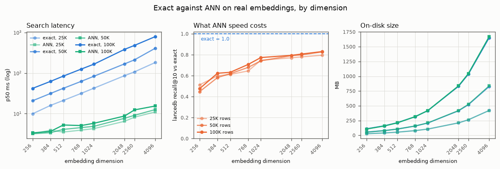
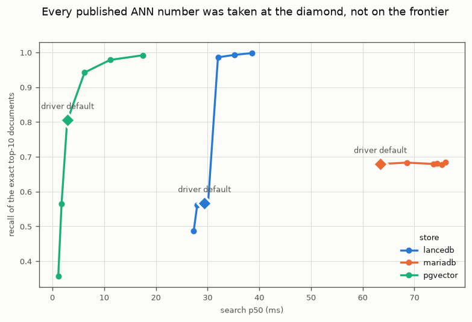
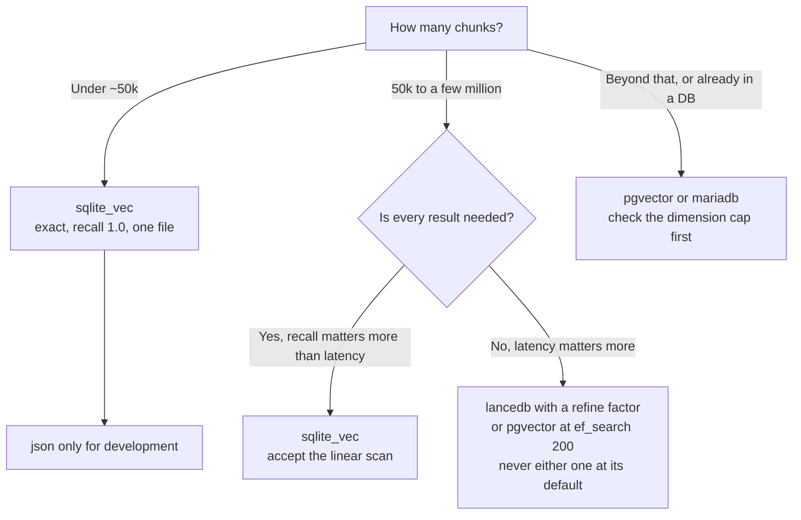
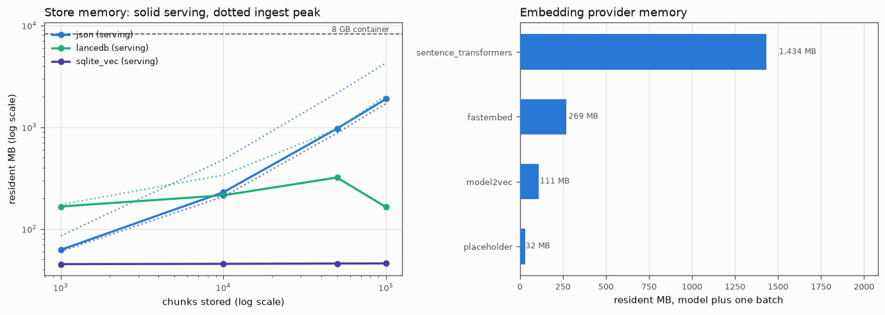

# Vector store

Where the vectors live and how they are searched. This choice does not change what a good result
looks like; it changes how fast you get it and how many of the good results you get at all.

## The backends

| Backend      | Search       | Runs as         | Use it for                                                                         |
|--------------|--------------|-----------------|------------------------------------------------------------------------------------|
| `json`       | Exact scan   | A file          | Development and small corpora. Loads fully into memory.                            |
| `sqlite_vec` | Exact scan   | A file          | The embedded default at real sizes. Exact, so recall is 1.0 by construction.       |
| `lancedb`    | ANN (IVF-PQ) | Embedded files  | Large corpora where search latency matters more than perfect recall. Needs AVX2.   |
| `pgvector`   | ANN (HNSW)   | Postgres server | When the data already belongs in Postgres. Its HNSW index caps at 2000 dimensions. |
| `mariadb`    | ANN          | MariaDB server  | When the data already belongs in MariaDB.                                          |

## Exact against ANN, on real embeddings

The measurement below holds one corpus and one chunk profile fixed and changes only the embedding
model, so the whole ladder is the same text, the same chunk boundaries and the same row count at
each dimension. Queries are held-out passage vectors from the same corpus, so recall here measures
how faithfully the ANN index reproduces exact search on realistically clustered data.

<!-- BEGIN GENERATED store_dim_real (scripts/gen_bench_tables.py) -->
| Dim              | Rows    | sqlite_vec exact p50 ms | lancedb ANN p50 ms | lancedb recall@10 | exact MB | ANN MB |
|------------------|---------|-------------------------|--------------------|-------------------|----------|--------|
| 256              | 25,000  | 9.94                    | 3.24               | 0.513             | 28.1     | 27.0   |
| 256              | 50,000  | 20.83                   | 3.20               | 0.448             | 55.2     | 53.6   |
| 256              | 100,000 | 42.02                   | 3.36               | 0.477             | 110.4    | 107.0  |
| 384              | 25,000  | 16.00                   | 3.89               | 0.599             | 41.2     | 40.1   |
| 384              | 50,000  | 31.49                   | 3.41               | 0.583             | 80.9     | 79.8   |
| 384              | 100,000 | 62.51                   | 3.66               | 0.624             | 161.8    | 159.1  |
| 512              | 25,000  | 21.17                   | 3.53               | 0.613             | 54.4     | 53.2   |
| 512              | 50,000  | 42.10                   | 4.10               | 0.620             | 106.7    | 105.9  |
| 512              | 100,000 | 84.06                   | 5.26               | 0.633             | 213.4    | 211.3  |
| 768              | 25,000  | 31.62                   | 3.93               | 0.646             | 80.6     | 79.5   |
| 768              | 50,000  | 62.49                   | 4.54               | 0.680             | 158.0    | 158.2  |
| 768              | 100,000 | 125.35                  | 5.10               | 0.708             | 316.1    | 315.6  |
| 1024 (from 2560) | 25,000  | 42.48                   | 4.29               | 0.748             | 106.8    | 105.8  |
| 1024 (from 2560) | 50,000  | 83.55                   | 4.88               | 0.743             | 209.5    | 210.4  |
| 1024 (from 2560) | 100,000 | 165.65                  | 5.80               | 0.774             | 419.0    | 419.8  |
| 2048 (from 2560) | 25,000  | 86.31                   | 6.49               | 0.772             | 211.8    | 210.8  |
| 2048 (from 2560) | 50,000  | 168.68                  | 7.70               | 0.792             | 415.2    | 419.5  |
| 2048 (from 2560) | 100,000 | 383.84                  | 8.76               | 0.795             | 830.4    | 837.0  |
| 2560             | 25,000  | 107.11                  | 8.20               | 0.780             | 264.3    | 263.4  |
| 2560             | 50,000  | 211.63                  | 9.11               | 0.799             | 518.1    | 524.1  |
| 2560             | 100,000 | 480.29                  | 12.38              | 0.807             | 1036.3   | 1045.5 |
| 4096             | 25,000  | 182.11                  | 11.05              | 0.796             | 421.7    | 420.9  |
| 4096             | 50,000  | 408.91                  | 12.61              | 0.828             | 826.6    | 837.7  |
| 4096             | 100,000 | 790.33                  | 15.44              | 0.831             | 1653.3   | 1671.1 |

Real embeddings of one fixed corpus and chunk profile (mldr_en_8k_slice, recursive-t256-o0-gpt2), so only the embedding model changes down the ladder. 100 held-out passage vectors as queries, 3 repeats. Recall is against exact top-10 on the same rows, at the adapter's DEFAULT ANN parameters, which are not tuned here. sqlite_vec is exact, so its recall is 1.0 by construction and serves as the control on the measurement.
<!-- END GENERATED store_dim_real -->

<picture>
  <source media="(prefers-color-scheme: dark)" srcset="img/store_dim_real-dark.png" />
  
</picture>

Three things this settles.

**Exact search cost is linear in both dimension and row count, and it gets large.** Doubling the
dimension doubles the scan, and doubling the corpus doubles it again: 9.94 ms at 256 dimensions
and 25,000 rows becomes 790 ms at 4096 dimensions and 100,000 rows. ANN latency barely moves
across that whole range, from 3.2 ms to 15.4 ms, so the advantage grows from about 3x to about
51x.

**ANN speed costs recall, and recall is not the currency that matters.** At 256 dimensions the
ANN index returns 0.45 to 0.51 of the exact top ten, so about half those documents are absent with
no error and no warning. That sounds severe, and the section below measures what it actually costs
in retrieval quality, which is far less.

**Recall improves as the dimension grows, monotonically.** The same index configuration that
loses half the results at 256 dimensions keeps 0.74 to 0.83 of them from 1024 upwards. Higher-dimensional
embeddings separate better, so the partitioning has an easier job. This runs against the intuition
that high dimensions are harder for an index, and it means the dimension decision and the store
decision are not independent.

An important qualifier on all three: **these are the adapter's default ANN parameters**, and for
lancedb that default is a poor one. Its recall barely responds to `nprobe`, but a refine factor
lifts it from 0.567 to 0.998 for about a third more latency. The frontier each store can actually
reach is measured in [Tuning](#tuning-what-each-store-can-reach-not-what-it-does-by-default) below.

## What approximation costs in quality, not in recall

Recall against exact search is easy to measure and easy to misread. The documents an approximate
index drops are not a random sample of the ranking: dropping the rank-1 document costs far more
than dropping rank 9, so a recall of 0.6 does not mean 60 percent of the quality. The only way to
know is to run the evaluation queries through the store itself and score the result against the
relevance judgements.

<!-- BEGIN GENERATED store_quality (scripts/gen_bench_tables.py) -->
| Corpus     | Model              | Dim  | Store      | Search / ANN setting       | nDCG@10 [95% CI]      | vs exact    | Doc recall@10 | p50 ms | MB   |
|------------|--------------------|------|------------|----------------------------|-----------------------|-------------|---------------|--------|------|
| mldr_de_3k | qwen3-embedding-8b | 4096 | lancedb    | nprobes=10 refine_factor=5 | 0.7302 [0.674, 0.785] | +0.0007     | 0.967         | 135.0  | 3367 |
| mldr_de_3k | qwen3-embedding-8b | 4096 | sqlite_vec | exhaustive                 | 0.7296 [0.673, 0.784] | 0 (control) | 1.000         | 1649.6 | 3344 |
| mldr_de_3k | bge-base           | 768  | lancedb    | nprobes=10 refine_factor=5 | 0.4548 [0.391, 0.519] | -0.0049     | 0.959         | 33.0   | 634  |
| mldr_de_3k | bge-base           | 768  | sqlite_vec | exhaustive                 | 0.4597 [0.395, 0.524] | 0 (control) | 1.000         | 275.5  | 642  |
| mldr_en_8k | qwen3-embedding-8b | 4096 | lancedb    | nprobes=10 refine_factor=5 | 0.8920 [0.873, 0.910] | -0.0005     | 0.989         | 137.0  | 2470 |
| mldr_en_8k | qwen3-embedding-8b | 4096 | sqlite_vec | exhaustive                 | 0.8925 [0.874, 0.911] | 0 (control) | 1.000         | 1282.3 | 2449 |
| mldr_en_8k | bge-base           | 768  | lancedb    | nprobes=10 refine_factor=5 | 0.8424 [0.821, 0.864] | -0.0023     | 0.982         | 32.0   | 466  |
| mldr_en_8k | bge-base           | 768  | sqlite_vec | exhaustive                 | 0.8447 [0.823, 0.866] | 0 (control) | 1.000         | 208.1  | 470  |

One run per row: the same cached vectors and the same queries, loaded into a real store. The exhaustive stores are the control - their ranking is exact by construction, so their nDCG must match the kernel's, and an ANN row beside them is only meaningful when it does. `vs exact` is the quality actually lost to approximation, which is the number the recall column cannot give you: dropping the rank-1 document costs far more than dropping rank 9. The ANN rows name the setting they were measured at, which is what a stock install resolves - not the driver's own default, which is a different and worse thing.
<!-- END GENERATED store_quality -->

At the setting semdex ships, the ANN index keeps 0.959 to 0.989 of the documents the exact scan
returns and costs **between 0 and 1.1 percent** of nDCG@10, while running 6.5 to 12 times faster.
On the German 4096-dimensional cell it scores 0.0007 ABOVE the exact scan, which is tie-ordering
noise rather than a real gain, and the honest way to read that row is "no measurable cost".

This table used to say 28 to 53 percent of documents missed and up to 5.6 percent of nDCG given
up. Both figures were real measurements of lancedb at its DRIVER default, which is no longer what
semdex ships: `ann_recall = "balanced"` now sets `nprobes=10 refine_factor=5` on lancedb, and
every row above has been re-measured at it. On the English 768-dimensional cell that moves nDCG@10
from 0.7974 to 0.8424 and doc recall from 0.564 to 0.982, for 1.5 ms. The frontier those numbers
came from is in [Tuning](#tuning-what-each-store-can-reach-not-what-it-does-by-default).

The remaining cost is small for the reason the old, larger cost was also smaller than its recall
suggested: the documents an approximate index misses are mostly not the ones carrying the answer.
What that earlier reading got wrong was treating a tunable default as the price of approximation
itself.

One qualifier stands. Latency is not free: the refine factor re-ranks candidates against the true
vectors, which costs 4 to 8 percent more per search than the untuned default. That is the trade,
and on this evidence it is worth paying.

**The exhaustive stores in that table are a control, not a result.** They scan every row, so their
ranking is exact by construction and their nDCG must equal the kernel's; it does, to the fourth
decimal, in all four runs. Without that agreement, no ANN number from the same run would be worth
reading.

## Tuning: what each store can reach, not what it does by default

Every ANN figure above, and every one this repo published before, was taken at whatever the driver
happened to default to. That makes them a comparison of DEFAULTS rather than of what each store can
do, and it turns out to matter more than the store choice does.

`scripts/score_ann_frontier.py` sweeps each store's own knobs on the same cached cell (MLDR
English, 148,008 chunks, 768 dimensions, 800 queries), scoring recall against the exact top-10 from
the same streamed kernel used everywhere else on these pages.

<picture>
  <source media="(prefers-color-scheme: dark)" srcset="img/ann_frontier-dark.png" />
  
</picture>

<!-- BEGIN GENERATED ann_query_frontier (scripts/gen_bench_tables.py) -->
| Store    | Setting              | Recall vs exact | nDCG@10 | p50 ms | p95 ms |
|----------|----------------------|-----------------|---------|--------|--------|
| lancedb  | nprobes=1            | 0.487           | 0.7074  | 27.3   | 34.3   |
| lancedb  | nprobes=5            | 0.561           | 0.7889  | 28.0   | 32.8   |
| lancedb  | nprobes=10           | 0.566           | 0.7947  | 28.9   | 37.8   |
| lancedb  | driver default       | 0.567           | 0.7960  | 29.4   | 35.9   |
| lancedb  | nprobes=20           | 0.567           | 0.7960  | 29.6   | 36.9   |
| lancedb  | nprobes=40           | 0.567           | 0.7960  | 29.6   | 34.0   |
| lancedb  | nprobes=80           | 0.567           | 0.7960  | 30.1   | 39.0   |
| lancedb  | nprobes=10 refine=5  | 0.986           | 0.8412  | 32.0   | 39.0   |
| lancedb  | nprobes=20 refine=5  | 0.993           | 0.8434  | 35.2   | 48.9   |
| lancedb  | nprobes=40 refine=10 | 0.998           | 0.8447  | 38.6   | 50.9   |
| mariadb  | driver default       | 0.679           | 0.6885  | 63.4   | 84.6   |
| mariadb  | ef_search=10         | 0.683           | 0.6943  | 68.5   | 95.4   |
| mariadb  | ef_search=20         | 0.679           | 0.6867  | 73.7   | 98.8   |
| mariadb  | ef_search=200        | 0.681           | 0.6978  | 74.4   | 98.4   |
| mariadb  | ef_search=100        | 0.677           | 0.6886  | 75.3   | 102.8  |
| mariadb  | ef_search=40         | 0.684           | 0.6894  | 76.0   | 103.1  |
| pgvector | ef_search=10         | 0.358           | 0.7102  | 1.1    | 2.0    |
| pgvector | ef_search=20         | 0.565           | 0.7678  | 1.8    | 3.3    |
| pgvector | ef_search=40         | 0.806           | 0.8038  | 2.9    | 4.9    |
| pgvector | driver default       | 0.806           | 0.8038  | 2.9    | 5.8    |
| pgvector | ef_search=100        | 0.942           | 0.8364  | 6.2    | 10.2   |
| pgvector | ef_search=200        | 0.978           | 0.8394  | 11.1   | 17.1   |
| pgvector | ef_search=400        | 0.992           | 0.8425  | 17.4   | 26.9   |

`Recall vs exact` is the share of the exact top-10 DOCUMENTS the store returned, scored against the same streamed kernel the rest of these pages use. These knobs change per search, so a deployment can move along this frontier without rebuilding anything. `driver default` is the setting every previously published store number was taken at.
<!-- END GENERATED ann_query_frontier -->

### The published cost of approximation was a bad default, not a property of ANN

This is the finding that changes an earlier conclusion on this page. lancedb at its driver default
keeps 0.567 of the exact top-10 and scores nDCG@10 0.7974 against the exact scan's 0.8447 - the
0.0473 gap that this page reported as "approximation costs up to 5.6 percent".

Set a refine factor and that gap essentially disappears. At `nprobes=10 refine_factor=5` recall is
0.986 and nDCG 0.8412, which is 0.4 percent under exact, for 32.0 ms against 29.4. At
`nprobes=40 refine_factor=10` recall is 0.998 and nDCG is **0.8447 - identical to the exact scan to
four decimals** - for 38.6 ms. The quality cost of approximation on this cell is not 5.6 percent.
It is zero, at 31 percent more latency than the untuned default and still 5x faster than the
208 ms exact scan.

**On lancedb, `nprobes` is not the knob.** Recall moves from 0.561 at 5 probes to 0.567 at 80 and
is flat from 20 upward; the refine factor is what re-ranks candidates against the true vectors and
is worth 42 points of recall. Any advice to raise `nprobe` for recall, including the earlier
wording on this page, was aimed at the wrong parameter.

### The three stores tune very differently

`pgvector` has the cleanest frontier: `ef_search` moves recall from 0.358 to 0.992 while latency
goes 1.1 ms to 17.4 ms, monotonically, with the default sitting sensibly in the middle at 0.806.
Every point on that curve is a usable operating point.

`mariadb` does not respond to its knob at all. Recall stays between 0.677 and 0.684 across
`ef_search` 10 to 200 while latency rises from 63 ms to 76 ms, so the setting costs time and buys
nothing, and no level reaches the 0.97 the other two reach easily. This is not semdex failing to
pass the parameter through: the session variable was read back off the connection the queries run
on and holds the requested value. It is unexplained, and until it is, mariadb should be chosen for
reasons other than tunable recall.

At matched recall the ranking is not the one the default-parameter table implies. To reach 0.97,
`pgvector` needs 11.1 ms and `lancedb` needs 32.0 ms; `mariadb` cannot get there.

<!-- BEGIN GENERATED ann_build_frontier (scripts/gen_bench_tables.py) -->
| Store    | Index setting            | Recall vs exact | nDCG@10 | Build s | Store MB | p50 ms |
|----------|--------------------------|-----------------|---------|---------|----------|--------|
| lancedb  | driver default           | 0.567           | 0.7960  | 16      | 466      | 29.4   |
| lancedb  | partitions=512           | 0.520           | 0.7685  | 21      | 467      | 28.6   |
| lancedb  | partitions=64            | 0.547           | 0.7804  | 18      | 466      | 28.9   |
| mariadb  | driver default           | 0.679           | 0.6885  | 308     | 0        | 63.4   |
| mariadb  | m=32                     | 0.683           | 0.6952  | 551     | 0        | 81.5   |
| mariadb  | m=8                      | 0.691           | 0.7110  | 499     | 0        | 78.3   |
| pgvector | driver default           | 0.806           | 0.8038  | 432     | 0        | 2.9    |
| pgvector | m=32 ef_construction=200 | 0.806           | 0.8063  | 350     | 0        | 4.8    |
| pgvector | m=8 ef_construction=32   | 0.806           | 0.8063  | 354     | 0        | 4.3    |

Measured at each driver's own query-time default, so the two axes never move together. These are baked into the index, so changing one costs a full rebuild - which is why the grid is short and why build time and size are reported here rather than on the query frontier.
<!-- END GENERATED ann_build_frontier -->

Build-time parameters were the disappointment. `pgvector` returns recall 0.806 at every `m` and
`ef_construction` tested, `mariadb` moves 0.679 to 0.691, and `lancedb`'s `num_partitions` moves
the wrong way (0.567 default, 0.547 at 64, 0.520 at 512). Since each level costs a full rebuild -
350 to 550 seconds on the server stores - none of them is worth the reindex on this cell.

Those numbers are only trustworthy because the parameters were verified to arrive: `pg_indexes`
shows `WITH (m='8', ef_construction='32')`, MariaDB's `SHOW CREATE TABLE` shows
`VECTOR KEY ... M=32`, and lancedb's partition count changes recall measurably. All three had to be
wired first - they were declared, documented and resolved, but no adapter read them, so a sweep run
before that fix would have drawn a flat line and called the knobs useless.

### What this does not establish

* **One cell.** 148,008 chunks at 768 dimensions on English long documents. Both the frontier
  shapes and the crossover points can move with scale and dimension.
* **One query depth.** Every point fetches 200 chunk hits before deduplicating to documents. HNSW
  implementations interact with the query limit, so a different depth could change the flat parts.
* **Latency is machine-bound.** The server stores ran in local Docker containers on the same box as
  the client, so their millisecond figures carry no network.
* **The presets are now measured, and one changed.** pgvector's ladder is validated as it stood.
  lancedb's `BALANCED` no longer means "leave the driver alone": it sets
  `nprobes=10 refine_factor=5`, the point measured above, because shipping the worst point on a
  store's own frontier as its default is not what "balanced" should mean. `fast` restores the
  previous behaviour. mariadb's three levels are honest to request and simply do not separate.

## Why the older synthetic sweep is kept, and what it is for

<!-- BEGIN GENERATED store_dim_synthetic (scripts/gen_bench_tables.py) -->
| Dim  | Rows    | sqlite_vec exact p50 ms | lancedb ANN p50 ms | Faster |
|------|---------|-------------------------|--------------------|--------|
| 384  | 50,000  | 22.18                   | 3.02               | ANN    |
| 384  | 100,000 | 44.24                   | 3.86               | ANN    |
| 384  | 250,000 | 110.86                  | 4.39               | ANN    |
| 384  | 500,000 | 223.23                  | 4.45               | ANN    |
| 768  | 50,000  | 44.35                   | 4.04               | ANN    |
| 768  | 100,000 | 88.61                   | 4.80               | ANN    |
| 768  | 250,000 | 388.85                  | 17.21              | ANN    |
| 768  | 500,000 | 440.62                  | 6.29               | ANN    |
| 1536 | 50,000  | 87.80                   | 6.14               | ANN    |
| 1536 | 100,000 | 179.15                  | 7.52               | ANN    |
| 1536 | 250,000 | 430.63                  | 10.61              | ANN    |
| 1536 | 500,000 | 935.51                  | 10.27              | ANN    |
| 3072 | 50,000  | 278.54                  | 9.75               | ANN    |
| 3072 | 100,000 | 381.48                  | 12.86              | ANN    |
| 3072 | 250,000 | 940.79                  | 16.81              | ANN    |
| 3072 | 500,000 | 1752.11                 | 17.11              | ANN    |

Random unit vectors. Latency depends only on row count and dimension, so these reproduce the SHAPE of the curve with no model or corpus needed. They do NOT reproduce recall: random vectors are near-orthogonal and evenly spread, the easiest possible case for a partitioning index, whereas real embeddings cluster. Read the shape here and the absolute numbers from the real-vector table. lancedb index threshold lowered to 10000 so ANN is active at every scale.
<!-- END GENERATED store_dim_synthetic -->

Random vectors reproduce latency correctly, because latency depends only on row count and
dimension. They do not reproduce recall at all: random vectors are near-orthogonal and spread
evenly over the sphere, which is the easiest case a partitioning index will ever see, while real
embeddings cluster hard. Use this table for the shape of the latency curve and the real-vector
table above for anything you intend to act on.

## Choosing

The honest short version: **below roughly 50,000 chunks, use an exact store** - the scan is a few
milliseconds, the ranking is exact by construction, and there is no index to tune or rebuild.
**Above about 100,000, use ANN.** At 148,000 chunks the exact scan is 208 ms at 768 dimensions and
1.3 seconds at 4096, which is not an interactive latency, and the measured quality cost of the
index is at most 1.1 percent of nDCG@10. The earlier reading of this page, that ANN's recall made
it a steep trade, was measuring recall rather than quality.

## Memory: will it fit in the container

Disk size is reported for every store on this page. Resident memory was reported for none, so the
question that actually decides a deployment - does this fit in the box I have - had no answer here.

<picture>
  <source media="(prefers-color-scheme: dark)" srcset="img/store_memory-dark.png" />
  
</picture>

<!-- BEGIN GENERATED store_memory (scripts/gen_bench_tables.py) -->
| Backend    | Rows    | Serving RSS | Ingest peak | Query p50   |
|------------|---------|-------------|-------------|-------------|
| json       | 1,000   | 62 MB       | 85 MB       | 43.52 ms    |
| json       | 10,000  | 229 MB      | 479 MB      | 419.62 ms   |
| json       | 50,000  | 968 MB      | 2,165 MB    | 2,124.27 ms |
| json       | 100,000 | 1,894 MB    | 4,271 MB    | 4,259.38 ms |
| lancedb    | 1,000   | 166 MB      | 173 MB      | 2.95 ms     |
| lancedb    | 10,000  | 214 MB      | 339 MB      | 5.12 ms     |
| lancedb    | 50,000  | 320 MB      | 959 MB      | 15.12 ms    |
| lancedb    | 100,000 | 164 MB      | 2,048 MB    | 5.61 ms     |
| sqlite_vec | 1,000   | 45 MB       | 60 MB       | 0.47 ms     |
| sqlite_vec | 10,000  | 45 MB       | 207 MB      | 5.17 ms     |
| sqlite_vec | 50,000  | 46 MB       | 875 MB      | 23.16 ms    |
| sqlite_vec | 100,000 | 46 MB       | 1,708 MB    | 45.44 ms    |

`Serving RSS` is what a process holds while answering queries, measured in a FRESH process that opened the store from disk and never built it - the fixture needed to load a store is larger than the store, so measuring both in one process measures mostly the harness. `Ingest peak` is the high-water mark of the process that built it, harness included, and is the number that decides whether a machine can create an index at all. Both are net of a 12.0 MB interpreter baseline, measured the same way. Vectors are 384-dimensional.
<!-- END GENERATED store_memory -->

**`sqlite_vec` does not grow.** From 1,000 chunks to 100,000 its serving footprint moves by less
than a megabyte, because the vectors live in the file and not in the process. That is the property
that decides a small container, and it holds across a hundredfold increase in corpus size.

**The embedded `json` store grows with the corpus, as designed.** Its footprint is roughly linear
in chunk count, which is the documented phase-1 behaviour: it loads every vector into memory and
scans them exactly. The number is now attached to the design note. Its query latency scales the
same way and for the same reason.

**`lancedb` starts high, and then gets LIGHTER at 100,000 chunks.** Most of its footprint is the
library rather than the data, so it is the worst of the three on a tiny corpus. The drop at the top
of the ladder is not noise: `lance_index_threshold` defaults to 100,000, so that cell is the first
one served by the IVF index instead of a flat scan, and it is both lighter (320 MB to 164 MB) and
faster (15.1 ms to 5.6 ms) for it. The backend has two regimes and the ladder happens to straddle
the boundary, which is why the capacity table refuses to extrapolate through it.

<!-- BEGIN GENERATED store_memory_capacity (scripts/gen_bench_tables.py) -->
| Backend    | Chunks servable                                             |
|------------|-------------------------------------------------------------|
| json       | about 440,275 chunks                                        |
| lancedb    | not extrapolated: footprint falls between 1,000 and 100,000 |
| sqlite_vec | flat to 100,000 chunks; bounded by disk, not memory         |

Extrapolated linearly from the measured span above, so it is an order-of-magnitude answer rather than a guarantee. A store whose footprint does not grow with the corpus gets no number: its limit is disk, which is measured elsewhere.
<!-- END GENERATED store_memory_capacity -->

### Building an index costs more than serving one

The `Ingest peak` column is consistently several times the serving figure, and it is the one that
decides whether a machine can create an index at all. A container sized from the serving number
alone will build the index once, on a bigger machine, or not at all.

Part of that peak is the harness holding a corpus in memory to feed the store, which a real ingest
streaming from disk would not pay; the raw file records that share per row so the two can be told
apart. The ordering between backends is the portable part.

### What this does not establish

* **The server-backed stores are absent.** `pgvector` and `mariadb` keep their vectors in a
  database process, so the number that matters for them is the SERVER's memory, not the client's,
  and measuring the client would report a small figure that means nothing. That is a different
  measurement and it is not done.
* **One machine, one allocator, one Python.** Absolute megabytes belong to this box; the shape of
  each curve is the portable part.
* **Peak is not a guarantee.** These are high-water marks under one access pattern. A different
  query mix, or concurrency, can exceed them.
* **The capacity figures are extrapolations**, linear from the measured span, not measurements at
  that size.

## Operational notes

**lancedb needs `compact` to be called.** `upsert` only appends; the ANN index is built and its
unindexed tail folded in by `VectorStoreWriter.compact`, which `index_sources` calls according to
the `[vector_store].compact_after_records/seconds` policy. A writer that upserts through the store
and never compacts leaves that tail growing, and every query degrades toward a full scan. The other
backends implement `compact` as a no-op.

**lancedb needs AVX2.** Its wheel raises an illegal instruction on older CPUs, so store benchmarks
have to run on a machine that has it.

**pgvector's HNSW index caps at 2000 dimensions.** A 2560- or 4096-dimensional model cannot be
indexed there, which is a constraint on the embedding choice, not just the store choice.

**Close the store.** `close()` is part of the port: the SQL backends release their connection, and
a long-lived server that never closes will leak them.

## Scale beyond this ladder

The real-vector ladder above stops at 100,000 rows because that is the size of the cached cells.
A separate one-off run at MSMARCO scale (50k, 250k, 1M) exists in
`tests/benchmarks/raw/msmarco-scale.json` and is not reproduced here as a ranking, because it was
measured once, on a different corpus, without repeats or a recall column against exact search. Its
useful content is the trend, which agrees with this page: exact search grows linearly and ANN does
not.
