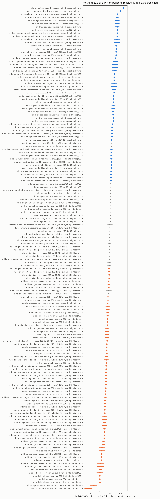

# Retrieval method: dense, BM25, and both

Every other page here measures a component while holding the retrieval method fixed at
single-vector dense search with cosine similarity. This page varies the method itself, and it
produces the largest effects in the whole benchmark set.

Dense retrieval and BM25 fail differently. The embedding misses a rare exact token it never
learned; the lexical index misses a paraphrase that shares no words with the query. Fusing them is
the standard response, and until now nothing here measured whether it was worth doing.

All three systems see identical input: the same chunk set, the same queries, the same judgements,
and for the dense side the same cached vectors the rest of the sweep uses. The BM25 analyzer is
stemmed and stopworded **in the corpus language**, because an English analyzer on German text
would understate lexical retrieval and quietly bias the comparison toward dense. Fusion is
Reciprocal Rank Fusion, which uses only each system's ranks: a cosine similarity and a BM25 score
share no scale, and normalising them would introduce a tuning knob of its own.

## The three methods, side by side

<!-- BEGIN GENERATED method_ranking (scripts/gen_bench_tables.py) -->
| Corpus     | Embedder                       | Dim  | Dense nDCG@10         | BM25 nDCG@10          | Hybrid nDCG@10        | Best   |
|------------|--------------------------------|------|-----------------------|-----------------------|-----------------------|--------|
| mldr_de_3k | fastembed:bge-base             | 768  | 0.4597 [0.395, 0.524] | 0.6541 [0.591, 0.716] | 0.5955 [0.537, 0.655] | bm25   |
| mldr_de_3k | fastembed:bge-small            | 384  | 0.4949 [0.432, 0.559] | 0.6541 [0.591, 0.716] | 0.6089 [0.547, 0.668] | bm25   |
| mldr_de_3k | model2vec:potion-base-8M       | 256  | 0.2369 [0.184, 0.291] | 0.6541 [0.591, 0.716] | 0.4858 [0.431, 0.539] | bm25   |
| mldr_de_3k | model2vec:potion-retrieval-32M | 512  | 0.3426 [0.283, 0.403] | 0.6541 [0.591, 0.716] | 0.5434 [0.486, 0.601] | bm25   |
| mldr_de_3k | ollama:qwen3-embedding-8b      | 4096 | 0.7296 [0.673, 0.784] | 0.6541 [0.591, 0.716] | 0.7136 [0.656, 0.769] | dense  |
| mldr_en_8k | fastembed:bge-base             | 768  | 0.8447 [0.823, 0.866] | 0.8910 [0.871, 0.910] | 0.9002 [0.882, 0.918] | hybrid |
| mldr_en_8k | fastembed:bge-small            | 384  | 0.8193 [0.795, 0.843] | 0.8910 [0.871, 0.910] | 0.8837 [0.865, 0.901] | bm25   |
| mldr_en_8k | model2vec:potion-base-8M       | 256  | 0.7096 [0.681, 0.737] | 0.8910 [0.871, 0.910] | 0.8239 [0.802, 0.846] | bm25   |
| mldr_en_8k | model2vec:potion-retrieval-32M | 512  | 0.7917 [0.767, 0.816] | 0.8910 [0.871, 0.910] | 0.8632 [0.842, 0.883] | bm25   |
| mldr_en_8k | ollama:qwen3-embedding-8b      | 4096 | 0.8925 [0.874, 0.911] | 0.8910 [0.871, 0.910] | 0.9118 [0.895, 0.928] | hybrid |

One chunk set, one query set, one set of judgements, three retrieval methods. The BM25 column repeats down each corpus because the lexical index does not depend on the embedding model, which is a free check that the three runs really did share an index. Hybrid is Reciprocal Rank Fusion of the other two.
<!-- END GENERATED method_ranking -->

## Does adding lexical retrieval help

<picture>
  <source media="(prefers-color-scheme: dark)" srcset="img/chunk_knob_method-dark.png" />
  
</picture>

<!-- BEGIN GENERATED method_effects (scripts/gen_bench_tables.py) -->
| Corpus           | Embedder                       | Held fixed              | Change (low to high) | Delta nDCG@10 | 95% CI             | Win/loss | Verdict      |
|------------------|--------------------------------|-------------------------|----------------------|---------------|--------------------|----------|--------------|
| mldr_de_3k_slice | fastembed:bge-base             | recursive cap256 ov0tok | bm25 to dense        | -0.1943       | [-0.2551, -0.1365] | 15/65    | resolved     |
| mldr_de_3k_slice | fastembed:bge-base             | recursive cap256 ov0tok | bm25 to hybrid       | -0.0586       | [-0.0920, -0.0254] | 17/43    | resolved     |
| mldr_de_3k_slice | fastembed:bge-base             | recursive cap256 ov0tok | dense to hybrid      | +0.1357       | [+0.0991, +0.1742] | 66/6     | resolved     |
| mldr_de_3k_slice | fastembed:bge-small            | recursive cap256 ov0tok | bm25 to dense        | -0.1592       | [-0.2149, -0.1034] | 17/59    | resolved     |
| mldr_de_3k_slice | fastembed:bge-small            | recursive cap256 ov0tok | bm25 to hybrid       | -0.0452       | [-0.0766, -0.0144] | 16/34    | resolved     |
| mldr_de_3k_slice | fastembed:bge-small            | recursive cap256 ov0tok | dense to hybrid      | +0.1139       | [+0.0759, +0.1522] | 57/9     | resolved     |
| mldr_de_3k_slice | model2vec:potion-base-8M       | recursive cap256 ov0tok | bm25 to dense        | -0.4172       | [-0.4813, -0.3514] | 6/106    | resolved     |
| mldr_de_3k_slice | model2vec:potion-base-8M       | recursive cap256 ov0tok | bm25 to hybrid       | -0.1683       | [-0.2085, -0.1269] | 10/83    | resolved     |
| mldr_de_3k_slice | model2vec:potion-base-8M       | recursive cap256 ov0tok | dense to hybrid      | +0.2489       | [+0.2093, +0.2875] | 103/3    | resolved     |
| mldr_de_3k_slice | model2vec:potion-retrieval-32M | recursive cap256 ov0tok | bm25 to dense        | -0.3114       | [-0.3764, -0.2467] | 9/87     | resolved     |
| mldr_de_3k_slice | model2vec:potion-retrieval-32M | recursive cap256 ov0tok | bm25 to hybrid       | -0.1106       | [-0.1492, -0.0719] | 12/61    | resolved     |
| mldr_de_3k_slice | model2vec:potion-retrieval-32M | recursive cap256 ov0tok | dense to hybrid      | +0.2008       | [+0.1627, +0.2400] | 84/4     | resolved     |
| mldr_de_3k_slice | ollama:qwen3-embedding-8b      | recursive cap256 ov0tok | bm25 to dense        | +0.0755       | [+0.0278, +0.1240] | 45/20    | resolved     |
| mldr_de_3k_slice | ollama:qwen3-embedding-8b      | recursive cap256 ov0tok | bm25 to hybrid       | +0.0596       | [+0.0301, +0.0903] | 38/8     | resolved     |
| mldr_de_3k_slice | ollama:qwen3-embedding-8b      | recursive cap256 ov0tok | dense to hybrid      | -0.0159       | [-0.0494, +0.0163] | 21/32    | not resolved |
| mldr_en_8k_slice | fastembed:bge-base             | recursive cap256 ov0tok | bm25 to dense        | -0.0463       | [-0.0659, -0.0261] | 58/123   | resolved     |
| mldr_en_8k_slice | fastembed:bge-base             | recursive cap256 ov0tok | bm25 to hybrid       | +0.0092       | [-0.0034, +0.0219] | 64/45    | not resolved |
| mldr_en_8k_slice | fastembed:bge-base             | recursive cap256 ov0tok | dense to hybrid      | +0.0555       | [+0.0424, +0.0689] | 128/25   | resolved     |
| mldr_en_8k_slice | fastembed:bge-small            | recursive cap256 ov0tok | bm25 to dense        | -0.0717       | [-0.0938, -0.0502] | 59/134   | resolved     |
| mldr_en_8k_slice | fastembed:bge-small            | recursive cap256 ov0tok | bm25 to hybrid       | -0.0073       | [-0.0199, +0.0053] | 64/69    | not resolved |
| mldr_en_8k_slice | fastembed:bge-small            | recursive cap256 ov0tok | dense to hybrid      | +0.0644       | [+0.0507, +0.0785] | 138/29   | resolved     |
| mldr_en_8k_slice | model2vec:potion-base-8M       | recursive cap256 ov0tok | bm25 to dense        | -0.1814       | [-0.2048, -0.1587] | 20/232   | resolved     |
| mldr_en_8k_slice | model2vec:potion-base-8M       | recursive cap256 ov0tok | bm25 to hybrid       | -0.0671       | [-0.0816, -0.0530] | 28/136   | resolved     |
| mldr_en_8k_slice | model2vec:potion-base-8M       | recursive cap256 ov0tok | dense to hybrid      | +0.1143       | [+0.1002, +0.1292] | 222/4    | resolved     |
| mldr_en_8k_slice | model2vec:potion-retrieval-32M | recursive cap256 ov0tok | bm25 to dense        | -0.0993       | [-0.1183, -0.0807] | 31/170   | resolved     |
| mldr_en_8k_slice | model2vec:potion-retrieval-32M | recursive cap256 ov0tok | bm25 to hybrid       | -0.0278       | [-0.0401, -0.0158] | 40/80    | resolved     |
| mldr_en_8k_slice | model2vec:potion-retrieval-32M | recursive cap256 ov0tok | dense to hybrid      | +0.0715       | [+0.0594, +0.0840] | 159/12   | resolved     |
| mldr_en_8k_slice | ollama:qwen3-embedding-8b      | recursive cap256 ov0tok | bm25 to dense        | +0.0015       | [-0.0165, +0.0196] | 70/72    | not resolved |
| mldr_en_8k_slice | ollama:qwen3-embedding-8b      | recursive cap256 ov0tok | bm25 to hybrid       | +0.0208       | [+0.0101, +0.0319] | 71/31    | resolved     |
| mldr_en_8k_slice | ollama:qwen3-embedding-8b      | recursive cap256 ov0tok | dense to hybrid      | +0.0193       | [+0.0083, +0.0306] | 77/37    | resolved     |

Each row bootstraps the per-query difference between two retrieval methods over the queries they share, on identical chunks and judgements. Only corpora that can carry a chunking claim are shown; the rest yield about one chunk per document, where every profile produces the same chunk. The full set is in `tests/benchmarks/raw/chunk-knob-effects.json`.
<!-- END GENERATED method_effects -->

Three findings, in order of how much they should change what you build.

**Adding lexical retrieval to dense is the largest effect measured anywhere in this set.** Of ten
dense-to-hybrid comparisons, nine resolve and every resolved one is positive, from +0.019 to
+0.249 nDCG@10. For comparison, the largest resolved chunking effect on the same corpora is about
0.16, and that one reverses sign between corpora. If you are choosing where to spend effort,
this is the first place.

**BM25 alone beats every CPU embedding model tested, on both languages.** That is not a
statement about embeddings in general; it is a statement about this body. MLDR queries are drawn
from long documents and carry a lot of literal vocabulary, which is exactly the case lexical
search is strongest on, and a 4096-dimensional GPU model is the only dense system that matches it.
The uncomfortable reading is still fair: a project that reaches for a bigger embedding model
before it has any lexical retrieval at all is optimising the weaker half.

**Fusion is not free, and it can lose.** Where dense is much weaker than BM25, the hybrid lands
*below* BM25 alone: on German, fusing BM25 with the weakest model costs 0.168 nDCG@10 against
using BM25 by itself. RRF has no notion of which input to trust, so it drags a strong ranking
toward a weak one. And in the one case where dense is clearly the stronger system, German with the
4096-dimensional model, hybrid is not resolved as an improvement over dense at all.

So the rule this supports is narrower than "always go hybrid": **fuse two systems that are
comparably strong, and otherwise use the better one alone.** Measure both sides on your own corpus
before fusing, because which side is stronger is a property of the corpus, not a constant.

## Reranking with a cross-encoder

A cross-encoder reads the query and a passage together, so it can judge relevance a bi-encoder
cannot: the bi-encoder must reduce each side to a vector before it has seen the other. It is far
too slow to score a corpus, so it runs as a second stage over a shortlist. That is the standard
recipe, and on these corpora it does not work.

Each method's top 20 documents are reranked, each document represented by the chunk that earned it
its place. Baseline and reranked run come from the same shortlist at the same depth, so the pair
differs by exactly one thing. The reranker is `BAAI/bge-reranker-base`.

<!-- BEGIN GENERATED rerank_effects (scripts/gen_bench_tables.py) -->
| Corpus           | Embedder                  | Held fixed              | Change (low to high)                | Delta nDCG@10 | 95% CI             | Win/loss | Verdict      |
|------------------|---------------------------|-------------------------|-------------------------------------|---------------|--------------------|----------|--------------|
| mldr_de_3k_slice | fastembed:bge-base        | recursive cap256 ov0tok | bm25@20 to bm25@20+rerank           | -0.0138       | [-0.0488, +0.0227] | 21/30    | not resolved |
| mldr_de_3k_slice | fastembed:bge-base        | recursive cap256 ov0tok | bm25@20 to dense@20                 | -0.1943       | [-0.2551, -0.1365] | 15/65    | resolved     |
| mldr_de_3k_slice | fastembed:bge-base        | recursive cap256 ov0tok | bm25@20+rerank to dense@20          | -0.1806       | [-0.2421, -0.1218] | 23/68    | resolved     |
| mldr_de_3k_slice | fastembed:bge-base        | recursive cap256 ov0tok | bm25@20 to dense@20+rerank          | -0.1675       | [-0.2235, -0.1120] | 14/59    | resolved     |
| mldr_de_3k_slice | fastembed:bge-base        | recursive cap256 ov0tok | bm25@20+rerank to dense@20+rerank   | -0.1537       | [-0.2061, -0.1021] | 13/58    | resolved     |
| mldr_de_3k_slice | fastembed:bge-base        | recursive cap256 ov0tok | dense@20 to dense@20+rerank         | +0.0269       | [-0.0144, +0.0695] | 26/27    | not resolved |
| mldr_de_3k_slice | fastembed:bge-base        | recursive cap256 ov0tok | bm25@20 to hybrid@20                | -0.0582       | [-0.0903, -0.0265] | 14/45    | resolved     |
| mldr_de_3k_slice | fastembed:bge-base        | recursive cap256 ov0tok | bm25@20+rerank to hybrid@20         | -0.0444       | [-0.0834, -0.0068] | 24/47    | resolved     |
| mldr_de_3k_slice | fastembed:bge-base        | recursive cap256 ov0tok | dense@20 to hybrid@20               | +0.1362       | [+0.0985, +0.1747] | 66/8     | resolved     |
| mldr_de_3k_slice | fastembed:bge-base        | recursive cap256 ov0tok | dense@20+rerank to hybrid@20        | +0.1093       | [+0.0709, +0.1469] | 61/14    | resolved     |
| mldr_de_3k_slice | fastembed:bge-base        | recursive cap256 ov0tok | bm25@20 to hybrid@20+rerank         | -0.0670       | [-0.1057, -0.0281] | 18/42    | resolved     |
| mldr_de_3k_slice | fastembed:bge-base        | recursive cap256 ov0tok | bm25@20+rerank to hybrid@20+rerank  | -0.0532       | [-0.0868, -0.0201] | 13/41    | resolved     |
| mldr_de_3k_slice | fastembed:bge-base        | recursive cap256 ov0tok | dense@20 to hybrid@20+rerank        | +0.1274       | [+0.0689, +0.1878] | 60/32    | resolved     |
| mldr_de_3k_slice | fastembed:bge-base        | recursive cap256 ov0tok | dense@20+rerank to hybrid@20+rerank | +0.1005       | [+0.0587, +0.1448] | 40/22    | resolved     |
| mldr_de_3k_slice | fastembed:bge-base        | recursive cap256 ov0tok | hybrid@20 to hybrid@20+rerank       | -0.0088       | [-0.0500, +0.0333] | 39/42    | not resolved |
| mldr_de_3k_slice | ollama:qwen3-embedding-8b | recursive cap256 ov0tok | bm25@20 to bm25@20+rerank           | -0.0138       | [-0.0488, +0.0227] | 21/30    | not resolved |
| mldr_de_3k_slice | ollama:qwen3-embedding-8b | recursive cap256 ov0tok | bm25@20 to dense@20                 | +0.0755       | [+0.0278, +0.1240] | 45/20    | resolved     |
| mldr_de_3k_slice | ollama:qwen3-embedding-8b | recursive cap256 ov0tok | bm25@20+rerank to dense@20          | +0.0893       | [+0.0406, +0.1385] | 54/21    | resolved     |
| mldr_de_3k_slice | ollama:qwen3-embedding-8b | recursive cap256 ov0tok | bm25@20 to dense@20+rerank          | -0.0284       | [-0.0798, +0.0244] | 34/47    | not resolved |
| mldr_de_3k_slice | ollama:qwen3-embedding-8b | recursive cap256 ov0tok | bm25@20+rerank to dense@20+rerank   | -0.0147       | [-0.0610, +0.0322] | 32/44    | not resolved |
| mldr_de_3k_slice | ollama:qwen3-embedding-8b | recursive cap256 ov0tok | dense@20 to dense@20+rerank         | -0.1040       | [-0.1446, -0.0647] | 13/58    | resolved     |
| mldr_de_3k_slice | ollama:qwen3-embedding-8b | recursive cap256 ov0tok | bm25@20 to hybrid@20                | +0.0665       | [+0.0379, +0.0966] | 40/10    | resolved     |
| mldr_de_3k_slice | ollama:qwen3-embedding-8b | recursive cap256 ov0tok | bm25@20+rerank to hybrid@20         | +0.0802       | [+0.0443, +0.1165] | 50/16    | resolved     |
| mldr_de_3k_slice | ollama:qwen3-embedding-8b | recursive cap256 ov0tok | dense@20 to hybrid@20               | -0.0090       | [-0.0398, +0.0216] | 21/32    | not resolved |
| mldr_de_3k_slice | ollama:qwen3-embedding-8b | recursive cap256 ov0tok | dense@20+rerank to hybrid@20        | +0.0949       | [+0.0511, +0.1371] | 61/20    | resolved     |
| mldr_de_3k_slice | ollama:qwen3-embedding-8b | recursive cap256 ov0tok | bm25@20 to hybrid@20+rerank         | -0.0043       | [-0.0502, +0.0438] | 35/44    | not resolved |
| mldr_de_3k_slice | ollama:qwen3-embedding-8b | recursive cap256 ov0tok | bm25@20+rerank to hybrid@20+rerank  | +0.0095       | [-0.0317, +0.0510] | 30/42    | not resolved |
| mldr_de_3k_slice | ollama:qwen3-embedding-8b | recursive cap256 ov0tok | dense@20 to hybrid@20+rerank        | -0.0798       | [-0.1212, -0.0384] | 21/56    | resolved     |
| mldr_de_3k_slice | ollama:qwen3-embedding-8b | recursive cap256 ov0tok | dense@20+rerank to hybrid@20+rerank | +0.0241       | [+0.0064, +0.0440] | 30/14    | resolved     |
| mldr_de_3k_slice | ollama:qwen3-embedding-8b | recursive cap256 ov0tok | hybrid@20 to hybrid@20+rerank       | -0.0708       | [-0.1102, -0.0310] | 24/52    | resolved     |
| mldr_en_8k_slice | fastembed:bge-base        | recursive cap256 ov0tok | bm25@20 to bm25@20+rerank           | -0.0202       | [-0.0353, -0.0053] | 49/92    | resolved     |
| mldr_en_8k_slice | fastembed:bge-base        | recursive cap256 ov0tok | bm25@20 to dense@20                 | -0.0463       | [-0.0659, -0.0261] | 58/123   | resolved     |
| mldr_en_8k_slice | fastembed:bge-base        | recursive cap256 ov0tok | bm25@20+rerank to dense@20          | -0.0261       | [-0.0475, -0.0045] | 103/119  | resolved     |
| mldr_en_8k_slice | fastembed:bge-base        | recursive cap256 ov0tok | bm25@20 to dense@20+rerank          | -0.1272       | [-0.1503, -0.1045] | 53/221   | resolved     |
| mldr_en_8k_slice | fastembed:bge-base        | recursive cap256 ov0tok | bm25@20+rerank to dense@20+rerank   | -0.1070       | [-0.1293, -0.0851] | 58/213   | resolved     |
| mldr_en_8k_slice | fastembed:bge-base        | recursive cap256 ov0tok | dense@20 to dense@20+rerank         | -0.0808       | [-0.1013, -0.0601] | 74/193   | resolved     |
| mldr_en_8k_slice | fastembed:bge-base        | recursive cap256 ov0tok | bm25@20 to hybrid@20                | +0.0104       | [-0.0009, +0.0218] | 65/45    | not resolved |
| mldr_en_8k_slice | fastembed:bge-base        | recursive cap256 ov0tok | bm25@20+rerank to hybrid@20         | +0.0306       | [+0.0143, +0.0474] | 114/64   | resolved     |
| mldr_en_8k_slice | fastembed:bge-base        | recursive cap256 ov0tok | dense@20 to hybrid@20               | +0.0567       | [+0.0438, +0.0701] | 128/29   | resolved     |
| mldr_en_8k_slice | fastembed:bge-base        | recursive cap256 ov0tok | dense@20+rerank to hybrid@20        | +0.1375       | [+0.1175, +0.1583] | 238/33   | resolved     |
| mldr_en_8k_slice | fastembed:bge-base        | recursive cap256 ov0tok | bm25@20 to hybrid@20+rerank         | -0.0893       | [-0.1095, -0.0695] | 53/189   | resolved     |
| mldr_en_8k_slice | fastembed:bge-base        | recursive cap256 ov0tok | bm25@20+rerank to hybrid@20+rerank  | -0.0691       | [-0.0882, -0.0504] | 58/181   | resolved     |
| mldr_en_8k_slice | fastembed:bge-base        | recursive cap256 ov0tok | dense@20 to hybrid@20+rerank        | -0.0430       | [-0.0650, -0.0200] | 104/178  | resolved     |
| mldr_en_8k_slice | fastembed:bge-base        | recursive cap256 ov0tok | dense@20+rerank to hybrid@20+rerank | +0.0378       | [+0.0262, +0.0502] | 128/33   | resolved     |
| mldr_en_8k_slice | fastembed:bge-base        | recursive cap256 ov0tok | hybrid@20 to hybrid@20+rerank       | -0.0997       | [-0.1202, -0.0801] | 56/203   | resolved     |
| mldr_en_8k_slice | ollama:qwen3-embedding-8b | recursive cap256 ov0tok | bm25@20 to bm25@20+rerank           | -0.0202       | [-0.0353, -0.0053] | 49/92    | resolved     |
| mldr_en_8k_slice | ollama:qwen3-embedding-8b | recursive cap256 ov0tok | bm25@20 to dense@20                 | +0.0015       | [-0.0165, +0.0196] | 70/72    | not resolved |
| mldr_en_8k_slice | ollama:qwen3-embedding-8b | recursive cap256 ov0tok | bm25@20+rerank to dense@20          | +0.0217       | [+0.0013, +0.0418] | 113/78   | resolved     |
| mldr_en_8k_slice | ollama:qwen3-embedding-8b | recursive cap256 ov0tok | bm25@20 to dense@20+rerank          | -0.1113       | [-0.1337, -0.0888] | 59/222   | resolved     |
| mldr_en_8k_slice | ollama:qwen3-embedding-8b | recursive cap256 ov0tok | bm25@20+rerank to dense@20+rerank   | -0.0911       | [-0.1113, -0.0706] | 62/206   | resolved     |
| mldr_en_8k_slice | ollama:qwen3-embedding-8b | recursive cap256 ov0tok | dense@20 to dense@20+rerank         | -0.1128       | [-0.1325, -0.0930] | 50/217   | resolved     |
| mldr_en_8k_slice | ollama:qwen3-embedding-8b | recursive cap256 ov0tok | bm25@20 to hybrid@20                | +0.0217       | [+0.0111, +0.0328] | 74/32    | resolved     |
| mldr_en_8k_slice | ollama:qwen3-embedding-8b | recursive cap256 ov0tok | bm25@20+rerank to hybrid@20         | +0.0419       | [+0.0265, +0.0578] | 124/47   | resolved     |
| mldr_en_8k_slice | ollama:qwen3-embedding-8b | recursive cap256 ov0tok | dense@20 to hybrid@20               | +0.0202       | [+0.0095, +0.0315] | 76/36    | resolved     |
| mldr_en_8k_slice | ollama:qwen3-embedding-8b | recursive cap256 ov0tok | dense@20+rerank to hybrid@20        | +0.1330       | [+0.1138, +0.1530] | 228/38   | resolved     |
| mldr_en_8k_slice | ollama:qwen3-embedding-8b | recursive cap256 ov0tok | bm25@20 to hybrid@20+rerank         | -0.0799       | [-0.1007, -0.0589] | 61/192   | resolved     |
| mldr_en_8k_slice | ollama:qwen3-embedding-8b | recursive cap256 ov0tok | bm25@20+rerank to hybrid@20+rerank  | -0.0597       | [-0.0777, -0.0412] | 61/174   | resolved     |
| mldr_en_8k_slice | ollama:qwen3-embedding-8b | recursive cap256 ov0tok | dense@20 to hybrid@20+rerank        | -0.0814       | [-0.1015, -0.0610] | 63/195   | resolved     |
| mldr_en_8k_slice | ollama:qwen3-embedding-8b | recursive cap256 ov0tok | dense@20+rerank to hybrid@20+rerank | +0.0314       | [+0.0220, +0.0415] | 124/29   | resolved     |
| mldr_en_8k_slice | ollama:qwen3-embedding-8b | recursive cap256 ov0tok | hybrid@20 to hybrid@20+rerank       | -0.1016       | [-0.1211, -0.0826] | 53/199   | resolved     |

Baseline and reranked run come from the SAME shortlist at the same depth, so each pair differs by exactly one thing: the reranking. The @20 suffix is that depth. Only corpora that can carry a chunking claim are shown; the rest yield about one chunk per document, where every profile produces the same chunk. The full set is in `tests/benchmarks/raw/chunk-knob-effects.json`.
<!-- END GENERATED rerank_effects -->

Of twelve comparisons, eight resolve and **all eight resolved ones are negative**, to -0.113
nDCG@10. The single improvement, dense retrieval on German, is the one case that does not resolve.

**The reranker is not broken, and that was checked before this was written.** Given a query, a
chunk from a known-relevant document, and a chunk from a random one, it prefers the relevant chunk
in 38 of 40 queries, with mean scores of +0.158 against +0.000. It is doing its job; the job is
just not helping here.

What explains it is visible in the numbers: the gain from reranking correlates **-0.674** with how
good the first stage already was. The only baseline it improved was the weakest one measured
(0.4597). At a baseline of 0.90 there are few wrong answers left to fix and a great many right
ones to break, and a single 256-token window is thin evidence on which to overturn a ranking that
aggregated matches across a document of 18.5 to 67 chunks on average.

So the honest statement is narrow. On long documents, with a first stage that is already strong,
reranking each document by its best-matching chunk costs accuracy rather than adding it. That is a
result about this setup, not a claim that cross-encoders do not work:

* one reranker, and a small one. A larger model such as `bge-reranker-v2-m3` was benchmarked at
  3.3 pairs per second on this CPU against 13.5 for the one used, which is why it was not swept -
  a cost decision, not a quality judgement.
* one shortlist depth, 20.
* document-level reranking through a single representative chunk. A cross-encoder with a long
  enough context to read a whole MLDR document, or an evaluation whose relevance judgements are
  per chunk rather than per document, would be measuring something different and might well
  conclude differently.
* strong baselines throughout. The one weak baseline in the set is the one that improved, which is
  the case where a reranker is usually recommended in the first place.

The practical reading: **do not add a reranker on faith.** Measure it against your own first
stage, and expect it to earn its cost only where that first stage is weak.

## What this does not cover

One chunk profile, `recursive cap256 ov0tok`, on the two long-document bodies. Both are chosen
because they are the recommended configuration and the only corpora that can carry a chunking
claim, but the interaction between chunk size and lexical retrieval is untested: a chunk size that
suits dense recall need not suit lexical matching.

The reranking measurement above is one model at one depth; see its own caveats. Sweeping the
reranker family, the depth, and the RRF constant is untouched.

RRF's damping constant is left at the conventional 60 and is not swept, so the fusion is measured
at a default in the same way the ANN stores are.
