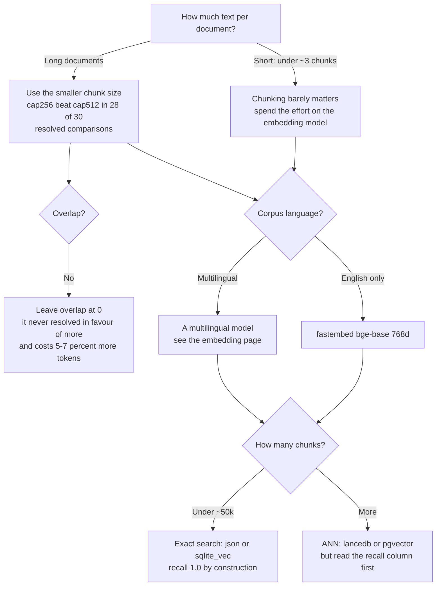

# semdex benchmarks

Every component in semdex is swappable: the extractor that turns a file into text, the chunker
that cuts it up, the embedding model that turns chunks into vectors, and the store that searches
them. This directory measures those choices so a stack can be picked from evidence rather than
from defaults.

Two things to know before reading any number here.

**A difference has to clear the noise floor.** Every retrieval score is a mean over a query set,
and the query sets are small. On the German long-document body a difference must exceed about
0.12 nDCG@10 before it means anything at all. Numbers are therefore printed with a 95 percent
confidence interval, and comparisons are made pairwise over the queries two configurations share.
Of the 96 such comparisons on bodies long enough to
carry a chunking claim, **only 42 resolve**. The rest are ties, and are
reported as ties.

**A corpus has to be able to answer the question.** A chunking comparison on a corpus that yields
about one chunk per document measures nothing, because every configuration produces the same
single chunk. Half the public retrieval benchmarks fall into that category, which is why the
chunking results here are measured on MLDR and not on the more familiar names.

## Pick a page

| If you are deciding                                              | Read                                          |
|------------------------------------------------------------------|-----------------------------------------------|
| Which file formats you can ingest, and what OCR costs            | [Extraction](02-extraction.md)                |
| How to cut documents up: strategy, size, overlap                 | [Chunking](03-chunking.md)                    |
| Which embedding model, and whether more dimensions pay           | [Embedding](04-embedding.md)                  |
| Which vector store, and what ANN speed costs in recall           | [Vector store](05-vector-store.md)            |
| Whether to add keyword search alongside the vectors              | [Retrieval method](06-retrieval-method.md)    |
| A whole stack for a use case and a budget                        | [Selection](07-selection.md)                  |
| Whether a number here can carry the weight you are putting on it | [Method](01-method.md) and [Gaps](08-gaps.md) |

## The short version

## What is measured, and what is not

Numbers here come from three tiers, and the tier is stated on every table:

* **Gated** - a small fixed slice re-run in CI, so a regression is caught. It is small enough that
  it can only catch large regressions; see [Method](01-method.md).
* **Swept** - the large offline runs over the pre-computed vector cache. These carry confidence
  intervals and are the basis for the selection advice.
* **One-off** - a reference measurement taken once on a named machine. Useful for order of
  magnitude, not for a third decimal.

Things that are genuinely not measured, including rerankers and any tuning of ANN parameters, are
listed in [Gaps](08-gaps.md) rather than left for a reader to discover by their absence.

## Reproducing

All of it reuses a pre-computed vector cache, so nothing here re-embeds a corpus. See
[Method](01-method.md) for the commands and what each one costs.
